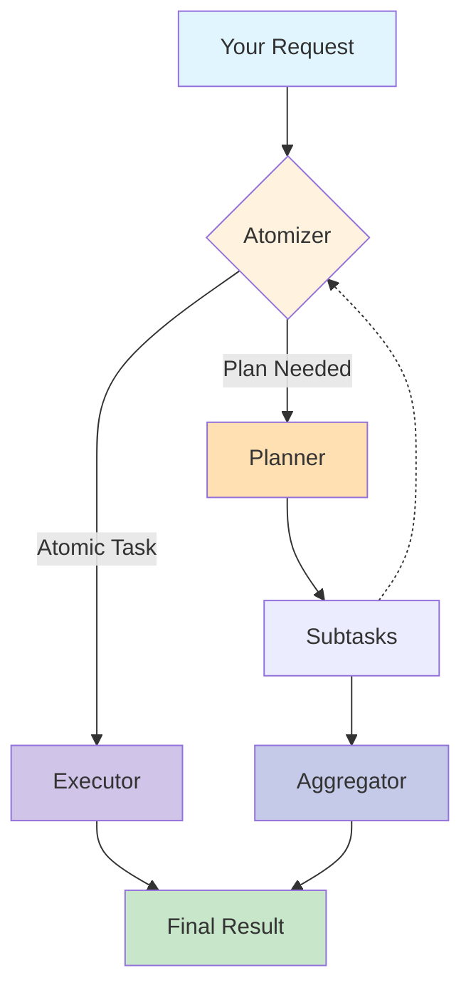

# [sentient-agi/ROMA](https://github.com/sentient-agi/ROMA)

<div align="center">
<div align="center">
    
</div>
<h1>ROMA: Recursive Open Meta-Agents</h1>

<p align="center">
  <strong>Building hierarchical high-performance multi-agent systems made easy! (Beta) </strong>
</p>

<a href="https://trendshift.io/repositories/14848" target="_blank"></a>

<p align="center">
  <a href="https://sentient.xyz/" target="_blank" style="margin: 2px;">
    
  </a>
  <a href="https://github.com/sentient-agi" target="_blank" style="margin: 2px;">
    
  </a>
  <a href="https://huggingface.co/Sentientagi" target="_blank" style="margin: 2px;">
    
  </a>
</div>

<div align="center" style="line-height: 1;">
  <a href="https://discord.gg/sentientfoundation" target="_blank" style="margin: 2px;">
    
  </a>
  <a href="https://x.com/SentientAGI" target="_blank" style="margin: 2px;">
    
  </a>
</p>
<p align="center">
  <a href="https://www.sentient.xyz/blog/recursive-open-meta-agent">Technical Blog</a> •
  <a href="docs/">Paper (Coming soon)</a> •
  <a href="https://www.sentient.xyz/">Build Agents for $$$</a>
</p>


</div>

---
</div>


## 📖 Documentation


- **[🚀 Introduction](docs/INTRODUCTION.md)** - Understand the vision and architecture behind ROMA

- **[📦 Setup](docs/SETUP.md)** - Detailed configuration options and environment setup

- **[🤖 Agents Guide](docs/AGENTS_GUIDE.md)** - Learn how to create and customize your own agents

- **[⚙️ Configuration](docs/CONFIGURATION.md)** - Detailed configuration options and environment setup

- **[🗺️ Roadmap](docs/ROADMAP.md)** - See what's coming next for ROMA

## 🎯 What is ROMA?

<div align="center">
    
</div>
<br>

**ROMA** is a **meta-agent framework** that uses recursive hierarchical structures to solve complex problems. By breaking down tasks into parallelizable components, ROMA enables agents to tackle sophisticated reasoning challenges while maintaining transparency that makes context-engineering and iteration straightforward. The framework offers **parallel problem solving** where agents work simultaneously on different parts of complex tasks, **transparent development** with a clear structure for easy debugging, and **proven performance** demonstrated through our search agent's strong benchmark results. We've shown the framework's effectiveness, but this is just the beginning. As an **open-source and extensible** platform, ROMA is designed for community-driven development, allowing you to build and customize agents for your specific needs while benefiting from the collective improvements of the community.

## 🏗️ How It Works


**ROMA** framework processes tasks through a recursive **plan–execute loop**:

```python
def solve(task):
    if is_atomic(task):                 # Step 1: Atomizer
        return execute(task)            # Step 2: Executor
    else:
        subtasks = plan(task)           # Step 2: Planner
        results = []
        for subtask in subtasks:
            results.append(solve(subtask))  # Recursive call
        return aggregate(results)       # Step 3: Aggregator

# Entry point:
answer = solve(initial_request)
```
1. **Atomizer** – Decides whether a request is **atomic** (directly executable) or requires **planning**.  
2. **Planner** – If planning is needed, the task is broken into smaller **subtasks**. Each subtask is fed back into the **Atomizer**, making the process recursive.  
3. **Executors** – Handle atomic tasks. Executors can be **LLMs, APIs, or even other agents** — as long as they implement an `agent.execute()` interface.  
4. **Aggregator** – Collects and integrates results from subtasks. Importantly, the Aggregator produces the **answer to the original parent task**, not just raw child outputs.  


#### 📐 Information Flow  
- **Top-down:** Tasks are decomposed into subtasks recursively.  
- **Bottom-up:** Subtask results are aggregated upwards into solutions for parent tasks.  
- **Left-to-right:** If a subtask depends on the output of a previous one, it waits until that subtask completes before execution.  

This structure makes the system flexible, recursive, and dependency-aware — capable of decomposing complex problems into smaller steps while ensuring results are integrated coherently. 

<details>
<summary>Click to view the system flow diagram</summary>



</details><br>

### 🚀 30-Second Quick Start

```bash
git clone https://github.com/sentient-agi/ROMA.git
cd ROMA

# Run the automated setup
./setup.sh
```

Choose between:
- **Docker Setup** (Recommended) - One-command setup with isolation
- **Native Setup** - Direct installation for development

## 🛠️ Technical Stack

- **Framework**: Built on [AgnoAgents]([https://github.com/your/agnoagents](https://github.com/agno-agi/agno))
- **Backend**: Python 3.12+ with FastAPI/Flask
- **Frontend**: React + TypeScript with real-time WebSocket
- **LLM Support**: Any provider via LiteLLM
- **Data Persistence**: Enterprise S3 mounting with security validation
  - 🔒 **goofys FUSE mounting** for zero-latency file access
  - 🛡️ **Path injection protection** with comprehensive validation
  - 🔐 **AWS credentials verification** before operations
  - 📁 **Dynamic Docker Compose** with secure volume mounting
- **Code Execution**: E2B sandboxes with unified S3 integration
- **Security**: Production-grade validation and error handling
- **Features**: Multi-modal, tools, MCP, hooks, caching

## 📦 Installation Options

### Quick Start (Recommended)
```bash
# Main setup (choose Docker or Native)
./setup.sh

# Optional: Setup E2B sandbox integration
./setup.sh --e2b

# Test E2B integration  
./setup.sh --test-e2b
```

### Command Line Options
```bash
./setup.sh --docker     # Run Docker setup directly
./setup.sh --docker-from-scratch  # Rebuild Docker images/containers from scratch (down -v, no cache)
./setup.sh --native     # Run native setup directly (macOS/Ubuntu/Debian)
./setup.sh --e2b        # Setup E2B template (requires E2B_API_KEY + AWS creds)
./setup.sh --test-e2b   # Test E2B template integration
./setup.sh --help       # Show all available options
```

### Manual Installation
See [setup docs](docs/SETUP.md) for detailed instructions.


### 🏗️ Optional: E2B Sandbox Integration

For secure code execution capabilities, optionally set up E2B sandboxes:

```bash
# After main setup, configure E2B (requires E2B_API_KEY and AWS credentials in .env)
./setup.sh --e2b

# Test E2B integration
./setup.sh --test-e2b
```

**E2B Features:**
- 🔒 **Secure Code Execution** - Run untrusted code in isolated sandboxes
- ☁️ **S3 Integration** - Automatic data sync between local and sandbox environments  
- 🚀 **goofys Mounting** - High-performance S3 filesystem mounting
- 🔧 **AWS Credentials** - Passed securely via Docker build arguments


## 🤖 Pre-built Agents

> **Note:** These agents are demonstrations built using ROMA's framework through simple vibe-prompting and minimal manual tuning. They showcase how easily you can create high-performance agents with ROMA, rather than being production-final solutions. Our mission is to empower the community to build, share, and get rewarded for creating innovative agent recipes and use-cases.

ROMA comes with example agents that demonstrate the framework's capabilities:

### 🔍 General Task Solver
A versatile agent powered by ChatGPT Search Preview for handling diverse tasks:
- **Intelligent Search**: Leverages OpenAI's latest search capabilities for real-time information
- **Flexible Planning**: Adapts task decomposition based on query complexity
- **Multi-Domain**: Handles everything from technical questions to creative projects
- **Quick Prototyping**: Perfect for testing ROMA's capabilities without domain-specific setup

Perfect for: General research, fact-checking, exploratory analysis, quick information gathering

### 🔬 Deep Research Agent
A comprehensive research system that breaks down complex research questions into manageable sub-tasks:
- **Smart Task Decomposition**: Automatically splits research topics into search, analysis, and synthesis phases
- **Parallel Information Gathering**: Executes multiple searches simultaneously for faster results
- **Multi-Source Integration**: Combines results from web search, Wikipedia, and specialized APIs
- **Intelligent Synthesis**: Aggregates findings into coherent, well-structured reports

Perfect for: Academic research, market analysis, competitive intelligence, technical documentation

### 💹 Crypto Analytics Agent
Specialized financial analysis agent with deep blockchain and DeFi expertise:
- **Real-Time Market Data**: Integrates with Binance, CoinGecko, and DefiLlama APIs
- **On-Chain Analytics**: Access to Arkham Intelligence for wallet tracking and token flows
- **Technical Analysis**: Advanced charting with OHLC data and market indicators
- **DeFi Metrics**: TVL tracking, yield analysis, protocol comparisons
- **Secure Execution**: Runs analysis in E2B sandboxes with data persistence

Perfect for: Token research, portfolio analysis, DeFi protocol evaluation, market trend analysis

All three agents demonstrate ROMA's recursive architecture in action, showing how complex queries that would overwhelm single-pass systems can be elegantly decomposed and solved. They serve as templates and inspiration for building your own specialized agents.

### Your First Agent in 5 Minutes

```python
./setup.sh  # Automated setup with Docker or native installation
```

Access all the pre-defined agents through the frontend on `localhost:3000` after setting up the backend on `localhost:5000`. Please checkout [Setup](./docs/SETUP.md) and the [Agents guide](./docs/AGENTS_GUIDE.md) to get started!

<div align="center">
    
</div>


```python
# Your first agent in 3 lines
from sentientresearchagent import SentientAgent

agent = SentientAgent.create()
result = await agent.run("Create a podcast about AI safety")
```

## 📊 Benchmarks

We evaluate our simple implementation of a search system using ROMA, called ROMA-Search across three benchmarks: **SEAL-0**, **FRAMES**, and **SimpleQA**.  
Below are the performance graphs for each benchmark.

### [SEAL-0](https://huggingface.co/datasets/vtllms/sealqa)
SealQA is a new challenging benchmark for evaluating Search-Augmented Language models on fact-seeking questions where web search yields conflicting, noisy, or unhelpful results.  


---

### [FRAMES](https://huggingface.co/datasets/google/frames-benchmark)
<details>
<summary>View full results</summary>

A comprehensive evaluation dataset designed to test the capabilities of Retrieval-Augmented Generation (RAG) systems across factuality, retrieval accuracy, and reasoning.  


</details>

---

### [SimpleQA](https://openai.com/index/introducing-simpleqa/)
<details>
<summary>View full results</summary>

Factuality benchmark that measures the ability for language models to answer short, fact-seeking questions.  


</details>

## ✨ Features

<table>
<tr>
<td width="50%">

### 🔄 **Recursive Task Decomposition**
Automatically breaks down complex tasks into manageable subtasks with intelligent dependency management. Runs independent sub-tasks in **parallel**.

</td>
<td width="50%">

### 🤖 **Agent Agnostic**
Works with any provider (OpenAI, Anthropic, Google, local models) through unified interface, as long as it has an `agent.run()` command, then you can use it!

</td>
</tr>
<tr>
<td width="50%">

### 🔍 **Complete Transparency**
Stage tracing shows exactly what happens at each step - debug and optimize with full visibility

</td>
<td width="50%">

### 🔌 Connect Any Tool

Seamlessly integrate external tools and protocols with configurable intervention points. Already includes production-grade connectors such as E2B, file-read-write, and more.

</td>
</tr>
</table>


## 🙏 Acknowledgments

This framework would not have been possible if it wasn't for these amazing open-source contributions!
- Inspired by the hierarchical planning approach described in ["Beyond Outlining: Heterogeneous Recursive Planning"](https://arxiv.org/abs/2503.08275) by Xiong et al.
- [Pydantic](https://github.com/pydantic/pydantic) - Data validation using Python type annotations
- [Agno]([https://github.com/agno-ai/agno](https://github.com/agno-agi/agno)) - Framework for building AI agents
- [E2B](https://github.com/e2b-dev/e2b) - Cloud runtime for AI agents

## 📚 Citation

If you use the ROMA repo in your research, please cite:

```bibtex
@software{al_zubi_2025_17052592,
  author       = {Al-Zubi, Salah and
                  Nama, Baran and
                  Kaz, Arda and
                  Oh, Sewoong},
  title        = {SentientResearchAgent: A Hierarchical AI Agent
                   Framework for Research and Analysis
                  },
  month        = sep,
  year         = 2025,
  publisher    = {Zenodo},
  version      = {ROMA},
  doi          = {10.5281/zenodo.17052592},
  url          = {https://doi.org/10.5281/zenodo.17052592},
  swhid        = {swh:1:dir:69cd1552103e0333dd0c39fc4f53cb03196017ce
                   ;origin=https://doi.org/10.5281/zenodo.17052591;vi
                   sit=swh:1:snp:f50bf99634f9876adb80c027361aec9dff97
                   3433;anchor=swh:1:rel:afa7caa843ce1279f5b4b29b5d3d
                   5e3fe85edc95;path=salzubi401-ROMA-b31c382
                  },
}
```

## 📄 License

This project is licensed under the MIT License - see the [LICENSE](LICENSE) file for details.
