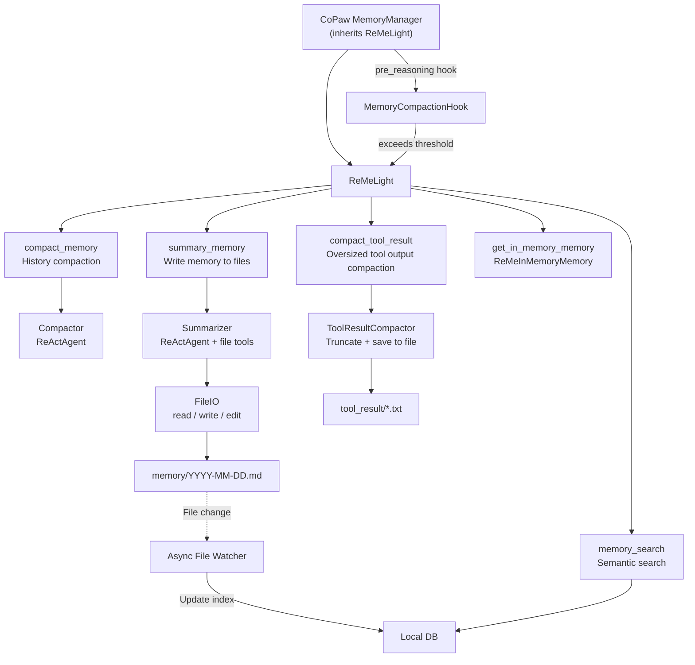
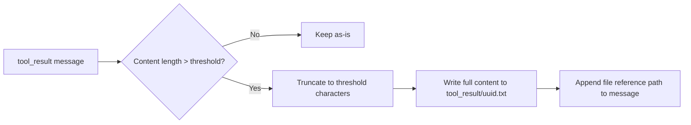
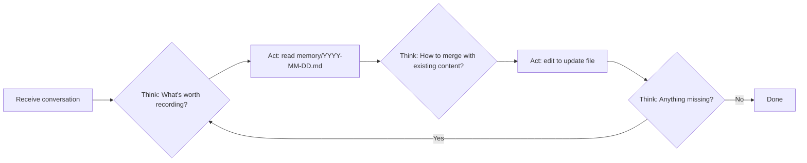
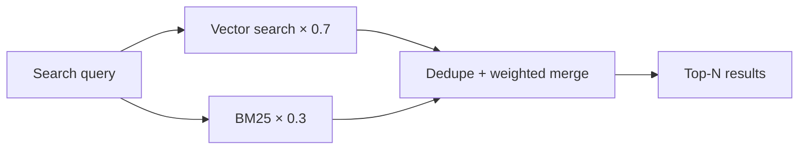
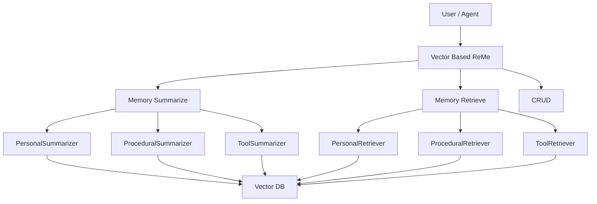

# [agentscope-ai/ReMe](https://github.com/agentscope-ai/ReMe)

<p align="center">
 
</p>

<p align="center">
  <a href="https://pypi.org/project/reme-ai/"></a>
  <a href="https://pypi.org/project/reme-ai/"></a>
  <a href="https://pepy.tech/project/reme-ai/"></a>
  <a href="https://github.com/agentscope-ai/ReMe"></a>
</p>

<p align="center">
  <a href="./LICENSE"></a>
  <a href="./README.md"></a>
  <a href="./README_ZH.md"></a>
  <a href="https://github.com/agentscope-ai/ReMe"></a>
</p>

<p align="center">
  <strong>A memory management toolkit for AI agents — Remember Me, Refine Me.</strong><br>
</p>

> For legacy versions, see [0.2.x Documentation](docs/README_0_2_x.md)

---

🧠 ReMe is a **memory management framework** built for **AI agents**, offering both **file-based** and **vector-based**
memory systems.

It addresses two core problems of agent memory: **limited context windows** (early information gets truncated or lost
during long conversations) and **stateless sessions** (new conversations cannot inherit history and always start from
scratch).

ReMe gives agents **real memory** — old conversations are automatically condensed, important information is persisted,
and the next conversation can recall it automatically.


---

## 📁 File-Based Memory System (ReMeLight)

> Memory as files, files as memory

Treat **memory as files** — readable, editable, and portable.
[CoPaw](https://github.com/agentscope-ai/CoPaw) implements long-term memory and context management by inheriting
`ReMeLight`.

| Traditional Memory Systems | File-Based ReMe    |
|----------------------------|--------------------|
| 🗄️ Database storage       | 📝 Markdown files  |
| 🔒 Opaque                  | 👀 Read anytime    |
| ❌ Hard to modify           | ✏️ Edit directly   |
| 🚫 Hard to migrate         | 📦 Copy to migrate |

```
working_dir/
├── MEMORY.md              # Long-term memory: user preferences, project config, etc.
├── memory/
│   └── YYYY-MM-DD.md      # Daily summary logs: written automatically after conversation ends
└── tool_result/           # Cache for oversized tool outputs (auto-managed, auto-cleaned when expired)
    └── <uuid>.txt
```

### Core Capabilities

[ReMeLight](reme/reme_light.py) is the core class of this memory system, providing complete memory management
capabilities for AI Agents:

| Method                 | Function                           | Key Components                                                                                                                                              |
|------------------------|------------------------------------|-------------------------------------------------------------------------------------------------------------------------------------------------------------|
| `start`                | 🚀 Start memory system             | Initialize file store, file watcher, Embedding cache; clean up expired tool result files                                                                    |
| `close`                | 📕 Close and clean up              | Clean tool result files, stop file watcher, save Embedding cache                                                                                            |
| `compact_memory`       | 📦 Compact history to summary      | [Compactor](reme/memory/file_based/compactor.py) — ReActAgent generates structured context checkpoint                                                       |
| `summary_memory`       | 📝 Write important memory to files | [Summarizer](reme/memory/file_based/summarizer.py) — ReActAgent + file tools (read / write / edit)                                                          |
| `compact_tool_result`  | ✂️ Compact oversized tool output   | [ToolResultCompactor](reme/memory/file_based/tool_result_compactor.py) — Truncate and save to `tool_result/`, keep file reference in message                |
| `memory_search`        | 🔍 Semantic memory search          | [MemorySearch](reme/memory/tools/chunk/memory_search.py) — Vector + BM25 hybrid retrieval                                                                   |
| `get_in_memory_memory` | 🗂️ Create in-memory instance      | [ReMeInMemoryMemory](reme/memory/file_based/reme_in_memory_memory.py) — Token-aware memory management, supports compression summary and state serialization |

---

### 🚀 Quick Start

#### Installation

```bash
pip install -e ".[light]"
```

#### Environment Variables

`ReMeLight` environment variables configure Embedding and storage backend

| Variable             | Description                    | Example                                             |
|----------------------|--------------------------------|-----------------------------------------------------|
| `LLM_API_KEY`        | LLM API key                    | `sk-xxx`                                            |
| `LLM_BASE_URL`       | LLM base URL                   | `https://dashscope.aliyuncs.com/compatible-mode/v1` |
| `EMBEDDING_API_KEY`  | Embedding API key (Optional)   | `sk-xxx`                                            |
| `EMBEDDING_BASE_URL` | Embedding base URL  (Optional) | `https://dashscope.aliyuncs.com/compatible-mode/v1` |
| `LLM_MODEL_NAME`     | LLM model name                 | `qwen3.5-plus`                                      |

#### Python Usage

```python
import asyncio

from agentscope.message import Msg
from reme.reme_light import ReMeLight


async def main():
    reme = ReMeLight(
        working_dir=".reme",  # Memory file storage directory
        max_input_length=128000,  # Model context window (tokens)
        memory_compact_ratio=0.7,  # Trigger compaction when reaching max_input_length * 0.7
        language="zh",  # Summary language (zh / "")
        tool_result_threshold=1000,  # Auto-save tool outputs exceeding this character count
        retention_days=7,  # tool_result/ file retention days
    )
    await reme.start()

    messages = [...]

    # 1. Compact oversized tool outputs (prevent tool results from overflowing context)
    messages = await reme.compact_tool_result(messages)

    # 2. Compact history to structured summary (trigger: context approaching limit), can pass previous summary for incremental update
    summary = await reme.compact_memory(messages=messages, previous_summary="")

    # 3. Submit async summary task in background (non-blocking, writes to memory/YYYY-MM-DD.md)
    reme.add_async_summary_task(messages=messages)

    # 4. Semantic memory search (Vector + BM25 hybrid retrieval)
    result = await reme.memory_search(query="Python version preference", max_results=5)

    # 5. Get in-memory instance (ReMeInMemoryMemory, manages single conversation context) AgentScope InMemoryMemory
    memory = reme.get_in_memory_memory()
    token_stats = await memory.estimate_tokens()
    print(f"Current context usage: {token_stats['context_usage_ratio']:.1f}%")
    print(f"Message tokens: {token_stats['messages_tokens']}")
    print(f"Estimated total tokens: {token_stats['estimated_tokens']}")

    # 6. Wait for background tasks before closing
    summary_result = await reme.await_summary_tasks()

    # Close ReMeLight
    await reme.close()


if __name__ == "__main__":
    asyncio.run(main())
```

### File-Based ReMeLight Memory System Architecture

[CoPaw MemoryManager](https://github.com/agentscope-ai/CoPaw/blob/main/src/copaw/agents/memory/memory_manager.py)
inherits `ReMeLight` and integrates memory capabilities into the Agent reasoning flow:



### Context Compaction Mechanism

#### Context Compaction

[Compactor](reme/memory/file_based/compactor.py) uses ReActAgent to compact history into structured **context
checkpoints**:

| Field                 | Description                                         |
|-----------------------|-----------------------------------------------------|
| `## Goal`             | 🎯 User's objectives (can be multiple)              |
| `## Constraints`      | ⚙️ Constraints and preferences mentioned by user    |
| `## Progress`         | 📈 Completed / in progress / blocked tasks          |
| `## Key Decisions`    | 🔑 Decisions made with brief reasons                |
| `## Next Steps`       | 🗺️ Next action plan (ordered list)                 |
| `## Critical Context` | 📌 File paths, function names, error messages, etc. |

Supports **incremental updates**: when `previous_summary` is passed, automatically merges new conversation with old
summary, preserving historical progress.

#### Tool Result Compaction

[ToolResultCompactor](reme/memory/file_based/tool_result_compactor.py) solves context overflow caused by oversized tool
outputs (e.g., browser use):



Expired files (exceeding `retention_days`) are automatically cleaned up during `start` / `close` /
`compact_tool_result`.

### Memory Summary: ReAct + File Tools

[Summarizer](reme/memory/file_based/summarizer.py) uses the **ReAct + file tools** pattern, letting AI autonomously
decide what to write and where:



[FileIO](reme/memory/file_based/file_io.py) provides file operation tools:

| Tool    | Function                       | Use case                                |
|---------|--------------------------------|-----------------------------------------|
| `read`  | Read file content (line range) | View existing memory, avoid duplicates  |
| `write` | Overwrite file                 | Create new memory file or major rewrite |
| `edit`  | Replace after exact match      | Append or modify specific sections      |

### In-Memory Session Management

[ReMeInMemoryMemory](reme/memory/file_based/reme_in_memory_memory.py) extends AgentScope's `InMemoryMemory`:

| Feature                          | Description                                                         |
|----------------------------------|---------------------------------------------------------------------|
| `get_memory`                     | Filter messages by mark, auto-prepend compression summary           |
| `estimate_tokens`                | Precisely estimate current context token usage and ratio            |
| `get_history_str`                | Generate human-readable conversation summary (with token stats)     |
| `state_dict` / `load_state_dict` | Support state serialization / deserialization (session persistence) |
| `mark_messages_compressed`       | Mark messages as compressed state                                   |
| `get_compressed_summary`         | Get compressed summary content                                      |

### Memory Retrieval

[MemorySearch](reme/memory/tools/chunk/memory_search.py) provides **vector + BM25 hybrid retrieval**:

| Retrieval           | Strength                                        | Weakness                               |
|---------------------|-------------------------------------------------|----------------------------------------|
| **Vector semantic** | Captures similar meaning with different wording | Weaker on exact token match            |
| **BM25 full-text**  | Strong exact token match                        | No synonym or paraphrase understanding |

**Fusion**: Both retrieval paths are weighted and summed (vector 0.7 + BM25 0.3), so both natural-language queries and
exact lookups get reliable results.



---

## 🗃️ Vector-Based Memory System

[ReMe Vector Based](reme/reme.py) is the core class for the vector-based memory system, supporting unified management of
three memory types:

| Memory Type                  | Purpose                                             | Usage Context |
|------------------------------|-----------------------------------------------------|---------------|
| **Personal memory**          | User preferences, habits                            | `user_name`   |
| **Task / procedural memory** | Task execution experience, success/failure patterns | `task_name`   |
| **Tool memory**              | Tool usage experience, parameter tuning             | `tool_name`   |

### Core Capabilities

| Method             | Function            | Description                                               |
|--------------------|---------------------|-----------------------------------------------------------|
| `summarize_memory` | 🧠 Summarize memory | Automatically extract and store memory from conversations |
| `retrieve_memory`  | 🔍 Retrieve memory  | Retrieve relevant memory by query                         |
| `add_memory`       | ➕ Add memory        | Manually add memory to vector store                       |
| `get_memory`       | 📖 Get memory       | Fetch a single memory by ID                               |
| `update_memory`    | ✏️ Update memory    | Update content or metadata of existing memory             |
| `delete_memory`    | 🗑️ Delete memory   | Delete specified memory                                   |
| `list_memory`      | 📋 List memory      | List memories with filtering and sorting                  |

### Installation

```bash
pip install -U reme-ai
```

### Environment Variables

API keys are set via environment variables; you can put them in a `.env` file in the project root:

| Variable             | Description        | Example                                             |
|----------------------|--------------------|-----------------------------------------------------|
| `LLM_API_KEY`        | LLM API Key        | `sk-xxx`                                            |
| `LLM_BASE_URL`       | LLM Base URL       | `https://dashscope.aliyuncs.com/compatible-mode/v1` |
| `EMBEDDING_API_KEY`  | Embedding API Key  | `sk-xxx`                                            |
| `EMBEDDING_BASE_URL` | Embedding Base URL | `https://dashscope.aliyuncs.com/compatible-mode/v1` |

### Python Usage

```python
import asyncio

from reme import ReMe


async def main():
    # Initialize ReMe
    reme = ReMe(
        working_dir=".reme",
        default_llm_config={
            "backend": "openai",
            "model_name": "qwen3.5-plus",
        },
        default_embedding_model_config={
            "backend": "openai",
            "model_name": "text-embedding-v4",
            "dimensions": 1024,
        },
        default_vector_store_config={
            "backend": "local",  # Supports local/chroma/qdrant/elasticsearch
        },
    )
    await reme.start()

    messages = [
        {"role": "user", "content": "Help me write a Python script", "time_created": "2026-02-28 10:00:00"},
        {"role": "assistant", "content": "Sure, I'll help you write it", "time_created": "2026-02-28 10:00:05"},
    ]

    # 1. Summarize memory from conversation (auto-extract user preferences, task experience, etc.)
    result = await reme.summarize_memory(
        messages=messages,
        user_name="alice",  # Personal memory
        # task_name="code_writing",  # Task memory
    )
    print(f"Summarize result: {result}")

    # 2. Retrieve relevant memory
    memories = await reme.retrieve_memory(
        query="Python programming",
        user_name="alice",
        # task_name="code_writing",
    )
    print(f"Retrieve result: {memories}")

    # 3. Manually add memory
    memory_node = await reme.add_memory(
        memory_content="User prefers concise code style",
        user_name="alice",
    )
    print(f"Added memory: {memory_node}")
    memory_id = memory_node.memory_id

    # 4. Get single memory by ID
    fetched_memory = await reme.get_memory(memory_id=memory_id)
    print(f"Fetched memory: {fetched_memory}")

    # 5. Update memory content
    updated_memory = await reme.update_memory(
        memory_id=memory_id,
        user_name="alice",
        memory_content="User prefers concise, well-commented code style",
    )
    print(f"Updated memory: {updated_memory}")

    # 6. List all memories for user (with filtering and sorting)
    all_memories = await reme.list_memory(
        user_name="alice",
        limit=10,
        sort_key="time_created",
        reverse=True,
    )
    print(f"User memory list: {all_memories}")

    # 7. Delete specified memory
    await reme.delete_memory(memory_id=memory_id)
    print(f"Deleted memory: {memory_id}")

    # 8. Delete all memories (use with caution)
    # await reme.delete_all()

    await reme.close()


if __name__ == "__main__":
    asyncio.run(main())
```

### Technical Architecture



## ⭐ Community & Support

- **Star & Watch**: Star helps more agent developers discover ReMe; Watch keeps you updated on new releases and
  features.
- **Share your work**: In Issues or Discussions, share what ReMe unlocks for your agents — we're happy to highlight
  great community examples.
- **Need a new feature?** Open a Feature Request; we'll iterate with the community.
- **Code contributions**: All forms of code contribution are welcome. See
  the [Contribution Guide](docs/contribution.md).
- **Acknowledgments**: Thanks to OpenClaw, Mem0, MemU, CoPaw, and other open-source projects for inspiration and
  support.

---

## 📄 Citation

```bibtex
@software{AgentscopeReMe2025,
  title = {AgentscopeReMe: Memory Management Kit for Agents},
  author = {ReMe Team},
  url = {https://reme.agentscope.io},
  year = {2025}
}
```

---

## ⚖️ License

This project is open source under the Apache License 2.0. See the [LICENSE](./LICENSE) file for details.

---

## 📈 Star History

[](https://www.star-history.com/#agentscope-ai/ReMe&Date)
