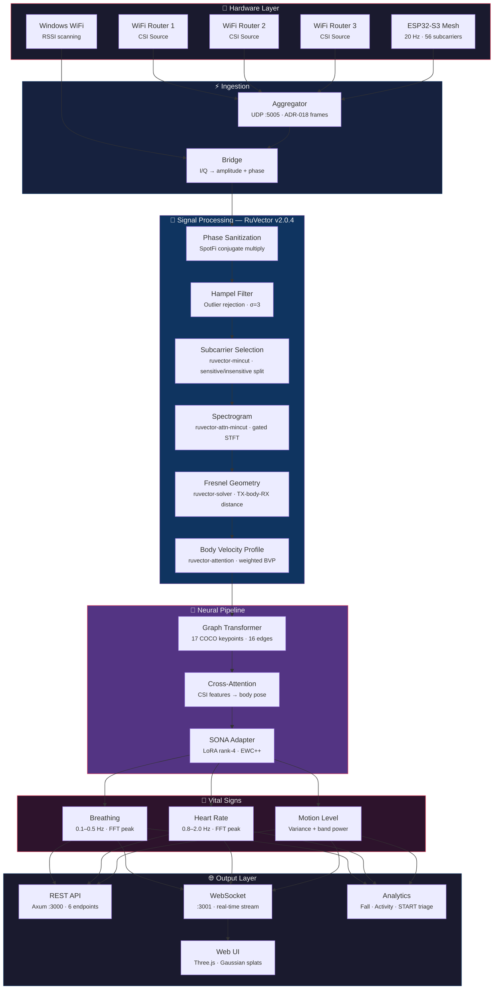
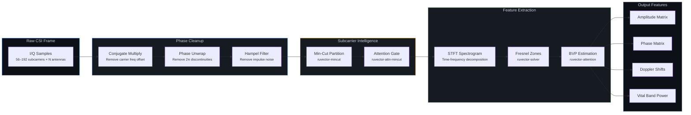
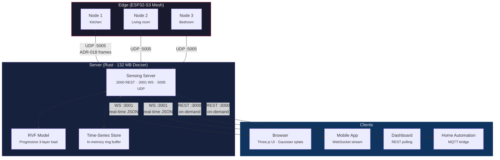

# [ruvnet/RuView](https://github.com/ruvnet/RuView)

# π RuView

<p align="center">
  <a href="https://ruvnet.github.io/RuView/">
    
  </a>
</p>

## **See through walls with WiFi + Ai** ##

**Perceive the world through signals.** No cameras. No wearables. No Internet. Just physics.

### π RuView is an edge AI perception system that learns directly from the environment around it.

Instead of relying on cameras or cloud models, it observes whatever signals exist in a space such as WiFi, radio waves across the spectrum, motion patterns, vibration, sound, or other sensory inputs and builds an understanding of what is happening locally.

Built on top of [RuVector](https://github.com/ruvnet/ruvector/) Self Learning Vector Memory system and [Cognitum.One](https://Cognitum.One) , the project became widely known for its implementation of WiFi DensePose — a sensing technique first explored in academic research such as Carnegie Mellon University's *DensePose From WiFi* work. That research demonstrated that WiFi signals can be used to reconstruct human pose.

RuView extends that concept into a practical edge system. By analyzing Channel State Information (CSI) disturbances caused by human movement, RuView reconstructs body position, breathing rate, heart rate, and presence in real time using physics-based signal processing and machine learning.

Unlike research systems that rely on synchronized cameras for training, RuView is designed to operate entirely from radio signals and self-learned embeddings at the edge.

The system runs entirely on inexpensive hardware such as an ESP32 sensor mesh (as low as ~$1 per node). Small programmable edge modules analyze signals locally and learn the RF signature of a room over time, allowing the system to separate the environment from the activity happening inside it.

Because RuView learns in proximity to the signals it observes, it improves as it operates. Each deployment develops a local model of its surroundings and continuously adapts without requiring cameras, labeled data, or cloud infrastructure.

In practice this means ordinary environments gain a new kind of spatial awareness. Rooms, buildings, and devices begin to sense presence, movement, and vital activity using the signals that already fill the space.

### Built for low-power edge applications

[Edge modules](#edge-intelligence-adr-041) are small programs that run directly on the ESP32 sensor — no internet needed, no cloud fees, instant response.

[](https://www.rust-lang.org/)
[](https://opensource.org/licenses/MIT)
[](https://github.com/ruvnet/RuView)
[](https://hub.docker.com/r/ruvnet/wifi-densepose)
[](#vital-sign-detection)
[](#esp32-s3-hardware-pipeline)
[](https://crates.io/crates/wifi-densepose-ruvector)

 
> | What | How | Speed |
> |------|-----|-------|
> | **Pose estimation** | CSI subcarrier amplitude/phase → DensePose UV maps | 54K fps (Rust) |
> | **Breathing detection** | Bandpass 0.1-0.5 Hz → FFT peak | 6-30 BPM |
> | **Heart rate** | Bandpass 0.8-2.0 Hz → FFT peak | 40-120 BPM |
> | **Presence sensing** | RSSI variance + motion band power | < 1ms latency |
> | **Through-wall** | Fresnel zone geometry + multipath modeling | Up to 5m depth |

```bash
# 30 seconds to live sensing — no toolchain required
docker pull ruvnet/wifi-densepose:latest
docker run -p 3000:3000 ruvnet/wifi-densepose:latest
# Open http://localhost:3000
```

> [!NOTE]
> **CSI-capable hardware required.** Pose estimation, vital signs, and through-wall sensing rely on Channel State Information (CSI) — per-subcarrier amplitude and phase data that standard consumer WiFi does not expose. You need CSI-capable hardware (ESP32-S3 or a research NIC) for full functionality. Consumer WiFi laptops can only provide RSSI-based presence detection, which is significantly less capable.

> **Hardware options** for live CSI capture:
>
> | Option | Hardware | Cost | Full CSI | Capabilities |
> |--------|----------|------|----------|-------------|
> | **ESP32 Mesh** (recommended) | 3-6x ESP32-S3 + WiFi router | ~$54 | Yes | Pose, breathing, heartbeat, motion, presence |
> | **Research NIC** | Intel 5300 / Atheros AR9580 | ~$50-100 | Yes | Full CSI with 3x3 MIMO |
> | **Any WiFi** | Windows, macOS, or Linux laptop | $0 | No | RSSI-only: coarse presence and motion |
>
> No hardware? Verify the signal processing pipeline with the deterministic reference signal: `python v1/data/proof/verify.py`
>
---

## 📖 Documentation

| Document | Description |
|----------|-------------|
| [User Guide](docs/user-guide.md) | Step-by-step guide: installation, first run, API usage, hardware setup, training |
| [Build Guide](docs/build-guide.md) | Building from source (Rust and Python) |
| [Architecture Decisions](docs/adr/README.md) | 62 ADRs — why each technical choice was made, organized by domain (hardware, signal processing, ML, platform, infrastructure) |
| [Domain Models](docs/ddd/README.md) | 7 DDD models (RuvSense, Signal Processing, Training Pipeline, Hardware Platform, Sensing Server, WiFi-Mat, CHCI) — bounded contexts, aggregates, domain events, and ubiquitous language |
| [Desktop App](rust-port/wifi-densepose-rs/crates/wifi-densepose-desktop/README.md) | **WIP** — Tauri v2 desktop app for node management, OTA updates, WASM deployment, and mesh visualization |
| [Medical Examples](examples/medical/README.md) | Contactless blood pressure, heart rate, breathing rate via 60 GHz mmWave radar — $15 hardware, no wearable |

---


  <a href="https://ruvnet.github.io/RuView/">
    
  </a>
  <br>
  <em>Real-time pose skeleton from WiFi CSI signals — no cameras, no wearables</em>
  <br><br>
  <a href="https://ruvnet.github.io/RuView/"><strong>▶ Live Observatory Demo</strong></a>
  &nbsp;|&nbsp;
  <a href="https://ruvnet.github.io/RuView/pose-fusion.html"><strong>▶ Dual-Modal Pose Fusion Demo</strong></a>

> The [server](#-quick-start) is optional for visualization and aggregation — the ESP32 [runs independently](#esp32-s3-hardware-pipeline) for presence detection, vital signs, and fall alerts.
>
> **Live ESP32 pipeline**: Connect an ESP32-S3 node → run the [sensing server](#sensing-server) → open the [pose fusion demo](https://ruvnet.github.io/RuView/pose-fusion.html) for real-time dual-modal pose estimation (webcam + WiFi CSI). See [ADR-059](docs/adr/ADR-059-live-esp32-csi-pipeline.md).


## 🚀 Key Features

### Sensing

See people, breathing, and heartbeats through walls — using only WiFi signals already in the room.

| | Feature | What It Means |
|---|---------|---------------|
| 🔒 | **Privacy-First** | Tracks human pose using only WiFi signals — no cameras, no video, no images stored |
| 💓 | **Vital Signs** | Detects breathing rate (6-30 breaths/min) and heart rate (40-120 bpm) without any wearable |
| 👥 | **Multi-Person** | Tracks multiple people simultaneously, each with independent pose and vitals — no hard software limit (physics: ~3-5 per AP with 56 subcarriers, more with multi-AP) |
| 🧱 | **Through-Wall** | WiFi passes through walls, furniture, and debris — works where cameras cannot |
| 🚑 | **Disaster Response** | Detects trapped survivors through rubble and classifies injury severity (START triage) |
| 📡 | **Multistatic Mesh** | 4-6 low-cost sensor nodes work together, combining 12+ overlapping signal paths for full 360-degree room coverage with sub-inch accuracy and no person mix-ups ([ADR-029](docs/adr/ADR-029-ruvsense-multistatic-sensing-mode.md)) |
| 🌐 | **Persistent Field Model** | The system learns the RF signature of each room — then subtracts the room to isolate human motion, detect drift over days, predict intent before movement starts, and flag spoofing attempts ([ADR-030](docs/adr/ADR-030-ruvsense-persistent-field-model.md)) |

### Intelligence

The system learns on its own and gets smarter over time — no hand-tuning, no labeled data required.

| | Feature | What It Means |
|---|---------|---------------|
| 🧠 | **Self-Learning** | Teaches itself from raw WiFi data — no labeled training sets, no cameras needed to bootstrap ([ADR-024](docs/adr/ADR-024-contrastive-csi-embedding-model.md)) |
| 🎯 | **AI Signal Processing** | Attention networks, graph algorithms, and smart compression replace hand-tuned thresholds — adapts to each room automatically ([RuVector](https://github.com/ruvnet/ruvector)) |
| 🌍 | **Works Everywhere** | Train once, deploy in any room — adversarial domain generalization strips environment bias so models transfer across rooms, buildings, and hardware ([ADR-027](docs/adr/ADR-027-cross-environment-domain-generalization.md)) |
| 👁️ | **Cross-Viewpoint Fusion** | AI combines what each sensor sees from its own angle — fills in blind spots and depth ambiguity that no single viewpoint can resolve on its own ([ADR-031](docs/adr/ADR-031-ruview-sensing-first-rf-mode.md)) |
| 🔮 | **Signal-Line Protocol** | A 6-stage processing pipeline transforms raw WiFi signals into structured body representations — from signal cleanup through graph-based spatial reasoning to final pose output ([ADR-033](docs/adr/ADR-033-crv-signal-line-sensing-integration.md)) |
| 🔒 | **QUIC Mesh Security** | All sensor-to-sensor communication is encrypted end-to-end with tamper detection, replay protection, and seamless reconnection if a node moves or drops offline ([ADR-032](docs/adr/ADR-032-multistatic-mesh-security-hardening.md)) |
| 🎯 | **Adaptive Classifier** | Records labeled CSI sessions, trains a 15-feature logistic regression model in pure Rust, and learns your room's unique signal characteristics — replaces hand-tuned thresholds with data-driven classification ([ADR-048](docs/adr/ADR-048-adaptive-csi-classifier.md)) |

### Performance & Deployment

Fast enough for real-time use, small enough for edge devices, simple enough for one-command setup.

| | Feature | What It Means |
|---|---------|---------------|
| ⚡ | **Real-Time** | Analyzes WiFi signals in under 100 microseconds per frame — fast enough for live monitoring |
| 🦀 | **810x Faster** | Complete Rust rewrite: 54,000 frames/sec pipeline, multi-arch Docker image, 1,031+ tests |
| 🐳 | **One-Command Setup** | `docker pull ruvnet/wifi-densepose:latest` — live sensing in 30 seconds, no toolchain needed (amd64 + arm64 / Apple Silicon) |
| 📡 | **Fully Local** | Runs completely on a $9 ESP32 — no internet connection, no cloud account, no recurring fees. Detects presence, vital signs, and falls on-device with instant response |
| 📦 | **Portable Models** | Trained models package into a single `.rvf` file — runs on edge, cloud, or browser (WASM) |
| 🔭 | **Observatory Visualization** | Cinematic Three.js dashboard with 5 holographic panels — subcarrier manifold, vital signs oracle, presence heatmap, phase constellation, convergence engine — all driven by live or demo CSI data ([ADR-047](docs/adr/ADR-047-psychohistory-observatory-visualization.md)) |
| 📟 | **AMOLED Display** | ESP32-S3 boards with built-in AMOLED screens show real-time presence, vital signs, and room status directly on the sensor — no phone or PC needed ([ADR-045](docs/adr/ADR-045-amoled-display-support.md)) |

---

## 🔬 How It Works

WiFi routers flood every room with radio waves. When a person moves — or even breathes — those waves scatter differently. WiFi DensePose reads that scattering pattern and reconstructs what happened:

```
WiFi Router → radio waves pass through room → hit human body → scatter
    ↓
ESP32 mesh (4-6 nodes) captures CSI on channels 1/6/11 via TDM protocol
    ↓
Multi-Band Fusion: 3 channels × 56 subcarriers = 168 virtual subcarriers per link
    ↓
Multistatic Fusion: N×(N-1) links → attention-weighted cross-viewpoint embedding
    ↓
Coherence Gate: accept/reject measurements → stable for days without tuning
    ↓
Signal Processing: Hampel, SpotFi, Fresnel, BVP, spectrogram → clean features
    ↓
AI Backbone (RuVector): attention, graph algorithms, compression, field model
    ↓
Signal-Line Protocol (CRV): 6-stage gestalt → sensory → topology → coherence → search → model
    ↓
Neural Network: processed signals → 17 body keypoints + vital signs + room model
    ↓
Output: real-time pose, breathing, heart rate, room fingerprint, drift alerts
```

No training cameras required — the [Self-Learning system (ADR-024)](docs/adr/ADR-024-contrastive-csi-embedding-model.md) bootstraps from raw WiFi data alone. [MERIDIAN (ADR-027)](docs/adr/ADR-027-cross-environment-domain-generalization.md) ensures the model works in any room, not just the one it trained in.

---

## 🏢 Use Cases & Applications

WiFi sensing works anywhere WiFi exists. No new hardware in most cases — just software on existing access points or a $8 ESP32 add-on. Because there are no cameras, deployments avoid privacy regulations (GDPR video, HIPAA imaging) by design.

**Scaling:** Each AP distinguishes ~3-5 people (56 subcarriers). Multi-AP multiplies linearly — a 4-AP retail mesh covers ~15-20 occupants. No hard software limit; the practical ceiling is signal physics.

| | Why WiFi sensing wins | Traditional alternative |
|---|----------------------|----------------------|
| 🔒 | **No video, no GDPR/HIPAA imaging rules** | Cameras require consent, signage, data retention policies |
| 🧱 | **Works through walls, shelving, debris** | Cameras need line-of-sight per room |
| 🌙 | **Works in total darkness** | Cameras need IR or visible light |
| 💰 | **$0-$8 per zone** (existing WiFi or ESP32) | Camera systems: $200-$2,000 per zone |
| 🔌 | **WiFi already deployed everywhere** | PIR/radar sensors require new wiring per room |

<details>
<summary><strong>🏥 Everyday</strong> — Healthcare, retail, office, hospitality (commodity WiFi)</summary>

| Use Case | What It Does | Hardware | Key Metric | Edge Module |
|----------|-------------|----------|------------|-------------|
| **Elderly care / assisted living** | Fall detection, nighttime activity monitoring, breathing rate during sleep — no wearable compliance needed | 1 ESP32-S3 per room ($8) | Fall alert <2s | [Sleep Apnea](docs/edge-modules/medical.md), [Gait Analysis](docs/edge-modules/medical.md) |
| **Hospital patient monitoring** | Continuous breathing + heart rate for non-critical beds without wired sensors; nurse alert on anomaly | 1-2 APs per ward | Breathing: 6-30 BPM | [Respiratory Distress](docs/edge-modules/medical.md), [Cardiac Arrhythmia](docs/edge-modules/medical.md) |
| **Emergency room triage** | Automated occupancy count + wait-time estimation; detect patient distress (abnormal breathing) in waiting areas | Existing hospital WiFi | Occupancy accuracy >95% | [Queue Length](docs/edge-modules/retail.md), [Panic Motion](docs/edge-modules/security.md) |
| **Retail occupancy & flow** | Real-time foot traffic, dwell time by zone, queue length — no cameras, no opt-in, GDPR-friendly | Existing store WiFi + 1 ESP32 | Dwell resolution ~1m | [Customer Flow](docs/edge-modules/retail.md), [Dwell Heatmap](docs/edge-modules/retail.md) |
| **Office space utilization** | Which desks/rooms are actually occupied, meeting room no-shows, HVAC optimization based on real presence | Existing enterprise WiFi | Presence latency <1s | [Meeting Room](docs/edge-modules/building.md), [HVAC Presence](docs/edge-modules/building.md) |
| **Hotel & hospitality** | Room occupancy without door sensors, minibar/bathroom usage patterns, energy savings on empty rooms | Existing hotel WiFi | 15-30% HVAC savings | [Energy Audit](docs/edge-modules/building.md), [Lighting Zones](docs/edge-modules/building.md) |
| **Restaurants & food service** | Table turnover tracking, kitchen staff presence, restroom occupancy displays — no cameras in dining areas | Existing WiFi | Queue wait ±30s | [Table Turnover](docs/edge-modules/retail.md), [Queue Length](docs/edge-modules/retail.md) |
| **Parking garages** | Pedestrian presence in stairwells and elevators where cameras have blind spots; security alert if someone lingers | Existing WiFi | Through-concrete walls | [Loitering](docs/edge-modules/security.md), [Elevator Count](docs/edge-modules/building.md) |

</details>

<details>
<summary><strong>🏟️ Specialized</strong> — Events, fitness, education, civic (CSI-capable hardware)</summary>

| Use Case | What It Does | Hardware | Key Metric | Edge Module |
|----------|-------------|----------|------------|-------------|
| **Smart home automation** | Room-level presence triggers (lights, HVAC, music) that work through walls — no dead zones, no motion-sensor timeouts | 2-3 ESP32-S3 nodes ($24) | Through-wall range ~5m | [HVAC Presence](docs/edge-modules/building.md), [Lighting Zones](docs/edge-modules/building.md) |
| **Fitness & sports** | Rep counting, posture correction, breathing cadence during exercise — no wearable, no camera in locker rooms | 3+ ESP32-S3 mesh | Pose: 17 keypoints | [Breathing Sync](docs/edge-modules/exotic.md), [Gait Analysis](docs/edge-modules/medical.md) |
| **Childcare & schools** | Naptime breathing monitoring, playground headcount, restricted-area alerts — privacy-safe for minors | 2-4 ESP32-S3 per zone | Breathing: ±1 BPM | [Sleep Apnea](docs/edge-modules/medical.md), [Perimeter Breach](docs/edge-modules/security.md) |
| **Event venues & concerts** | Crowd density mapping, crush-risk detection via breathing compression, emergency evacuation flow tracking | Multi-AP mesh (4-8 APs) | Density per m² | [Customer Flow](docs/edge-modules/retail.md), [Panic Motion](docs/edge-modules/security.md) |
| **Stadiums & arenas** | Section-level occupancy for dynamic pricing, concession staffing, emergency egress flow modeling | Enterprise AP grid | 15-20 per AP mesh | [Dwell Heatmap](docs/edge-modules/retail.md), [Queue Length](docs/edge-modules/retail.md) |
| **Houses of worship** | Attendance counting without facial recognition — privacy-sensitive congregations, multi-room campus tracking | Existing WiFi | Zone-level accuracy | [Elevator Count](docs/edge-modules/building.md), [Energy Audit](docs/edge-modules/building.md) |
| **Warehouse & logistics** | Worker safety zones, forklift proximity alerts, occupancy in hazardous areas — works through shelving and pallets | Industrial AP mesh | Alert latency <500ms | [Forklift Proximity](docs/edge-modules/industrial.md), [Confined Space](docs/edge-modules/industrial.md) |
| **Civic infrastructure** | Public restroom occupancy (no cameras possible), subway platform crowding, shelter headcount during emergencies | Municipal WiFi + ESP32 | Real-time headcount | [Customer Flow](docs/edge-modules/retail.md), [Loitering](docs/edge-modules/security.md) |
| **Museums & galleries** | Visitor flow heatmaps, exhibit dwell time, crowd bottleneck alerts — no cameras near artwork (flash/theft risk) | Existing WiFi | Zone dwell ±5s | [Dwell Heatmap](docs/edge-modules/retail.md), [Shelf Engagement](docs/edge-modules/retail.md) |

</details>

<details>
<summary><strong>🤖 Robotics & Industrial</strong> — Autonomous systems, manufacturing, android spatial awareness</summary>

WiFi sensing gives robots and autonomous systems a spatial awareness layer that works where LIDAR and cameras fail — through dust, smoke, fog, and around corners. The CSI signal field acts as a "sixth sense" for detecting humans in the environment without requiring line-of-sight.

| Use Case | What It Does | Hardware | Key Metric | Edge Module |
|----------|-------------|----------|------------|-------------|
| **Cobot safety zones** | Detect human presence near collaborative robots — auto-slow or stop before contact, even behind obstructions | 2-3 ESP32-S3 per cell | Presence latency <100ms | [Forklift Proximity](docs/edge-modules/industrial.md), [Perimeter Breach](docs/edge-modules/security.md) |
| **Warehouse AMR navigation** | Autonomous mobile robots sense humans around blind corners, through shelving racks — no LIDAR occlusion | ESP32 mesh along aisles | Through-shelf detection | [Forklift Proximity](docs/edge-modules/industrial.md), [Loitering](docs/edge-modules/security.md) |
| **Android / humanoid spatial awareness** | Ambient human pose sensing for social robots — detect gestures, approach direction, and personal space without cameras always on | Onboard ESP32-S3 module | 17-keypoint pose | [Gesture Language](docs/edge-modules/exotic.md), [Emotion Detection](docs/edge-modules/exotic.md) |
| **Manufacturing line monitoring** | Worker presence at each station, ergonomic posture alerts, headcount for shift compliance — works through equipment | Industrial AP per zone | Pose + breathing | [Confined Space](docs/edge-modules/industrial.md), [Gait Analysis](docs/edge-modules/medical.md) |
| **Construction site safety** | Exclusion zone enforcement around heavy machinery, fall detection from scaffolding, personnel headcount | Ruggedized ESP32 mesh | Alert <2s, through-dust | [Panic Motion](docs/edge-modules/security.md), [Structural Vibration](docs/edge-modules/industrial.md) |
| **Agricultural robotics** | Detect farm workers near autonomous harvesters in dusty/foggy field conditions where cameras are unreliable | Weatherproof ESP32 nodes | Range ~10m open field | [Forklift Proximity](docs/edge-modules/industrial.md), [Rain Detection](docs/edge-modules/exotic.md) |
| **Drone landing zones** | Verify landing area is clear of humans — WiFi sensing works in rain, dust, and low light where downward cameras fail | Ground ESP32 nodes | Presence: >95% accuracy | [Perimeter Breach](docs/edge-modules/security.md), [Tailgating](docs/edge-modules/security.md) |
| **Clean room monitoring** | Personnel tracking without cameras (particle contamination risk from camera fans) — gown compliance via pose | Existing cleanroom WiFi | No particulate emission | [Clean Room](docs/edge-modules/industrial.md), [Livestock Monitor](docs/edge-modules/industrial.md) |

</details>

<details>
<summary><strong>🔥 Extreme</strong> — Through-wall, disaster, defense, underground</summary>

These scenarios exploit WiFi's ability to penetrate solid materials — concrete, rubble, earth — where no optical or infrared sensor can reach. The WiFi-Mat disaster module (ADR-001) is specifically designed for this tier.

| Use Case | What It Does | Hardware | Key Metric | Edge Module |
|----------|-------------|----------|------------|-------------|
| **Search & rescue (WiFi-Mat)** | Detect survivors through rubble/debris via breathing signature, START triage color classification, 3D localization | Portable ESP32 mesh + laptop | Through 30cm concrete | [Respiratory Distress](docs/edge-modules/medical.md), [Seizure Detection](docs/edge-modules/medical.md) |
| **Firefighting** | Locate occupants through smoke and walls before entry; breathing detection confirms life signs remotely | Portable mesh on truck | Works in zero visibility | [Sleep Apnea](docs/edge-modules/medical.md), [Panic Motion](docs/edge-modules/security.md) |
| **Prison & secure facilities** | Cell occupancy verification, distress detection (abnormal vitals), perimeter sensing — no camera blind spots | Dedicated AP infrastructure | 24/7 vital signs | [Cardiac Arrhythmia](docs/edge-modules/medical.md), [Loitering](docs/edge-modules/security.md) |
| **Military / tactical** | Through-wall personnel detection, room clearing confirmation, hostage vital signs at standoff distance | Directional WiFi + custom FW | Range: 5m through wall | [Perimeter Breach](docs/edge-modules/security.md), [Weapon Detection](docs/edge-modules/security.md) |
| **Border & perimeter security** | Detect human presence in tunnels, behind fences, in vehicles — passive sensing, no active illumination to reveal position | Concealed ESP32 mesh | Passive / covert | [Perimeter Breach](docs/edge-modules/security.md), [Tailgating](docs/edge-modules/security.md) |
| **Mining & underground** | Worker presence in tunnels where GPS/cameras fail, breathing detection after collapse, headcount at safety points | Ruggedized ESP32 mesh | Through rock/earth | [Confined Space](docs/edge-modules/industrial.md), [Respiratory Distress](docs/edge-modules/medical.md) |
| **Maritime & naval** | Below-deck personnel tracking through steel bulkheads (limited range, requires tuning), man-overboard detection | Ship WiFi + ESP32 | Through 1-2 bulkheads | [Structural Vibration](docs/edge-modules/industrial.md), [Panic Motion](docs/edge-modules/security.md) |
| **Wildlife research** | Non-invasive animal activity monitoring in enclosures or dens — no light pollution, no visual disturbance | Weatherproof ESP32 nodes | Zero light emission | [Livestock Monitor](docs/edge-modules/industrial.md), [Dream Stage](docs/edge-modules/exotic.md) |

</details>

### Edge Intelligence ([ADR-041](docs/adr/ADR-041-wasm-module-collection.md))

Small programs that run directly on the ESP32 sensor — no internet needed, no cloud fees, instant response. Each module is a tiny WASM file (5-30 KB) that you upload to the device over-the-air. It reads WiFi signal data and makes decisions locally in under 10 ms. [ADR-041](docs/adr/ADR-041-wasm-module-collection.md) defines 60 modules across 13 categories — all 60 are implemented with 609 tests passing.

| | Category | Examples |
|---|----------|---------|
| 🏥 | [**Medical & Health**](docs/edge-modules/medical.md) | Sleep apnea detection, cardiac arrhythmia, gait analysis, seizure detection |
| 🔐 | [**Security & Safety**](docs/edge-modules/security.md) | Intrusion detection, perimeter breach, loitering, panic motion |
| 🏢 | [**Smart Building**](docs/edge-modules/building.md) | Zone occupancy, HVAC control, elevator counting, meeting room tracking |
| 🛒 | [**Retail & Hospitality**](docs/edge-modules/retail.md) | Queue length, dwell heatmaps, customer flow, table turnover |
| 🏭 | [**Industrial**](docs/edge-modules/industrial.md) | Forklift proximity, confined space monitoring, structural vibration |
| 🔮 | [**Exotic & Research**](docs/edge-modules/exotic.md) | Sleep staging, emotion detection, sign language, breathing sync |
| 📡 | [**Signal Intelligence**](docs/edge-modules/signal-intelligence.md) | Cleans and sharpens raw WiFi signals — focuses on important regions, filters noise, fills in missing data, and tracks which person is which |
| 🧠 | [**Adaptive Learning**](docs/edge-modules/adaptive-learning.md) | The sensor learns new gestures and patterns on its own over time — no cloud needed, remembers what it learned even after updates |
| 🗺️ | [**Spatial Reasoning**](docs/edge-modules/spatial-temporal.md) | Figures out where people are in a room, which zones matter most, and tracks movement across areas using graph-based spatial logic |
| ⏱️ | [**Temporal Analysis**](docs/edge-modules/spatial-temporal.md) | Learns daily routines, detects when patterns break (someone didn't get up), and verifies safety rules are being followed over time |
| 🛡️ | [**AI Security**](docs/edge-modules/ai-security.md) | Detects signal replay attacks, WiFi jamming, injection attempts, and flags abnormal behavior that could indicate tampering |
| ⚛️ | [**Quantum-Inspired**](docs/edge-modules/autonomous.md) | Uses quantum-inspired math to map room-wide signal coherence and search for optimal sensor configurations |
| 🤖 | [**Autonomous & Exotic**](docs/edge-modules/autonomous.md) | Self-managing sensor mesh — auto-heals dropped nodes, plans its own actions, and explores experimental signal representations |

All implemented modules are `no_std` Rust, share a [common utility library](rust-port/wifi-densepose-rs/crates/wifi-densepose-wasm-edge/src/vendor_common.rs), and talk to the host through a 12-function API. Full documentation: [**Edge Modules Guide**](docs/edge-modules/README.md). See the [complete implemented module list](#edge-module-list) below.

<details id="edge-module-list">
<summary><strong>🧩 Edge Intelligence — <a href="docs/edge-modules/README.md">All 65 Modules Implemented</a></strong> (ADR-041 complete)</summary>

All 60 modules are implemented, tested (609 tests passing), and ready to deploy. They compile to `wasm32-unknown-unknown`, run on ESP32-S3 via WASM3, and share a [common utility library](rust-port/wifi-densepose-rs/crates/wifi-densepose-wasm-edge/src/vendor_common.rs). Source: [`crates/wifi-densepose-wasm-edge/src/`](rust-port/wifi-densepose-rs/crates/wifi-densepose-wasm-edge/src/)

**Core modules** (ADR-040 flagship + early implementations):

| Module | File | What It Does |
|--------|------|-------------|
| Gesture Classifier | [`gesture.rs`](rust-port/wifi-densepose-rs/crates/wifi-densepose-wasm-edge/src/gesture.rs) | DTW template matching for hand gestures |
| Coherence Filter | [`coherence.rs`](rust-port/wifi-densepose-rs/crates/wifi-densepose-wasm-edge/src/coherence.rs) | Phase coherence gating for signal quality |
| Adversarial Detector | [`adversarial.rs`](rust-port/wifi-densepose-rs/crates/wifi-densepose-wasm-edge/src/adversarial.rs) | Detects physically impossible signal patterns |
| Intrusion Detector | [`intrusion.rs`](rust-port/wifi-densepose-rs/crates/wifi-densepose-wasm-edge/src/intrusion.rs) | Human vs non-human motion classification |
| Occupancy Counter | [`occupancy.rs`](rust-port/wifi-densepose-rs/crates/wifi-densepose-wasm-edge/src/occupancy.rs) | Zone-level person counting |
| Vital Trend | [`vital_trend.rs`](rust-port/wifi-densepose-rs/crates/wifi-densepose-wasm-edge/src/vital_trend.rs) | Long-term breathing and heart rate trending |
| RVF Parser | [`rvf.rs`](rust-port/wifi-densepose-rs/crates/wifi-densepose-wasm-edge/src/rvf.rs) | RVF container format parsing |

**Vendor-integrated modules** (24 modules, ADR-041 Category 7):

**📡 Signal Intelligence** — Real-time CSI analysis and feature extraction

| Module | File | What It Does | Budget |
|--------|------|-------------|--------|
| Flash Attention | [`sig_flash_attention.rs`](rust-port/wifi-densepose-rs/crates/wifi-densepose-wasm-edge/src/sig_flash_attention.rs) | Tiled attention over 8 subcarrier groups — finds spatial focus regions and entropy | S (<5ms) |
| Coherence Gate | [`sig_coherence_gate.rs`](rust-port/wifi-densepose-rs/crates/wifi-densepose-wasm-edge/src/sig_coherence_gate.rs) | Z-score phasor gating with hysteresis: Accept / PredictOnly / Reject / Recalibrate | L (<2ms) |
| Temporal Compress | [`sig_temporal_compress.rs`](rust-port/wifi-densepose-rs/crates/wifi-densepose-wasm-edge/src/sig_temporal_compress.rs) | 3-tier adaptive quantization (8-bit hot / 5-bit warm / 3-bit cold) | L (<2ms) |
| Sparse Recovery | [`sig_sparse_recovery.rs`](rust-port/wifi-densepose-rs/crates/wifi-densepose-wasm-edge/src/sig_sparse_recovery.rs) | ISTA L1 reconstruction for dropped subcarriers | H (<10ms) |
| Person Match | [`sig_mincut_person_match.rs`](rust-port/wifi-densepose-rs/crates/wifi-densepose-wasm-edge/src/sig_mincut_person_match.rs) | Hungarian-lite bipartite assignment for multi-person tracking | S (<5ms) |
| Optimal Transport | [`sig_optimal_transport.rs`](rust-port/wifi-densepose-rs/crates/wifi-densepose-wasm-edge/src/sig_optimal_transport.rs) | Sliced Wasserstein-1 distance with 4 projections | L (<2ms) |

**🧠 Adaptive Learning** — On-device learning without cloud connectivity

| Module | File | What It Does | Budget |
|--------|------|-------------|--------|
| DTW Gesture Learn | [`lrn_dtw_gesture_learn.rs`](rust-port/wifi-densepose-rs/crates/wifi-densepose-wasm-edge/src/lrn_dtw_gesture_learn.rs) | User-teachable gesture recognition — 3-rehearsal protocol, 16 templates | S (<5ms) |
| Anomaly Attractor | [`lrn_anomaly_attractor.rs`](rust-port/wifi-densepose-rs/crates/wifi-densepose-wasm-edge/src/lrn_anomaly_attractor.rs) | 4D dynamical system attractor classification with Lyapunov exponents | H (<10ms) |
| Meta Adapt | [`lrn_meta_adapt.rs`](rust-port/wifi-densepose-rs/crates/wifi-densepose-wasm-edge/src/lrn_meta_adapt.rs) | Hill-climbing self-optimization with safety rollback | L (<2ms) |
| EWC Lifelong | [`lrn_ewc_lifelong.rs`](rust-port/wifi-densepose-rs/crates/wifi-densepose-wasm-edge/src/lrn_ewc_lifelong.rs) | Elastic Weight Consolidation — remembers past tasks while learning new ones | S (<5ms) |

**🗺️ Spatial Reasoning** — Location, proximity, and influence mapping

| Module | File | What It Does | Budget |
|--------|------|-------------|--------|
| PageRank Influence | [`spt_pagerank_influence.rs`](rust-port/wifi-densepose-rs/crates/wifi-densepose-wasm-edge/src/spt_pagerank_influence.rs) | 4x4 cross-correlation graph with power iteration PageRank | L (<2ms) |
| Micro HNSW | [`spt_micro_hnsw.rs`](rust-port/wifi-densepose-rs/crates/wifi-densepose-wasm-edge/src/spt_micro_hnsw.rs) | 64-vector navigable small-world graph for nearest-neighbor search | S (<5ms) |
| Spiking Tracker | [`spt_spiking_tracker.rs`](rust-port/wifi-densepose-rs/crates/wifi-densepose-wasm-edge/src/spt_spiking_tracker.rs) | 32 LIF neurons + 4 output zone neurons with STDP learning | S (<5ms) |

**⏱️ Temporal Analysis** — Activity patterns, logic verification, autonomous planning

| Module | File | What It Does | Budget |
|--------|------|-------------|--------|
| Pattern Sequence | [`tmp_pattern_sequence.rs`](rust-port/wifi-densepose-rs/crates/wifi-densepose-wasm-edge/src/tmp_pattern_sequence.rs) | Activity routine detection and deviation alerts | S (<5ms) |
| Temporal Logic Guard | [`tmp_temporal_logic_guard.rs`](rust-port/wifi-densepose-rs/crates/wifi-densepose-wasm-edge/src/tmp_temporal_logic_guard.rs) | LTL formula verification on CSI event streams | S (<5ms) |
| GOAP Autonomy | [`tmp_goap_autonomy.rs`](rust-port/wifi-densepose-rs/crates/wifi-densepose-wasm-edge/src/tmp_goap_autonomy.rs) | Goal-Oriented Action Planning for autonomous module management | S (<5ms) |

**🛡️ AI Security** — Tamper detection and behavioral anomaly profiling

| Module | File | What It Does | Budget |
|--------|------|-------------|--------|
| Prompt Shield | [`ais_prompt_shield.rs`](rust-port/wifi-densepose-rs/crates/wifi-densepose-wasm-edge/src/ais_prompt_shield.rs) | FNV-1a replay detection, injection detection (10x amplitude), jamming (SNR) | L (<2ms) |
| Behavioral Profiler | [`ais_behavioral_profiler.rs`](rust-port/wifi-densepose-rs/crates/wifi-densepose-wasm-edge/src/ais_behavioral_profiler.rs) | 6D behavioral profile with Mahalanobis anomaly scoring | S (<5ms) |

**⚛️ Quantum-Inspired** — Quantum computing metaphors applied to CSI analysis

| Module | File | What It Does | Budget |
|--------|------|-------------|--------|
| Quantum Coherence | [`qnt_quantum_coherence.rs`](rust-port/wifi-densepose-rs/crates/wifi-densepose-wasm-edge/src/qnt_quantum_coherence.rs) | Bloch sphere mapping, Von Neumann entropy, decoherence detection | S (<5ms) |
| Interference Search | [`qnt_interference_search.rs`](rust-port/wifi-densepose-rs/crates/wifi-densepose-wasm-edge/src/qnt_interference_search.rs) | 16 room-state hypotheses with Grover-inspired oracle + diffusion | S (<5ms) |

**🤖 Autonomous Systems** — Self-governing and self-healing behaviors

| Module | File | What It Does | Budget |
|--------|------|-------------|--------|
| Psycho-Symbolic | [`aut_psycho_symbolic.rs`](rust-port/wifi-densepose-rs/crates/wifi-densepose-wasm-edge/src/aut_psycho_symbolic.rs) | 16-rule forward-chaining knowledge base with contradiction detection | S (<5ms) |
| Self-Healing Mesh | [`aut_self_healing_mesh.rs`](rust-port/wifi-densepose-rs/crates/wifi-densepose-wasm-edge/src/aut_self_healing_mesh.rs) | 8-node mesh with health tracking, degradation/recovery, coverage healing | S (<5ms) |

**🔮 Exotic (Vendor)** — Novel mathematical models for CSI interpretation

| Module | File | What It Does | Budget |
|--------|------|-------------|--------|
| Time Crystal | [`exo_time_crystal.rs`](rust-port/wifi-densepose-rs/crates/wifi-densepose-wasm-edge/src/exo_time_crystal.rs) | Autocorrelation subharmonic detection in 256-frame history | S (<5ms) |
| Hyperbolic Space | [`exo_hyperbolic_space.rs`](rust-port/wifi-densepose-rs/crates/wifi-densepose-wasm-edge/src/exo_hyperbolic_space.rs) | Poincare ball embedding with 32 reference locations, hyperbolic distance | S (<5ms) |

**🏥 Medical & Health** (Category 1) — Contactless health monitoring

| Module | File | What It Does | Budget |
|--------|------|-------------|--------|
| Sleep Apnea | [`med_sleep_apnea.rs`](rust-port/wifi-densepose-rs/crates/wifi-densepose-wasm-edge/src/med_sleep_apnea.rs) | Detects breathing pauses during sleep | S (<5ms) |
| Cardiac Arrhythmia | [`med_cardiac_arrhythmia.rs`](rust-port/wifi-densepose-rs/crates/wifi-densepose-wasm-edge/src/med_cardiac_arrhythmia.rs) | Monitors heart rate for irregular rhythms | S (<5ms) |
| Respiratory Distress | [`med_respiratory_distress.rs`](rust-port/wifi-densepose-rs/crates/wifi-densepose-wasm-edge/src/med_respiratory_distress.rs) | Alerts on abnormal breathing patterns | S (<5ms) |
| Gait Analysis | [`med_gait_analysis.rs`](rust-port/wifi-densepose-rs/crates/wifi-densepose-wasm-edge/src/med_gait_analysis.rs) | Tracks walking patterns and detects changes | S (<5ms) |
| Seizure Detection | [`med_seizure_detect.rs`](rust-port/wifi-densepose-rs/crates/wifi-densepose-wasm-edge/src/med_seizure_detect.rs) | 6-state machine for tonic-clonic seizure recognition | S (<5ms) |

**🔐 Security & Safety** (Category 2) — Perimeter and threat detection

| Module | File | What It Does | Budget |
|--------|------|-------------|--------|
| Perimeter Breach | [`sec_perimeter_breach.rs`](rust-port/wifi-densepose-rs/crates/wifi-densepose-wasm-edge/src/sec_perimeter_breach.rs) | Detects boundary crossings with approach/departure | S (<5ms) |
| Weapon Detection | [`sec_weapon_detect.rs`](rust-port/wifi-densepose-rs/crates/wifi-densepose-wasm-edge/src/sec_weapon_detect.rs) | Metal anomaly detection via CSI amplitude shifts | S (<5ms) |
| Tailgating | [`sec_tailgating.rs`](rust-port/wifi-densepose-rs/crates/wifi-densepose-wasm-edge/src/sec_tailgating.rs) | Detects unauthorized follow-through at access points | S (<5ms) |
| Loitering | [`sec_loitering.rs`](rust-port/wifi-densepose-rs/crates/wifi-densepose-wasm-edge/src/sec_loitering.rs) | Alerts when someone lingers too long in a zone | S (<5ms) |
| Panic Motion | [`sec_panic_motion.rs`](rust-port/wifi-densepose-rs/crates/wifi-densepose-wasm-edge/src/sec_panic_motion.rs) | Detects fleeing, struggling, or panic movement | S (<5ms) |

**🏢 Smart Building** (Category 3) — Automation and energy efficiency

| Module | File | What It Does | Budget |
|--------|------|-------------|--------|
| HVAC Presence | [`bld_hvac_presence.rs`](rust-port/wifi-densepose-rs/crates/wifi-densepose-wasm-edge/src/bld_hvac_presence.rs) | Occupancy-driven HVAC control with departure countdown | S (<5ms) |
| Lighting Zones | [`bld_lighting_zones.rs`](rust-port/wifi-densepose-rs/crates/wifi-densepose-wasm-edge/src/bld_lighting_zones.rs) | Auto-dim/off lighting based on zone activity | S (<5ms) |
| Elevator Count | [`bld_elevator_count.rs`](rust-port/wifi-densepose-rs/crates/wifi-densepose-wasm-edge/src/bld_elevator_count.rs) | Counts people entering/leaving with overload warning | S (<5ms) |
| Meeting Room | [`bld_meeting_room.rs`](rust-port/wifi-densepose-rs/crates/wifi-densepose-wasm-edge/src/bld_meeting_room.rs) | Tracks meeting lifecycle: start, headcount, end, availability | S (<5ms) |
| Energy Audit | [`bld_energy_audit.rs`](rust-port/wifi-densepose-rs/crates/wifi-densepose-wasm-edge/src/bld_energy_audit.rs) | Tracks after-hours usage and room utilization rates | S (<5ms) |

**🛒 Retail & Hospitality** (Category 4) — Customer insights without cameras

| Module | File | What It Does | Budget |
|--------|------|-------------|--------|
| Queue Length | [`ret_queue_length.rs`](rust-port/wifi-densepose-rs/crates/wifi-densepose-wasm-edge/src/ret_queue_length.rs) | Estimates queue size and wait times | S (<5ms) |
| Dwell Heatmap | [`ret_dwell_heatmap.rs`](rust-port/wifi-densepose-rs/crates/wifi-densepose-wasm-edge/src/ret_dwell_heatmap.rs) | Shows where people spend time (hot/cold zones) | S (<5ms) |
| Customer Flow | [`ret_customer_flow.rs`](rust-port/wifi-densepose-rs/crates/wifi-densepose-wasm-edge/src/ret_customer_flow.rs) | Counts ins/outs and tracks net occupancy | S (<5ms) |
| Table Turnover | [`ret_table_turnover.rs`](rust-port/wifi-densepose-rs/crates/wifi-densepose-wasm-edge/src/ret_table_turnover.rs) | Restaurant table lifecycle: seated, dining, vacated | S (<5ms) |
| Shelf Engagement | [`ret_shelf_engagement.rs`](rust-port/wifi-densepose-rs/crates/wifi-densepose-wasm-edge/src/ret_shelf_engagement.rs) | Detects browsing, considering, and reaching for products | S (<5ms) |

**🏭 Industrial & Specialized** (Category 5) — Safety and compliance

| Module | File | What It Does | Budget |
|--------|------|-------------|--------|
| Forklift Proximity | [`ind_forklift_proximity.rs`](rust-port/wifi-densepose-rs/crates/wifi-densepose-wasm-edge/src/ind_forklift_proximity.rs) | Warns when people get too close to vehicles | S (<5ms) |
| Confined Space | [`ind_confined_space.rs`](rust-port/wifi-densepose-rs/crates/wifi-densepose-wasm-edge/src/ind_confined_space.rs) | OSHA-compliant worker monitoring with extraction alerts | S (<5ms) |
| Clean Room | [`ind_clean_room.rs`](rust-port/wifi-densepose-rs/crates/wifi-densepose-wasm-edge/src/ind_clean_room.rs) | Occupancy limits and turbulent motion detection | S (<5ms) |
| Livestock Monitor | [`ind_livestock_monitor.rs`](rust-port/wifi-densepose-rs/crates/wifi-densepose-wasm-edge/src/ind_livestock_monitor.rs) | Animal presence, stillness, and escape alerts | S (<5ms) |
| Structural Vibration | [`ind_structural_vibration.rs`](rust-port/wifi-densepose-rs/crates/wifi-densepose-wasm-edge/src/ind_structural_vibration.rs) | Seismic events, mechanical resonance, structural drift | S (<5ms) |

**🔮 Exotic & Research** (Category 6) — Experimental sensing applications

| Module | File | What It Does | Budget |
|--------|------|-------------|--------|
| Dream Stage | [`exo_dream_stage.rs`](rust-port/wifi-densepose-rs/crates/wifi-densepose-wasm-edge/src/exo_dream_stage.rs) | Contactless sleep stage classification (wake/light/deep/REM) | S (<5ms) |
| Emotion Detection | [`exo_emotion_detect.rs`](rust-port/wifi-densepose-rs/crates/wifi-densepose-wasm-edge/src/exo_emotion_detect.rs) | Arousal, stress, and calm detection from micro-movements | S (<5ms) |
| Gesture Language | [`exo_gesture_language.rs`](rust-port/wifi-densepose-rs/crates/wifi-densepose-wasm-edge/src/exo_gesture_language.rs) | Sign language letter recognition via WiFi | S (<5ms) |
| Music Conductor | [`exo_music_conductor.rs`](rust-port/wifi-densepose-rs/crates/wifi-densepose-wasm-edge/src/exo_music_conductor.rs) | Tempo and dynamic tracking from conducting gestures | S (<5ms) |
| Plant Growth | [`exo_plant_growth.rs`](rust-port/wifi-densepose-rs/crates/wifi-densepose-wasm-edge/src/exo_plant_growth.rs) | Monitors plant growth, circadian rhythms, wilt detection | S (<5ms) |
| Ghost Hunter | [`exo_ghost_hunter.rs`](rust-port/wifi-densepose-rs/crates/wifi-densepose-wasm-edge/src/exo_ghost_hunter.rs) | Environmental anomaly classification (draft/insect/wind/unknown) | S (<5ms) |
| Rain Detection | [`exo_rain_detect.rs`](rust-port/wifi-densepose-rs/crates/wifi-densepose-wasm-edge/src/exo_rain_detect.rs) | Detects rain onset, intensity, and cessation via signal scatter | S (<5ms) |
| Breathing Sync | [`exo_breathing_sync.rs`](rust-port/wifi-densepose-rs/crates/wifi-densepose-wasm-edge/src/exo_breathing_sync.rs) | Detects synchronized breathing between multiple people | S (<5ms) |

</details>

---

<details>
<summary><strong>🧠 Self-Learning WiFi AI (ADR-024)</strong> — Adaptive recognition, self-optimization, and intelligent anomaly detection</summary>

Every WiFi signal that passes through a room creates a unique fingerprint of that space. WiFi-DensePose already reads these fingerprints to track people, but until now it threw away the internal "understanding" after each reading. The Self-Learning WiFi AI captures and preserves that understanding as compact, reusable vectors — and continuously optimizes itself for each new environment.

**What it does in plain terms:**
- Turns any WiFi signal into a 128-number "fingerprint" that uniquely describes what's happening in a room
- Learns entirely on its own from raw WiFi data — no cameras, no labeling, no human supervision needed
- Recognizes rooms, detects intruders, identifies people, and classifies activities using only WiFi
- Runs on an $8 ESP32 chip (the entire model fits in 55 KB of memory)
- Produces both body pose tracking AND environment fingerprints in a single computation

**Key Capabilities**

| What | How it works | Why it matters |
|------|-------------|----------------|
| **Self-supervised learning** | The model watches WiFi signals and teaches itself what "similar" and "different" look like, without any human-labeled data | Deploy anywhere — just plug in a WiFi sensor and wait 10 minutes |
| **Room identification** | Each room produces a distinct WiFi fingerprint pattern | Know which room someone is in without GPS or beacons |
| **Anomaly detection** | An unexpected person or event creates a fingerprint that doesn't match anything seen before | Automatic intrusion and fall detection as a free byproduct |
| **Person re-identification** | Each person disturbs WiFi in a slightly different way, creating a personal signature | Track individuals across sessions without cameras |
| **Environment adaptation** | MicroLoRA adapters (1,792 parameters per room) fine-tune the model for each new space | Adapts to a new room with minimal data — 93% less than retraining from scratch |
| **Memory preservation** | EWC++ regularization remembers what was learned during pretraining | Switching to a new task doesn't erase prior knowledge |
| **Hard-negative mining** | Training focuses on the most confusing examples to learn faster | Better accuracy with the same amount of training data |

**Architecture**

```
WiFi Signal [56 channels] → Transformer + Graph Neural Network
                                  ├→ 128-dim environment fingerprint (for search + identification)
                                  └→ 17-joint body pose (for human tracking)
```

**Quick Start**

```bash
# Step 1: Learn from raw WiFi data (no labels needed)
cargo run -p wifi-densepose-sensing-server -- --pretrain --dataset data/csi/ --pretrain-epochs 50

# Step 2: Fine-tune with pose labels for full capability
cargo run -p wifi-densepose-sensing-server -- --train --dataset data/mmfi/ --epochs 100 --save-rvf model.rvf

# Step 3: Use the model — extract fingerprints from live WiFi
cargo run -p wifi-densepose-sensing-server -- --model model.rvf --embed

# Step 4: Search — find similar environments or detect anomalies
cargo run -p wifi-densepose-sensing-server -- --model model.rvf --build-index env
```

**Training Modes**

| Mode | What you need | What you get |
|------|--------------|-------------|
| Self-Supervised | Just raw WiFi data | A model that understands WiFi signal structure |
| Supervised | WiFi data + body pose labels | Full pose tracking + environment fingerprints |
| Cross-Modal | WiFi data + camera footage | Fingerprints aligned with visual understanding |

**Fingerprint Index Types**

| Index | What it stores | Real-world use |
|-------|---------------|----------------|
| `env_fingerprint` | Average room fingerprint | "Is this the kitchen or the bedroom?" |
| `activity_pattern` | Activity boundaries | "Is someone cooking, sleeping, or exercising?" |
| `temporal_baseline` | Normal conditions | "Something unusual just happened in this room" |
| `person_track` | Individual movement signatures | "Person A just entered the living room" |

**Model Size**

| Component | Parameters | Memory (on ESP32) |
|-----------|-----------|-------------------|
| Transformer backbone | ~28,000 | 28 KB |
| Embedding projection head | ~25,000 | 25 KB |
| Per-room MicroLoRA adapter | ~1,800 | 2 KB |
| **Total** | **~55,000** | **55 KB** (of 520 KB available) |

The self-learning system builds on the [AI Backbone (RuVector)](#ai-backbone-ruvector) signal-processing layer — attention, graph algorithms, and compression — adding contrastive learning on top.

See [`docs/adr/ADR-024-contrastive-csi-embedding-model.md`](docs/adr/ADR-024-contrastive-csi-embedding-model.md) for full architectural details.

</details>

---

## 📦 Installation

<details>
<summary><strong>Guided Installer</strong> — Interactive hardware detection and profile selection</summary>

```bash
./install.sh
```

The installer walks through 7 steps: system detection, toolchain check, WiFi hardware scan, profile recommendation, dependency install, build, and verification.

| Profile | What it installs | Size | Requirements |
|---------|-----------------|------|-------------|
| `verify` | Pipeline verification only | ~5 MB | Python 3.8+ |
| `python` | Full Python API server + sensing | ~500 MB | Python 3.8+ |
| `rust` | Rust pipeline (~810x faster) | ~200 MB | Rust 1.70+ |
| `browser` | WASM for in-browser execution | ~10 MB | Rust + wasm-pack |
| `iot` | ESP32 sensor mesh + aggregator | varies | Rust + ESP-IDF |
| `docker` | Docker-based deployment | ~1 GB | Docker |
| `field` | WiFi-Mat disaster response kit | ~62 MB | Rust + wasm-pack |
| `full` | Everything available | ~2 GB | All toolchains |

```bash
# Non-interactive
./install.sh --profile rust --yes

# Hardware check only
./install.sh --check-only
```

</details>

<details>
<summary><strong>From Source</strong> — Rust (primary) or Python</summary>

```bash
git clone https://github.com/ruvnet/RuView.git
cd RuView

# Rust (primary — 810x faster)
cd rust-port/wifi-densepose-rs
cargo build --release
cargo test --workspace

# Python (legacy v1)
pip install -r requirements.txt
pip install -e .

# Or via pip
pip install wifi-densepose
pip install wifi-densepose[gpu]   # GPU acceleration
pip install wifi-densepose[all]   # All optional deps
```

</details>

<details>
<summary><strong>Docker</strong> — Pre-built images, no toolchain needed</summary>

```bash
# Rust sensing server (132 MB — recommended)
docker pull ruvnet/wifi-densepose:latest
docker run -p 3000:3000 -p 3001:3001 -p 5005:5005/udp ruvnet/wifi-densepose:latest

# Python sensing pipeline (569 MB)
docker pull ruvnet/wifi-densepose:python
docker run -p 8765:8765 -p 8080:8080 ruvnet/wifi-densepose:python

# Both via docker-compose
cd docker && docker compose up

# Export RVF model
docker run --rm -v $(pwd):/out ruvnet/wifi-densepose:latest --export-rvf /out/model.rvf
```

| Image | Tag | Platforms | Ports |
|-------|-----|-----------|-------|
| `ruvnet/wifi-densepose` | `latest`, `rust` | linux/amd64, linux/arm64 | 3000 (REST), 3001 (WS), 5005/udp (ESP32) |
| `ruvnet/wifi-densepose` | `python` | linux/amd64 | 8765 (WS), 8080 (UI) |

</details>

<details>
<summary><strong>System Requirements</strong></summary>

- **Rust**: 1.70+ (primary runtime — install via [rustup](https://rustup.rs/))
- **Python**: 3.8+ (for verification and legacy v1 API)
- **OS**: Linux (Ubuntu 18.04+), macOS (10.15+), Windows 10+
- **Memory**: Minimum 4GB RAM, Recommended 8GB+
- **Storage**: 2GB free space for models and data
- **Network**: WiFi interface with CSI capability (optional — installer detects what you have)
- **GPU**: Optional (NVIDIA CUDA or Apple Metal)

</details>

<details>
<summary><strong>Rust Crates</strong> — Individual crates on crates.io</summary>

The Rust workspace consists of 15 crates, all published to [crates.io](https://crates.io/):

```bash
# Add individual crates to your Cargo.toml
cargo add wifi-densepose-core       # Types, traits, errors
cargo add wifi-densepose-signal     # CSI signal processing (6 SOTA algorithms)
cargo add wifi-densepose-nn         # Neural inference (ONNX, PyTorch, Candle)
cargo add wifi-densepose-vitals     # Vital sign extraction (breathing + heart rate)
cargo add wifi-densepose-mat        # Disaster response (MAT survivor detection)
cargo add wifi-densepose-hardware   # ESP32, Intel 5300, Atheros sensors
cargo add wifi-densepose-train      # Training pipeline (MM-Fi dataset)
cargo add wifi-densepose-wifiscan   # Multi-BSSID WiFi scanning
cargo add wifi-densepose-ruvector   # RuVector v2.0.4 integration layer (ADR-017)
```

| Crate | Description | RuVector | crates.io |
|-------|-------------|----------|-----------|
| [`wifi-densepose-core`](https://crates.io/crates/wifi-densepose-core) | Foundation types, traits, and utilities | -- | [](https://crates.io/crates/wifi-densepose-core) |
| [`wifi-densepose-signal`](https://crates.io/crates/wifi-densepose-signal) | SOTA CSI signal processing (SpotFi, FarSense, Widar 3.0) | `mincut`, `attn-mincut`, `attention`, `solver` | [](https://crates.io/crates/wifi-densepose-signal) |
| [`wifi-densepose-nn`](https://crates.io/crates/wifi-densepose-nn) | Multi-backend inference (ONNX, PyTorch, Candle) | -- | [](https://crates.io/crates/wifi-densepose-nn) |
| [`wifi-densepose-train`](https://crates.io/crates/wifi-densepose-train) | Training pipeline with MM-Fi dataset (NeurIPS 2023) | **All 5** | [](https://crates.io/crates/wifi-densepose-train) |
| [`wifi-densepose-mat`](https://crates.io/crates/wifi-densepose-mat) | Mass Casualty Assessment Tool (disaster survivor detection) | `solver`, `temporal-tensor` | [](https://crates.io/crates/wifi-densepose-mat) |
| [`wifi-densepose-ruvector`](https://crates.io/crates/wifi-densepose-ruvector) | RuVector v2.0.4 integration layer — 7 signal+MAT integration points (ADR-017) | **All 5** | [](https://crates.io/crates/wifi-densepose-ruvector) |
| [`wifi-densepose-vitals`](https://crates.io/crates/wifi-densepose-vitals) | Vital signs: breathing (6-30 BPM), heart rate (40-120 BPM) | -- | [](https://crates.io/crates/wifi-densepose-vitals) |
| [`wifi-densepose-hardware`](https://crates.io/crates/wifi-densepose-hardware) | ESP32, Intel 5300, Atheros CSI sensor interfaces | -- | [](https://crates.io/crates/wifi-densepose-hardware) |
| [`wifi-densepose-wifiscan`](https://crates.io/crates/wifi-densepose-wifiscan) | Multi-BSSID WiFi scanning (Windows, macOS, Linux) | -- | [](https://crates.io/crates/wifi-densepose-wifiscan) |
| [`wifi-densepose-wasm`](https://crates.io/crates/wifi-densepose-wasm) | WebAssembly bindings for browser deployment | -- | [](https://crates.io/crates/wifi-densepose-wasm) |
| [`wifi-densepose-sensing-server`](https://crates.io/crates/wifi-densepose-sensing-server) | Axum server: UDP ingestion, WebSocket broadcast | -- | [](https://crates.io/crates/wifi-densepose-sensing-server) |
| [`wifi-densepose-cli`](https://crates.io/crates/wifi-densepose-cli) | Command-line tool for MAT disaster scanning | -- | [](https://crates.io/crates/wifi-densepose-cli) |
| [`wifi-densepose-api`](https://crates.io/crates/wifi-densepose-api) | REST + WebSocket API layer | -- | [](https://crates.io/crates/wifi-densepose-api) |
| [`wifi-densepose-config`](https://crates.io/crates/wifi-densepose-config) | Configuration management | -- | [](https://crates.io/crates/wifi-densepose-config) |
| [`wifi-densepose-db`](https://crates.io/crates/wifi-densepose-db) | Database persistence (PostgreSQL, SQLite, Redis) | -- | [](https://crates.io/crates/wifi-densepose-db) |

All crates integrate with [RuVector v2.0.4](https://github.com/ruvnet/ruvector) — see [AI Backbone](#ai-backbone-ruvector) below.

**[rUv Neural](rust-port/wifi-densepose-rs/crates/ruv-neural/)** — A separate 12-crate workspace for brain network topology analysis, neural decoding, and medical sensing. See [rUv Neural](#ruv-neural) in Models & Training.

</details>

---

## 🚀 Quick Start

<details open>
<summary><strong>First API call in 3 commands</strong></summary>

### 1. Install

```bash
# Fastest path — Docker
docker pull ruvnet/wifi-densepose:latest
docker run -p 3000:3000 ruvnet/wifi-densepose:latest

# Or from source (Rust)
./install.sh --profile rust --yes
```

### 2. Start the System

```python
from wifi_densepose import WiFiDensePose

system = WiFiDensePose()
system.start()
poses = system.get_latest_poses()
print(f"Detected {len(poses)} persons")
system.stop()
```

### 3. REST API

```bash
# Health check
curl http://localhost:3000/health

# Latest sensing frame
curl http://localhost:3000/api/v1/sensing/latest

# Vital signs
curl http://localhost:3000/api/v1/vital-signs

# Pose estimation
curl http://localhost:3000/api/v1/pose/current

# Server info
curl http://localhost:3000/api/v1/info
```

### 4. Real-time WebSocket

```python
import asyncio, websockets, json

async def stream():
    async with websockets.connect("ws://localhost:3001/ws/sensing") as ws:
        async for msg in ws:
            data = json.loads(msg)
            print(f"Persons: {len(data.get('persons', []))}")

asyncio.run(stream())
```

</details>

---

## 📋 Table of Contents

<details open>
<summary><strong>📡 Signal Processing & Sensing</strong> — From raw WiFi frames to vital signs</summary>

The signal processing stack transforms raw WiFi Channel State Information into actionable human sensing data. Starting from 56-192 subcarrier complex values captured at 20 Hz, the pipeline applies research-grade algorithms (SpotFi phase correction, Hampel outlier rejection, Fresnel zone modeling) to extract breathing rate, heart rate, motion level, and multi-person body pose — all in pure Rust with zero external ML dependencies.

| Section | Description | Docs |
|---------|-------------|------|
| [Key Features](#key-features) | Sensing, Intelligence, and Performance & Deployment capabilities | — |
| [How It Works](#how-it-works) | End-to-end pipeline: radio waves → CSI capture → signal processing → AI → pose + vitals | — |
| [ESP32-S3 Hardware Pipeline](#esp32-s3-hardware-pipeline) | 20 Hz CSI streaming, binary frame parsing, flash & provision | [ADR-018](docs/adr/ADR-018-esp32-dev-implementation.md) · [Tutorial #34](https://github.com/ruvnet/RuView/issues/34) |
| [Vital Sign Detection](#vital-sign-detection) | Breathing 6-30 BPM, heartbeat 40-120 BPM, FFT peak detection | [ADR-021](docs/adr/ADR-021-vital-sign-detection-rvdna-pipeline.md) |
| [WiFi Scan Domain Layer](#wifi-scan-domain-layer) | 8-stage RSSI pipeline, multi-BSSID fingerprinting, Windows WiFi | [ADR-022](docs/adr/ADR-022-windows-wifi-enhanced-fidelity-ruvector.md) · [Tutorial #36](https://github.com/ruvnet/RuView/issues/36) |
| [WiFi-Mat Disaster Response](#wifi-mat-disaster-response) | Search & rescue, START triage, 3D localization through debris | [ADR-001](docs/adr/ADR-001-wifi-mat-disaster-detection.md) · [User Guide](docs/wifi-mat-user-guide.md) |
| [SOTA Signal Processing](#sota-signal-processing) | SpotFi, Hampel, Fresnel, STFT spectrogram, subcarrier selection, BVP | [ADR-014](docs/adr/ADR-014-sota-signal-processing.md) |

</details>

<details>
<summary><strong>🧠 Models & Training</strong> — DensePose pipeline, RVF containers, SONA adaptation, RuVector integration</summary>

The neural pipeline uses a graph transformer with cross-attention to map CSI feature matrices to 17 COCO body keypoints and DensePose UV coordinates. Models are packaged as single-file `.rvf` containers with progressive loading (Layer A instant, Layer B warm, Layer C full). SONA (Self-Optimizing Neural Architecture) enables continuous on-device adaptation via micro-LoRA + EWC++ without catastrophic forgetting. Signal processing is powered by 5 [RuVector](https://github.com/ruvnet/ruvector) crates (v2.0.4) with 7 integration points across the Rust workspace, plus 6 additional vendored crates for inference and graph intelligence.

| Section | Description | Docs |
|---------|-------------|------|
| [RVF Model Container](#rvf-model-container) | Binary packaging with Ed25519 signing, progressive 3-layer loading, SIMD quantization | [ADR-023](docs/adr/ADR-023-trained-densepose-model-ruvector-pipeline.md) |
| [Training & Fine-Tuning](#training--fine-tuning) | 8-phase pure Rust pipeline (7,832 lines), MM-Fi/Wi-Pose pre-training, 6-term composite loss, SONA LoRA | [ADR-023](docs/adr/ADR-023-trained-densepose-model-ruvector-pipeline.md) |
| [RuVector Crates](#ruvector-crates) | 11 vendored Rust crates from [ruvector](https://github.com/ruvnet/ruvector): attention, min-cut, solver, GNN, HNSW, temporal compression, sparse inference | [GitHub](https://github.com/ruvnet/ruvector) · [Source](vendor/ruvector/) |
| [rUv Neural](#ruv-neural) | 12-crate brain topology analysis ecosystem: neural decoding, quantum sensor integration, cognitive state classification, BCI output | [README](rust-port/wifi-densepose-rs/crates/ruv-neural/README.md) |
| [AI Backbone (RuVector)](#ai-backbone-ruvector) | 5 AI capabilities replacing hand-tuned thresholds: attention, graph min-cut, sparse solvers, tiered compression | [crates.io](https://crates.io/crates/wifi-densepose-ruvector) |
| [Self-Learning WiFi AI (ADR-024)](#self-learning-wifi-ai-adr-024) | Contrastive self-supervised learning, room fingerprinting, anomaly detection, 55 KB model | [ADR-024](docs/adr/ADR-024-contrastive-csi-embedding-model.md) |
| [Cross-Environment Generalization (ADR-027)](docs/adr/ADR-027-cross-environment-domain-generalization.md) | Domain-adversarial training, geometry-conditioned inference, hardware normalization, zero-shot deployment | [ADR-027](docs/adr/ADR-027-cross-environment-domain-generalization.md) |

</details>

<details>
<summary><strong>🖥️ Usage & Configuration</strong> — CLI flags, API endpoints, hardware setup</summary>

The Rust sensing server is the primary interface, offering a comprehensive CLI with flags for data source selection, model loading, training, benchmarking, and RVF export. A REST API (Axum) and WebSocket server provide real-time data access. The Python v1 CLI remains available for legacy workflows.

| Section | Description | Docs |
|---------|-------------|------|
| [CLI Usage](#cli-usage) | `--source`, `--train`, `--benchmark`, `--export-rvf`, `--model`, `--progressive` | — |
| [REST API & WebSocket](#rest-api--websocket) | 6 REST endpoints (sensing, vitals, BSSID, SONA), WebSocket real-time stream | — |
| [Hardware Support](#hardware-support-1) | ESP32-S3 ($8), Intel 5300 ($15), Atheros AR9580 ($20), Windows RSSI ($0) | [ADR-012](docs/adr/ADR-012-esp32-csi-sensor-mesh.md) · [ADR-013](docs/adr/ADR-013-feature-level-sensing-commodity-gear.md) |

</details>

<details>
<summary><strong>⚙️ Development & Testing</strong> — 542+ tests, CI, deployment</summary>

The project maintains 542+ pure-Rust tests across 7 crate suites with zero mocks — every test runs against real algorithm implementations. Hardware-free simulation mode (`--source simulate`) enables full-stack testing without physical devices. Docker images are published on Docker Hub for zero-setup deployment.

| Section | Description | Docs |
|---------|-------------|------|
| [Testing](#testing) | 7 test suites: sensing-server (229), signal (83), mat (139), wifiscan (91), RVF (16), vitals (18) | — |
| [Deployment](#deployment) | Docker images (132 MB Rust / 569 MB Python), docker-compose, env vars | — |
| [Contributing](#contributing) | Fork → branch → test → PR workflow, Rust and Python dev setup | — |

</details>

<details>
<summary><strong>📊 Performance & Benchmarks</strong> — Measured throughput, latency, resource usage</summary>

All benchmarks are measured on the Rust sensing server using `cargo bench` and the built-in `--benchmark` CLI flag. The Rust v2 implementation delivers 810x end-to-end speedup over the Python v1 baseline, with motion detection reaching 5,400x improvement. The vital sign detector processes 11,665 frames/second in a single-threaded benchmark.

| Section | Description | Key Metric |
|---------|-------------|------------|
| [Performance Metrics](#performance-metrics) | Vital signs, CSI pipeline, motion detection, Docker image, memory | 11,665 fps vitals · 54K fps pipeline |
| [Rust vs Python](#python-vs-rust) | Side-by-side benchmarks across 5 operations | **810x** full pipeline speedup |

</details>

<details>
<summary><strong>📄 Meta</strong> — License, changelog, support</summary>

WiFi DensePose is MIT-licensed open source, developed by [ruvnet](https://github.com/ruvnet). The project has been in active development since March 2025, with 3 major releases delivering the Rust port, SOTA signal processing, disaster response module, and end-to-end training pipeline.

| Section | Description | Link |
|---------|-------------|------|
| [Changelog](#changelog) | v3.0.0 (AETHER AI + Docker), v2.0.0 (Rust port + SOTA + WiFi-Mat) | [CHANGELOG.md](CHANGELOG.md) |
| [License](#license) | MIT License | [LICENSE](LICENSE) |
| [Support](#support) | Bug reports, feature requests, community discussion | [Issues](https://github.com/ruvnet/RuView/issues) · [Discussions](https://github.com/ruvnet/RuView/discussions) |

</details>

---

<details>
<summary><strong>🌍 Cross-Environment Generalization (ADR-027 — Project MERIDIAN)</strong> — Train once, deploy in any room without retraining</summary>

| What | How it works | Why it matters |
|------|-------------|----------------|
| **Gradient Reversal Layer** | An adversarial classifier tries to guess which room the signal came from; the main network is trained to fool it | Forces the model to discard room-specific shortcuts |
| **Geometry Encoder (FiLM)** | Transmitter/receiver positions are Fourier-encoded and injected as scale+shift conditioning on every layer | The model knows *where* the hardware is, so it doesn't need to memorize layout |
| **Hardware Normalizer** | Resamples any chipset's CSI to a canonical 56-subcarrier format with standardized amplitude | Intel 5300 and ESP32 data look identical to the model |
| **Virtual Domain Augmentation** | Generates synthetic environments with random room scale, wall reflections, scatterers, and noise profiles | Training sees 1000s of rooms even with data from just 2-3 |
| **Rapid Adaptation (TTT)** | Contrastive test-time training with LoRA weight generation from a few unlabeled frames | Zero-shot deployment — the model self-tunes on arrival |
| **Cross-Domain Evaluator** | Leave-one-out evaluation across all training environments with per-environment PCK/OKS metrics | Proves generalization, not just memorization |

**Architecture**

```
CSI Frame [any chipset]
    │
    ▼
HardwareNormalizer ──→ canonical 56 subcarriers, N(0,1) amplitude
    │
    ▼
CSI Encoder (existing) ──→ latent features
    │
    ├──→ Pose Head ──→ 17-joint pose (environment-invariant)
    │
    ├──→ Gradient Reversal Layer ──→ Domain Classifier (adversarial)
    │         λ ramps 0→1 via cosine/exponential schedule
    │
    └──→ Geometry Encoder ──→ FiLM conditioning (scale + shift)
              Fourier positional encoding → DeepSets → per-layer modulation
```

**Security hardening:**
- Bounded calibration buffer (max 10,000 frames) prevents memory exhaustion
- `adapt()` returns `Result<_, AdaptError>` — no panics on bad input
- Atomic instance counter ensures unique weight initialization across threads
- Division-by-zero guards on all augmentation parameters

See [`docs/adr/ADR-027-cross-environment-domain-generalization.md`](docs/adr/ADR-027-cross-environment-domain-generalization.md) for full architectural details.

</details>

<details>
<summary><strong>🔍 Independent Capability Audit (ADR-028)</strong> — 1,031 tests, SHA-256 proof, self-verifying witness bundle</summary>

A [3-agent parallel audit](docs/adr/ADR-028-esp32-capability-audit.md) independently verified every claim in this repository — ESP32 hardware, signal processing, neural networks, training pipeline, deployment, and security. Results:

```
Rust tests:     1,031 passed, 0 failed
Python proof:   VERDICT: PASS (SHA-256: 8c0680d7...)
Bundle verify:  7/7 checks PASS
```

**33-row attestation matrix:** 31 capabilities verified YES, 2 not measured at audit time (benchmark throughput, Kubernetes deploy).

**Verify it yourself** (no hardware needed):
```bash
# Run all tests
cd rust-port/wifi-densepose-rs && cargo test --workspace --no-default-features

# Run the deterministic proof
python v1/data/proof/verify.py

# Generate + verify the witness bundle
bash scripts/generate-witness-bundle.sh
cd dist/witness-bundle-ADR028-*/ && bash VERIFY.sh
```

| Document | What it contains |
|----------|-----------------|
| [ADR-028](docs/adr/ADR-028-esp32-capability-audit.md) | Full audit: ESP32 specs, signal algorithms, NN architectures, training phases, deployment infra |
| [Witness Log](docs/WITNESS-LOG-028.md) | 11 reproducible verification steps + 33-row attestation matrix with evidence per row |
| [`generate-witness-bundle.sh`](scripts/generate-witness-bundle.sh) | Creates self-contained tar.gz with test logs, proof output, firmware hashes, crate versions, VERIFY.sh |

</details>

<details>
<summary><strong>📡 Multistatic Sensing (ADR-029/030/031 — Project RuvSense + RuView)</strong> — Multiple ESP32 nodes fuse viewpoints for production-grade pose, tracking, and exotic sensing</summary>

A single WiFi receiver can track people, but has blind spots — limbs behind the torso are invisible, depth is ambiguous, and two people at similar range create overlapping signals. RuvSense solves this by coordinating multiple ESP32 nodes into a **multistatic mesh** where every node acts as both transmitter and receiver, creating N×(N-1) measurement links from N devices.

**What it does in plain terms:**
- 4 ESP32-S3 nodes ($48 total) provide 12 TX-RX measurement links covering 360 degrees
- Each node hops across WiFi channels 1/6/11, tripling effective bandwidth from 20→60 MHz
- Coherence gating rejects noisy frames automatically — no manual tuning, stable for days
- Two-person tracking at 20 Hz with zero identity swaps over 10 minutes
- The room itself becomes a persistent model — the system remembers, predicts, and explains

**Three ADRs, one pipeline:**

| ADR | Codename | What it adds |
|-----|----------|-------------|
| [ADR-029](docs/adr/ADR-029-ruvsense-multistatic-sensing-mode.md) | **RuvSense** | Channel hopping, TDM protocol, multi-node fusion, coherence gating, 17-keypoint Kalman tracker |
| [ADR-030](docs/adr/ADR-030-ruvsense-persistent-field-model.md) | **RuvSense Field** | Room electromagnetic eigenstructure (SVD), RF tomography, longitudinal drift detection, intention prediction, gesture recognition, adversarial detection |
| [ADR-031](docs/adr/ADR-031-ruview-sensing-first-rf-mode.md) | **RuView** | Cross-viewpoint attention with geometric bias, viewpoint diversity optimization, embedding-level fusion |

**Architecture**

```
4x ESP32-S3 nodes ($48)     TDM: each transmits in turn, all others receive
        │                    Channel hop: ch1→ch6→ch11 per dwell (50ms)
        ▼
Per-Node Signal Processing   Phase sanitize → Hampel → BVP → subcarrier select
        │                    (ADR-014, unchanged per viewpoint)
        ▼
Multi-Band Frame Fusion      3 channels × 56 subcarriers = 168 virtual subcarriers
        │                    Cross-channel phase alignment via NeumannSolver
        ▼
Multistatic Viewpoint Fusion  N nodes → attention-weighted fusion → single embedding
        │                    Geometric bias from node placement angles
        ▼
Coherence Gate               Accept / PredictOnly / Reject / Recalibrate
        │                    Prevents model drift, stable for days
        ▼
Persistent Field Model       SVD baseline → body = observation - environment
        │                    RF tomography, drift detection, intention signals
        ▼
Pose Tracker + DensePose     17-keypoint Kalman, re-ID via AETHER embeddings
                             Multi-person min-cut separation, zero ID swaps
```

**Seven Exotic Sensing Tiers (ADR-030)**

| Tier | Capability | What it detects |
|------|-----------|-----------------|
| 1 | Field Normal Modes | Room electromagnetic eigenstructure via SVD |
| 2 | Coarse RF Tomography | 3D occupancy volume from link attenuations |
| 3 | Intention Lead Signals | Pre-movement prediction 200-500ms before action |
| 4 | Longitudinal Biomechanics | Personal movement changes over days/weeks |
| 5 | Cross-Room Continuity | Identity preserved across rooms without cameras |
| 6 | Invisible Interaction | Multi-user gesture control through walls |
| 7 | Adversarial Detection | Physically impossible signal identification |

**Acceptance Test**

| Metric | Threshold | What it proves |
|--------|-----------|---------------|
| Torso keypoint jitter | < 30mm RMS | Precision sufficient for applications |
| Identity swaps | 0 over 10 minutes (12,000 frames) | Reliable multi-person tracking |
| Update rate | 20 Hz (50ms cycle) | Real-time response |
| Breathing SNR | > 10 dB at 3m | Small-motion sensitivity confirmed |

**New Rust modules (9,000+ lines)**

| Crate | New modules | Purpose |
|-------|------------|---------|
| `wifi-densepose-signal` | `ruvsense/` (10 modules) | Multiband fusion, phase alignment, multistatic fusion, coherence, field model, tomography, longitudinal drift, intention detection |
| `wifi-densepose-ruvector` | `viewpoint/` (5 modules) | Cross-viewpoint attention with geometric bias, diversity index, coherence gating, fusion orchestrator |
| `wifi-densepose-hardware` | `esp32/tdm.rs` | TDM sensing protocol, sync beacons, clock drift compensation |

**Firmware extensions (C, backward-compatible)**

| File | Addition |
|------|---------|
| `csi_collector.c` | Channel hop table, timer-driven hop, NDP injection stub |
| `nvs_config.c` | 5 new NVS keys: hop_count, channel_list, dwell_ms, tdm_slot, tdm_node_count |

**DDD Domain Model** — 6 bounded contexts: Multistatic Sensing, Coherence, Pose Tracking, Field Model, Cross-Room Identity, Adversarial Detection. Full specification: [`docs/ddd/ruvsense-domain-model.md`](docs/ddd/ruvsense-domain-model.md).

See the ADR documents for full architectural details, GOAP integration plans, and research references.

</details>

<details>
<summary><b>🔮 Signal-Line Protocol (CRV)</b></summary>

### 6-Stage CSI Signal Line

Maps the CRV (Coordinate Remote Viewing) signal-line methodology to WiFi CSI processing via `ruvector-crv`:

| Stage | CRV Name | WiFi CSI Mapping | ruvector Component |
|-------|----------|-----------------|-------------------|
| I | Ideograms | Raw CSI gestalt (manmade/natural/movement/energy) | Poincare ball hyperbolic embeddings |
| II | Sensory | Amplitude textures, phase patterns, frequency colors | Multi-head attention vectors |
| III | Dimensional | AP mesh spatial topology, node geometry | GNN graph topology |
| IV | Emotional/AOL | Coherence gating — signal vs noise separation | SNN temporal encoding |
| V | Interrogation | Cross-stage probing — query pose against CSI history | Differentiable search |
| VI | 3D Model | Composite person estimation, MinCut partitioning | Graph partitioning |

**Cross-Session Convergence**: When multiple AP clusters observe the same person, CRV convergence analysis finds agreement in their signal embeddings — directly mapping to cross-room identity continuity.

```rust
use wifi_densepose_ruvector::crv::WifiCrvPipeline;

let mut pipeline = WifiCrvPipeline::new(WifiCrvConfig::default());
pipeline.create_session("room-a", "person-001")?;

// Process CSI frames through 6-stage pipeline
let result = pipeline.process_csi_frame("room-a", &amplitudes, &phases)?;
// result.gestalt = Movement, confidence = 0.87
// result.sensory_embedding = [0.12, -0.34, ...]

// Cross-room identity matching via convergence
let convergence = pipeline.find_cross_room_convergence("person-001", 0.75)?;
```

**Architecture**:
- `CsiGestaltClassifier` — Maps CSI amplitude/phase patterns to 6 gestalt types
- `CsiSensoryEncoder` — Extracts texture/color/temperature/luminosity features from subcarriers
- `MeshTopologyEncoder` — Encodes AP mesh as GNN graph (Stage III)
- `CoherenceAolDetector` — Maps coherence gate states to AOL noise detection (Stage IV)
- `WifiCrvPipeline` — Orchestrates all 6 stages into unified sensing session

</details>

---

## 📡 Signal Processing & Sensing

<details>
<summary><a id="esp32-s3-hardware-pipeline"></a><strong>📡 ESP32-S3 Hardware Pipeline (ADR-018)</strong> — 28 Hz CSI streaming, flash & provision</summary>

A single ESP32-S3 board (~$9) captures WiFi signal data 28 times per second and streams it over UDP. A host server can visualize and record the data, but the ESP32 can also run on its own — detecting presence, measuring breathing and heart rate, and alerting on falls without any server at all.

```
ESP32-S3 node                    UDP/5005        Host server (optional)
┌───────────────────────┐      ──────────>      ┌──────────────────────┐
│ Captures WiFi signals │      binary frames    │ Parses frames        │
│ 28 Hz, up to 192 sub- │      or 32-byte       │ Visualizes poses     │
│ carriers per frame     │      vitals packets   │ Records CSI data     │
│                        │                       │ REST API + WebSocket │
│ On-device (optional):  │                       └──────────────────────┘
│  Presence detection    │
│  Breathing + heart rate│
│  Fall detection        │
│  WASM custom modules   │
└───────────────────────┘
```

| Metric | Measured on hardware |
|--------|----------------------|
| CSI frame rate | 28.5 Hz (channel 5, BW20) |
| Subcarriers per frame | 64 / 128 / 192 (depends on WiFi mode) |
| UDP latency | < 1 ms on local network |
| Presence detection range | Reliable at 3 m through walls |
| Binary size | 990 KB (8MB flash) / 773 KB (4MB flash) |
| Boot to ready | ~3.9 seconds |

### Flash and provision

Download a pre-built binary — no build toolchain needed:

| Release | What's included | Tag |
|---------|-----------------|-----|
| [v0.5.0](https://github.com/ruvnet/RuView/releases/tag/v0.5.0-esp32) | **Stable** — mmWave sensor fusion ([ADR-063](docs/adr/ADR-063-mmwave-sensor-fusion.md)), auto-detect MR60BHA2/LD2410, 48-byte fused vitals, all v0.4.3.1 fixes | `v0.5.0-esp32` |
| [v0.4.3.1](https://github.com/ruvnet/RuView/releases/tag/v0.4.3.1-esp32) | Fall detection fix ([#263](https://github.com/ruvnet/RuView/issues/263)), 4MB flash ([#265](https://github.com/ruvnet/RuView/issues/265)), watchdog fix ([#266](https://github.com/ruvnet/RuView/issues/266)) | `v0.4.3.1-esp32` |
| [v0.4.1](https://github.com/ruvnet/RuView/releases/tag/v0.4.1-esp32) | CSI build fix, compile guard, AMOLED display, edge intelligence ([ADR-057](docs/adr/ADR-057-firmware-csi-build-guard.md)) | `v0.4.1-esp32` |
| [v0.3.0-alpha](https://github.com/ruvnet/RuView/releases/tag/v0.3.0-alpha-esp32) | Alpha — adds on-device edge intelligence and WASM modules ([ADR-039](docs/adr/ADR-039-esp32-edge-intelligence.md), [ADR-040](docs/adr/ADR-040-wasm-programmable-sensing.md)) | `v0.3.0-alpha-esp32` |
| [v0.2.0](https://github.com/ruvnet/RuView/releases/tag/v0.2.0-esp32) | Raw CSI streaming, multi-node TDM, channel hopping | `v0.2.0-esp32` |

```bash
# 1. Flash the firmware to your ESP32-S3 (8MB flash — most boards)
python -m esptool --chip esp32s3 --port COM7 --baud 460800 \
  write_flash --flash-mode dio --flash-size 8MB --flash-freq 80m \
  0x0 bootloader.bin 0x8000 partition-table.bin \
  0xf000 ota_data_initial.bin 0x20000 esp32-csi-node.bin

# 1b. For 4MB flash boards (e.g. ESP32-S3 SuperMini 4MB) — use the 4MB binaries:
python -m esptool --chip esp32s3 --port COM7 --baud 460800 \
  write_flash --flash-mode dio --flash-size 4MB --flash-freq 80m \
  0x0 bootloader.bin 0x8000 partition-table-4mb.bin \
  0xF000 ota_data_initial.bin 0x20000 esp32-csi-node-4mb.bin

# 2. Set WiFi credentials and server address (stored in flash, survives reboots)
python firmware/esp32-csi-node/provision.py --port COM7 \
  --ssid "YourWiFi" --password "secret" --target-ip 192.168.1.20

# 3. (Optional) Start the host server to visualize data
cargo run -p wifi-densepose-sensing-server -- --http-port 3000 --source auto
# Open http://localhost:3000
```

### Multi-node mesh

For better accuracy and room coverage, deploy 3-6 nodes with time-division multiplexing (TDM) so they take turns transmitting:

```bash
# Node 0 of a 3-node mesh
python firmware/esp32-csi-node/provision.py --port COM7 \
  --ssid "YourWiFi" --password "secret" --target-ip 192.168.1.20 \
  --node-id 0 --tdm-slot 0 --tdm-total 3

# Node 1
python firmware/esp32-csi-node/provision.py --port COM8 \
  --ssid "YourWiFi" --password "secret" --target-ip 192.168.1.20 \
  --node-id 1 --tdm-slot 1 --tdm-total 3
```

Nodes can also hop across WiFi channels (1, 6, 11) to increase sensing bandwidth — configured via [ADR-029](docs/adr/ADR-029-ruvsense-multistatic-sensing-mode.md) channel hopping.

### On-device intelligence (v0.3.0-alpha)

The alpha firmware can analyze signals locally and send compact results instead of raw data. This means the ESP32 works standalone — no server needed for basic sensing. Disabled by default for backward compatibility.

| Tier | What it does | RAM used |
|------|-------------|----------|
| **0** | Off — streams raw CSI only (same as v0.2.0) | 0 KB |
| **1** | Cleans up signals, picks the best subcarriers, compresses data (saves 30-50% bandwidth) | ~30 KB |
| **2** | Everything in Tier 1 + detects presence, measures breathing and heart rate, detects falls | ~33 KB |
| **3** | Everything in Tier 2 + runs custom WASM modules (gesture recognition, intrusion detection, and [63 more](docs/edge-modules/README.md)) | ~160 KB/module |

Enable without reflashing — just reprovision:

```bash
# Turn on Tier 2 (vitals) on an already-flashed node
python firmware/esp32-csi-node/provision.py --port COM7 \
  --ssid "YourWiFi" --password "secret" --target-ip 192.168.1.20 \
  --edge-tier 2

# Fine-tune detection thresholds (fall-thresh in milli-units: 15000 = 15.0 rad/s²)
python firmware/esp32-csi-node/provision.py --port COM7 \
  --edge-tier 2 --vital-int 500 --fall-thresh 15000 --subk-count 16
```

When Tier 2 is active, the node sends a 32-byte vitals packet once per second containing: presence, motion level, breathing BPM, heart rate BPM, confidence scores, fall alert flag, and occupancy count.

See [firmware/esp32-csi-node/README.md](firmware/esp32-csi-node/README.md), [ADR-039](docs/adr/ADR-039-esp32-edge-intelligence.md), [ADR-044](docs/adr/ADR-044-provisioning-tool-enhancements.md), and [Tutorial #34](https://github.com/ruvnet/RuView/issues/34).

</details>

<details>
<summary><strong>🦀 Rust Implementation (v2)</strong> — 810x faster, 54K fps pipeline</summary>

### Performance Benchmarks (Validated)

| Operation | Python (v1) | Rust (v2) | Speedup |
|-----------|-------------|-----------|---------|
| CSI Preprocessing (4x64) | ~5ms | **5.19 µs** | ~1000x |
| Phase Sanitization (4x64) | ~3ms | **3.84 µs** | ~780x |
| Feature Extraction (4x64) | ~8ms | **9.03 µs** | ~890x |
| Motion Detection | ~1ms | **186 ns** | ~5400x |
| **Full Pipeline** | ~15ms | **18.47 µs** | ~810x |
| **Vital Signs** | N/A | **86 µs** | 11,665 fps |

| Resource | Python (v1) | Rust (v2) |
|----------|-------------|-----------|
| Memory | ~500 MB | ~100 MB |
| Docker Image | 569 MB | 132 MB |
| Tests | 41 | 542+ |
| WASM Support | No | Yes |

```bash
cd rust-port/wifi-densepose-rs
cargo build --release
cargo test --workspace
cargo bench --package wifi-densepose-signal
```

</details>

<details>
<summary><a id="vital-sign-detection"></a><strong>💓 Vital Sign Detection (ADR-021)</strong> — Breathing and heartbeat via FFT</summary>

| Capability | Range | Method |
|------------|-------|--------|
| **Breathing Rate** | 6-30 BPM (0.1-0.5 Hz) | Bandpass filter + FFT peak detection |
| **Heart Rate** | 40-120 BPM (0.8-2.0 Hz) | Bandpass filter + FFT peak detection |
| **Sampling Rate** | 20 Hz (ESP32 CSI) | Real-time streaming |
| **Confidence** | 0.0-1.0 per sign | Spectral coherence + signal quality |

```bash
./target/release/sensing-server --source simulate --http-port 3000 --ws-port 3001 --ui-path ../../ui
curl http://localhost:3000/api/v1/vital-signs
```

See [ADR-021](docs/adr/ADR-021-vital-sign-detection-rvdna-pipeline.md).

</details>

<details>
<summary><a id="wifi-scan-domain-layer"></a><strong>📡 WiFi Scan Domain Layer (ADR-022/025)</strong> — 8-stage RSSI pipeline for Windows, macOS, and Linux WiFi</summary>

| Stage | Purpose |
|-------|---------|
| **Predictive Gating** | Pre-filter scan results using temporal prediction |
| **Attention Weighting** | Weight BSSIDs by signal relevance |
| **Spatial Correlation** | Cross-AP spatial signal correlation |
| **Motion Estimation** | Detect movement from RSSI variance |
| **Breathing Extraction** | Extract respiratory rate from sub-Hz oscillations |
| **Quality Gating** | Reject low-confidence estimates |
| **Fingerprint Matching** | Location and posture classification via RF fingerprints |
| **Orchestration** | Fuse all stages into unified sensing output |

```bash
cargo test -p wifi-densepose-wifiscan
```

See [ADR-022](docs/adr/ADR-022-windows-wifi-enhanced-fidelity-ruvector.md) and [Tutorial #36](https://github.com/ruvnet/RuView/issues/36).

</details>

<details>
<summary><a id="wifi-mat-disaster-response"></a><strong>🚨 WiFi-Mat: Disaster Response</strong> — Search & rescue, START triage, 3D localization</summary>

WiFi signals penetrate non-metallic debris (concrete, wood, drywall) where cameras and thermal sensors cannot reach. The WiFi-Mat module (`wifi-densepose-mat`, 139 tests) uses CSI analysis to detect survivors trapped under rubble, classify their condition using the START triage protocol, and estimate their 3D position — giving rescue teams actionable intelligence within seconds of deployment.

| Capability | How It Works | Performance Target |
|------------|-------------|-------------------|
| **Breathing Detection** | Bandpass 0.07-1.0 Hz + Fresnel zone modeling detects chest displacement of 5-10mm at 5 GHz | 4-60 BPM, <500ms latency |
| **Heartbeat Detection** | Micro-Doppler shift extraction from fine-grained CSI phase variation | Via ruvector-temporal-tensor |
| **3D Localization** | Multi-AP triangulation + CSI fingerprint matching + depth estimation through rubble layers | 3-5m penetration |
| **START Triage** | Ensemble classifier votes on breathing + movement + vital stability → P1-P4 priority | <1% false negative |
| **Zone Scanning** | 16+ concurrent scan zones with periodic re-scan and audit logging | Full disaster site |

**Triage classification (START protocol compatible):**

| Status | Color | Detection Criteria | Priority |
|--------|-------|-------------------|----------|
| Immediate | Red | Breathing detected, no movement | P1 |
| Delayed | Yellow | Movement + breathing, stable vitals | P2 |
| Minor | Green | Strong movement, responsive patterns | P3 |
| Deceased | Black | No vitals for >30 min continuous scan | P4 |

**Deployment modes:** portable (single TX/RX handheld), distributed (multiple APs around collapse site), drone-mounted (UAV scanning), vehicle-mounted (mobile command post).

```rust
use wifi_densepose_mat::{DisasterResponse, DisasterConfig, DisasterType, ScanZone, ZoneBounds};

let config = DisasterConfig::builder()
    .disaster_type(DisasterType::Earthquake)
    .sensitivity(0.85)
    .max_depth(5.0)
    .build();

let mut response = DisasterResponse::new(config);
response.initialize_event(location, "Building collapse")?;
response.add_zone(ScanZone::new("North Wing", ZoneBounds::rectangle(0.0, 0.0, 30.0, 20.0)))?;
response.start_scanning().await?;
```

**Safety guarantees:** fail-safe defaults (assume life present on ambiguous signals), redundant multi-algorithm voting, complete audit trail, offline-capable (no network required).

- [WiFi-Mat User Guide](docs/wifi-mat-user-guide.md) | [ADR-001](docs/adr/ADR-001-wifi-mat-disaster-detection.md) | [Domain Model](docs/ddd/wifi-mat-domain-model.md)

</details>

<details>
<summary><a id="sota-signal-processing"></a><strong>🔬 SOTA Signal Processing (ADR-014)</strong> — 6 research-grade algorithms</summary>

The signal processing layer bridges the gap between raw commodity WiFi hardware output and research-grade sensing accuracy. Each algorithm addresses a specific limitation of naive CSI processing — from hardware-induced phase corruption to environment-dependent multipath interference. All six are implemented in `wifi-densepose-signal/src/` with deterministic tests and no mock data.

| Algorithm | What It Does | Why It Matters | Math | Source |
|-----------|-------------|----------------|------|--------|
| **Conjugate Multiplication** | Multiplies CSI antenna pairs: `H₁[k] × conj(H₂[k])` | Cancels CFO, SFO, and packet detection delay that corrupt raw phase — preserves only environment-caused phase differences | `CSI_ratio[k] = H₁[k] * conj(H₂[k])` | [SpotFi](https://dl.acm.org/doi/10.1145/2789168.2790124) (SIGCOMM 2015) |
| **Hampel Filter** | Replaces outliers using running median ± scaled MAD | Z-score uses mean/std which are corrupted by the very outliers it detects (masking effect). Hampel uses median/MAD, resisting up to 50% contamination | `σ̂ = 1.4826 × MAD` | Standard DSP; WiGest (2015) |
| **Fresnel Zone Model** | Models signal variation from chest displacement crossing Fresnel zone boundaries | Zero-crossing counting fails in multipath-rich environments. Fresnel predicts *where* breathing should appear based on TX-RX-body geometry | `ΔΦ = 2π × 2Δd / λ`, `A = \|sin(ΔΦ/2)\|` | [FarSense](https://dl.acm.org/doi/10.1145/3300061.3345431) (MobiCom 2019) |
| **CSI Spectrogram** | Sliding-window FFT (STFT) per subcarrier → 2D time-frequency matrix | Breathing = 0.2-0.4 Hz band, walking = 1-2 Hz, static = noise. 2D structure enables CNN spatial pattern recognition that 1D features miss | `S[t,f] = \|Σₙ x[n] w[n-t] e^{-j2πfn}\|²` | Standard since 2018 |
| **Subcarrier Selection** | Ranks subcarriers by motion sensitivity (variance ratio) and selects top-K | Not all subcarriers respond to motion — some sit in multipath nulls. Selecting the 10-20 most sensitive improves SNR by 6-10 dB | `sensitivity[k] = var_motion / var_static` | [WiDance](https://dl.acm.org/doi/10.1145/3117811.3117826) (MobiCom 2017) |
| **Body Velocity Profile** | Extracts velocity distribution from Doppler shifts across subcarriers | BVP is domain-independent — same velocity profile regardless of room layout, furniture, or AP placement. Basis for cross-environment recognition | `BVP[v,t] = Σₖ \|STFTₖ[v,t]\|` | [Widar 3.0](https://dl.acm.org/doi/10.1145/3328916) (MobiSys 2019) |

**Processing pipeline order:** Raw CSI → Conjugate multiplication (phase cleaning) → Hampel filter (outlier removal) → Subcarrier selection (top-K) → CSI spectrogram (time-frequency) → Fresnel model (breathing) + BVP (activity)

See [ADR-014](docs/adr/ADR-014-sota-signal-processing.md) for full mathematical derivations.

</details>

---

## 🧠 Models & Training

<details>
<summary><a id="ai-backbone-ruvector"></a><strong>🤖 AI Backbone: RuVector</strong> — Attention, graph algorithms, and edge-AI compression powering the sensing pipeline</summary>

Raw WiFi signals are noisy, redundant, and environment-dependent. [RuVector](https://github.com/ruvnet/ruvector) is the AI intelligence layer that transforms them into clean, structured input for the DensePose neural network. It uses **attention mechanisms** to learn which signals to trust, **graph algorithms** that automatically discover which WiFi channels are sensitive to body motion, and **compressed representations** that make edge inference possible on an $8 microcontroller.

Without RuVector, WiFi DensePose would need hand-tuned thresholds, brute-force matrix math, and 4x more memory — making real-time edge inference impossible.

```
Raw WiFi CSI (56 subcarriers, noisy)
    |
    +-- ruvector-mincut ---------- Which channels carry body-motion signal? (learned graph partitioning)
    +-- ruvector-attn-mincut ----- Which time frames are signal vs noise? (attention-gated filtering)
    +-- ruvector-attention ------- How to fuse multi-antenna data? (learned weighted aggregation)
    |
    v
Clean, structured signal --> DensePose Neural Network --> 17-keypoint body pose
                         --> FFT Vital Signs -----------> breathing rate, heart rate
                         --> ruvector-solver ------------> physics-based localization
```

The [`wifi-densepose-ruvector`](https://crates.io/crates/wifi-densepose-ruvector) crate ([ADR-017](docs/adr/ADR-017-ruvector-signal-mat-integration.md)) connects all 7 integration points:

| AI Capability | What It Replaces | RuVector Crate | Result |
|--------------|-----------------|----------------|--------|
| **Self-optimizing channel selection** | Hand-tuned thresholds that break when rooms change | `ruvector-mincut` | Graph min-cut adapts to any environment automatically |
| **Attention-based signal cleaning** | Fixed energy cutoffs that miss subtle breathing | `ruvector-attn-mincut` | Learned gating amplifies body signals, suppresses noise |
| **Learned signal fusion** | Simple averaging where one bad channel corrupts all | `ruvector-attention` | Transformer-style attention downweights corrupted channels |
| **Physics-informed localization** | Expensive nonlinear solvers | `ruvector-solver` | Sparse least-squares Fresnel geometry in real-time |
| **O(1) survivor triangulation** | O(N^3) matrix inversion | `ruvector-solver` | Neumann series linearization for instant position updates |
| **75% memory compression** | 13.4 MB breathing buffers that overflow edge devices | `ruvector-temporal-tensor` | Tiered 3-8 bit quantization fits 60s of vitals in 3.4 MB |

See [issue #67](https://github.com/ruvnet/RuView/issues/67) for a deep dive with code examples, or [`cargo add wifi-densepose-ruvector`](https://crates.io/crates/wifi-densepose-ruvector) to use it directly.

</details>

<details>
<summary><a id="rvf-model-container"></a><strong>📦 RVF Model Container</strong> — Single-file deployment with progressive loading</summary>

The [RuVector Format (RVF)](https://github.com/ruvnet/ruvector/tree/main/crates/rvf) packages an entire trained model — weights, HNSW indexes, quantization codebooks, SONA adaptation deltas, and WASM inference runtime — into a single self-contained binary file. No external dependencies are needed at deployment time.

**Container structure:**

```
┌──────────────────────────────────────────────────────┐
│ RVF Container (.rvf)                                  │
│                                                       │
│  ┌─────────────┐  64-byte header per segment          │
│  │ Manifest     │  Magic: 0x52564653 ("RVFS")         │
│  ├─────────────┤  Type + content hash + compression   │
│  │ Weights      │  Model parameters (f32/f16/u8)      │
│  ├─────────────┤                                      │
│  │ HNSW Index   │  Vector search index                │
│  ├─────────────┤                                      │
│  │ Quant        │  Quantization codebooks              │
│  ├─────────────┤                                      │
│  │ SONA Profile │  LoRA deltas + EWC++ Fisher matrix  │
│  ├─────────────┤                                      │
│  │ Witness      │  Ed25519 training proof              │
│  ├─────────────┤                                      │
│  │ Vitals Config│  Breathing/HR filter parameters     │
│  └─────────────┘                                      │
└──────────────────────────────────────────────────────┘
```

**Deployment targets:**

| Target | Quantization | Size | Load Time | Use Case |
|--------|-------------|------|-----------|----------|
| **ESP32 / IoT** | int4 | ~0.7 MB | <5ms (Layer A) | Presence + breathing only |
| **Mobile / WebView** | int8 | ~6 MB | ~200ms (Layer B) | Pose estimation on phone |
| **Browser (WASM)** | int8 | ~10 MB | ~500ms (Layer B) | In-browser demo |
| **Field (WiFi-Mat)** | fp16 | ~62 MB | ~2s (Layer C) | Full DensePose + disaster triage |
| **Server / Cloud** | f32 | ~50+ MB | ~3s (Layer C) | Training + full inference |

| Property | Detail |
|----------|--------|
| **Format** | Segment-based binary, 20+ segment types, CRC32 integrity per segment |
| **Progressive Loading** | **Layer A** (<5ms): manifest + entry points → **Layer B** (100ms-1s): hot weights + adjacency → **Layer C** (seconds): full graph |
| **Signing** | Ed25519 training proofs for verifiable provenance — chain of custody from training data to deployed model |
| **Quantization** | Per-segment temperature-tiered: f32 (full), f16 (half), u8 (int8), int4 — with SIMD-accelerated distance computation |
| **CLI** | `--export-rvf` (generate), `--load-rvf` (config), `--save-rvf` (persist), `--model` (inference), `--progressive` (3-layer load) |

```bash
# Export model package
./target/release/sensing-server --export-rvf wifi-densepose-v1.rvf

# Load and run with progressive loading
./target/release/sensing-server --model wifi-densepose-v1.rvf --progressive

# Export via Docker
docker run --rm -v $(pwd):/out ruvnet/wifi-densepose:latest --export-rvf /out/model.rvf
```

Built on the [rvf](https://github.com/ruvnet/ruvector/tree/main/crates/rvf) crate family (rvf-types, rvf-wire, rvf-manifest, rvf-index, rvf-quant, rvf-crypto, rvf-runtime). See [ADR-023](docs/adr/ADR-023-trained-densepose-model-ruvector-pipeline.md).

</details>

<details>
<summary><a id="training--fine-tuning"></a><strong>🧬 Training & Fine-Tuning</strong> — MM-Fi/Wi-Pose pre-training, SONA adaptation</summary>

The training pipeline implements 8 phases in pure Rust (7,832 lines, zero external ML dependencies). It trains a graph transformer with cross-attention to map CSI feature matrices to 17 COCO body keypoints and DensePose UV coordinates — following the approach from the CMU "DensePose From WiFi" paper ([arXiv:2301.00250](https://arxiv.org/abs/2301.00250)). RuVector crates provide the core building blocks: [ruvector-attention](https://github.com/ruvnet/ruvector/tree/main/crates/ruvector-attention) for cross-attention layers, [ruvector-mincut](https://github.com/ruvnet/ruvector/tree/main/crates/ruvector-mincut) for multi-person matching, and [ruvector-temporal-tensor](https://github.com/ruvnet/ruvector/tree/main/crates/ruvector-temporal-tensor) for CSI buffer compression.

**Three-tier data strategy:**

| Tier | Method | Purpose | RuVector Integration |
|------|--------|---------|---------------------|
| **1. Pre-train** | MM-Fi + Wi-Pose public datasets | Cross-environment generalization (multi-subject, multi-room) | `ruvector-temporal-tensor` compresses CSI windows (114→56 subcarrier resampling) |
| **2. Fine-tune** | ESP32 CSI + camera pseudo-labels | Environment-specific multipath adaptation | `ruvector-solver` for Fresnel geometry, `ruvector-attn-mincut` for subcarrier gating |
| **3. SONA adapt** | Micro-LoRA (rank-4) + EWC++ | Continuous on-device learning without catastrophic forgetting | [SONA](https://github.com/ruvnet/ruvector/tree/main/crates/sona) architecture (Self-Optimizing Neural Architecture) |

**Training pipeline components:**

| Phase | Module | What It Does | RuVector Crate |
|-------|--------|-------------|----------------|
| 1 | `dataset.rs` (850 lines) | MM-Fi `.npy` + Wi-Pose `.mat` loaders, subcarrier resampling (114→56, 30→56), windowing | [ruvector-temporal-tensor](https://github.com/ruvnet/ruvector/tree/main/crates/ruvector-temporal-tensor) |
| 2 | `graph_transformer.rs` (855 lines) | COCO BodyGraph (17 kp, 16 edges), AntennaGraph, multi-head CrossAttention, GCN message passing | [ruvector-attention](https://github.com/ruvnet/ruvector/tree/main/crates/ruvector-attention) |
| 3 | `trainer.rs` (881 lines) | 6-term composite loss (MSE, CE, UV, temporal, bone, symmetry), SGD+momentum, cosine+warmup, PCK/OKS | [ruvector-mincut](https://github.com/ruvnet/ruvector/tree/main/crates/ruvector-mincut) (person matching) |
| 4 | `sona.rs` (639 lines) | LoRA adapters (A×B delta), EWC++ Fisher regularization, EnvironmentDetector (3-sigma drift) | [sona](https://github.com/ruvnet/ruvector/tree/main/crates/sona) |
| 5 | `sparse_inference.rs` (753 lines) | NeuronProfiler hot/cold partitioning, SparseLinear (skip cold rows), INT8/FP16 quantization | [ruvector-sparse-inference](https://github.com/ruvnet/ruvector/tree/main/crates/ruvector-sparse-inference) |
| 6 | `rvf_pipeline.rs` (1,027 lines) | Progressive 3-layer loader, HNSW index, OverlayGraph, `RvfModelBuilder` | [ruvector-core](https://github.com/ruvnet/ruvector/tree/main/crates/ruvector-core) (HNSW) |
| 7 | `rvf_container.rs` (914 lines) | Binary container format, 6+ segment types, CRC32 integrity | [rvf](https://github.com/ruvnet/ruvector/tree/main/crates/rvf) |
| 8 | `main.rs` integration | `--train`, `--model`, `--progressive` CLI flags, REST endpoints | — |

**SONA (Self-Optimizing Neural Architecture)** — the continuous adaptation system:

| Component | What It Does | Why It Matters |
|-----------|-------------|----------------|
| **Micro-LoRA (rank-4)** | Trains small A×B weight deltas instead of full weights | 100x fewer parameters to update → runs on ESP32 |
| **EWC++ (Fisher matrix)** | Penalizes changes to important weights from previous environments | Prevents catastrophic forgetting when moving between rooms |
| **EnvironmentDetector** | Monitors CSI feature drift with 3-sigma threshold | Auto-triggers adaptation when the model is moved to a new space |
| **Best-epoch snapshot** | Saves best validation loss weights, restores before export | Prevents shipping overfit final-epoch parameters |

```bash
# Pre-train on MM-Fi dataset
./target/release/sensing-server --train --dataset data/ --dataset-type mmfi --epochs 100

# Train and export to RVF in one step
./target/release/sensing-server --train --dataset data/ --epochs 100 --save-rvf model.rvf

# Via Docker (no toolchain needed)
docker run --rm -v $(pwd)/data:/data ruvnet/wifi-densepose:latest \
  --train --dataset /data --epochs 100 --export-rvf /data/model.rvf
```

See [ADR-023](docs/adr/ADR-023-trained-densepose-model-ruvector-pipeline.md) · [SONA crate](https://github.com/ruvnet/ruvector/tree/main/crates/sona) · [arXiv:2301.00250](https://arxiv.org/abs/2301.00250)

</details>

<details>
<summary><a id="ruvector-crates"></a><strong>🔩 RuVector Crates</strong> — 11 vendored signal intelligence crates from <a href="https://github.com/ruvnet/ruvector">github.com/ruvnet/ruvector</a></summary>

**5 directly-used crates** (v2.0.4, declared in `Cargo.toml`, 7 integration points):

| Crate | What It Does | Where It's Used in WiFi-DensePose | Source |
|-------|-------------|-----------------------------------|--------|
| [`ruvector-attention`](https://github.com/ruvnet/ruvector/tree/main/crates/ruvector-attention) | Scaled dot-product attention, MoE routing, sparse attention | `model.rs` (spatial attention), `bvp.rs` (sensitivity-weighted velocity profiles) | [crate](https://crates.io/crates/ruvector-attention) |
| [`ruvector-mincut`](https://github.com/ruvnet/ruvector/tree/main/crates/ruvector-mincut) | Subpolynomial dynamic min-cut O(n^1.5 log n) | `metrics.rs` (DynamicPersonMatcher — multi-person assignment), `subcarrier_selection.rs` (sensitive/insensitive split) | [crate](https://crates.io/crates/ruvector-mincut) |
| [`ruvector-attn-mincut`](https://github.com/ruvnet/ruvector/tree/main/crates/ruvector-attn-mincut) | Attention-gated spectrogram noise suppression | `model.rs` (antenna attention gating), `spectrogram.rs` (gate noisy time-frequency bins) | [crate](https://crates.io/crates/ruvector-attn-mincut) |
| [`ruvector-solver`](https://github.com/ruvnet/ruvector/tree/main/crates/ruvector-solver) | Sparse Neumann series solver O(sqrt(n)) | `fresnel.rs` (TX-body-RX geometry), `triangulation.rs` (3D localization), `subcarrier.rs` (sparse interpolation 114→56) | [crate](https://crates.io/crates/ruvector-solver) |
| [`ruvector-temporal-tensor`](https://github.com/ruvnet/ruvector/tree/main/crates/ruvector-temporal-tensor) | Tiered temporal compression (8/7/5/3-bit) | `dataset.rs` (CSI buffer compression), `breathing.rs` + `heartbeat.rs` (compressed vital sign spectrograms) | [crate](https://crates.io/crates/ruvector-temporal-tensor) |

**6 additional vendored crates** (used by training pipeline and inference):

| Crate | What It Does | Source |
|-------|-------------|--------|
| [`ruvector-core`](https://github.com/ruvnet/ruvector/tree/main/crates/ruvector-core) | VectorDB engine, HNSW index, SIMD distance functions, quantization codebooks | [crate](https://crates.io/crates/ruvector-core) |
| [`ruvector-gnn`](https://github.com/ruvnet/ruvector/tree/main/crates/ruvector-gnn) | Graph neural network layers, graph attention, EWC-regularized training | [crate](https://crates.io/crates/ruvector-gnn) |
| [`ruvector-graph-transformer`](https://github.com/ruvnet/ruvector/tree/main/crates/ruvector-graph-transformer) | Proof-gated graph transformer with cross-attention | [crate](https://crates.io/crates/ruvector-graph-transformer) |
| [`ruvector-sparse-inference`](https://github.com/ruvnet/ruvector/tree/main/crates/ruvector-sparse-inference) | PowerInfer-style hot/cold neuron partitioning, skip cold rows at runtime | [crate](https://crates.io/crates/ruvector-sparse-inference) |
| [`ruvector-nervous-system`](https://github.com/ruvnet/ruvector/tree/main/crates/ruvector-nervous-system) | PredictiveLayer, OscillatoryRouter, Hopfield associative memory | [crate](https://crates.io/crates/ruvector-nervous-system) |
| [`ruvector-coherence`](https://github.com/ruvnet/ruvector/tree/main/crates/ruvector-coherence) | Spectral coherence monitoring, HNSW graph health, Fiedler connectivity | [crate](https://crates.io/crates/ruvector-coherence) |

The full RuVector ecosystem includes 90+ crates. See [github.com/ruvnet/ruvector](https://github.com/ruvnet/ruvector) for the complete library, and [`vendor/ruvector/`](vendor/ruvector/) for the vendored source in this project.

</details>

<details>
<summary><a id="ruv-neural"></a><strong>🧠 rUv Neural</strong> — Brain topology analysis ecosystem for neural decoding and medical sensing</summary>

[**rUv Neural**](rust-port/wifi-densepose-rs/crates/ruv-neural/README.md) is a 12-crate Rust ecosystem that extends RuView's signal processing into brain network topology analysis. It transforms neural magnetic field measurements from quantum sensors (NV diamond magnetometers, optically pumped magnetometers) into dynamic connectivity graphs, using minimum cut algorithms to detect cognitive state transitions in real time. The ecosystem includes crates for signal processing (`ruv-neural-signal`), graph construction (`ruv-neural-graph`), HNSW-indexed pattern memory (`ruv-neural-memory`), graph embeddings (`ruv-neural-embed`), cognitive state decoding (`ruv-neural-decoder`), and ESP32/WASM edge targets. Medical and research applications include early neurological disease detection via topology signatures, brain-computer interfaces, clinical neurofeedback, and non-invasive biomedical sensing -- bridging RuView's RF sensing architecture with the emerging field of quantum biomedical diagnostics.

</details>

---

<details>
<summary><strong>🏗️ System Architecture</strong> — End-to-end data flow from CSI capture to REST/WebSocket API</summary>

### End-to-End Pipeline



### Signal Processing Detail



### Deployment Topology



| Component | Crate / Module | Description |
|-----------|---------------|-------------|
| **Aggregator** | `wifi-densepose-hardware` | ESP32 UDP listener, ADR-018 frame parser, I/Q → amplitude/phase bridge |
| **Signal Processor** | `wifi-densepose-signal` | SpotFi phase sanitization, Hampel filter, STFT spectrogram, Fresnel geometry, BVP |
| **Subcarrier Selection** | `ruvector-mincut` + `ruvector-attn-mincut` | Dynamic sensitive/insensitive partitioning, attention-gated noise suppression |
| **Fresnel Solver** | `ruvector-solver` | Sparse Neumann series O(sqrt(n)) for TX-body-RX distance estimation |
| **Graph Transformer** | `wifi-densepose-train` | COCO BodyGraph (17 kp, 16 edges), cross-attention CSI→pose, GCN message passing |
| **SONA** | `sona` crate | Micro-LoRA (rank-4) adaptation, EWC++ catastrophic forgetting prevention |
| **Vital Signs** | `wifi-densepose-signal` | FFT-based breathing (0.1-0.5 Hz) and heartbeat (0.8-2.0 Hz) extraction |
| **REST API** | `wifi-densepose-sensing-server` | Axum server: `/api/v1/sensing`, `/health`, `/vital-signs`, `/bssid`, `/sona` |
| **WebSocket** | `wifi-densepose-sensing-server` | Real-time pose, sensing, and vital sign streaming on `:3001` |
| **Analytics** | `wifi-densepose-mat` | Fall detection, activity recognition, START triage (WiFi-Mat disaster module) |
| **Web UI** | `ui/` | Three.js scene, Gaussian splat visualization, signal dashboard |

</details>

---

## 🖥️ CLI Usage

<details>
<summary><strong>Rust Sensing Server</strong> — Primary CLI interface</summary>

```bash
# Start with simulated data (no hardware)
./target/release/sensing-server --source simulate --ui-path ../../ui

# Start with ESP32 CSI hardware
./target/release/sensing-server --source esp32 --udp-port 5005

# Start with Windows WiFi RSSI
./target/release/sensing-server --source wifi

# Run vital sign benchmark
./target/release/sensing-server --benchmark

# Export RVF model package
./target/release/sensing-server --export-rvf model.rvf

# Train a model
./target/release/sensing-server --train --dataset data/ --epochs 100

# Load trained model with progressive loading
./target/release/sensing-server --model wifi-densepose-v1.rvf --progressive
```

| Flag | Description |
|------|-------------|
| `--source` | Data source: `auto`, `wifi`, `esp32`, `simulate` |
| `--http-port` | HTTP port for UI and REST API (default: 8080) |
| `--ws-port` | WebSocket port (default: 8765) |
| `--udp-port` | UDP port for ESP32 CSI frames (default: 5005) |
| `--benchmark` | Run vital sign benchmark (1000 frames) and exit |
| `--export-rvf` | Export RVF container package and exit |
| `--load-rvf` | Load model config from RVF container |
| `--save-rvf` | Save model state on shutdown |
| `--model` | Load trained `.rvf` model for inference |
| `--progressive` | Enable progressive loading (Layer A instant start) |
| `--train` | Train a model and exit |
| `--dataset` | Path to dataset directory (MM-Fi or Wi-Pose) |
| `--epochs` | Training epochs (default: 100) |

</details>

<details>
<summary><a id="rest-api--websocket"></a><strong>REST API & WebSocket</strong> — Endpoints reference</summary>

#### REST API (Rust Sensing Server)

```bash
GET  /api/v1/sensing              # Latest sensing frame
GET  /api/v1/vital-signs          # Breathing, heart rate, confidence
GET  /api/v1/bssid                # Multi-BSSID registry
GET  /api/v1/model/layers         # Progressive loading status
GET  /api/v1/model/sona/profiles  # SONA profiles
POST /api/v1/model/sona/activate  # Activate SONA profile
```

WebSocket: `ws://localhost:3001/ws/sensing` (real-time sensing + vital signs)

> Default ports (Docker): HTTP 3000, WS 3001. Binary defaults: HTTP 8080, WS 8765. Override with `--http-port` / `--ws-port`.

</details>

<details>
<summary><a id="hardware-support-1"></a><strong>Hardware Support</strong> — Devices, cost, and guides</summary>

| Hardware | CSI | Cost | Guide |
|----------|-----|------|-------|
| **ESP32-S3** | Native | ~$8 | [Tutorial #34](https://github.com/ruvnet/RuView/issues/34) |
| Intel 5300 | Firmware mod | ~$15 | Linux `iwl-csi` |
| Atheros AR9580 | ath9k patch | ~$20 | Linux only |
| Any Windows WiFi | RSSI only | $0 | [Tutorial #36](https://github.com/ruvnet/RuView/issues/36) |
| Any macOS WiFi | RSSI only (CoreWLAN) | $0 | [ADR-025](docs/adr/ADR-025-macos-corewlan-wifi-sensing.md) |
| Any Linux WiFi | RSSI only (`iw`) | $0 | Requires `iw` + `CAP_NET_ADMIN` |

</details>

<details>
<summary><strong>QEMU Firmware Testing (ADR-061) — 9-Layer Platform</strong></summary>

Test ESP32-S3 firmware without physical hardware using Espressif's QEMU fork. The platform provides 9 layers of testing capability:

| Layer | Capability | Script / Config |
|-------|-----------|-----------------|
| 1 | Mock CSI generator (10 physics-based scenarios) | `firmware/esp32-csi-node/main/mock_csi.c` |
| 2 | Single-node QEMU runner + UART validation (16 checks) | `scripts/qemu-esp32s3-test.sh`, `scripts/validate_qemu_output.py` |
| 3 | Multi-node TDM mesh simulation (TAP networking) | `scripts/qemu-mesh-test.sh`, `scripts/validate_mesh_test.py` |
| 4 | GDB remote debugging (VS Code integration) | `.vscode/launch.json` |
| 5 | Code coverage (gcov/lcov via apptrace) | `firmware/esp32-csi-node/sdkconfig.coverage` |
| 6 | Fuzz testing (libFuzzer + ASAN/UBSAN) | `firmware/esp32-csi-node/test/fuzz_*.c` |
| 7 | NVS provisioning matrix (14 configs) | `scripts/generate_nvs_matrix.py` |
| 8 | Snapshot regression (sub-second VM restore) | `scripts/qemu-snapshot-test.sh` |
| 9 | Chaos testing (fault injection + health monitoring) | `scripts/qemu-chaos-test.sh`, `scripts/inject_fault.py`, `scripts/check_health.py` |

```bash
# Quick start: build + run + validate
cd firmware/esp32-csi-node
idf.py -D SDKCONFIG_DEFAULTS="sdkconfig.defaults;sdkconfig.qemu" build

# Single-node test (builds, merges flash, runs QEMU, validates output)
bash scripts/qemu-esp32s3-test.sh

# Multi-node mesh test (3 QEMU instances with TDM)
sudo bash scripts/qemu-mesh-test.sh 3

# Fuzz testing (60 seconds per target)
cd firmware/esp32-csi-node/test && make all CC=clang && make run_serialize FUZZ_DURATION=60

# Chaos testing (fault injection resilience)
bash scripts/qemu-chaos-test.sh --faults all --duration 120
```

**10 test scenarios**: empty room, static person, walking, fall, multi-person, channel sweep, MAC filter, ring overflow, boundary RSSI, zero-length frames.

**14 NVS configs**: default, WiFi-only, full ADR-060, edge tiers 0/1/2, TDM mesh, WASM signed/unsigned, 5GHz, boundary max/min, power-save, empty-strings.

**CI**: GitHub Actions workflow runs 7 NVS matrix configs, 3 fuzz targets, and NVS binary validation on every push to `firmware/`.

See [ADR-061](docs/adr/ADR-061-qemu-esp32s3-firmware-testing.md) for the full architecture.

</details>

<details>
<summary><strong>QEMU Swarm Configurator (ADR-062)</strong></summary>

Test multiple ESP32-S3 nodes simultaneously using a YAML-driven orchestrator. Define node roles, network topologies, and validation assertions in a config file.

```bash
# Quick smoke test (2 nodes, 15 seconds)
python3 scripts/qemu_swarm.py --preset smoke

# Standard 3-node test (coordinator + 2 sensors)
python3 scripts/qemu_swarm.py --preset standard

# See all presets
python3 scripts/qemu_swarm.py --list-presets

# Preview without running
python3 scripts/qemu_swarm.py --preset standard --dry-run
```

**Topologies**: star (sensors → coordinator), mesh (fully connected), line (relay chain), ring (circular).

**Node roles**: sensor (generates CSI), coordinator (aggregates), gateway (bridges to host).

**7 presets**: smoke, standard, ci-matrix, large-mesh, line-relay, ring-fault, heterogeneous.

**9 swarm assertions**: boot check, crash detection, TDM collision, frame production, coordinator reception, fall detection, frame rate, boot time, heap health.

See [ADR-062](docs/adr/ADR-062-qemu-swarm-configurator.md) and the [User Guide](docs/user-guide.md#testing-firmware-without-hardware-qemu) for step-by-step instructions.

</details>

<details>
<summary><strong>Python Legacy CLI</strong> — v1 API server commands</summary>

```bash
wifi-densepose start                    # Start API server
wifi-densepose -c config.yaml start     # Custom config
wifi-densepose -v start                 # Verbose logging
wifi-densepose status                   # Check status
wifi-densepose stop                     # Stop server
wifi-densepose config show              # Show configuration
wifi-densepose db init                  # Initialize database
wifi-densepose tasks list               # List background tasks
```

</details>

<details>
<summary><strong>Documentation Links</strong></summary>

- [User Guide](docs/user-guide.md) — installation, first run, API, hardware setup, QEMU testing
- [WiFi-Mat User Guide](docs/wifi-mat-user-guide.md) | [Domain Model](docs/ddd/wifi-mat-domain-model.md)
- [ADR-061](docs/adr/ADR-061-qemu-esp32s3-firmware-testing.md) QEMU platform | [ADR-062](docs/adr/ADR-062-qemu-swarm-configurator.md) Swarm configurator
- [ADR-021](docs/adr/ADR-021-vital-sign-detection-rvdna-pipeline.md) | [ADR-022](docs/adr/ADR-022-windows-wifi-enhanced-fidelity-ruvector.md) | [ADR-023](docs/adr/ADR-023-trained-densepose-model-ruvector-pipeline.md)

</details>

---

## 🧪 Testing

<details>
<summary><strong>542+ tests across 7 suites</strong> — zero mocks, hardware-free simulation</summary>

```bash
# Rust tests (primary — 542+ tests)
cd rust-port/wifi-densepose-rs
cargo test --workspace

# Sensing server tests (229 tests)
cargo test -p wifi-densepose-sensing-server

# Vital sign benchmark
./target/release/sensing-server --benchmark

# Python tests
python -m pytest v1/tests/ -v

# Pipeline verification (no hardware needed)
./verify
```

| Suite | Tests | What It Covers |
|-------|-------|----------------|
| sensing-server lib | 147 | Graph transformer, trainer, SONA, sparse inference, RVF |
| sensing-server bin | 48 | CLI integration, WebSocket, REST API |
| RVF integration | 16 | Container build, read, progressive load |
| Vital signs integration | 18 | FFT detection, breathing, heartbeat |
| wifi-densepose-signal | 83 | SOTA algorithms, Doppler, Fresnel |
| wifi-densepose-mat | 139 | Disaster response, triage, localization |
| wifi-densepose-wifiscan | 91 | 8-stage RSSI pipeline |

</details>

---

## 🚀 Deployment

<details>
<summary><strong>Docker deployment</strong> — Production setup with docker-compose</summary>

```bash
# Rust sensing server (132 MB)
docker pull ruvnet/wifi-densepose:latest
docker run -p 3000:3000 -p 3001:3001 -p 5005:5005/udp ruvnet/wifi-densepose:latest

# Python pipeline (569 MB)
docker pull ruvnet/wifi-densepose:python
docker run -p 8765:8765 -p 8080:8080 ruvnet/wifi-densepose:python

# Both via docker-compose
cd docker && docker compose up

# Export RVF model
docker run --rm -v $(pwd):/out ruvnet/wifi-densepose:latest --export-rvf /out/model.rvf
```

### Environment Variables

```bash
RUST_LOG=info                    # Logging level
WIFI_INTERFACE=wlan0             # WiFi interface for RSSI
POSE_CONFIDENCE_THRESHOLD=0.7    # Minimum confidence
POSE_MAX_PERSONS=10              # Max tracked individuals
```

</details>

---

## 📊 Performance Metrics

<details>
<summary><strong>Measured benchmarks</strong> — Rust sensing server, validated via cargo bench</summary>

### Rust Sensing Server

| Metric | Value |
|--------|-------|
| Vital sign detection | **11,665 fps** (86 µs/frame) |
| Full CSI pipeline | **54,000 fps** (18.47 µs/frame) |
| Motion detection | **186 ns** (~5,400x vs Python) |
| Docker image | 132 MB |
| Memory usage | ~100 MB |
| Test count | 542+ |

### Python vs Rust

| Operation | Python | Rust | Speedup |
|-----------|--------|------|---------|
| CSI Preprocessing | ~5 ms | 5.19 µs | 1000x |
| Phase Sanitization | ~3 ms | 3.84 µs | 780x |
| Feature Extraction | ~8 ms | 9.03 µs | 890x |
| Motion Detection | ~1 ms | 186 ns | 5400x |
| **Full Pipeline** | ~15 ms | 18.47 µs | **810x** |

</details>

---

## 🤝 Contributing

<details>
<summary><strong>Dev setup, code standards, PR process</strong></summary>

```bash
git clone https://github.com/ruvnet/RuView.git
cd RuView

# Rust development
cd rust-port/wifi-densepose-rs
cargo build --release
cargo test --workspace

# Python development
python -m venv venv && source venv/bin/activate
pip install -r requirements-dev.txt && pip install -e .
pre-commit install
```

1. **Fork** the repository
2. **Create** a feature branch (`git checkout -b feature/amazing-feature`)
3. **Commit** your changes
4. **Push** and open a Pull Request

</details>

---

## 📄 Changelog

<details>
<summary><strong>Release history</strong></summary>

### v3.2.0 — 2026-03-03

Edge intelligence: 24 hot-loadable WASM modules for on-device CSI processing on ESP32-S3.

- **ADR-041 Edge Intelligence Modules** — 24 `no_std` Rust modules compiled to `wasm32-unknown-unknown`, loaded via WASM3 on ESP32; 8 categories covering signal intelligence, adaptive learning, spatial reasoning, temporal analysis, AI security, quantum-inspired, autonomous systems, and exotic algorithms
- **Vendor Integration** — Algorithms ported from `midstream` (DTW, attractors, Flash Attention, min-cut, optimal transport) and `sublinear-time-solver` (PageRank, HNSW, sparse recovery, spiking NN)
- **On-device gesture learning** — User-teachable DTW gesture recognition with 3-rehearsal protocol and 16 template slots
- **Lifelong learning (EWC++)** — Elastic Weight Consolidation prevents catastrophic forgetting when learning new tasks
- **AI security modules** — FNV-1a replay detection, injection/jamming detection, 6D behavioral anomaly profiling with Mahalanobis scoring
- **Self-healing mesh** — 8-node mesh with health tracking, degradation/recovery hysteresis, and coverage redistribution
- **Common utility library** — `vendor_common.rs` shared across all 24 modules: CircularBuffer, EMA, WelfordStats, DTW, FixedPriorityQueue, vector math
- **243 tests passing** — All modules include comprehensive inline tests; 0 failures
- **Security audit** — 15 findings addressed (1 critical, 3 high, 6 medium, 5 low)

### v3.1.0 — 2026-03-02

Multistatic sensing, persistent field model, and cross-viewpoint fusion — the biggest capability jump since v2.0.

- **Project RuvSense (ADR-029)** — Multistatic mesh: TDM protocol, channel hopping (ch1/6/11), multi-band frame fusion, coherence gating, 17-keypoint Kalman tracker with re-ID; 10 new signal modules (5,300+ lines)
- **RuvSense Persistent Field Model (ADR-030)** — 7 exotic sensing tiers: field normal modes (SVD), RF tomography, longitudinal drift detection, intention prediction, cross-room identity, gesture classification, adversarial detection
- **Project RuView (ADR-031)** — Cross-viewpoint attention with geometric bias, Geometric Diversity Index, viewpoint fusion orchestrator; 5 new ruvector modules (2,200+ lines)
- **TDM Hardware Protocol** — ESP32 sensing coordinator: sync beacons, slot scheduling, clock drift compensation (±10ppm), 20 Hz aggregate rate
- **Channel-Hopping Firmware** — ESP32 firmware extended with hop table, timer-driven channel switching, NDP injection stub; NVS config for all TDM parameters; fully backward-compatible
- **DDD Domain Model** — 6 bounded contexts, ubiquitous language, aggregate roots, domain events, full event bus specification
- **`ruvector-crv` 6-stage CRV signal-line integration (ADR-033)** — Maps Coordinate Remote Viewing methodology to WiFi CSI: gestalt classification, sensory encoding, GNN topology, SNN coherence gating, differentiable search, MinCut partitioning; cross-session convergence for multi-room identity continuity
- **ADR-032 multistatic mesh security hardening** — HMAC-SHA256 beacon auth, SipHash-2-4 frame integrity, NDP rate limiter, coherence gate timeout, bounded buffers, NVS credential zeroing, atomic firmware state
- **ADR-032a QUIC transport layer** — `midstreamer-quic` TLS 1.3 AEAD for aggregator nodes, dual-mode security (ManualCrypto/QuicTransport), QUIC stream mapping, connection migration, congestion control
- **ADR-033 CRV signal-line sensing integration** — Architecture decision record for the 6-stage CRV pipeline mapping to ruvector components
- **Temporal gesture matching** — `midstreamer-temporal-compare` DTW/LCS/edit-distance gesture classification with quantized feature comparison
- **Attractor drift analysis** — `midstreamer-attractor` Takens' theorem phase-space embedding with Lyapunov exponent regime detection (Stable/Periodic/Chaotic)
- **v0.3.0 published** — All 15 workspace crates published to [crates.io](https://crates.io/crates/wifi-densepose-core) with updated dependencies
- **28,000+ lines of new Rust code** across 26 modules with 400+ tests
- **Security hardened** — Bounded buffers, NaN guards, no panics in public APIs, input validation at all boundaries

### v3.0.0 — 2026-03-01

Major release: AETHER contrastive embedding model, AI signal processing backbone, cross-platform adapters, Docker Hub images, and comprehensive README overhaul.

- **Project AETHER (ADR-024)** — Self-supervised contrastive learning for WiFi CSI fingerprinting, similarity search, and anomaly detection; 55 KB model fits on ESP32
- **AI Backbone (`wifi-densepose-ruvector`)** — 7 RuVector integration points replacing hand-tuned thresholds with attention, graph algorithms, and smart compression; [published to crates.io](https://crates.io/crates/wifi-densepose-ruvector)
- **Cross-platform RSSI adapters** — macOS CoreWLAN and Linux `iw` Rust adapters with `#[cfg(target_os)]` gating (ADR-025)
- **Docker images published** — `ruvnet/wifi-densepose:latest` (132 MB Rust) and `:python` (569 MB)
- **Project MERIDIAN (ADR-027)** — Cross-environment domain generalization: gradient reversal, geometry-conditioned FiLM, virtual domain augmentation, contrastive test-time training; zero-shot room transfer
- **10-phase DensePose training pipeline (ADR-023/027)** — Graph transformer, 6-term composite loss, SONA adaptation, RVF packaging, hardware normalization, domain-adversarial training
- **Vital sign detection (ADR-021)** — FFT-based breathing (6-30 BPM) and heartbeat (40-120 BPM), 11,665 fps
- **WiFi scan domain layer (ADR-022/025)** — 8-stage signal intelligence pipeline for Windows, macOS, and Linux
- **700+ Rust tests** — All passing, zero mocks

### v2.0.0 — 2026-02-28

Complete Rust sensing server, SOTA signal processing, WiFi-Mat disaster response, ESP32 hardware, RuVector integration, guided installer, and security hardening.

- **Rust sensing server** — Axum REST API + WebSocket, 810x speedup over Python, 54K fps pipeline
- **RuVector integration** — 11 vendored crates for HNSW, attention, GNN, temporal compression, min-cut, solver
- **6 SOTA signal algorithms (ADR-014)** — SpotFi, Hampel, Fresnel, spectrogram, subcarrier selection, BVP
- **WiFi-Mat disaster response** — START triage, 3D localization, priority alerts — 139 tests
- **ESP32 CSI hardware** — Binary frame parsing, $54 starter kit, 20 Hz streaming
- **Guided installer** — 7-step hardware detection, 8 install profiles
- **Three.js visualization** — 3D body model, 17 joints, real-time WebSocket
- **Security hardening** — 10 vulnerabilities fixed

</details>

---

## 📄 License

MIT License — see [LICENSE](LICENSE) for details.

## 📞 Support

[GitHub Issues](https://github.com/ruvnet/RuView/issues) | [Discussions](https://github.com/ruvnet/RuView/discussions) | [PyPI](https://pypi.org/project/wifi-densepose/)

---

**WiFi DensePose** — Privacy-preserving human pose estimation through WiFi signals.
