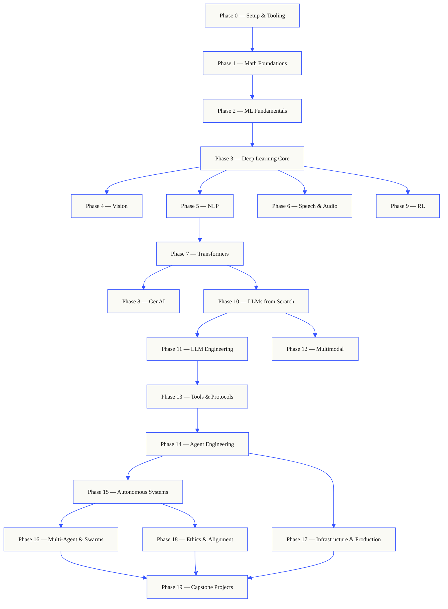
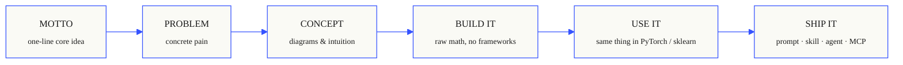

# [rohitg00/ai-engineering-from-scratch](https://github.com/rohitg00/ai-engineering-from-scratch)

<p align="center">
  
</p>

<p align="center">
  <a href="LICENSE"></a>
  <a href="ROADMAP.md"></a>
  <a href="#contents"></a>
  <a href="https://github.com/rohitg00/ai-engineering-from-scratch/stargazers"></a>
  <a href="https://aiengineeringfromscratch.com"></a>
</p>

```
░░░▒▒▒░░░▒▒▒░░░▒▒▒░░░▒▒▒░░░▒▒▒░░░▒▒▒░░░▒▒▒░░░▒▒▒░░░▒▒▒░░░▒▒▒░░░▒▒▒░░░▒▒▒░░░▒▒▒░░░▒▒▒░░░▒▒▒
```

> **84% of students already use AI tools. Only 18% feel prepared to use them
> professionally.** This curriculum closes that gap.
>
> 435 lessons. 20 phases. ~320 hours. Python, TypeScript, Rust, Julia. Every lesson ships
> a reusable artifact: a prompt, a skill, an agent, an MCP server. Free, open source, MIT.
>
> You don't just learn AI. You build it. End-to-end. By hand.

## How this works

Most AI material teaches in scattered pieces. A paper here, a fine-tuning post there, a
flashy agent demo somewhere else. The pieces rarely line up. You ship a chatbot but can't
explain its loss curve. You hook a function to an agent but can't say what attention does
inside the model that's calling it.

This curriculum is the spine. 20 phases, 435 lessons, four languages: Python, TypeScript,
Rust, Julia. Linear algebra at one end, autonomous swarms at the other. Every algorithm
gets built from raw math first. Backprop. Tokenizer. Attention. Agent loop. By the time
PyTorch shows up, you already know what it's doing under the hood.

Each lesson runs the same loop: read the problem, derive the math, write the code, run
the test, keep the artifact. No five-minute videos, no copy-paste deploys, no hand-holding.
Free, open source, and built to run on your own laptop.

```
░░░▒▒▒░░░▒▒▒░░░▒▒▒░░░▒▒▒░░░▒▒▒░░░▒▒▒░░░▒▒▒░░░▒▒▒░░░▒▒▒░░░▒▒▒░░░▒▒▒░░░▒▒▒░░░▒▒▒░░░▒▒▒░░░▒▒▒
```

## The shape of the curriculum

Twenty phases stack on top of each other. Math is the floor. Agents and production are the roof.
Skip ahead if you already know the lower layers, but don't skip and then wonder why something at
the top is breaking.



```
░░░▒▒▒░░░▒▒▒░░░▒▒▒░░░▒▒▒░░░▒▒▒░░░▒▒▒░░░▒▒▒░░░▒▒▒░░░▒▒▒░░░▒▒▒░░░▒▒▒░░░▒▒▒░░░▒▒▒░░░▒▒▒░░░▒▒▒
```

## The shape of a lesson

Each lesson lives in its own folder, with the same structure across the entire curriculum:

```
phases/<NN>-<phase-name>/<NN>-<lesson-name>/
├── code/      runnable implementations (Python, TypeScript, Rust, Julia)
├── docs/
│   └── en.md  lesson narrative
└── outputs/   prompts, skills, agents, or MCP servers this lesson produces
```

Every lesson follows six beats. The *Build It / Use It* split is the spine — you implement the
algorithm from scratch first, then run the same thing through the production library. You
understand what the framework is doing because you wrote the smaller version yourself.



## Getting started

Three ways in. Pick one.

**Option A — read.** Open any completed lesson on
[aiengineeringfromscratch.com](https://aiengineeringfromscratch.com) or expand a phase under
[Contents](#contents). No setup, no cloning.

**Option B — clone and run.**

```bash
git clone https://github.com/rohitg00/ai-engineering-from-scratch.git
cd ai-engineering-from-scratch
python phases/01-math-foundations/01-linear-algebra-intuition/code/vectors.py
```

**Option C — find your level *(recommended)*.** Skip ahead intelligently. Inside Claude, Cursor, Codex, OpenClaw, Hermes, or any agent with the curriculum skills installed:

```bash
/find-your-level
```

Ten questions. Maps your knowledge to a starting phase, builds a personalized path with hour
estimates. After each phase:

```bash
/check-understanding 3        # quiz yourself on phase 3
ls phases/03-deep-learning-core/05-loss-functions/outputs/
# ├── prompt-loss-function-selector.md
# └── prompt-loss-debugger.md
```

### Prerequisites

- You can write code (any language; Python helps).
- You want to understand how AI **actually works**, not just call APIs.

### Built-in agent skills (Claude, Cursor, Codex, OpenClaw, Hermes)

| Skill | What it does |
|---|---|
| [`/find-your-level`](.claude/skills/find-your-level/SKILL.md) | Ten-question placement quiz. Maps your knowledge to a starting phase and produces a personalized path with hour estimates. |
| [`/check-understanding <phase>`](.claude/skills/check-understanding/SKILL.md) | Per-phase quiz, eight questions, with feedback and specific lessons to review. |

```
░░░▒▒▒░░░▒▒▒░░░▒▒▒░░░▒▒▒░░░▒▒▒░░░▒▒▒░░░▒▒▒░░░▒▒▒░░░▒▒▒░░░▒▒▒░░░▒▒▒░░░▒▒▒░░░▒▒▒░░░▒▒▒░░░▒▒▒
```

## Every lesson ships something

Other curricula end with *"congratulations, you learned X."* Each lesson here ends with a
**reusable tool** you can install or paste into your daily workflow.

<table>
<tr>
<th align="left" width="25%"><br/><sub>FIG_001 · A</sub><br/><b>PROMPTS</b></th>
<th align="left" width="25%"><br/><sub>FIG_001 · B</sub><br/><b>SKILLS</b></th>
<th align="left" width="25%"><br/><sub>FIG_001 · C</sub><br/><b>AGENTS</b></th>
<th align="left" width="25%"><br/><sub>FIG_001 · D</sub><br/><b>MCP SERVERS</b></th>
</tr>
<tr>
<td valign="top">Paste into any AI assistant for expert-level help on a narrow task.</td>
<td valign="top">Drop into Claude, Cursor, Codex, OpenClaw, Hermes, or any agent that reads <code>SKILL.md</code>.</td>
<td valign="top">Deploy as autonomous workers — you wrote the loop yourself in Phase 14.</td>
<td valign="top">Plug into any MCP-compatible client. Built end-to-end in Phase 13.</td>
</tr>
</table>

> Install the lot with `python3 scripts/install_skills.py`. Real tools, not homework.
> By the end of the curriculum, you have a portfolio of 435 artifacts you actually
> understand because you built them.

### FIG_002 · A worked sample

Phase 14, lesson 1: the agent loop. ~120 lines of pure Python, no dependencies.

<table>
<tr>
<td valign="top" width="50%">

**`code/agent_loop.py`** &nbsp; <sub><i>build it</i></sub>

```python
def run(query, tools):
    history = [user(query)]
    for step in range(MAX_STEPS):
        msg = llm(history)
        if msg.tool_calls:
            for call in msg.tool_calls:
                result = tools[call.name](**call.args)
                history.append(tool_result(call.id, result))
            continue
        return msg.content
    raise StepLimitExceeded
```

</td>
<td valign="top" width="50%">

**`outputs/skill-agent-loop.md`** &nbsp; <sub><i>ship it</i></sub>

```markdown
---
name: agent-loop
description: ReAct-style loop for any tool list
phase: 14
lesson: 01
---

Implement a minimal agent loop that...
```

**`outputs/prompt-debug-agent.md`**

```markdown
You are an agent debugger. Given the trace
of an agent run, identify the step where
the agent went wrong and explain why...
```

</td>
</tr>
</table>

```
░░░▒▒▒░░░▒▒▒░░░▒▒▒░░░▒▒▒░░░▒▒▒░░░▒▒▒░░░▒▒▒░░░▒▒▒░░░▒▒▒░░░▒▒▒░░░▒▒▒░░░▒▒▒░░░▒▒▒░░░▒▒▒░░░▒▒▒
```

<a id="contents"></a>

## Contents

Twenty phases. Click any phase to expand its lesson list.

<a id="phase-0"></a>
### Phase 0: Setup & Tooling `12 lessons`
> Get your environment ready for everything that follows.

| # | Lesson | Type | Lang |
|:---:|--------|:----:|------|
| 01 | [Dev Environment](phases/00-setup-and-tooling/01-dev-environment/) | Build | Python, TypeScript, Rust |
| 02 | [Git & Collaboration](phases/00-setup-and-tooling/02-git-and-collaboration/) | Learn | — |
| 03 | [GPU Setup & Cloud](phases/00-setup-and-tooling/03-gpu-setup-and-cloud/) | Build | Python |
| 04 | [APIs & Keys](phases/00-setup-and-tooling/04-apis-and-keys/) | Build | Python, TypeScript |
| 05 | [Jupyter Notebooks](phases/00-setup-and-tooling/05-jupyter-notebooks/) | Build | Python |
| 06 | [Python Environments](phases/00-setup-and-tooling/06-python-environments/) | Build | Python |
| 07 | [Docker for AI](phases/00-setup-and-tooling/07-docker-for-ai/) | Build | Python |
| 08 | [Editor Setup](phases/00-setup-and-tooling/08-editor-setup/) | Build | — |
| 09 | [Data Management](phases/00-setup-and-tooling/09-data-management/) | Build | Python |
| 10 | [Terminal & Shell](phases/00-setup-and-tooling/10-terminal-and-shell/) | Learn | — |
| 11 | [Linux for AI](phases/00-setup-and-tooling/11-linux-for-ai/) | Learn | — |
| 12 | [Debugging & Profiling](phases/00-setup-and-tooling/12-debugging-and-profiling/) | Build | Python |

<details id="phase-1">
<summary><b>Phase 1 — Math Foundations</b> &nbsp;<code>22 lessons</code>&nbsp; <em>The intuition behind every AI algorithm, through code.</em></summary>
<br/>

| # | Lesson | Type | Lang |
|:---:|--------|:----:|------|
| 01 | [Linear Algebra Intuition](phases/01-math-foundations/01-linear-algebra-intuition/) | Learn | Python, Julia |
| 02 | [Vectors, Matrices & Operations](phases/01-math-foundations/02-vectors-matrices-operations/) | Build | Python, Julia |
| 03 | [Matrix Transformations & Eigenvalues](phases/01-math-foundations/03-matrix-transformations/) | Build | Python, Julia |
| 04 | [Calculus for ML: Derivatives & Gradients](phases/01-math-foundations/04-calculus-for-ml/) | Learn | Python |
| 05 | [Chain Rule & Automatic Differentiation](phases/01-math-foundations/05-chain-rule-and-autodiff/) | Build | Python |
| 06 | [Probability & Distributions](phases/01-math-foundations/06-probability-and-distributions/) | Learn | Python |
| 07 | [Bayes' Theorem & Statistical Thinking](phases/01-math-foundations/07-bayes-theorem/) | Build | Python |
| 08 | [Optimization: Gradient Descent Family](phases/01-math-foundations/08-optimization/) | Build | Python |
| 09 | [Information Theory: Entropy, KL Divergence](phases/01-math-foundations/09-information-theory/) | Learn | Python |
| 10 | [Dimensionality Reduction: PCA, t-SNE, UMAP](phases/01-math-foundations/10-dimensionality-reduction/) | Build | Python |
| 11 | [Singular Value Decomposition](phases/01-math-foundations/11-singular-value-decomposition/) | Build | Python, Julia |
| 12 | [Tensor Operations](phases/01-math-foundations/12-tensor-operations/) | Build | Python |
| 13 | [Numerical Stability](phases/01-math-foundations/13-numerical-stability/) | Build | Python |
| 14 | [Norms & Distances](phases/01-math-foundations/14-norms-and-distances/) | Build | Python |
| 15 | [Statistics for ML](phases/01-math-foundations/15-statistics-for-ml/) | Build | Python |
| 16 | [Sampling Methods](phases/01-math-foundations/16-sampling-methods/) | Build | Python |
| 17 | [Linear Systems](phases/01-math-foundations/17-linear-systems/) | Build | Python |
| 18 | [Convex Optimization](phases/01-math-foundations/18-convex-optimization/) | Build | Python |
| 19 | [Complex Numbers for AI](phases/01-math-foundations/19-complex-numbers/) | Learn | Python |
| 20 | [The Fourier Transform](phases/01-math-foundations/20-fourier-transform/) | Build | Python |
| 21 | [Graph Theory for ML](phases/01-math-foundations/21-graph-theory/) | Build | Python |
| 22 | [Stochastic Processes](phases/01-math-foundations/22-stochastic-processes/) | Learn | Python |

</details>

<details id="phase-2">
<summary><b>Phase 2 — ML Fundamentals</b> &nbsp;<code>18 lessons</code>&nbsp; <em>Classical ML — still the backbone of most production AI.</em></summary>
<br/>

| # | Lesson | Type | Lang |
|:---:|--------|:----:|------|
| 01 | [What Is Machine Learning](phases/02-ml-fundamentals/01-what-is-machine-learning/) | Learn | Python |
| 02 | [Linear Regression from Scratch](phases/02-ml-fundamentals/02-linear-regression/) | Build | Python |
| 03 | [Logistic Regression & Classification](phases/02-ml-fundamentals/03-logistic-regression/) | Build | Python |
| 04 | [Decision Trees & Random Forests](phases/02-ml-fundamentals/04-decision-trees/) | Build | Python |
| 05 | [Support Vector Machines](phases/02-ml-fundamentals/05-support-vector-machines/) | Build | Python |
| 06 | [KNN & Distance Metrics](phases/02-ml-fundamentals/06-knn-and-distances/) | Build | Python |
| 07 | [Unsupervised Learning: K-Means, DBSCAN](phases/02-ml-fundamentals/07-unsupervised-learning/) | Build | Python |
| 08 | [Feature Engineering & Selection](phases/02-ml-fundamentals/08-feature-engineering/) | Build | Python |
| 09 | [Model Evaluation: Metrics, Cross-Validation](phases/02-ml-fundamentals/09-model-evaluation/) | Build | Python |
| 10 | [Bias, Variance & the Learning Curve](phases/02-ml-fundamentals/10-bias-variance/) | Learn | Python |
| 11 | [Ensemble Methods: Boosting, Bagging, Stacking](phases/02-ml-fundamentals/11-ensemble-methods/) | Build | Python |
| 12 | [Hyperparameter Tuning](phases/02-ml-fundamentals/12-hyperparameter-tuning/) | Build | Python |
| 13 | [ML Pipelines & Experiment Tracking](phases/02-ml-fundamentals/13-ml-pipelines/) | Build | Python |
| 14 | [Naive Bayes](phases/02-ml-fundamentals/14-naive-bayes/) | Build | Python |
| 15 | [Time Series Fundamentals](phases/02-ml-fundamentals/15-time-series/) | Build | Python |
| 16 | [Anomaly Detection](phases/02-ml-fundamentals/16-anomaly-detection/) | Build | Python |
| 17 | [Handling Imbalanced Data](phases/02-ml-fundamentals/17-imbalanced-data/) | Build | Python |
| 18 | [Feature Selection](phases/02-ml-fundamentals/18-feature-selection/) | Build | Python |

</details>

<details id="phase-3">
<summary><b>Phase 3 — Deep Learning Core</b> &nbsp;<code>13 lessons</code>&nbsp; <em>Neural networks from first principles. No frameworks until you build one.</em></summary>
<br/>

| # | Lesson | Type | Lang |
|:---:|--------|:----:|------|
| 01 | [The Perceptron: Where It All Started](phases/03-deep-learning-core/01-the-perceptron/) | Build | Python |
| 02 | [Multi-Layer Networks & Forward Pass](phases/03-deep-learning-core/02-multi-layer-networks/) | Build | Python |
| 03 | [Backpropagation from Scratch](phases/03-deep-learning-core/03-backpropagation/) | Build | Python |
| 04 | [Activation Functions: ReLU, Sigmoid, GELU & Why](phases/03-deep-learning-core/04-activation-functions/) | Build | Python |
| 05 | [Loss Functions: MSE, Cross-Entropy, Contrastive](phases/03-deep-learning-core/05-loss-functions/) | Build | Python |
| 06 | [Optimizers: SGD, Momentum, Adam, AdamW](phases/03-deep-learning-core/06-optimizers/) | Build | Python |
| 07 | [Regularization: Dropout, Weight Decay, BatchNorm](phases/03-deep-learning-core/07-regularization/) | Build | Python |
| 08 | [Weight Initialization & Training Stability](phases/03-deep-learning-core/08-weight-initialization/) | Build | Python |
| 09 | [Learning Rate Schedules & Warmup](phases/03-deep-learning-core/09-learning-rate-schedules/) | Build | Python |
| 10 | [Build Your Own Mini Framework](phases/03-deep-learning-core/10-mini-framework/) | Build | Python |
| 11 | [Introduction to PyTorch](phases/03-deep-learning-core/11-intro-to-pytorch/) | Build | Python |
| 12 | [Introduction to JAX](phases/03-deep-learning-core/12-intro-to-jax/) | Build | Python |
| 13 | [Debugging Neural Networks](phases/03-deep-learning-core/13-debugging-neural-networks/) | Build | Python |

</details>

<details id="phase-4">
<summary><b>Phase 4 — Computer Vision</b> &nbsp;<code>28 lessons</code>&nbsp; <em>From pixels to understanding — image, video, 3D, VLMs, and world models.</em></summary>
<br/>

| # | Lesson | Type | Lang |
|:---:|--------|:----:|------|
| 01 | [Image Fundamentals: Pixels, Channels, Color Spaces](phases/04-computer-vision/01-image-fundamentals/) | Learn | Python |
| 02 | [Convolutions from Scratch](phases/04-computer-vision/02-convolutions-from-scratch/) | Build | Python |
| 03 | [CNNs: LeNet to ResNet](phases/04-computer-vision/03-cnns-lenet-to-resnet/) | Build | Python |
| 04 | [Image Classification](phases/04-computer-vision/04-image-classification/) | Build | Python |
| 05 | [Transfer Learning & Fine-Tuning](phases/04-computer-vision/05-transfer-learning/) | Build | Python |
| 06 | [Object Detection — YOLO from Scratch](phases/04-computer-vision/06-object-detection-yolo/) | Build | Python |
| 07 | [Semantic Segmentation — U-Net](phases/04-computer-vision/07-semantic-segmentation-unet/) | Build | Python |
| 08 | [Instance Segmentation — Mask R-CNN](phases/04-computer-vision/08-instance-segmentation-mask-rcnn/) | Build | Python |
| 09 | [Image Generation — GANs](phases/04-computer-vision/09-image-generation-gans/) | Build | Python |
| 10 | [Image Generation — Diffusion Models](phases/04-computer-vision/10-image-generation-diffusion/) | Build | Python |
| 11 | [Stable Diffusion — Architecture & Fine-Tuning](phases/04-computer-vision/11-stable-diffusion/) | Build | Python |
| 12 | [Video Understanding — Temporal Modeling](phases/04-computer-vision/12-video-understanding/) | Build | Python |
| 13 | [3D Vision: Point Clouds, NeRFs](phases/04-computer-vision/13-3d-vision-nerf/) | Build | Python |
| 14 | [Vision Transformers (ViT)](phases/04-computer-vision/14-vision-transformers/) | Build | Python |
| 15 | [Real-Time Vision: Edge Deployment](phases/04-computer-vision/15-real-time-edge/) | Build | Python, Rust |
| 16 | [Build a Complete Vision Pipeline](phases/04-computer-vision/16-vision-pipeline-capstone/) | Build | Python |
| 17 | [Self-Supervised Vision — SimCLR, DINO, MAE](phases/04-computer-vision/17-self-supervised-vision/) | Build | Python |
| 18 | [Open-Vocabulary Vision — CLIP](phases/04-computer-vision/18-open-vocab-clip/) | Build | Python |
| 19 | [OCR & Document Understanding](phases/04-computer-vision/19-ocr-document-understanding/) | Build | Python |
| 20 | [Image Retrieval & Metric Learning](phases/04-computer-vision/20-image-retrieval-metric/) | Build | Python |
| 21 | [Keypoint Detection & Pose Estimation](phases/04-computer-vision/21-keypoint-pose/) | Build | Python |
| 22 | [3D Gaussian Splatting from Scratch](phases/04-computer-vision/22-3d-gaussian-splatting/) | Build | Python |
| 23 | [Diffusion Transformers & Rectified Flow](phases/04-computer-vision/23-diffusion-transformers-rectified-flow/) | Build | Python |
| 24 | [SAM 3 & Open-Vocabulary Segmentation](phases/04-computer-vision/24-sam3-open-vocab-segmentation/) | Build | Python |
| 25 | [Vision-Language Models (ViT-MLP-LLM)](phases/04-computer-vision/25-vision-language-models/) | Build | Python |
| 26 | [Monocular Depth & Geometry Estimation](phases/04-computer-vision/26-monocular-depth/) | Build | Python |
| 27 | [Multi-Object Tracking & Video Memory](phases/04-computer-vision/27-multi-object-tracking/) | Build | Python |
| 28 | [World Models & Video Diffusion](phases/04-computer-vision/28-world-models-video-diffusion/) | Build | Python |

</details>

<details id="phase-5">
<summary><b>Phase 5 — NLP: Foundations to Advanced</b> &nbsp;<code>29 lessons</code>&nbsp; <em>Language is the interface to intelligence.</em></summary>
<br/>

| # | Lesson | Type | Lang |
|:---:|--------|:----:|------|
| 01 | [Text Processing: Tokenization, Stemming, Lemmatization](phases/05-nlp-foundations-to-advanced/01-text-processing/) | Build | Python |
| 02 | [Bag of Words, TF-IDF & Text Representation](phases/05-nlp-foundations-to-advanced/02-bag-of-words-tfidf/) | Build | Python |
| 03 | [Word Embeddings: Word2Vec from Scratch](phases/05-nlp-foundations-to-advanced/03-word-embeddings-word2vec/) | Build | Python |
| 04 | [GloVe, FastText & Subword Embeddings](phases/05-nlp-foundations-to-advanced/04-glove-fasttext-subword/) | Build | Python |
| 05 | [Sentiment Analysis](phases/05-nlp-foundations-to-advanced/05-sentiment-analysis/) | Build | Python |
| 06 | [Named Entity Recognition (NER)](phases/05-nlp-foundations-to-advanced/06-named-entity-recognition/) | Build | Python |
| 07 | [POS Tagging & Syntactic Parsing](phases/05-nlp-foundations-to-advanced/07-pos-tagging-parsing/) | Build | Python |
| 08 | [Text Classification — CNNs & RNNs for Text](phases/05-nlp-foundations-to-advanced/08-cnns-rnns-for-text/) | Build | Python |
| 09 | [Sequence-to-Sequence Models](phases/05-nlp-foundations-to-advanced/09-sequence-to-sequence/) | Build | Python |
| 10 | [Attention Mechanism — The Breakthrough](phases/05-nlp-foundations-to-advanced/10-attention-mechanism/) | Build | Python |
| 11 | [Machine Translation](phases/05-nlp-foundations-to-advanced/11-machine-translation/) | Build | Python |
| 12 | [Text Summarization](phases/05-nlp-foundations-to-advanced/12-text-summarization/) | Build | Python |
| 13 | [Question Answering Systems](phases/05-nlp-foundations-to-advanced/13-question-answering/) | Build | Python |
| 14 | [Information Retrieval & Search](phases/05-nlp-foundations-to-advanced/14-information-retrieval-search/) | Build | Python |
| 15 | [Topic Modeling: LDA, BERTopic](phases/05-nlp-foundations-to-advanced/15-topic-modeling/) | Build | Python |
| 16 | [Text Generation](phases/05-nlp-foundations-to-advanced/16-text-generation-pre-transformer/) | Build | Python |
| 17 | [Chatbots: Rule-Based to Neural](phases/05-nlp-foundations-to-advanced/17-chatbots-rule-to-neural/) | Build | Python |
| 18 | [Multilingual NLP](phases/05-nlp-foundations-to-advanced/18-multilingual-nlp/) | Build | Python |
| 19 | [Subword Tokenization: BPE, WordPiece, Unigram, SentencePiece](phases/05-nlp-foundations-to-advanced/19-subword-tokenization/) | Learn | Python |
| 20 | [Structured Outputs & Constrained Decoding](phases/05-nlp-foundations-to-advanced/20-structured-outputs-constrained-decoding/) | Build | Python |
| 21 | [NLI & Textual Entailment](phases/05-nlp-foundations-to-advanced/21-nli-textual-entailment/) | Learn | Python |
| 22 | [Embedding Models Deep Dive](phases/05-nlp-foundations-to-advanced/22-embedding-models-deep-dive/) | Learn | Python |
| 23 | [Chunking Strategies for RAG](phases/05-nlp-foundations-to-advanced/23-chunking-strategies-rag/) | Build | Python |
| 24 | [Coreference Resolution](phases/05-nlp-foundations-to-advanced/24-coreference-resolution/) | Learn | Python |
| 25 | [Entity Linking & Disambiguation](phases/05-nlp-foundations-to-advanced/25-entity-linking/) | Build | Python |
| 26 | [Relation Extraction & Knowledge Graph Construction](phases/05-nlp-foundations-to-advanced/26-relation-extraction-kg/) | Build | Python |
| 27 | [LLM Evaluation: RAGAS, DeepEval, G-Eval](phases/05-nlp-foundations-to-advanced/27-llm-evaluation-frameworks/) | Build | Python |
| 28 | [Long-Context Evaluation: NIAH, RULER, LongBench, MRCR](phases/05-nlp-foundations-to-advanced/28-long-context-evaluation/) | Learn | Python |
| 29 | [Dialogue State Tracking](phases/05-nlp-foundations-to-advanced/29-dialogue-state-tracking/) | Build | Python |

</details>

<details id="phase-6">
<summary><b>Phase 6 — Speech & Audio</b> &nbsp;<code>17 lessons</code>&nbsp; <em>Hear, understand, speak.</em></summary>
<br/>

| # | Lesson | Type | Lang |
|:---:|--------|:----:|------|
| 01 | [Audio Fundamentals: Waveforms, Sampling, FFT](phases/06-speech-and-audio/01-audio-fundamentals) | Learn | Python |
| 02 | [Spectrograms, Mel Scale & Audio Features](phases/06-speech-and-audio/02-spectrograms-mel-features) | Build | Python |
| 03 | [Audio Classification](phases/06-speech-and-audio/03-audio-classification) | Build | Python |
| 04 | [Speech Recognition (ASR)](phases/06-speech-and-audio/04-speech-recognition-asr) | Build | Python |
| 05 | [Whisper: Architecture & Fine-Tuning](phases/06-speech-and-audio/05-whisper-architecture-finetuning) | Build | Python |
| 06 | [Speaker Recognition & Verification](phases/06-speech-and-audio/06-speaker-recognition-verification) | Build | Python |
| 07 | [Text-to-Speech (TTS)](phases/06-speech-and-audio/07-text-to-speech) | Build | Python |
| 08 | [Voice Cloning & Voice Conversion](phases/06-speech-and-audio/08-voice-cloning-conversion) | Build | Python |
| 09 | [Music Generation](phases/06-speech-and-audio/09-music-generation) | Build | Python |
| 10 | [Audio-Language Models](phases/06-speech-and-audio/10-audio-language-models) | Build | Python |
| 11 | [Real-Time Audio Processing](phases/06-speech-and-audio/11-real-time-audio-processing) | Build | Python, Rust |
| 12 | [Build a Voice Assistant Pipeline](phases/06-speech-and-audio/12-voice-assistant-pipeline) | Build | Python |
| 13 | [Neural Audio Codecs — EnCodec, SNAC, Mimi, DAC](phases/06-speech-and-audio/13-neural-audio-codecs) | Learn | Python |
| 14 | [Voice Activity Detection & Turn-Taking](phases/06-speech-and-audio/14-voice-activity-detection-turn-taking) | Build | Python |
| 15 | [Streaming Speech-to-Speech — Moshi, Hibiki](phases/06-speech-and-audio/15-streaming-speech-to-speech-moshi-hibiki) | Learn | Python |
| 16 | [Voice Anti-Spoofing & Audio Watermarking](phases/06-speech-and-audio/16-anti-spoofing-audio-watermarking) | Build | Python |
| 17 | [Audio Evaluation — WER, MOS, MMAU, Leaderboards](phases/06-speech-and-audio/17-audio-evaluation-metrics) | Learn | Python |

</details>

<details id="phase-7">
<summary><b>Phase 7 — Transformers Deep Dive</b> &nbsp;<code>14 lessons</code>&nbsp; <em>The architecture that changed everything.</em></summary>
<br/>

| # | Lesson | Type | Lang |
|:---:|--------|:----:|------|
| 01 | [Why Transformers: The Problems with RNNs](phases/07-transformers-deep-dive/01-why-transformers/) | Learn | Python |
| 02 | [Self-Attention from Scratch](phases/07-transformers-deep-dive/02-self-attention-from-scratch/) | Build | Python |
| 03 | [Multi-Head Attention](phases/07-transformers-deep-dive/03-multi-head-attention/) | Build | Python |
| 04 | [Positional Encoding: Sinusoidal, RoPE, ALiBi](phases/07-transformers-deep-dive/04-positional-encoding/) | Build | Python |
| 05 | [The Full Transformer: Encoder + Decoder](phases/07-transformers-deep-dive/05-full-transformer/) | Build | Python |
| 06 | [BERT — Masked Language Modeling](phases/07-transformers-deep-dive/06-bert-masked-language-modeling/) | Build | Python |
| 07 | [GPT — Causal Language Modeling](phases/07-transformers-deep-dive/07-gpt-causal-language-modeling/) | Build | Python |
| 08 | [T5, BART — Encoder-Decoder Models](phases/07-transformers-deep-dive/08-t5-bart-encoder-decoder/) | Learn | Python |
| 09 | [Vision Transformers (ViT)](phases/07-transformers-deep-dive/09-vision-transformers/) | Build | Python |
| 10 | [Audio Transformers — Whisper Architecture](phases/07-transformers-deep-dive/10-audio-transformers-whisper/) | Learn | Python |
| 11 | [Mixture of Experts (MoE)](phases/07-transformers-deep-dive/11-mixture-of-experts/) | Build | Python |
| 12 | [KV Cache, Flash Attention & Inference Optimization](phases/07-transformers-deep-dive/12-kv-cache-flash-attention/) | Build | Python |
| 13 | [Scaling Laws](phases/07-transformers-deep-dive/13-scaling-laws/) | Learn | Python |
| 14 | [Build a Transformer from Scratch](phases/07-transformers-deep-dive/14-build-a-transformer-capstone/) | Build | Python |

</details>

<details id="phase-8">
<summary><b>Phase 8 — Generative AI</b> &nbsp;<code>14 lessons</code>&nbsp; <em>Create images, video, audio, 3D, and more.</em></summary>
<br/>

| # | Lesson | Type | Lang |
|:---:|--------|:----:|------|
| 01 | [Generative Models: Taxonomy & History](phases/08-generative-ai/01-generative-models-taxonomy-history/) | Learn | Python |
| 02 | [Autoencoders & VAE](phases/08-generative-ai/02-autoencoders-vae/) | Build | Python |
| 03 | [GANs: Generator vs Discriminator](phases/08-generative-ai/03-gans-generator-discriminator/) | Build | Python |
| 04 | [Conditional GANs & Pix2Pix](phases/08-generative-ai/04-conditional-gans-pix2pix/) | Build | Python |
| 05 | [StyleGAN](phases/08-generative-ai/05-stylegan/) | Build | Python |
| 06 | [Diffusion Models — DDPM from Scratch](phases/08-generative-ai/06-diffusion-ddpm-from-scratch/) | Build | Python |
| 07 | [Latent Diffusion & Stable Diffusion](phases/08-generative-ai/07-latent-diffusion-stable-diffusion/) | Build | Python |
| 08 | [ControlNet, LoRA & Conditioning](phases/08-generative-ai/08-controlnet-lora-conditioning/) | Build | Python |
| 09 | [Inpainting, Outpainting & Editing](phases/08-generative-ai/09-inpainting-outpainting-editing/) | Build | Python |
| 10 | [Video Generation](phases/08-generative-ai/10-video-generation/) | Build | Python |
| 11 | [Audio Generation](phases/08-generative-ai/11-audio-generation/) | Build | Python |
| 12 | [3D Generation](phases/08-generative-ai/12-3d-generation/) | Build | Python |
| 13 | [Flow Matching & Rectified Flows](phases/08-generative-ai/13-flow-matching-rectified-flows/) | Build | Python |
| 14 | [Evaluation: FID, CLIP Score](phases/08-generative-ai/14-evaluation-fid-clip-score/) | Build | Python |

</details>

<details id="phase-9">
<summary><b>Phase 9 — Reinforcement Learning</b> &nbsp;<code>12 lessons</code>&nbsp; <em>The foundation of RLHF and game-playing AI.</em></summary>
<br/>

| # | Lesson | Type | Lang |
|:---:|--------|:----:|------|
| 01 | [MDPs, States, Actions & Rewards](phases/09-reinforcement-learning/01-mdps-states-actions-rewards/) | Learn | Python |
| 02 | [Dynamic Programming](phases/09-reinforcement-learning/02-dynamic-programming/) | Build | Python |
| 03 | [Monte Carlo Methods](phases/09-reinforcement-learning/03-monte-carlo-methods/) | Build | Python |
| 04 | [Q-Learning, SARSA](phases/09-reinforcement-learning/04-q-learning-sarsa/) | Build | Python |
| 05 | [Deep Q-Networks (DQN)](phases/09-reinforcement-learning/05-dqn/) | Build | Python |
| 06 | [Policy Gradients — REINFORCE](phases/09-reinforcement-learning/06-policy-gradients-reinforce/) | Build | Python |
| 07 | [Actor-Critic — A2C, A3C](phases/09-reinforcement-learning/07-actor-critic-a2c-a3c/) | Build | Python |
| 08 | [PPO](phases/09-reinforcement-learning/08-ppo/) | Build | Python |
| 09 | [Reward Modeling & RLHF](phases/09-reinforcement-learning/09-reward-modeling-rlhf/) | Build | Python |
| 10 | [Multi-Agent RL](phases/09-reinforcement-learning/10-multi-agent-rl/) | Build | Python |
| 11 | [Sim-to-Real Transfer](phases/09-reinforcement-learning/11-sim-to-real-transfer/) | Build | Python |
| 12 | [RL for Games](phases/09-reinforcement-learning/12-rl-for-games/) | Build | Python |

</details>

<details id="phase-10">
<summary><b>Phase 10 — LLMs from Scratch</b> &nbsp;<code>22 lessons</code>&nbsp; <em>Build, train, and understand large language models.</em></summary>
<br/>

| # | Lesson | Type | Lang |
|:---:|--------|:----:|------|
| 01 | [Tokenizers: BPE, WordPiece, SentencePiece](phases/10-llms-from-scratch/01-tokenizers/) | Build | Python |
| 02 | [Building a Tokenizer from Scratch](phases/10-llms-from-scratch/02-building-a-tokenizer/) | Build | Python |
| 03 | [Data Pipelines for Pre-Training](phases/10-llms-from-scratch/03-data-pipelines/) | Build | Python |
| 04 | [Pre-Training a Mini GPT (124M)](phases/10-llms-from-scratch/04-pre-training-mini-gpt/) | Build | Python |
| 05 | [Distributed Training, FSDP, DeepSpeed](phases/10-llms-from-scratch/05-scaling-distributed/) | Build | Python |
| 06 | [Instruction Tuning — SFT](phases/10-llms-from-scratch/06-instruction-tuning-sft/) | Build | Python |
| 07 | [RLHF — Reward Model + PPO](phases/10-llms-from-scratch/07-rlhf/) | Build | Python |
| 08 | [DPO — Direct Preference Optimization](phases/10-llms-from-scratch/08-dpo/) | Build | Python |
| 09 | [Constitutional AI & Self-Improvement](phases/10-llms-from-scratch/09-constitutional-ai-self-improvement/) | Build | Python |
| 10 | [Evaluation — Benchmarks, Evals](phases/10-llms-from-scratch/10-evaluation/) | Build | Python |
| 11 | [Quantization: INT8, GPTQ, AWQ, GGUF](phases/10-llms-from-scratch/11-quantization/) | Build | Python, Rust |
| 12 | [Inference Optimization](phases/10-llms-from-scratch/12-inference-optimization/) | Build | Python |
| 13 | [Building a Complete LLM Pipeline](phases/10-llms-from-scratch/13-building-complete-llm-pipeline/) | Build | Python |
| 14 | [Open Models: Architecture Walkthroughs](phases/10-llms-from-scratch/14-open-models-architecture-walkthroughs/) | Learn | Python |
| 15 | [Speculative Decoding and EAGLE-3](phases/10-llms-from-scratch/15-speculative-decoding-eagle3/) | Build | Python |
| 16 | [Differential Attention (V2)](phases/10-llms-from-scratch/16-differential-attention-v2/) | Build | Python |
| 17 | [Native Sparse Attention (DeepSeek NSA)](phases/10-llms-from-scratch/17-native-sparse-attention/) | Build | Python |
| 18 | [Multi-Token Prediction (MTP)](phases/10-llms-from-scratch/18-multi-token-prediction/) | Build | Python |
| 19 | [DualPipe Parallelism](phases/10-llms-from-scratch/19-dualpipe-parallelism/) | Learn | Python |
| 20 | [DeepSeek-V3 Architecture Walkthrough](phases/10-llms-from-scratch/20-deepseek-v3-walkthrough/) | Learn | Python |
| 21 | [Jamba — Hybrid SSM-Transformer](phases/10-llms-from-scratch/21-jamba-hybrid-ssm-transformer/) | Learn | Python |
| 22 | [Async and Hogwild! Inference](phases/10-llms-from-scratch/22-async-hogwild-inference/) | Build | Python |

</details>

<details id="phase-11">
<summary><b>Phase 11 — LLM Engineering</b> &nbsp;<code>17 lessons</code>&nbsp; <em>Put LLMs to work in production.</em></summary>
<br/>

| # | Lesson | Type | Lang |
|:---:|--------|:----:|------|
| 01 | [Prompt Engineering: Techniques & Patterns](phases/11-llm-engineering/01-prompt-engineering/) | Build | Python |
| 02 | [Few-Shot, CoT, Tree-of-Thought](phases/11-llm-engineering/02-few-shot-cot/) | Build | Python |
| 03 | [Structured Outputs](phases/11-llm-engineering/03-structured-outputs/) | Build | Python, TypeScript |
| 04 | [Embeddings & Vector Representations](phases/11-llm-engineering/04-embeddings/) | Build | Python |
| 05 | [Context Engineering](phases/11-llm-engineering/05-context-engineering/) | Build | Python, TypeScript |
| 06 | [RAG: Retrieval-Augmented Generation](phases/11-llm-engineering/06-rag/) | Build | Python, TypeScript |
| 07 | [Advanced RAG: Chunking, Reranking](phases/11-llm-engineering/07-advanced-rag/) | Build | Python |
| 08 | [Fine-Tuning with LoRA & QLoRA](phases/11-llm-engineering/08-fine-tuning-lora/) | Build | Python |
| 09 | [Function Calling & Tool Use](phases/11-llm-engineering/09-function-calling/) | Build | Python |
| 10 | [Evaluation & Testing](phases/11-llm-engineering/10-evaluation/) | Build | Python |
| 11 | [Caching, Rate Limiting & Cost](phases/11-llm-engineering/11-caching-cost/) | Build | Python |
| 12 | [Guardrails & Safety](phases/11-llm-engineering/12-guardrails/) | Build | Python |
| 13 | [Building a Production LLM App](phases/11-llm-engineering/13-production-app/) | Build | Python |
| 14 | [Model Context Protocol (MCP)](phases/11-llm-engineering/14-model-context-protocol/) | Build | Python |
| 15 | [Prompt Caching & Context Caching](phases/11-llm-engineering/15-prompt-caching/) | Build | Python |
| 16 | [LangGraph: State Machines for Agents](phases/11-llm-engineering/16-langgraph-state-machines/) | Build | Python |
| 17 | [Agent Framework Tradeoffs](phases/11-llm-engineering/17-agent-framework-tradeoffs/) | Learn | Python |

</details>

<details id="phase-12">
<summary><b>Phase 12 — Multimodal AI</b> &nbsp;<code>25 lessons</code>&nbsp; <em>See, hear, read, and reason across modalities — from ViT patches to computer-use agents.</em></summary>
<br/>

| # | Lesson | Type | Lang |
|:---:|--------|:----:|------|
| 01 | [Vision Transformers and the Patch-Token Primitive](phases/12-multimodal-ai/01-vision-transformer-patch-tokens/) | Learn | Python |
| 02 | [CLIP and Contrastive Vision-Language Pretraining](phases/12-multimodal-ai/02-clip-contrastive-pretraining/) | Build | Python |
| 03 | [BLIP-2 Q-Former as Modality Bridge](phases/12-multimodal-ai/03-blip2-qformer-bridge/) | Build | Python |
| 04 | [Flamingo and Gated Cross-Attention](phases/12-multimodal-ai/04-flamingo-gated-cross-attention/) | Learn | Python |
| 05 | [LLaVA and Visual Instruction Tuning](phases/12-multimodal-ai/05-llava-visual-instruction-tuning/) | Build | Python |
| 06 | [Any-Resolution Vision — Patch-n'-Pack and NaFlex](phases/12-multimodal-ai/06-any-resolution-patch-n-pack/) | Build | Python |
| 07 | [Open-Weight VLM Recipes: What Actually Matters](phases/12-multimodal-ai/07-open-weight-vlm-recipes/) | Learn | Python |
| 08 | [LLaVA-OneVision: Single, Multi, Video](phases/12-multimodal-ai/08-llava-onevision-single-multi-video/) | Build | Python |
| 09 | [Qwen-VL Family and Dynamic-FPS Video](phases/12-multimodal-ai/09-qwen-vl-family-dynamic-fps/) | Learn | Python |
| 10 | [InternVL3 Native Multimodal Pretraining](phases/12-multimodal-ai/10-internvl3-native-multimodal/) | Learn | Python |
| 11 | [Chameleon Early-Fusion Token-Only](phases/12-multimodal-ai/11-chameleon-early-fusion-tokens/) | Build | Python |
| 12 | [Emu3 Next-Token Prediction for Generation](phases/12-multimodal-ai/12-emu3-next-token-for-generation/) | Learn | Python |
| 13 | [Transfusion Autoregressive + Diffusion](phases/12-multimodal-ai/13-transfusion-autoregressive-diffusion/) | Build | Python |
| 14 | [Show-o Discrete-Diffusion Unified](phases/12-multimodal-ai/14-show-o-discrete-diffusion-unified/) | Learn | Python |
| 15 | [Janus-Pro Decoupled Encoders](phases/12-multimodal-ai/15-janus-pro-decoupled-encoders/) | Build | Python |
| 16 | [MIO Any-to-Any Streaming](phases/12-multimodal-ai/16-mio-any-to-any-streaming/) | Learn | Python |
| 17 | [Video-Language Temporal Grounding](phases/12-multimodal-ai/17-video-language-temporal-grounding/) | Build | Python |
| 18 | [Long-Video at Million-Token Context](phases/12-multimodal-ai/18-long-video-million-token/) | Build | Python |
| 19 | [Audio-Language Models: Whisper to AF3](phases/12-multimodal-ai/19-audio-language-whisper-to-af3/) | Build | Python |
| 20 | [Omni Models: Thinker-Talker Streaming](phases/12-multimodal-ai/20-omni-models-thinker-talker/) | Build | Python |
| 21 | [Embodied VLAs: RT-2, OpenVLA, π0, GR00T](phases/12-multimodal-ai/21-embodied-vlas-openvla-pi0-groot/) | Learn | Python |
| 22 | [Document and Diagram Understanding](phases/12-multimodal-ai/22-document-diagram-understanding/) | Build | Python |
| 23 | [ColPali Vision-Native Document RAG](phases/12-multimodal-ai/23-colpali-vision-native-rag/) | Build | Python |
| 24 | [Multimodal RAG and Cross-Modal Retrieval](phases/12-multimodal-ai/24-multimodal-rag-cross-modal/) | Build | Python |
| 25 | [Multimodal Agents and Computer-Use (Capstone)](phases/12-multimodal-ai/25-multimodal-agents-computer-use/) | Build | Python |

</details>

<details id="phase-13">
<summary><b>Phase 13 — Tools & Protocols</b> &nbsp;<code>23 lessons</code>&nbsp; <em>The interfaces between AI and the real world.</em></summary>
<br/>

| # | Lesson | Type | Lang |
|:---:|--------|:----:|------|
| 01 | [The Tool Interface](phases/13-tools-and-protocols/01-the-tool-interface/) | Learn | Python |
| 02 | [Function Calling Deep Dive](phases/13-tools-and-protocols/02-function-calling-deep-dive/) | Build | Python |
| 03 | [Parallel and Streaming Tool Calls](phases/13-tools-and-protocols/03-parallel-and-streaming-tool-calls/) | Build | Python |
| 04 | [Structured Output](phases/13-tools-and-protocols/04-structured-output/) | Build | Python |
| 05 | [Tool Schema Design](phases/13-tools-and-protocols/05-tool-schema-design/) | Learn | Python |
| 06 | [MCP Fundamentals](phases/13-tools-and-protocols/06-mcp-fundamentals/) | Learn | Python |
| 07 | [Building an MCP Server](phases/13-tools-and-protocols/07-building-an-mcp-server/) | Build | Python |
| 08 | [Building an MCP Client](phases/13-tools-and-protocols/08-building-an-mcp-client/) | Build | Python |
| 09 | [MCP Transports](phases/13-tools-and-protocols/09-mcp-transports/) | Learn | Python |
| 10 | [MCP Resources and Prompts](phases/13-tools-and-protocols/10-mcp-resources-and-prompts/) | Build | Python |
| 11 | [MCP Sampling](phases/13-tools-and-protocols/11-mcp-sampling/) | Build | Python |
| 12 | [MCP Roots and Elicitation](phases/13-tools-and-protocols/12-mcp-roots-and-elicitation/) | Build | Python |
| 13 | [MCP Async Tasks](phases/13-tools-and-protocols/13-mcp-async-tasks/) | Build | Python |
| 14 | [MCP Apps](phases/13-tools-and-protocols/14-mcp-apps/) | Build | Python |
| 15 | [MCP Security I — Tool Poisoning](phases/13-tools-and-protocols/15-mcp-security-tool-poisoning/) | Learn | Python |
| 16 | [MCP Security II — OAuth 2.1](phases/13-tools-and-protocols/16-mcp-security-oauth-2-1/) | Build | Python |
| 17 | [MCP Gateways and Registries](phases/13-tools-and-protocols/17-mcp-gateways-and-registries/) | Learn | Python |
| 18 | [MCP Auth in Production — DCR + JWKS on iii](phases/13-tools-and-protocols/18-mcp-auth-production/) | Build | Python |
| 19 | [A2A Protocol](phases/13-tools-and-protocols/19-a2a-protocol/) | Build | Python |
| 20 | [OpenTelemetry GenAI](phases/13-tools-and-protocols/20-opentelemetry-genai/) | Build | Python |
| 21 | [LLM Routing Layer](phases/13-tools-and-protocols/21-llm-routing-layer/) | Learn | Python |
| 22 | [Skills and Agent SDKs](phases/13-tools-and-protocols/22-skills-and-agent-sdks/) | Learn | Python |
| 23 | [Capstone — Tool Ecosystem](phases/13-tools-and-protocols/23-capstone-tool-ecosystem/) | Build | Python |

</details>

<details id="phase-14">
<summary><b>Phase 14 — Agent Engineering</b> &nbsp;<code>42 lessons</code>&nbsp; <em>Build agents from first principles — loop, memory, planning, frameworks, benchmarks, production, workbench.</em></summary>
<br/>

| # | Lesson | Type | Lang |
|:---:|--------|:----:|------|
| 01 | [The Agent Loop](phases/14-agent-engineering/01-the-agent-loop/) | Build | Python |
| 02 | [ReWOO and Plan-and-Execute](phases/14-agent-engineering/02-rewoo-plan-and-execute/) | Build | Python |
| 03 | [Reflexion and Verbal Reinforcement Learning](phases/14-agent-engineering/03-reflexion-verbal-rl/) | Build | Python |
| 04 | [Tree of Thoughts and LATS](phases/14-agent-engineering/04-tree-of-thoughts-lats/) | Build | Python |
| 05 | [Self-Refine and CRITIC](phases/14-agent-engineering/05-self-refine-and-critic/) | Build | Python |
| 06 | [Tool Use and Function Calling](phases/14-agent-engineering/06-tool-use-and-function-calling/) | Build | Python |
| 07 | [Memory — Virtual Context and MemGPT](phases/14-agent-engineering/07-memory-virtual-context-memgpt/) | Build | Python |
| 08 | [Memory Blocks and Sleep-Time Compute](phases/14-agent-engineering/08-memory-blocks-sleep-time-compute/) | Build | Python |
| 09 | [Hybrid Memory — Mem0 Vector + Graph + KV](phases/14-agent-engineering/09-hybrid-memory-mem0/) | Build | Python |
| 10 | [Skill Libraries and Lifelong Learning — Voyager](phases/14-agent-engineering/10-skill-libraries-voyager/) | Build | Python |
| 11 | [Planning with HTN and Evolutionary Search](phases/14-agent-engineering/11-planning-htn-and-evolutionary/) | Build | Python |
| 12 | [Anthropic's Workflow Patterns](phases/14-agent-engineering/12-anthropic-workflow-patterns/) | Build | Python |
| 13 | [LangGraph — Stateful Graphs and Durable Execution](phases/14-agent-engineering/13-langgraph-stateful-graphs/) | Build | Python |
| 14 | [AutoGen v0.4 — Actor Model](phases/14-agent-engineering/14-autogen-actor-model/) | Build | Python |
| 15 | [CrewAI — Role-Based Crews and Flows](phases/14-agent-engineering/15-crewai-role-based-crews/) | Build | Python |
| 16 | [OpenAI Agents SDK — Handoffs, Guardrails, Tracing](phases/14-agent-engineering/16-openai-agents-sdk/) | Build | Python |
| 17 | [Claude Agent SDK — Subagents and Session Store](phases/14-agent-engineering/17-claude-agent-sdk/) | Build | Python |
| 18 | [Agno and Mastra — Production Runtimes](phases/14-agent-engineering/18-agno-and-mastra-runtimes/) | Learn | Python, TypeScript |
| 19 | [Benchmarks — SWE-bench, GAIA, AgentBench](phases/14-agent-engineering/19-benchmarks-swebench-gaia/) | Learn | Python |
| 20 | [Benchmarks — WebArena and OSWorld](phases/14-agent-engineering/20-benchmarks-webarena-osworld/) | Learn | Python |
| 21 | [Computer Use — Claude, OpenAI CUA, Gemini](phases/14-agent-engineering/21-computer-use-agents/) | Build | Python |
| 22 | [Voice Agents — Pipecat and LiveKit](phases/14-agent-engineering/22-voice-agents-pipecat-livekit/) | Build | Python |
| 23 | [OpenTelemetry GenAI Semantic Conventions](phases/14-agent-engineering/23-otel-genai-conventions/) | Build | Python |
| 24 | [Agent Observability — Langfuse, Phoenix, Opik](phases/14-agent-engineering/24-agent-observability-platforms/) | Learn | Python |
| 25 | [Multi-Agent Debate and Collaboration](phases/14-agent-engineering/25-multi-agent-debate/) | Build | Python |
| 26 | [Failure Modes — Why Agents Break](phases/14-agent-engineering/26-failure-modes-agentic/) | Build | Python |
| 27 | [Prompt Injection and the PVE Defense](phases/14-agent-engineering/27-prompt-injection-defense/) | Build | Python |
| 28 | [Orchestration Patterns — Supervisor, Swarm, Hierarchical](phases/14-agent-engineering/28-orchestration-patterns/) | Build | Python |
| 29 | [Production Runtimes — Queue, Event, Cron](phases/14-agent-engineering/29-production-runtimes/) | Learn | Python |
| 30 | [Eval-Driven Agent Development](phases/14-agent-engineering/30-eval-driven-agent-development/) | Build | Python |
| 31 | [Agent Workbench: Why Capable Models Still Fail](phases/14-agent-engineering/31-agent-workbench-why-models-fail/) | Learn | Python |
| 32 | [The Minimal Agent Workbench](phases/14-agent-engineering/32-minimal-agent-workbench/) | Build | Python |
| 33 | [Agent Instructions as Executable Constraints](phases/14-agent-engineering/33-instructions-as-executable-constraints/) | Build | Python |
| 34 | [Repo Memory and Durable State](phases/14-agent-engineering/34-repo-memory-and-state/) | Build | Python |
| 35 | [Initialization Scripts for Agents](phases/14-agent-engineering/35-initialization-scripts/) | Build | Python |
| 36 | [Scope Contracts and Task Boundaries](phases/14-agent-engineering/36-scope-contracts/) | Build | Python |
| 37 | [Runtime Feedback Loops](phases/14-agent-engineering/37-runtime-feedback-loops/) | Build | Python |
| 38 | [Verification Gates](phases/14-agent-engineering/38-verification-gates/) | Build | Python |
| 39 | [Reviewer Agent: Separate Builder from Marker](phases/14-agent-engineering/39-reviewer-agent/) | Build | Python |
| 40 | [Multi-Session Handoff](phases/14-agent-engineering/40-multi-session-handoff/) | Build | Python |
| 41 | [The Workbench on a Real Repo](phases/14-agent-engineering/41-workbench-for-real-repos/) | Build | Python |
| 42 | [Capstone: Ship a Reusable Agent Workbench Pack](phases/14-agent-engineering/42-agent-workbench-capstone/) | Build | Python |

Each Phase 14 workbench lesson (31-42) ships a `mission.md` briefing the agent before it opens the full lesson docs.

</details>

<details id="phase-15">
<summary><b>Phase 15 — Autonomous Systems</b> &nbsp;<code>22 lessons</code>&nbsp; <em>Long-horizon agents, self-improvement, and the 2026 safety stack.</em></summary>
<br/>

| # | Lesson | Type | Lang |
|:---:|--------|:----:|------|
| 01 | [From Chatbots to Long-Horizon Agents (METR)](phases/15-autonomous-systems/01-long-horizon-agents/) | Learn | Python |
| 02 | [STaR, V-STaR, Quiet-STaR: Self-Taught Reasoning](phases/15-autonomous-systems/02-star-family-reasoning/) | Learn | Python |
| 03 | [AlphaEvolve: Evolutionary Coding Agents](phases/15-autonomous-systems/03-alphaevolve-evolutionary-coding/) | Learn | Python |
| 04 | [Darwin Gödel Machine: Self-Modifying Agents](phases/15-autonomous-systems/04-darwin-godel-machine/) | Learn | Python |
| 05 | [AI Scientist v2: Workshop-Level Research](phases/15-autonomous-systems/05-ai-scientist-v2/) | Learn | Python |
| 06 | [Automated Alignment Research (Anthropic AAR)](phases/15-autonomous-systems/06-automated-alignment-research/) | Learn | Python |
| 07 | [Recursive Self-Improvement: Capability vs Alignment](phases/15-autonomous-systems/07-recursive-self-improvement/) | Learn | Python |
| 08 | [Bounded Self-Improvement Designs](phases/15-autonomous-systems/08-bounded-self-improvement/) | Learn | Python |
| 09 | [Autonomous Coding Agent Landscape (SWE-bench, CodeAct)](phases/15-autonomous-systems/09-coding-agent-landscape/) | Learn | Python |
| 10 | [Claude Code Permission Modes and Auto Mode](phases/15-autonomous-systems/10-claude-code-permission-modes/) | Learn | Python |
| 11 | [Browser Agents and Indirect Prompt Injection](phases/15-autonomous-systems/11-browser-agents/) | Learn | Python |
| 12 | [Durable Execution for Long-Running Agents](phases/15-autonomous-systems/12-durable-execution/) | Learn | Python |
| 13 | [Action Budgets, Iteration Caps, Cost Governors](phases/15-autonomous-systems/13-cost-governors/) | Learn | Python |
| 14 | [Kill Switches, Circuit Breakers, Canary Tokens](phases/15-autonomous-systems/14-kill-switches-canaries/) | Learn | Python |
| 15 | [HITL: Propose-Then-Commit](phases/15-autonomous-systems/15-propose-then-commit/) | Learn | Python |
| 16 | [Checkpoints and Rollback](phases/15-autonomous-systems/16-checkpoints-rollback/) | Learn | Python |
| 17 | [Constitutional AI and Rule Overrides](phases/15-autonomous-systems/17-constitutional-ai/) | Learn | Python |
| 18 | [Llama Guard and Input/Output Classification](phases/15-autonomous-systems/18-llama-guard/) | Learn | Python |
| 19 | [Anthropic Responsible Scaling Policy v3.0](phases/15-autonomous-systems/19-anthropic-rsp/) | Learn | Python |
| 20 | [OpenAI Preparedness Framework and DeepMind FSF](phases/15-autonomous-systems/20-openai-preparedness-deepmind-fsf/) | Learn | Python |
| 21 | [METR Time Horizons and External Evaluation](phases/15-autonomous-systems/21-metr-external-evaluation/) | Learn | Python |
| 22 | [CAIS, CAISI, and Societal-Scale Risk](phases/15-autonomous-systems/22-cais-caisi-societal-risk/) | Learn | Python |

</details>

<details id="phase-16">
<summary><b>Phase 16 — Multi-Agent & Swarms</b> &nbsp;<code>25 lessons</code>&nbsp; <em>Coordination, emergence, and collective intelligence.</em></summary>
<br/>

| # | Lesson | Type | Lang |
|:---:|--------|:----:|------|
| 01 | [Why Multi-Agent](phases/16-multi-agent-and-swarms/01-why-multi-agent/) | Learn | TypeScript |
| 02 | [FIPA-ACL Heritage and Speech Acts](phases/16-multi-agent-and-swarms/02-fipa-acl-heritage/) | Learn | Python |
| 03 | [Communication Protocols](phases/16-multi-agent-and-swarms/03-communication-protocols/) | Build | TypeScript |
| 04 | [The Multi-Agent Primitive Model](phases/16-multi-agent-and-swarms/04-primitive-model/) | Learn | Python |
| 05 | [Supervisor / Orchestrator-Worker Pattern](phases/16-multi-agent-and-swarms/05-supervisor-orchestrator-pattern/) | Build | Python |
| 06 | [Hierarchical Architecture and Decomposition Drift](phases/16-multi-agent-and-swarms/06-hierarchical-architecture/) | Learn | Python |
| 07 | [Society of Mind and Multi-Agent Debate](phases/16-multi-agent-and-swarms/07-society-of-mind-debate/) | Build | Python |
| 08 | [Role Specialization — Planner / Critic / Executor / Verifier](phases/16-multi-agent-and-swarms/08-role-specialization/) | Build | Python |
| 09 | [Parallel Swarm and Networked Architectures](phases/16-multi-agent-and-swarms/09-parallel-swarm-networks/) | Build | Python |
| 10 | [Group Chat and Speaker Selection](phases/16-multi-agent-and-swarms/10-group-chat-speaker-selection/) | Build | Python |
| 11 | [Handoffs and Routines (Stateless Orchestration)](phases/16-multi-agent-and-swarms/11-handoffs-and-routines/) | Build | Python |
| 12 | [A2A — The Agent-to-Agent Protocol](phases/16-multi-agent-and-swarms/12-a2a-protocol/) | Build | Python |
| 13 | [Shared Memory and Blackboard Patterns](phases/16-multi-agent-and-swarms/13-shared-memory-blackboard/) | Build | Python |
| 14 | [Consensus and Byzantine Fault Tolerance](phases/16-multi-agent-and-swarms/14-consensus-and-bft/) | Build | Python |
| 15 | [Voting, Self-Consistency, and Debate Topology](phases/16-multi-agent-and-swarms/15-voting-debate-topology/) | Build | Python |
| 16 | [Negotiation and Bargaining](phases/16-multi-agent-and-swarms/16-negotiation-bargaining/) | Build | Python |
| 17 | [Generative Agents and Emergent Simulation](phases/16-multi-agent-and-swarms/17-generative-agents-simulation/) | Build | Python |
| 18 | [Theory of Mind and Emergent Coordination](phases/16-multi-agent-and-swarms/18-theory-of-mind-coordination/) | Build | Python |
| 19 | [Swarm Optimization (PSO, ACO)](phases/16-multi-agent-and-swarms/19-swarm-optimization-pso-aco/) | Build | Python |
| 20 | [MARL — MADDPG, QMIX, MAPPO](phases/16-multi-agent-and-swarms/20-marl-maddpg-qmix-mappo/) | Learn | Python |
| 21 | [Agent Economies, Token Incentives, Reputation](phases/16-multi-agent-and-swarms/21-agent-economies/) | Learn | Python |
| 22 | [Production Scaling — Queues, Checkpoints, Durability](phases/16-multi-agent-and-swarms/22-production-scaling-queues-checkpoints/) | Build | Python |
| 23 | [Failure Modes — MAST, Groupthink, Monoculture](phases/16-multi-agent-and-swarms/23-failure-modes-mast-groupthink/) | Learn | Python |
| 24 | [Evaluation and Coordination Benchmarks](phases/16-multi-agent-and-swarms/24-evaluation-coordination-benchmarks/) | Learn | Python |
| 25 | [Case Studies and 2026 State of the Art](phases/16-multi-agent-and-swarms/25-case-studies-2026-sota/) | Learn | Python |

</details>

<details id="phase-17">
<summary><b>Phase 17 — Infrastructure & Production</b> &nbsp;<code>28 lessons</code>&nbsp; <em>Ship AI to the real world.</em></summary>
<br/>

| # | Lesson | Type | Lang |
|:---:|--------|:----:|------|
| 01 | Managed LLM Platforms — Bedrock, Azure OpenAI, Vertex AI | Learn | Python |
| 02 | Inference Platform Economics — Fireworks, Together, Baseten, Modal | Learn | Python |
| 03 | GPU Autoscaling on Kubernetes — Karpenter, KAI Scheduler | Learn | Python |
| 04 | vLLM Serving Internals — PagedAttention, Continuous Batching, Chunked Prefill | Learn | Python |
| 05 | EAGLE-3 Speculative Decoding in Production | Learn | Python |
| 06 | SGLang and RadixAttention for Prefix-Heavy Workloads | Learn | Python |
| 07 | TensorRT-LLM on Blackwell with FP8 and NVFP4 | Learn | Python |
| 08 | Inference Metrics — TTFT, TPOT, ITL, Goodput, P99 | Learn | Python |
| 09 | Production Quantization — AWQ, GPTQ, GGUF, FP8, NVFP4 | Learn | Python |
| 10 | Cold Start Mitigation for Serverless LLMs | Learn | Python |
| 11 | Multi-Region LLM Serving and KV Cache Locality | Learn | Python |
| 12 | Edge Inference — ANE, Hexagon, WebGPU, Jetson | Learn | Python |
| 13 | LLM Observability Stack Selection | Learn | Python |
| 14 | Prompt Caching and Semantic Caching Economics | Learn | Python |
| 15 | Batch APIs — the 50% Discount as Industry Standard | Learn | Python |
| 16 | Model Routing as a Cost-Reduction Primitive | Learn | Python |
| 17 | Disaggregated Prefill/Decode — NVIDIA Dynamo and llm-d | Learn | Python |
| 18 | vLLM Production Stack with LMCache KV Offloading | Learn | Python |
| 19 | AI Gateways — LiteLLM, Portkey, Kong, Bifrost | Learn | Python |
| 20 | Shadow, Canary, and Progressive Deployment | Learn | Python |
| 21 | A/B Testing LLM Features — GrowthBook and Statsig | Learn | Python |
| 22 | Load Testing LLM APIs — k6, LLMPerf, GenAI-Perf | Build | Python |
| 23 | SRE for AI — Multi-Agent Incident Response | Learn | Python |
| 24 | Chaos Engineering for LLM Production | Learn | Python |
| 25 | Security — Secrets, PII Scrubbing, Audit Logs | Learn | Python |
| 26 | Compliance — SOC 2, HIPAA, GDPR, EU AI Act, ISO 42001 | Learn | Python |
| 27 | FinOps for LLMs — Unit Economics and Multi-Tenant Attribution | Learn | Python |
| 28 | Self-Hosted Serving Selection — llama.cpp, Ollama, TGI, vLLM, SGLang | Learn | Python |

</details>

<details id="phase-18">
<summary><b>Phase 18 — Ethics, Safety & Alignment</b> &nbsp;<code>30 lessons</code>&nbsp; <em>Build AI that helps humanity. Not optional.</em></summary>
<br/>

| # | Lesson | Type | Lang |
|:---:|--------|:----:|------|
| 01 | [Instruction-Following as Alignment Signal](phases/18-ethics-safety-alignment/01-instruction-following-alignment-signal/) | Learn | Python |
| 02 | [Reward Hacking & Goodhart's Law](phases/18-ethics-safety-alignment/02-reward-hacking-goodhart/) | Learn | Python |
| 03 | [Direct Preference Optimization Family](phases/18-ethics-safety-alignment/03-direct-preference-optimization-family/) | Learn | Python |
| 04 | [Sycophancy as RLHF Amplification](phases/18-ethics-safety-alignment/04-sycophancy-rlhf-amplification/) | Learn | Python |
| 05 | [Constitutional AI & RLAIF](phases/18-ethics-safety-alignment/05-constitutional-ai-rlaif/) | Learn | Python |
| 06 | [Mesa-Optimization & Deceptive Alignment](phases/18-ethics-safety-alignment/06-mesa-optimization-deceptive-alignment/) | Learn | Python |
| 07 | [Sleeper Agents — Persistent Deception](phases/18-ethics-safety-alignment/07-sleeper-agents-persistent-deception/) | Learn | Python |
| 08 | [In-Context Scheming in Frontier Models](phases/18-ethics-safety-alignment/08-in-context-scheming-frontier-models/) | Learn | Python |
| 09 | [Alignment Faking](phases/18-ethics-safety-alignment/09-alignment-faking/) | Learn | Python |
| 10 | [AI Control — Safety Despite Subversion](phases/18-ethics-safety-alignment/10-ai-control-subversion/) | Learn | Python |
| 11 | [Scalable Oversight & Weak-to-Strong](phases/18-ethics-safety-alignment/11-scalable-oversight-weak-to-strong/) | Learn | Python |
| 12 | [Red-Teaming: PAIR & Automated Attacks](phases/18-ethics-safety-alignment/12-red-teaming-pair-automated-attacks/) | Build | Python |
| 13 | [Many-Shot Jailbreaking](phases/18-ethics-safety-alignment/13-many-shot-jailbreaking/) | Learn | Python |
| 14 | [ASCII Art & Visual Jailbreaks](phases/18-ethics-safety-alignment/14-ascii-art-visual-jailbreaks/) | Build | Python |
| 15 | [Indirect Prompt Injection](phases/18-ethics-safety-alignment/15-indirect-prompt-injection/) | Build | Python |
| 16 | [Red-Team Tooling: Garak, Llama Guard, PyRIT](phases/18-ethics-safety-alignment/16-red-team-tooling-garak-llamaguard-pyrit/) | Build | Python |
| 17 | [WMDP & Dual-Use Capability Evaluation](phases/18-ethics-safety-alignment/17-wmdp-dual-use-evaluation/) | Learn | Python |
| 18 | [Frontier Safety Frameworks — RSP, PF, FSF](phases/18-ethics-safety-alignment/18-frontier-safety-frameworks-rsp-pf-fsf/) | Learn | — |
| 19 | [Model Welfare Research](phases/18-ethics-safety-alignment/19-model-welfare-research/) | Learn | Python |
| 20 | [Bias & Representational Harm](phases/18-ethics-safety-alignment/20-bias-representational-harm/) | Build | Python |
| 21 | [Fairness Criteria: Group, Individual, Counterfactual](phases/18-ethics-safety-alignment/21-fairness-criteria-group-individual-counterfactual/) | Learn | Python |
| 22 | [Differential Privacy for LLMs](phases/18-ethics-safety-alignment/22-differential-privacy-for-llms/) | Build | Python |
| 23 | [Watermarking: SynthID, Stable Signature, C2PA](phases/18-ethics-safety-alignment/23-watermarking-synthid-stable-signature-c2pa/) | Build | Python |
| 24 | [Regulatory Frameworks: EU, US, UK, Korea](phases/18-ethics-safety-alignment/24-regulatory-frameworks-eu-us-uk-korea/) | Learn | — |
| 25 | [EchoLeak & CVEs for AI](phases/18-ethics-safety-alignment/25-echoleak-cves-for-ai/) | Learn | Python |
| 26 | [Model, System & Dataset Cards](phases/18-ethics-safety-alignment/26-model-system-dataset-cards/) | Build | Python |
| 27 | [Data Provenance & Training-Data Governance](phases/18-ethics-safety-alignment/27-data-provenance-training-governance/) | Learn | Python |
| 28 | [Alignment Research Ecosystem: MATS, Redwood, Apollo, METR](phases/18-ethics-safety-alignment/28-alignment-research-ecosystem/) | Learn | — |
| 29 | [Moderation Systems: OpenAI, Perspective, Llama Guard](phases/18-ethics-safety-alignment/29-moderation-systems-openai-perspective-llamaguard/) | Build | Python |
| 30 | [Dual-Use Risk: Cyber, Bio, Chem, Nuclear](phases/18-ethics-safety-alignment/30-dual-use-risk-cyber-bio-chem-nuclear/) | Learn | — |

</details>

<details id="phase-19">
<summary><b>Phase 19 — Capstone Projects</b> &nbsp;<code>17 projects</code>&nbsp; <em>2026 end-to-end shippable products, 20-40 hours each.</em></summary>
<br/>

| # | Project | Combines | Lang |
|:---:|---------|----------|------|
| 01 | [Terminal-Native Coding Agent](phases/19-capstone-projects/01-terminal-native-coding-agent/) | P0 P5 P7 P10 P11 P13 P14 P15 P17 P18 | TypeScript, Python |
| 02 | [RAG over Codebase (Cross-Repo Semantic Search)](phases/19-capstone-projects/02-rag-over-codebase/) | P5 P7 P11 P13 P17 | Python, TypeScript |
| 03 | [Real-Time Voice Assistant (ASR → LLM → TTS)](phases/19-capstone-projects/03-realtime-voice-assistant/) | P6 P7 P11 P13 P14 P17 | Python, TypeScript |
| 04 | [Multimodal Document QA (Vision-First)](phases/19-capstone-projects/04-multimodal-document-qa/) | P4 P5 P7 P11 P12 P17 | Python, TypeScript |
| 05 | [Autonomous Research Agent (AI-Scientist Class)](phases/19-capstone-projects/05-autonomous-research-agent/) | P0 P2 P3 P7 P10 P14 P15 P16 P18 | Python |
| 06 | [DevOps Troubleshooting Agent for Kubernetes](phases/19-capstone-projects/06-devops-troubleshooting-agent/) | P11 P13 P14 P15 P17 P18 | Python, TypeScript |
| 07 | [End-to-End Fine-Tuning Pipeline](phases/19-capstone-projects/07-end-to-end-fine-tuning-pipeline/) | P2 P3 P7 P10 P11 P17 P18 | Python |
| 08 | [Production RAG Chatbot (Regulated Vertical)](phases/19-capstone-projects/08-production-rag-chatbot/) | P5 P7 P11 P12 P17 P18 | Python, TypeScript |
| 09 | [Code Migration Agent (Repo-Level Upgrade)](phases/19-capstone-projects/09-code-migration-agent/) | P5 P7 P11 P13 P14 P15 P17 | Python, TypeScript |
| 10 | [Multi-Agent Software Engineering Team](phases/19-capstone-projects/10-multi-agent-software-team/) | P11 P13 P14 P15 P16 P17 | Python, TypeScript |
| 11 | [LLM Observability & Eval Dashboard](phases/19-capstone-projects/11-llm-observability-dashboard/) | P11 P13 P17 P18 | TypeScript, Python |
| 12 | [Video Understanding Pipeline (Scene → QA)](phases/19-capstone-projects/12-video-understanding-pipeline/) | P4 P6 P7 P11 P12 P17 | Python, TypeScript |
| 13 | [MCP Server with Registry and Governance](phases/19-capstone-projects/13-mcp-server-with-registry/) | P11 P13 P14 P17 P18 | Python, TypeScript |
| 14 | [Speculative-Decoding Inference Server](phases/19-capstone-projects/14-speculative-decoding-server/) | P3 P7 P10 P17 | Python |
| 15 | [Constitutional Safety Harness + Red-Team Range](phases/19-capstone-projects/15-constitutional-safety-harness/) | P10 P11 P13 P14 P18 | Python |
| 16 | [GitHub Issue-to-PR Autonomous Agent](phases/19-capstone-projects/16-github-issue-to-pr-agent/) | P11 P13 P14 P15 P17 | Python, TypeScript |
| 17 | [Personal AI Tutor (Adaptive, Multimodal)](phases/19-capstone-projects/17-personal-ai-tutor/) | P5 P6 P11 P12 P14 P17 P18 | Python, TypeScript |

</details>

```
░░░▒▒▒░░░▒▒▒░░░▒▒▒░░░▒▒▒░░░▒▒▒░░░▒▒▒░░░▒▒▒░░░▒▒▒░░░▒▒▒░░░▒▒▒░░░▒▒▒░░░▒▒▒░░░▒▒▒░░░▒▒▒░░░▒▒▒
```

## The toolkit

Every lesson produces a reusable artifact. By the end you have:

```
outputs/
├── prompts/      prompt templates for every AI task
└── skills/       SKILL.md files for AI coding agents
```

Install them with `python3 scripts/install_skills.py`. Plug them into Claude, Cursor,
Codex, OpenClaw, Hermes, or any MCP-compatible agent. Real tools, not homework.

### Install every course skill into your agent

The repo ships 378 skills and 99 prompts under `phases/**/outputs/`.
`scripts/install_skills.py` walks every artifact, parses YAML frontmatter, and
copies the matching files into a target directory in the layout your agent
expects.

```bash
python3 scripts/install_skills.py ~/.claude/skills                 # every skill, nested layout
python3 scripts/install_skills.py ./out --type all                 # skills + prompts + agents
python3 scripts/install_skills.py ./out --phase 14                 # one phase only
python3 scripts/install_skills.py ./out --tag rag                  # filter by tag
python3 scripts/install_skills.py ./out --layout flat              # flat files
python3 scripts/install_skills.py ./out --dry-run                  # preview without writing
python3 scripts/install_skills.py ./out --force                    # overwrite existing files
```

By default the script refuses to overwrite an existing destination and exits
with code 1 after listing every colliding path. Use `--dry-run` to preview
collisions or `--force` to overwrite. Every non-dry-run run writes a
`manifest.json` in the target with the full inventory grouped by type and
phase. Pick the layout your agent reads:

| `--layout`  | Path written |
|---|---|
| `skills`    | `<target>/<name>/SKILL.md` (Claude / Cursor convention) |
| `by-phase`  | `<target>/phase-NN/<name>.md` |
| `flat`      | `<target>/<name>.md` |

### Drop the agent workbench into your own repo

The Phase 14 capstone ships a reusable Agent Workbench pack (AGENTS.md, schemas,
init / verify / handoff scripts). Scaffold it into any repo with:

```bash
python3 scripts/scaffold_workbench.py path/to/your-repo            # full pack + seeds
python3 scripts/scaffold_workbench.py path/to/your-repo --minimal  # skip docs/
python3 scripts/scaffold_workbench.py path/to/your-repo --dry-run  # preview only
python3 scripts/scaffold_workbench.py path/to/your-repo --force    # overwrite
```

You get the seven workbench surfaces wired up, a starter `task_board.json`,
and a fresh `agent_state.json` at `schema_version: 1`. From there: edit the
task, edit `AGENTS.md`, run `scripts/init_agent.py`, hand the contract to
your agent. The pack source lives at
`phases/14-agent-engineering/42-agent-workbench-capstone/outputs/agent-workbench-pack/`.

### Browse the entire course as JSON

`scripts/build_catalog.py` walks every phase, every lesson, every artifact on
disk and writes `catalog.json` at the repo root. One file, every course truth.

```bash
python3 scripts/build_catalog.py               # writes <repo>/catalog.json
python3 scripts/build_catalog.py --stdout      # to stdout, do not touch repo
python3 scripts/build_catalog.py --out path/to/file.json
```

The catalog is filesystem-derived, not README-derived, so counts always match
what is actually on disk. Use it for site builds, downstream tooling, or to
verify the README counts have not drifted. Schema is documented at the top of
the script.

A GitHub Action (`.github/workflows/curriculum.yml`) rebuilds `catalog.json`
on every PR and fails the build if the committed file is stale. After editing
any lesson, run `python3 scripts/build_catalog.py` and commit the result, or
CI will reject the PR. The same workflow runs `audit_lessons.py` in
warn-only mode (so existing drift does not block contributors).

### Smoke-check every lesson's Python code

`scripts/lesson_run.py` byte-compiles every `.py` file under each lesson's
`code/` directory. Default mode is syntax-check only — no execution, no API
keys, no heavy ML deps required. Catches the regressions contributors
introduce most often (bad indentation, broken f-strings, stray edits).

```bash
python3 scripts/lesson_run.py                  # syntax-check the whole curriculum
python3 scripts/lesson_run.py --phase 14       # one phase only
python3 scripts/lesson_run.py --json           # JSON report on stdout
python3 scripts/lesson_run.py --strict         # exit 1 if any lesson fails
python3 scripts/lesson_run.py --execute        # actually run, 10s timeout per lesson
```

`--execute` runs each lesson's `code/main.py` (or the first `.py` file) with a
10-second timeout. Lessons whose entry file starts with a `# requires: pkg1,
pkg2` comment listing non-stdlib deps are skipped with reason `needs <deps>`.
The script is opt-in and not wired into CI.

Stdlib only, Python 3.10+. Set `LINK_CHECK_SKIP=domain1,domain2` to override
the default skip-list (`twitter.com`, `x.com`, `linkedin.com`,
`instagram.com`, `medium.com` — domains that aggressively block automated
HEAD/GET).

## Where to start

| Background | Start at | Estimated time |
|---|---|---|
| New to programming and AI | Phase 0 — Setup | ~306 hours |
| Know Python, new to ML | Phase 1 — Math Foundations | ~270 hours |
| Know ML, new to deep learning | Phase 3 — Deep Learning Core | ~200 hours |
| Know deep learning, want LLMs and agents | Phase 10 — LLMs from Scratch | ~100 hours |
| Senior engineer, only want agent engineering | Phase 14 — Agent Engineering | ~60 hours |

```
░░░▒▒▒░░░▒▒▒░░░▒▒▒░░░▒▒▒░░░▒▒▒░░░▒▒▒░░░▒▒▒░░░▒▒▒░░░▒▒▒░░░▒▒▒░░░▒▒▒░░░▒▒▒░░░▒▒▒░░░▒▒▒░░░▒▒▒
```

## Why this matters now

<table>
<tr>
<th align="left" width="50%"><sub>FIG_003 · A</sub><br/><b>THE INDUSTRY SIGNAL</b></th>
<th align="left" width="50%"><sub>FIG_003 · B</sub><br/><b>FOUNDATIONAL PAPERS COVERED</b></th>
</tr>
<tr>
<td valign="top">

> *"The hottest new programming language is English."*<br/>
> — **Andrej Karpathy** ([tweet](https://x.com/karpathy/status/1617979122625712128))

> *"Software engineering is being remade in front of our eyes."*<br/>
> — **Boris Cherny**, creator of Claude Code

> *"Models will keep getting better. The skill that compounds is **knowing what to build**."*<br/>
> — Industry consensus, 2026

</td>
<td valign="top">

- *Attention Is All You Need* — Vaswani et al., 2017 → [Phase 7](#phase-7)
- *Language Models are Few-Shot Learners* (GPT-3) → [Phase 10](#phase-10)
- *Denoising Diffusion Probabilistic Models* → [Phase 8](#phase-8)
- *InstructGPT / RLHF* → [Phase 10](#phase-10)
- *Direct Preference Optimization* → [Phase 10](#phase-10)
- *Chain-of-Thought Prompting* → [Phase 11](#phase-11)
- *ReAct: Reasoning + Acting in LLMs* → [Phase 14](#phase-14)
- *Model Context Protocol* — Anthropic → [Phase 13](#phase-13)

</td>
</tr>
</table>

```
░░░▒▒▒░░░▒▒▒░░░▒▒▒░░░▒▒▒░░░▒▒▒░░░▒▒▒░░░▒▒▒░░░▒▒▒░░░▒▒▒░░░▒▒▒░░░▒▒▒░░░▒▒▒░░░▒▒▒░░░▒▒▒░░░▒▒▒
```

## Contributing

| Goal | Read |
|---|---|
| Contribute a lesson or fix | [CONTRIBUTING.md](CONTRIBUTING.md) |
| Fork for your team or school | [FORKING.md](FORKING.md) |
| Lesson template | [LESSON_TEMPLATE.md](LESSON_TEMPLATE.md) |
| Track progress | [ROADMAP.md](ROADMAP.md) |
| Glossary | [glossary/terms.md](glossary/terms.md) |
| Code of conduct | [CODE_OF_CONDUCT.md](CODE_OF_CONDUCT.md) |

Before submitting a lesson, run the invariant check:

```bash
python3 scripts/audit_lessons.py           # full curriculum
python3 scripts/audit_lessons.py --phase 14  # single phase
python3 scripts/audit_lessons.py --json    # CI-friendly output
```

Exit code is non-zero when any rule fails. Rules (L001–L010) validate directory
shape, `docs/en.md` presence + H1, `code/` non-emptiness, `quiz.json` schema
(rejects the legacy `q/choices/answer` keys that caused issue #102), and
relative links inside lesson docs.

```
░░░▒▒▒░░░▒▒▒░░░▒▒▒░░░▒▒▒░░░▒▒▒░░░▒▒▒░░░▒▒▒░░░▒▒▒░░░▒▒▒░░░▒▒▒░░░▒▒▒░░░▒▒▒░░░▒▒▒░░░▒▒▒░░░▒▒▒
```

## Sponsor the work

Free, MIT-licensed, 435 lessons. The curriculum is maintained on sponsorship alone. Cash only.

**Reach (verified 2026-05-14):** 55,593 monthly visitors · 90,709 page views · 7.5K stars ·
Twitter/X is the #1 acquisition channel.

| Tier | $/mo | What you get |
|------|------|---|
| Backer | $25 | Name in BACKERS.md |
| Bronze | $250 | Text-only row in README sponsor block + launch-day tweet |
| Silver | $750 | Small logo in README + listed as one supported provider in API lessons |
| Gold | $2,000 | Medium logo in README + sponsor page + quarterly X / LinkedIn co-feature |
| Platinum | $5,000 | Hero logo above the fold + one dedicated integration lesson, max 1 partner |

Full rate card, hard rules, pricing anchors, and reach data: [SPONSORS.md](SPONSORS.md).
Sign up via [GitHub Sponsors](https://github.com/sponsors/rohitg00).

```
░░░▒▒▒░░░▒▒▒░░░▒▒▒░░░▒▒▒░░░▒▒▒░░░▒▒▒░░░▒▒▒░░░▒▒▒░░░▒▒▒░░░▒▒▒░░░▒▒▒░░░▒▒▒░░░▒▒▒░░░▒▒▒░░░▒▒▒
```

## Star history

<a href="https://star-history.com/#rohitg00/ai-engineering-from-scratch&Date">
  <picture>
    <source media="(prefers-color-scheme: dark)" srcset="https://api.star-history.com/svg?repos=rohitg00/ai-engineering-from-scratch&type=Date&theme=dark">
    
  </picture>
</a>

If this manual helped you, star the repo. It keeps the project alive.

## License

MIT. Use it however you want — fork it, teach it, sell it, ship it. Attribution appreciated,
not required.

Maintained by [Rohit Ghumare](https://github.com/rohitg00) and the community.

<sub>
  <a href="https://x.com/ghumare64">@ghumare64</a> &nbsp;·&nbsp;
  <a href="https://aiengineeringfromscratch.com">aiengineeringfromscratch.com</a> &nbsp;·&nbsp;
  <a href="https://github.com/rohitg00/ai-engineering-from-scratch/issues/new/choose">Report / Suggest</a>
</sub>
