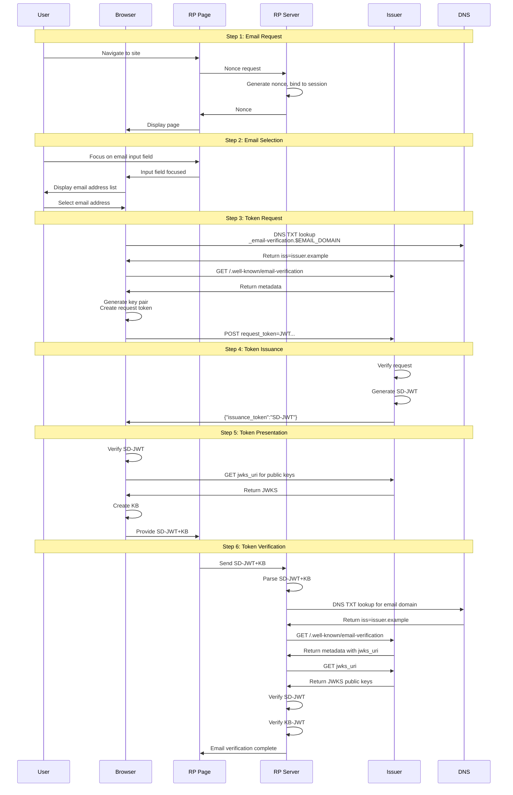

# [WICG/email-verification-protocol](https://github.com/WICG/email-verification-protocol)

# Email Verification Protocol

Verifying control of an email address is a frequent activity on the web today and is used both to prove the user has provided a valid email address, and as a means of authenticating the user when returning to an application. 

Verification is performed by either:

1) Sending the user a link they click on or a verification code. This requires the user to switch from the application they are using to their email address and having to wait for the email arrive, and then perform the verification action. This friction often causes drop off in users completing the task. There are privacy implications as the email transmission informs the mail service the applications the user is using and when they used them.

2) The user logs in with a social login provider such as Apple or Google that provide a verified email address. This requires the application to have set up a relationship with each social provider, and the user to be using one of those services and wanting to share the additional profile information that is also provided in the OpenID Connect flow.

The Email Verification Protocol enables a web application to obtain a verified email address without sending an email, and without the user leaving the web page they are on. To enable the functionality, the mail domain delegates email verification to an issuer that has authentication cookies for the user. When the user provides an email to the HTML form field, the browser calls the issuer passing authentication cookies, the issuer returns a token, which the browser verifies and updates and provides to the web application. The web application then verifies the token and has a verified email address for the user.

User privacy is enhanced as the issuer does not learn which web application is making the request as the request is mediated by the browser. 


## Key Concepts


- **SD-JWT+KB token**: The selective disclosure json web token with key binding is specified in [Selective Disclosure for JWT](https://datatracker.ietf.org/doc/draft-ietf-oauth-selective-disclosure-jwt/). This protocol does not use the selective disclosure features, it uses the key binding feature which enables a separation of token issuance and token presentation. The SD-JWT+KB is a token composed of two JWTs separated by the `~` character. The first JWT is an SD-JWT aka the issuance token and is signed by the issuer and contains the `email` and `email_verified` claims for the user, and the public key used by the browser to make the request. The second JWT is a KB token and is signed by the browser and contains a hash of the first JWT. The resulting SD-JWT+KB is the presentation token, and enables the application to verify the issuer provided the email address for the user without the issuer learning about the specific application

- **Issuer**: The service that verifies the user controls an email address. A DNS record for the email domain delegates email verification to the issuer. The issuer serves a `.well-known/email-verification` metadata file that contains its `issuance_endpoint` that is called to obtain an issuance token, and its `jwks_uri` that points to the JWKS file containing the public keys used to verify the SD-JWT. The issuer is identified by its domain, an eTLD+1 (eg `issuer.example`). The hostname in all URLs from the issuer's metadata MUST end with the issuer's domain. This identifier is what binds the SD-JWT, the DNS delegation, with the issuer.

## User Experience

Verified Email Release: The user navigates to any website that requires a verified email address and an input field to enter the email address. The user focusses on the input field and the browser provides one or emails for the user to select based on emails the user has provided previously to the browser. The user selects a verified email and the app proceeds having obtained the verified email.

> Are emails that can be verified decorated by the browser in the autocomplete UI?
> What UX is presented to the user when the app gets a verified email so the user knows it is already verified?

# Processing Steps

1. [**Email Request**](#1-email-request)
2. [**Email Selection**](#2-email-selection)
3. [**Token Request**](#3-token-request)
4. [**Token Issuance**](#4-token-issuance)
5. [**Token Presentation**](#5-token-presentation)
6. [**Token Verification**](#6-token-verification)





## 1. Email Request

User navigates to a site that will act as the RP. 

- **1.1** - the RP Server generates a nonce and binds the nonce to the session.

- **1.2** - the RP Server returns a page that has an input field with the `autocomplete` property set to `"email"` and the `nonce` property set the the nonce. If the browser receives an `issuance_token` per 4.4 below, then it sends a `emailverifed` event that has a `presentationToken` property. Following is an example of the HTML in the page:

```html
<input id="email"
       type="email"
       autocomplete="email"
       nonce="12345677890..random">
<script>
const input = document.getElementById('email')

input.addEventListener('emailverified', e => {
  // e.presentationToken is SD-JWT+KB
  console.log({
      presentationToken: e.presentationToken
  })
})
</script>

```

> Authors are exploring alternative HTML and JS API approaches


## 2. Email Selection 

- **2.1** - User focusses on email input field 

- **2.2** - The browser displays the list of email addresses it has for the user. 

> Q: Are emails that could be verified decorated for user to understand? 

- **2.3** - User selects an email address from browser selection, or the user types an email into the field.

> Future: allow user to type in a field so we learn about new emails, or if the user does not want the browser to remember emails, the Email Verification Protocol is still available. In the future when we allow the user to use a passkey to authenticate to the issuer, the user can provide a verified email to a web application using a public computer by authenticating with their passkey and not enter any secrets into the public computer.


## 3. Token Request

If the RP has performed (1):

- **3.1** - the browser parses the email domain ($EMAIL_DOMAIN) from the email address, looks up the `TXT` record for `_email-verification.$EMAIL_DOMAIN`. The contents of the record MUST start with `iss=` followed by the issuer identifier. There MUST be only one `TXT` record for `_email-verification.$EMAIL_DOMAIN`.

example record

```bash
_email-verification.email-domain.example   TXT   iss=issuer.example
```

This record states that `email-domain.example` has delegated email verification to the issuer `issuer.example`.

If the email domain and the issuer are the same domain, then the record would be:

```bash
_email-verification.issuer.example   TXT   iss=issuer.example
```

> Access to DNS records and email is often independent of website deployments. This provides assurance that an issuer is truly authorized as an insider with only access to websites on `issuer.example` could setup an issuer that would grant them verified emails for any email at `issuer.example`.

- **3.2** - if an issuer is found, the browser loads `https://$ISSUER$/.well-known/email-verification` and MUST follow redirects to the same path but with a different subdomain of the Issuer.

For example, `https://issuer.example/.well-known/email-verification` may redirect to `https://accounts.issuer.example/.well-known/email-verification`. 


- **3.3** - the browser confirms that the `.well-known/email-verification` file contains JSON that includes the following properties:

- *issuance_endpoint* - the API endpoint the browser calls to obtain an SD-JWT
- *jwks_uri* - the URL where the issuer provides its public keys to verify the SD-JWT
- *signing_alg_values_supported* - OPTIONAL. JSON array containing a list of the JWS signing algorithms ("alg" values) supported by both the browser for request tokens and the issuer for issued tokens. The same algorithm MUST be used for both the `request_token` and `issuance` within a single issuance flow. Algorithm identifiers MUST be from the IANA "JSON Web Signature and Encryption Algorithms" registry. If omitted, "EdDSA" is the default. "EdDSA" SHOULD be included in the supported algorithms list. The value "none" MUST NOT be used.

Each of these properties MUST include the issuer domain as the root of their hostname. 

Following is an example `.well-known/email-verification` file

```json
{
  "issuance_endpoint": "https://accounts.issuer.example/email-verification/issuance",
  "jwks_uri": "https://accounts.issuer.example/email-verification/jwks",
  "signing_alg_values_supported": ["EdDSA", "RS256"]
}
```

- **3.4** - the browser generates a fresh private / public key and signs a JWT with the private key that has the public key in the JWT header in the JWK format as a `jwk` claim that contains the following claims in the payload:

  - *aud* - the issuer
  - *iat* - time when the JWT was signed
  - *jti* - unique identifier for the token
  - *email* - email address to be verified 

The browser SHOULD select an algorithm from the issuer's `signing_alg_values_supported` array, or use "EdDSA" if the property is not present.

An example JWT header:
```json
{
  "alg": "EdDSA",
  "typ": "JWT",
  "jwk": {
    "kty": "OKP",
    "crv": "Ed25519",
    "x": "11qYAYdk9E6z7mT6rk6j1QnXb6pYq4v9wXb6pYq4v9w"  // base64url-encoded public key
  }
}
```
> do we want to register a new JWT `typ`

An example payload 
```json
{
  "aud": "issuer.example",
  "iat": 1692345600,
  "email": "user@example.com"
}
```


- **3.5** - the browser POSTs to the `issuance_endpoint` of the issuer with 1P cookies with a content-type of `application/x-www-form-urlencoded` containing a `request_token` parameter set to the signed JWT and the `Sec-Fetch-Dest` header set to `email-verification`. 

```bash
POST /email-verification/issuance HTTP/1.1
Host: accounts.issuer.example
Cookie: session=...
Content-Type: application/x-www-form-urlencoded
Sec-Fetch-Dest: email-verification

request_token=eyJhbGciOiJFZERTQSIsInR5cCI6IkpXVC...
```

## 4. Token Issuance

On receipt of a token request:

- **4.1** - the issuer MUST verify the request headers:

  - `Content-Type` is `application/x-www-form-urlencoded`
  - `Sec-Fetch-Dest` is `email-verification`

- **4.2** - the issuer MUST verify the request_token by:

  - parsing the JWT into header, payload, and signature components
  - confirming the presence of, and extracting the `jwk` and `alg` fields from the JWT header, and the `aud`, `iat`, and `email`, claims from the payload
  - verifying the JWT signature using the `jwk` with the `alg` algorithm
  - verifying the `aud` claim exactly matches the issuer's identifier
  - verifying the `iat` claim is within 60 seconds of the current time
  - verifying the `email` claim contains a syntactically valid email address


- **4.3** - the issuer checks if the cookies sent represent a logged in user, and if the logged in user has control of the email provided in the request_token. If so the issuer generates an SD-JWT with the following properties:

  - **Header**: MUST contain 
    - `alg`: signing algorithm (SHOULD match the algorithm from the request_token)
    - `kid`: key identifier of key used to sign
    - `typ` set to "evp+sd-jwt"
  - **Payload**: MUST contain the following claims:
    - `iss`: the issuer identifier
    - `iat`: issued at time 
    - `cnf`: confirmation claim containing the public key from the request_token's `jwk` field
    - `email`: claim containing the email address from the request_token
    - `email_verified`: claim that email is verified per OpenID Connect 1.0
  - **Signature**: MUST be signed with the issuer's private key corresponding to a public key in the `jwks_uri` identified by `kid`


Example header:
  ```json
  {
    "alg": "EdDSA",
    "kid": "2024-08-19",
    "typ": "evp+sd-jwt"
  }
  ```

Example payload:
  ```json
  {
    "iss": "issuer.example",
    "iat": 1724083200,
    "cnf": {
      "jwk": {
        "kty": "OKP",
        "crv": "Ed25519",
        "x": "11qYAYdk9E6z7mT6rk6j1QnXb6pYq4v9wXb6pYq4v9w"
      }
    },
    "email": "user@example.com",
    "email_verified": true
  }
  ```
The resulting JWT has the `~` appended to it, making it a valid SD-JWT.

- **4.4** - the issuer returns the SD-JWT to the browser as the value of `issuance_token` in an `application/json` response.

Example:
```bash
HTTP/1.1 200 OK
Content-Type: application/json

{"issuance_token":"eyJhbGciOiJFZERTQSIsImtpZCI6IjIwMjQtMDgtMTkiLCJ0eXAiOiJ3ZWItaWRlbnRpdHkrc2Qtand0In0..."}
```

## 4.5 Error Responses

If the issuer cannot process the token request successfully, it MUST return an appropriate HTTP status code with a JSON error response containing an `error` field and optionally an `error_description` field.


### 4.5.1 Invalid Content-Type Header

When the request does not include the required `Content-Type: application/x-www-form-urlencoded` header, the server MUST return the 415 HTTP response code


### 4.5.2 Invalid Sec-Fetch-Dest Header

When the request does not include the required `Sec-Fetch-Dest: email-verification` header:

**HTTP 400 Bad Request**
```json
{
  "error": "invalid-request",
  "error_description": "Missing or invalid Sec-Fetch-Dest header"
}
```

The `error_description` SHOULD specify that the Sec-Fetch-Dest header is missing or invalid.

### 4.5.3 Authentication Required

When the request lacks valid authentication cookies, contains expired/invalid cookies, or the authenticated user does not have control of the requested email address:

**HTTP 401 Unauthorized**
```json
{
  "error": "authentication_required",
  "error_description": "User must be authenticated and have control of the requested email address"
}
```

### 4.5.4 Invalid Parameters

When the `request_token` is malformed, missing required claims, or contains invalid values:

**HTTP 400 Bad Request**
```json
{
  "error": "invalid_request", 
  "error_description": "Invalid or malformed request_token"
}
```

### 4.5.5 Invalid Token

When the `request_token` signature verification fails or the token structure is invalid:

**HTTP 400 Bad Request**
```json
{
  "error": "invalid_token",
  "error_description": "Token signature verification failed or token structure is invalid"
}
```

### 4.5.6 Server Errors

For internal server errors or temporary unavailability:

**HTTP 500 Internal Server Error**
```json
{
  "error": "server_error",
  "error_description": "Temporary server error, please try again later"
}
```


> In a future version of this spec, the issuer could prompt the user to login via a URL or with a Passkey request.


## 5. Token Presentation

On receiving the `issuance_token`:

- **5.1** - the browser MUST verify the SD-JWT per (SD-JWT spec) by:

  - parsing the SD-JWT into header, payload, and signature components
  - confirming the presence of, and extracting the `alg` and `kid` fields from the SD-JWT header, and the `iss`, `iat`, `cnf`, `email`, and `email_verified` claims from the payload
  - parsing the email domain from the `email` claim and looking up the `TXT` record for `_email-verification.$EMAIL_DOMAIN` to verify the `iss` claim matches the issuer identifier in the DNS record
  - fetching the issuer's public keys from the `jwks_uri` specified in the `.well-known/email-verification` file
  - verifying the SD-JWT signature using the public key identified by `kid` from the JWKS with the `alg` algorithm
  - verifying the `iat` claim is within 60 seconds of the current time
  - verifying the `email` claim matches the email address the user selected
  - verifying the `email_verified` claim is true


- **5.2** - the browser then creates an SD-JWT+KB by:

  - taking the verified SD-JWT from step 5.1 as the base token
  - creating a Key Binding JWT (KB-JWT) with the following structure:
    - **Header**: 
      - `alg`: same signing algorithm used by the browser's private key
      - `typ`: "kb+jwt"
    - **Payload**:
      - `aud`: the RP's origin
      - `nonce`: the nonce from the original `navigator.credentials.get()` call
      - `iat`: current time when creating the KB-JWT
      - `sd_hash`: SHA-256 hash of the SD-JWT
  - signing the KB-JWT with the browser's private key (the same key pair generated in step 3.4)
  - concatenating the SD-JWT and the KB-JWT separated by a tilde (~) to form the SD-JWT+KB

  Example KB-JWT header:
  ```json
  {
    "alg": "EdDSA",
    "typ": "kb+jwt"
  }
  ```

  Example KB-JWT payload:
  ```json
  {
    "aud": "https://rp.example",
    "nonce": "259c5eae-486d-4b0f-b666-2a5b5ce1c925",
    "salt": "kR7fY9mP3xQ8wN2vL5jH6tZ1cB4nM9sD8fG3hJ7kL2p",
    "iat": 1724083260,
    "sd_hash": "X9yH0Ajrdm1Oij4tWso9UzzKJvPoDxwmuEcO3XAdRC0"
  }
  ```

- **5.3** - the browser sets a TBD hidden field and fires the TBD event ...

> details TBD

## 6. Token Verification

The RP web page now has the SD-JWT+KB from the event, and passes it to the RP server, or the token was posted to the RP server.

> details TBD

The RP server MUST verify the SD-JWT+KB by:

- **6.1** - the RP server receives the SD-JWT+KB from the web page

- **6.2** - the RP parses the SD-JWT+KB by separating the SD-JWT and KB-JWT components (separated by tilde ~)

- **6.3** - the RP verifies the KB-JWT by:
  - parsing the KB-JWT into header, payload, and signature components
  - confirming the presence of, and extracting the `alg` field from the KB-JWT header, and the `aud`, `nonce`, `iat`, and `sd_hash` claims from the payload
  - verifying the `aud` claim matches the RP's origin
  - verifying the `nonce` claim matches the nonce from the RP's session with the web page
  - verifying the `iat` claim is within a reasonable time window 
  - computing the SHA-256 hash of the SD-JWT and verifying it matches the `sd_hash` claim

- **6.4** - the RP verifies the SD-JWT by:
  - parsing the SD-JWT into header, payload, and signature components
  - confirming the presence of, and extracting the `alg` and `kid` fields from the SD-JWT header, and the `iss`, `iat`, `cnf`, `email`, and `email_verified` claims from the payload
  - parsing the email domain from the `email` claim and looking up the `TXT` record for `_email-verification.$EMAIL_DOMAIN` to verify the `iss` claim matches the issuer identifier in the DNS record
  - fetching the issuer's public keys from the `jwks_uri` specified in the `.well-known/email-verification` file
  - verifying the SD-JWT signature using the public key identified by `kid` from the JWKS with the `alg` algorithm
  - verifying the `iss` claim exactly matches the issuer identifier from the DNS record
  - verifying the `iat` claim is within a reasonable time window
  - verifying the `email_verified` claim is true

- **6.5** - the RP verifies the KB-JWT signature using the public key from the `cnf` claim in the SD-JWT with the `alg` algorithm from the KB-JWT header


# Privacy Considerations

> Below are notes capturing some discussions of potential privacy implications.

1. The email domain operator no longer learns which applications the user is verifying their email address to as the applications are no longer sending an email verification code to the user. By using an SD-JWT+KB, the browser intermediates the request and response so that the issuer does not learn the identity of the RP. 

2. The RP can infer if a user is logged into the issuer as the RP receives a SD-JWT when the user is logged in, and does not when the user is not logged in. 

3. The issuer may learn the user has email at a mail domain it is authoritative for that it did not know the user had.

# Alternatives Under Consideration 

## JS API for Providing the Email

The web page would call an API passing the email address and nonce. It would return a promise that resolves to the SD_JWT or an error response. The API would only be callable after a user gesture such as clicking a button labelled verify on the web page. This provides the web page in more flexibility in how to gather the email address. For example, if the web page is using EVP for login, and the user has used different emails for login and those are stored in cookies, the page can display the list of emails and an option to provide a different one. The user can then select the email they want to use rather than having to type it into a text field.

## Passkey Authentication 

In addition to, or instead of the browser sending cookies to the Issuer, the Issuer could return a WebAuthN request to the browser if it has credentials for the user identified by the email address. The browser would then interact with the user and provide the WebAuthN response to the Issuer, authenticating the user, and the Issuer would then return the SD-JWT.

# Alternatives Considered 

## Use .wellknown for Mail Domain delegation to Issuer

Rather than the DNS TXT record, the Mail Domain would host a JSON file in the .wellknown domain. This creates challenges for the long tail of individually owned domains:

- would require a domain that is used just for email to now have to support a web server
- the mail domain is usually an apex domain, which does not support CNAME, complicating hosting a web site

