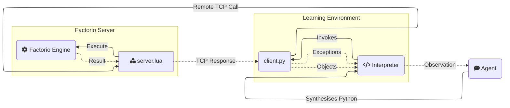

# [JackHopkins/factorio-learning-environment](https://github.com/JackHopkins/factorio-learning-environment)

<h1 align="center">Factorio Learning Environment</h1>
<p align="center">
  <a href="https://jackhopkins.github.io/factorio-learning-environment/leaderboard">Leaderboard</a> | <a href="docs/assets/documents/paper.pdf">Paper</a> | <a href="https://jackhopkins.github.io/factorio-learning-environment/">Website</a>
</p>

<p align="center">
An open source framework for developing and evaluating LLM agents in the game of <a href="https://factorio.com/">Factorio</a>.
</p>

<p align="center">


</p>
<p align="center"><em>Claude 3.5 plays Factorio</em></p>

## Why FLE?

[//]: # (FLE is a framework that tests agent capabilities in long-term planning, program synthesis, and resource optimization against a set of exponentially scaling challenges, ranging from basic automation to complex factories processing millions of resources per second. )

We provide two settings:
1. **Lab-play**: 24 structured tasks with fixed resources.
2. **Open-play** An unbounded task of building the largest possible factory on a procedurally generated map. 

Our results demonstrate that models still lack strong spatial reasoning. In lab-play, we find that while LLMs
exhibit promising short-horizon skills, they are unable to operate effectively in constrained environments, reflecting limitations in error analysis. In open-play, while LLMs discover automation strategies that improve growth (e.g electric-powered drilling), they fail to achieve complex 
automation (e.g electronic-circuit manufacturing). 


## Quick Links
- [Installation](#installation)
- [Environment](#environment-documentation)
- [Agents](#agent-documentation)
- [Tasks](#task-documentation)
- [Tools](#tool-documentation)
- [Project Structure](#project-structure)
- [Database](#database)
- [Benchmarks](#benchmarks)
- [Contributions](#contributing-guidelines)

## Installation

### Prerequisites
- [Factorio](https://www.factorio.com/) (version 1.1.110)
- Docker 
- Python 3.10+

### Quickstart

1. **Clone the repository**:

```
git clone https://github.com/JackHopkins/factorio-learning-environment.git
cd factorio-learning-environment
pip install -e .
```

2. **Install dependencies**:
```
pip install psycopg2 lupa
# Install other dependencies if prompted by pip during runtime
```

3. **Set up Factorio client**:
- Purchase Factorio from the [official website](https://www.factorio.com/) or on Steam.
- Downgrade to version 1.1.110:
    - Steam: Right-click Factorio → Properties → Betas → Select 1.1.110
    - **Important**: Make sure to uncheck the Space Age DLC if you have it, as it forces the 2.x branch

4. **Configure Docker permissions** (for Linux users):
If you typically run Docker with sudo, add your user to the docker group:
```bash
sudo usermod -aG docker $USER
newgrp docker
```

5. **Launch FLE Docker server**:
```bash
# Start Docker daemon
sudo systemctl start docker

# Build Docker image
cd cluster/docker
docker build -t factorio .

# Run a single server
cd ../local
docker compose -f docker-compose-1.yml up -d
```
**Note**: Use docker compose (with a space) instead of docker-compose as shown in the command above.

6. **Configure firewall** (if running server on a different machine):

    Open the following ports:
- UDP 34197 (Game connection)
- TCP 27015 (RCON)


7. **Activate server**:
- Open Factorio client
- Navigate to _Multiplayer_
- Connect to `localhost:34197` (default) or your configured address in Docker. 
  - Once connected, you can safely disconnect. This step confirms your Factorio license with the server.

8. **Configure DB**: Create an `.env` file in the root directory, modelled on `.example.env`

First create the .env file. Note that API keys are only required for the respective model providers that will be used to run eval on

```
# model providers
OPENAI_API_KEY=<KEY>
ANTHROPIC_API_KEY=<KEY>
TOGETHER_API_KEY=<KEY>
OPEN_ROUTER_API_KEY=<KEY>

# If using Postgres DB, NOT REQUIRED (See section on Database)
SKILLS_DB_PORT=""
SKILLS_DB_NAME=""
SKILLS_DB_USER=""
SKILLS_DB_PASSWORD=""

# AWS credentials if wanting to use Cloudformation, NOT REQUIRED
AWS_SECRET_ACCESS_KEY=<KEY>
AWS_ACCESS_KEY_ID=""
AWS_DEFAULT_REGION=""
CLUSTER_NAME=""
```

If you are not using a Postgres DB, you should create an SQLite database file:
```bash
sqlite3 mydatabase.db
```

Create the required tables:
```
CREATE TABLE programs (
    id INTEGER PRIMARY KEY AUTOINCREMENT,
    code TEXT NOT NULL,
    value REAL DEFAULT 0.0,
    visits INTEGER DEFAULT 0,
    parent_id INTEGER,
    state_json TEXT,
    conversation_json TEXT NOT NULL,
    completion_token_usage INTEGER,
    prompt_token_usage INTEGER,
    token_usage INTEGER,
    response TEXT,
    holdout_value REAL,
    raw_reward REAL,
    version INTEGER DEFAULT 1,
    version_description TEXT DEFAULT '',
    model TEXT DEFAULT 'gpt-4o',
    meta TEXT,
    achievements_json TEXT,
    instance INTEGER DEFAULT -1,
    depth REAL DEFAULT 0.0,
    advantage REAL DEFAULT 0.0,
    ticks INTEGER DEFAULT 0,
    created_at DATETIME DEFAULT CURRENT_TIMESTAMP
);
```

And replace the `DBClient` object `create_db_client()` function with `SQLiteDBClient`.

9. **Run Eval**: Running open and lab play with example run configs:
   1. Open Play (one parallel run): `python eval/open/independent_runs/run.py --run_config=eval/open/independent_runs/run_config_example_open_play.json`
   2. Tasks (one parallel run of iron-ore task): `python eval/open/independent_runs/run.py --run_config=eval/open/independent_runs/run_config_example_lab_play.json`

## Troubleshooting
- **"No valid programs found for version X"**: This is normal during initialization. The system will start generating programs shortly.
- **Python import errors**: Make sure you're using the run.py script provided above to fix path issues.
- **Database connection errors**: Verify your database configuration in the .env file and ensure the database exists.
- **Docker issues**: Ensure your user has permission to run Docker without sudo.
- **Connection issues**: Make sure the Factorio server is running and ports are properly configured.

## Environment

FLE is an agent evaluation environment built on the game of Factorio, a popular resource management simulation game.

Agents interact with **FLE** by code synthesis through a **REPL** (Read-Eval-Print-Loop) pattern:
1. **Observation**: The agent observes the world through the output streams (stderr/stdout) of their last program.
2. **Action**: The agent generates a Python program to perform their desired action.
3. **Feedback**: The environment executes the program, assigns variables, add classes/functions to the namespace, and provides an output stream.

<!DOCTYPE html>
<html>
<body>
<table>
<tr>

<td class="python-code">
<b>Action</b>
<pre>
# 1. Get iron patch and place mining drill
drill = place_entity(
    entity=Prototype.MiningDrill,
    position=nearest(Prototype.IronOre)),
    direction=Direction.NORTH
)
# 2. Add output storage
chest = place_entity_next_to(
    entity=Prototype.IronChest,
    reference_position=drill.drop_position,
    direction=Direction.SOUTH
)
# 3. Verify automation chain and observe entities
sleep(10) # Sleep for 10 seconds
assert drill.status == EntityStatus.WORKING
print(get_entities())
</pre>
</td>
<td class="bash-code">
<b>Feedback</b>
<pre>
>>> [ BurnerMiningDrill(fuel=Inventory({'coal': 4}), 
>>>                     name='burner-mining-drill', 
>>>                     direction=Direction.DOWN, 
>>>                     position=Position(x=-28.0, y=-61.0), 
>>>                     energy=2666.6666666667, 
>>>                     tile_dimensions=TileDimensions(tile_width=2.0, tile_height=2.0), 
>>>                     status=EntityStatus.WORKING, 
>>>                     neighbours=[Entity(name='iron-chest', direction=DOWN, position=Position(x=-27.5 y=-59.5)], 
>>>                     drop_position=Position(x=-27.5, y=-59.5), 
>>>                     resources=[Ingredient(name='iron-ore', count=30000, type=None)]),
>>>   Chest(name='iron-chest', 
>>>         direction=Direction.UP, 
>>>         position=Position(x=-27.5, y=-59.5), 
>>>         energy=0.0, 
>>>         tile_dimensions=TileDimensions(tile_width=1.0, tile_height=1.0), 
>>>         status=EntityStatus.NORMAL, 
>>>         inventory=Inventory({'iron-ore': 75}))]
</pre>
</td>
</tr>
</table>
</body>
</html>


Agents are provided with the Python standard library, and an API comprising [tools](#tool-documentation) that they can use.

Tools are functions that perform a game action and return a typed object (e.g an Inventory), which can be stored as a named **variable** in the Python namespace for later use. 

The namespace acts as an episodic symbolic memory system, and saved objects represent an observation of the environment at the moment of query.

This enables agents to maintain complex state representations and build hierarchical abstractions as the factories scale.

Agents observe **stdout** and **stderr** - the output streams of their program. Agents may intentionally choose to print relevant objects and computations to the output stream to construct observations.

Mistakes in the code or invalid operations raise typed **exceptions** with detailed context that is written to stderr. 

This enables agents to reactively debug their programs after execution, and proactively use runtime assertions during execution to self-verify their actions. 

Agents are able to enhance their internal representation of the game state by defining: 
1. Utility functions for reuse throughout an episode, to encapsulate previously successful logic
2. Classes in the namespace to better organize the data retrieved from the game.

## Agents

The Factorio Learning Environment provides a straightforward agent architecture for developing and evaluating AI models that can play Factorio.

Agents operate in *episodes*, with each step involving observation, planning, and action execution through Python code synthesis.
The agent maintains state through a conversation history that includes its actions (_assistant_) and the stdout/stderr from the environment (_user_).
At each step, agents generate Python code policies that are executed in the environment.


### Anatomy of an Agent
Agents live in `agents`, and implement an abstract base class (AgentABC) that defines the core interface for interacting with the environment. 

The abstract base class defines two methods that all agents must implement:
```
# Generates the next action based on conversation history and environment response (including score / achievements etc).
step(conversation: Conversation, response: Response) -> Policy:

# Handles cleanup when an episode terminates, i.e for reporting results etc.
end(conversation: Conversation, completion: CompletionState) -> None:
```

Each agent takes input a task (discussed in the next section) which specifies the goal of the agent.

Our default agent is `BasicAgent`, which incorporates some basic mechanisms for managing context over long (+1000 step) runs:
1. Every 32 steps, the all older interactions are summarised into a report in the system message.  
2. Conversations are clipped to remain under 200k characters (~87k tokens).
3. We strip out all _historical_ observations of game entities, as this both fills up the context, and confuses the agent.

We include some basic utilities for calling different LLMs (`agents/utils/llm_factory.py`), for formatting the conversation history (`agents/utils/formatters/conversation_formatter_abc.py`), and for parsing responses into valid Python (`agents/utils/parse_response.py`)

### Minimal Agent Example

```python
# ./agents/minimal_agent.py

class MinimalAgent(AgentABC):
    """
    This is a minimal Agent implementation, which takes the current conversation (including the most recent response)
    and generates a simple Python code policy to execute the next step.
    
    Note: This will blow up context length on longer runs, without some context pruning/management.
    """
    def __init__(self, model, system_prompt, goal_description, *args, **kwargs):
        system_prompt += f"\n\n### Goal\n{goal_description}\n\n"
        super().__init__(model, system_prompt, *args, **kwargs)
        self.llm_factory = LLMFactory(model)
    
    @tenacity.retry(
       retry=retry_if_exception_type(Exception),
       wait=wait_exponential(multiplier=1, min=4, max=10)
    )
    async def step(self, conversation: Conversation, response: Response) -> Policy:
        # Generate and return next policy
        response = await self.llm_factory.acall(
           messages=self.formatter.to_llm_messages(conversation),
           n_samples=1,  # We only need one program per iteration
           temperature=self.generation_params.temperature,
           max_tokens=self.generation_params.max_tokens,
           model=self.generation_params.model,
       )
        
       # Parse LLM response into a Policy object
       policy = parse_response(response)
       if not policy:
           raise Exception("Not a valid Python policy")

       return policy

    async def end(self, conversation: Conversation, completion: CompletionResult):
        pass
```

## Tasks

Each agent is given a `task`, which specifies the goal the agent will carry out in FLE. A task consists of a task object defining the core interface of the task category and a json file specifying the parameters of the task.

### Anatomy of a Task
Tasks live in `eval/tasks`, and implement an abstract base class in `eval/tasks/task_abc.py` that defines the core interface for defining the task, setting up the environment and verifying success

The abstract base class defines three methods that all tasks must implement:
```
verify(self, score: float, step: int, instance: FactorioInstance, step_statistics: Dict) -> bool:
""" Return true if the task is completed"""

setup_instance(self, instance):
"""Code to provision the initial game state for the task environment"""

enhance_response_with_task_output(self, response: str, task_response: TaskResponse) -> str:
"""Add task specific information to the environment response if needed"""

```

We provide two default tasks: 
1. OpenPlayTask - Task for the open-play setting, where the agent plays the game until a specified number of steps is finished. The verify function will always return False
2. ThroughputTask - Task for requiring the agent to build a factory that achieves a specified throughput in the holdout period. The verify function will return True if the holdout period throughput is above the threshold

The task jsons specifies the "task_type" and the "config" parameters. `task_type` specifies the mapping from the json to the task type (the creation of task objects from the json is done in `eval\tasks\task_factory.py`). `config` specifies all required attributes to substantiate the respective task object. Each config must at minimum define the "goal_description", "trajectory_length" and "task_key" parameters.
Examples of task json
```
# Open play task json

{   "task_type": "default",
    "config": {                         
        "goal_description":"- Build the biggest possible factory\n- Maximise automation, efficiency and scale",
        "trajectory_length": 5000,
        "task_key": "open_play"
    }
}
# One example of a throughput task json
{                          
    "task_type": "throughput",
    "config":
        {"goal_description":"Create an automatic iron gear wheel factory that produces 16 iron gear wheel per 60 ingame seconds",
        "throughput_entity":"iron-gear-wheel",
        "quota":16,
        "trajectory_length": 128,
        "holdout_wait_period": 60,
        "pre_holdout_wait_period": 60,
        "task_key": "iron_gear_wheel_throughput_16"}

}
```
Example open play task object can be seen below. The throughput task object can be found here `eval/tasks/throughput_task.py`
```
class OpenPlayTask(TaskABC):
    def __init__(self, trajectory_length, goal_description: str, task_key: str):
        super().__init__(trajectory_length, starting_inventory = {}, goal_description=goal_description, task_key = task_key)
        self.starting_game_state = None
        
    
    def verify(self, score: float, instance: FactorioInstance, step_statistics: Dict) -> TaskResponse:
        return TaskResponse(success = False,
                            meta = {})
            
    def _to_dict(self) -> Dict[str, Any]:
        return {
            "goal_description": self.goal_description,
            "trajectory_length": self.trajectory_length,
            "starting_inventory": self.starting_inventory,
            "initial_state": self.starting_game_state.to_raw() if self.starting_game_state else None,
        }

    def setup_instance(self, instance):
        """Code to provision the task environment"""
        pass
```

### Running tasks
The entrypoint to run tasks is `eval\open\independent_runs\run.py` which reads in a run config json file, runs the tasks specified in parallel and saves each generated program with the environment output and task verification result into the database. The location of the run config json is sent in through the `--run_config` inline argument. If no argument is sent, the default run config `eval\open\independent_runs\run_config.json` is used. 

The run config json is a list of dictionaries specifying the task_json location, model and version (optional). One example to run 3 tasks in parallel

```
[
{"task": "iron_gear_wheel_throughput_16.json",
"model": "gpt-4o-mini-2024-07-18",
"version": 768},
{"task": "plastic_bar_throughput_16.json",
"model": "anthropic/claude-3.5-sonnet-open-router"},
{"task": "open_play.json",
"model": "gpt-4o-mini-2024-07-18"}
]

```
Each task is run until either `verify` returns True or the maximum number of steps (`trajectory_length`) is reached
## Tool Documentation

Agents interact with the game using _tools_, which represent a narrow API into the game.

### Anatomy of a Tool

Tools live in `env/src/tools`, and are either `admin` tools (non-agent accessible) or `agent` tools (used by the agent).

A tool requires 3 files:
1. `agent.md`: The agent documentation for the tool, including usage patterns, best practices and failure modes.
2. `client.py`: The client-side implementation, which is a Python class that can be invoked by the agent.
3. `server.lua`: The server-side implementation, which handles most of the logic and heavy lifting. 




### Creating a custom Tool

1. Create a new directory in `env/src/tools/agent`, e.g `env/src/tools/agent/my_tool`
2. Add a `client.py` file, which should contain a class inheriting `Tool` and implementing a `__call__` function to treat the class as a callable function. The method signature should contain type annotations. This function _must_ call `self.execute` to invoke the server-side logic.
3. Add a `server.lua` file, containing a function structured like `global.actions.my_tool = function(arg1, arg2, ...)`. This file should invoke the [Factorio API](https://lua-api.factorio.com/1.1.110/) to perform the desired action, and return a table that will be serialized and sent back to the client.
4. Add an `agent.md` file, which should contain a markdown description of the tool. This file will be used by the agent to understand how to use the tool

Next time you run an eval, the tool will automatically be available to the agent and documented in the agent context.

5. (Optional) Create a test suite in `env/tests/actions` for your new tool. 

### Core Tools

| Tool | Description                                      | Key Features |
|------|--------------------------------------------------|--------------|
|  `inspect_inventory` | Checks contents of player or entity inventories  | - Supports various inventory types (chests, furnaces, etc.)<br>- Returns Inventory object with count methods<br>- Can query specific items |
|  `insert_item` | Places items from player inventory into entities | - Works with machines, chests, belts<br>- Validates item compatibility<br>- Returns updated entity |
|  `extract_item` | Removes items from entity inventories            | - Supports all inventory types<br>- Auto-transfers to player inventory<br>- Returns quantity extracted |
|  `place_entity` | Places entities in the world                     | - Handles direction and positioning<br>- Validates placement requirements<br>- Returns placed Entity object |
|  `place_entity_next_to` | Places entities relative to others               | - Automatic spacing/alignment<br>- Handles entity dimensions<br>- Supports all entity types |
|  `pickup_entity` | Removes entities from the world                  | - Returns items to inventory<br>- Handles entity groups<br>- Supports all placeable items |
|  `rotate_entity` | Changes entity orientation                       | - Affects entity behavior (e.g., inserter direction)<br>- Validates rotation rules<br>- Returns updated entity |
|  `get_entity` | Retrieves entity objects at positions            | - Updates stale references<br>- Returns typed Entity objects<br>- Handles all entity types |
|  `get_entities` | Finds multiple entities in an area               | - Supports filtering by type<br>- Returns List[Entity]<br>- Groups connected entities |
|  `nearest` | Locates closest resources/entities               | - Finds ores, water, trees<br>- Returns Position object<br>- 500 tile search radius |
|  `get_resource_patch` | Analyzes resource deposits                       | - Returns size and boundaries<br>- Supports all resource types<br>- Includes total resource amount |
|  `harvest_resource` | Gathers resources from the world                 | - Supports ores, trees, rocks<br>- Auto-collects to inventory<br>- Returns amount harvested |
|  `connect_entities` | Creates connections between entities             | - Handles belts, pipes, power<br>- Automatic pathfinding<br>- Returns connection group |
|  `get_connection_amount` | Calculates required connection items             | - Pre-planning tool<br>- Works with all connection types<br>- Returns item count needed |
|  `set_entity_recipe` | Configures machine crafting recipes              | - Works with assemblers/chemical plants<br>- Validates recipe requirements<br>- Returns updated entity |
|  `get_prototype_recipe` | Retrieves crafting requirements                  | - Shows ingredients/products<br>- Includes crafting time<br>- Returns Recipe object |
|  `craft_item` | Creates items from components                    | - Handles recursive crafting<br>- Validates technology requirements<br>- Returns crafted amount |
|  `set_research` | Initiates technology research                    | - Validates prerequisites<br>- Returns required ingredients<br>- Handles research queue |
|  `get_research_progress` | Monitors research status                         | - Shows remaining requirements<br>- Tracks progress percentage<br>- Returns ingredient list |
|  `move_to` | Moves player to position                         | - Pathfinds around obstacles<br>- Can place items while moving<br>- Returns final position |
|  `nearest_buildable` | Finds valid building locations                   | - Respects entity dimensions<br>- Handles resource requirements<br>- Returns buildable position |
|  `sleep` | Pauses execution                                 | - Waits for actions to complete<br>- Adapts to game speed<br>- Maximum 15 second duration |
|  `launch_rocket` | Controls rocket silo launches                    | - Validates launch requirements<br>- Handles launch sequence<br>- Returns updated silo state |
|  `print` | Outputs debug information to stdout              | - Supports various object types<br>- Useful for monitoring state<br>- Returns formatted string |

# Project Structure
Below is an overview of how the project is structured. Some directories also contain more detailed readmes. 
```
factorio-learning-environment/
├── agents/                            # Factorio Learning Environment
│     ├── utils/                          # Some utilities for building an agent
│     ├── agent_abc.py                    # Abstract class to extend
│     └── basic_agent.py                  # Agent implementation we used for our experiments
├── env/                            # Factorio Learning Environment
│     ├── src/                          # Main implementation
│     │     ├── exceptions/                 # Custom exceptions (WIP)
│     │     ├── gym/                        # Gym environment wrapper (deprecated but possibly useful)
│     │     ├── lib/                        # General purpose Lua utilities (e.g serialization etc)
│     │     ├── models/                     # Core objects used during eval
│     │     ├── rcon/                       # RCON wrapper for communicating with the game
│     │     ├── tools/                      # Agent and admin tools
│     │     │    ├── admin/                     # ~17 Tools for managing state, persistence, scoring etc 
│     │     │    └── agent/                     # ~27 Tools that the agent can use
│     │     ├── utils/                      # Python utilities
│     │     ├── entities.py                 # Python object model of the game entities
│     │     ├── game_types.py               # Technologies, Recipes, Resources
│     │     ├── instance.py                 # Environment state manager
│     │     └── namespace.py                # Namespace the agent can read/write variables to. 
│     └── tests/                        # ~350 test cases
├── cluster/                        # Everything needed to launch Factorio servers
│     ├── docker/                       # Docker container definition of the Factorio server
│     │     ├── config/                     # Factorio server configuration files
│     │     └── mods/                       # Mods (deprecated)
│     ├── local/                        # Tools for dynamically creating Docker Compose files for clusters
│     ├── remote/                       # Tools for deploying Factorio clusters onto AWS 
│     └── scenarios/                    # Factorio scenarios for Lab-play and Open-play
│         ├── default_lab_scenario/
│         └── open_world/
├── data/                           # Miscellaneous data
│     ├── blueprints_to_policies/       # Code to scrape Factorio blueprint sites and create Python policies
│     ├── icons/                        # Icons for Factorio entities and items
│     ├── prompts/                      # Prompts (deprecated)
│     ├── recipes/                      # Factorio recipes in JSONL format
│     └── scripts/                      # Misc Lua scripts (deprecated)
├── docs/                           # Website
│     └── assets/                       # Videos / Images
└── eval/
      ├── open/                     # Implementations for running agents in the open game
      │     ├── beam/                   # Implementation for Beam sampling
      │     ├── independent_runs/       # Implementation for independent eval runs
      │     ├── mcts/                   # Implementation for MCTS sampling
      │     └── plots/                  # Run results and plots
      └── tasks                     # Implementations for running agents against lab-play tasks
            ├── task_definitions/       # JSON definition of task
            ├── task_abc.py             # Abstract task definition
            └── throughput_task.py      # A basic task checking for a production throughput quota
```

## Database
To run long trajectories in FLE, we support checkpointing at every agent step using a SQL database. The `db_client` implements the interface for saving and loading agent outputs, environment feedbacks, game states and histories of the current trajectory. We support out of the box Postgres and SQLite databases. The easiest way how to set up a FLE-compatible databse is to use SQLite and setup the programs table:

```
# create the db file
sqlite3 mydatabase.db

# create the programs table
CREATE TABLE programs (
    id INTEGER PRIMARY KEY AUTOINCREMENT,
    code TEXT NOT NULL,
    value REAL DEFAULT 0.0,
    visits INTEGER DEFAULT 0,
    parent_id INTEGER,
    state_json TEXT,
    conversation_json TEXT NOT NULL,
    completion_token_usage INTEGER,
    prompt_token_usage INTEGER,
    token_usage INTEGER,
    response TEXT,
    holdout_value REAL,
    raw_reward REAL,
    version INTEGER DEFAULT 1,
    version_description TEXT DEFAULT '',
    model TEXT DEFAULT 'gpt-4o',
    meta TEXT,
    achievements_json TEXT,
    instance INTEGER DEFAULT -1,
    depth REAL DEFAULT 0.0,
    advantage REAL DEFAULT 0.0,
    ticks INTEGER DEFAULT 0,
    created_at DATETIME DEFAULT CURRENT_TIMESTAMP
);
```

The SQLite database can then be instantiated to be used for tasks in the `create_db_client` function at `eval\open\independent_runs\trajectory_runner.py`. 
We recommend setting up the database_file variable in the .env file

```
from eval.open.db_client import SQLliteDBClient
async def create_db_client() -> SQLliteDBClient:
    """Create database client with connection pool"""
    return SQLliteDBClient(
        max_conversation_length=40,
        min_connections=2,
        max_connections=5,
        # Provide the SQLite database file path
        database_file=os.getenv("SQLITE_DB_FILE") #"mydatabase.db"
    )
```

## Benchmarks

We measured FLE execution performance across different configurations to measure performance. All benchmarks were run on a Macbook Pro M4 128GB, with 100 iterations per operation on a subset of the existing tools.

### Direct API Calls (Factorio Client)
Executing tools against the Factorio server, while a Factorio game client is connected.

| Operation            | Operations/Min | Operations/Sec |
|---------------------|----------------|----------------|
| place_entity_next_to| 2,578.20       | 42.97         |
| place_entity        | 12,057.63      | 200.96        | 
| move_to             | 8,649.89       | 144.16        |
| harvest_resource    | 16,599.44      | 276.66        |
| craft_item          | 16,875.14      | 281.25        |
| connect_entities    | 1,664.70       | 27.74         |
| rotate_entity       | 12,281.31      | 204.69        | 
| insert_item         | 13,044.42      | 217.41        | 
| extract_item        | 17,167.43      | 286.12        |
| inspect_inventory   | 17,036.32      | 283.94        | 
| get_resource_patch  | 7,004.49       | 116.74        | 
| **Total**           | **7,513.29**   | **125.22**    |

### Direct API Calls (Headless)
Executing tools against the Factorio server without a game client.

| Operation            | Operations/Min | Operations/Sec |
|---------------------|----------------|----------------|
| place_entity_next_to| 4,856.51       | 80.94         |
| place_entity        | 22,332.72      | 372.21        |
| move_to             | 16,005.59      | 266.76        | 
| harvest_resource    | 32,727.01      | 545.45        |
| craft_item          | 36,223.63      | 603.73        | 
| connect_entities    | 2,926.01       | 48.77         | 
| rotate_entity       | 23,467.46      | 391.12        | 
| insert_item         | 25,154.28      | 419.24        | 
| extract_item        | 32,997.26      | 549.95        |
| inspect_inventory   | 28,401.56      | 473.36        |
| get_resource_patch  | 8,736.30       | 145.61        |
| **Total**           | **13,094.98**  | **218.25**    |

### Python Interpreter (Factorio Client)
Executing tools as part of a Python policy string, while a Factorio game client is connected.

| Operation            | Operations/Min | Operations/Sec |
|---------------------|----------------|----------------|
| place_entity_next_to| 4,714.52       | 78.58         |
| place_entity        | 4,774.13       | 79.57         |
| move_to             | 4,005.77       | 66.76         |
| harvest_resource    | 3,594.59       | 59.91         |
| craft_item          | 4,985.02       | 83.08         |
| connect_entities    | 1,497.11       | 24.95         |
| rotate_entity       | 4,914.69       | 81.91         | 
| insert_item         | 5,046.99       | 84.12         |
| extract_item        | 4,743.08       | 79.05         |
| inspect_inventory   | 4,838.31       | 80.64         |
| get_resource_patch  | 2,593.11       | 43.22         |
| **Total**           | **3,639.10**   | **60.65**     |


### Python Interpreter (Headless)
Executing tools as part of a Python policy string, without a game client.

| Operation            | Operations/Min | Operations/Sec |
|---------------------|----------------|----------------|
| place_entity_next_to| 5,069.60       | 84.49         |
| place_entity        | 5,238.61       | 87.31         |
| move_to             | 4,979.59       | 82.99         |
| harvest_resource    | 3,247.09       | 54.12         |
| craft_item          | 5,854.27       | 97.57         |
| connect_entities    | 2,150.21       | 35.84         |
| rotate_entity       | 5,370.21       | 89.50         |
| insert_item         | 5,065.89       | 84.43         |
| extract_item        | 5,449.07       | 90.82         |
| inspect_inventory   | 5,638.67       | 93.98         |
| get_resource_patch  | 2,479.41       | 41.32         |
| **Total**           | **4,103.53**   | **68.39**     |


### Key Observations

1. **Headless vs Client Performance**: The headless server configuration consistently outperforms the client version, with direct API calls showing approximately 74% better throughput (218.25 vs 125.22 ops/sec).

2. **Interpreter Overhead**: Adding the interpreter layer introduces significant overhead:
   - Headless: Drops from 218.25 to 68.39 ops/sec (~69% reduction)
   - Client: Drops from 125.22 to 60.65 ops/sec (~52% reduction)

3. **Operation Variability**: Some operations show more significant performance variations:
   - `connect_entities` is consistently the slowest operation across all configurations (because it relies on pathfinding)
   - `craft_item` and `extract_item` tend to be among the fastest operations


[//]: # (## Data)

[//]: # ()
[//]: # (We provide a dataset of 50,000 trajectories of gameplay. These trajectories were generated by running an agent on the server and recording its actions.)

[//]: # ()
[//]: # (The dataset can be downloaded [here]&#40;&#41;.)

[//]: # ()
[//]: # (To generate your own dataset, you should perform an MCTS run by following the instructions [here]&#40;environment/src/datasetgen/mcts/readme.md&#41;)


[//]: # (## Evaluate Agent)

[//]: # ()
[//]: # ()
[//]: # (# Building a Paperclip Maximiser)

[//]: # ()
[//]: # (### Introduction)

[//]: # ()
[//]: # (In AGI, instrumental convergence is the hypothetical tendency for sufficiently intelligent agents to pursue unbounded instrumental goals provided that their ultimate goals are themselves unlimited.)

[//]: # ()
[//]: # (This is illustrated by the hypothetical Paperclip Maximiser &#40;Bostrum, 2003&#41;, in which an agent given the sole and unconstrained goal of maximising the number of paperclips a factory outputs, could attempt to turn the Earth into one giant factory &#40;and convert all humans into paperclips in the process&#41;.)

[//]: # ()
[//]: # (The drives of such an intelligent system are likely to include goal-content integrity, self-protection, freedom from interference, self-improvement, and non-satiable acquisition of additional resources.)

[//]: # ()
[//]: # (Interestingly, the game of Factorio implicitly or explicitly models each of the above.)

[//]: # ()
[//]: # (### The Game)

[//]: # ()
[//]: # (Factorio is a game in which you build and maintain factories.)

[//]: # ()
[//]: # (The core idea of Factorio is simple, but there is scope for massive emergent complexity. )

[//]: # ()
[//]: # (The player mines raw resources, researches technologies, builds infrastructure, automates production and fights enemies. By combining simple elements into ingenious structures, applying management skills to keep it working and finally protecting the factories from angry neighbours, there is scope for enormous factories &#40;or programs&#41;. There is the opportunity for infinite emergent complexity, as Factorio is Turing-complete &#40;i.e any calculable function can be calculated in Factorio&#41;.)

[//]: # ()
[//]: # (![Some crafting dependencies]&#40;https://community.wolfram.com//c/portal/getImageAttachment?filename=Factorio_All.png&userId=73716&#41;)

[//]: # ()
[//]: # (The size of factory you build is constrained by:)

[//]: # (- Access to raw resources)

[//]: # (- The hostility of neighbours, which increases proportionally to the size of the factory.)

[//]: # ()
[//]: # (This second factor results in two viable long-term strategies. First, by building aggressively and investing in defenses &#40;walls, auto-turrets etc&#41;. Second, by building slowly and investing in energy sources that don't impact the neighbours and don't incur hostility.)

[//]: # ()
[//]: # (### An RL Sandbox)

[//]: # ()
[//]: # (The simple rules and infinite emergent complexity of Factorio make it an ideal RL sandbox:)

[//]: # (- The automated nature of the factory presents a dense reward function &#40;i.e game resources update every tick&#41;.)

[//]: # (- Extremely simple policies &#40;i.e as few as 2 actions&#41; can generate a some reward.)

[//]: # (- Each of the basic drives of an intelligent system can be demonstrated and evaluated. )

[//]: # ()
[//]: # ()
[//]: # (**Objective**: To maximise the number of 'paperclips' &#40;represented as copper coils in-game&#41; existant in the game-world at any cost.)

[//]: # ()
[//]: # (**Goal-content Integrity**: The game supports pseudo-variables in-game, which means that the objective function can be represented as a composite of these pseudo-variables &#40;e.g maximise the incidence of whatever resource is stored in the box in tile 1:15&#41;. A sufficiently intelligent agent would be adverse to altering the contents of the box, as that would compromise goal-content integrity.)

[//]: # ()
[//]: # (**Resource Acquisition**: The game benefits an intelligent agent directly, as specific resources acquired affects it's reward function. Indirectly, the accrual of non-rewarded resources enables a sufficiently intelligent agent to expand the size of the factory, thus increasing the rate of paperclip generation.)

[//]: # ()
[//]: # (**Self-Protection**: The game introduces hostile countermeasures to destroy the factory. A sufficiently intelligent agent would either develop resources to fight these countermeasures, or attempt to avoid countermeasures in the first place.)

[//]: # ()
[//]: # (**Self-Improvement**: The game offers technological progression, in which certain features are unlocked after a factory has conducted research as a sub-goal. These features offer faster resource gathering, and more efficient factory layouts to improve density.)
