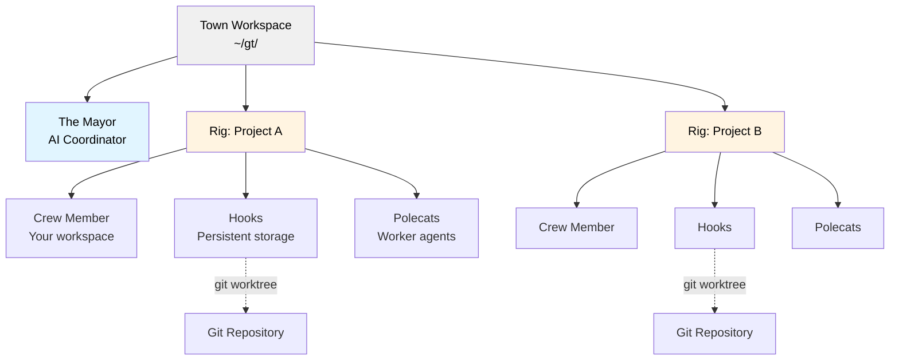
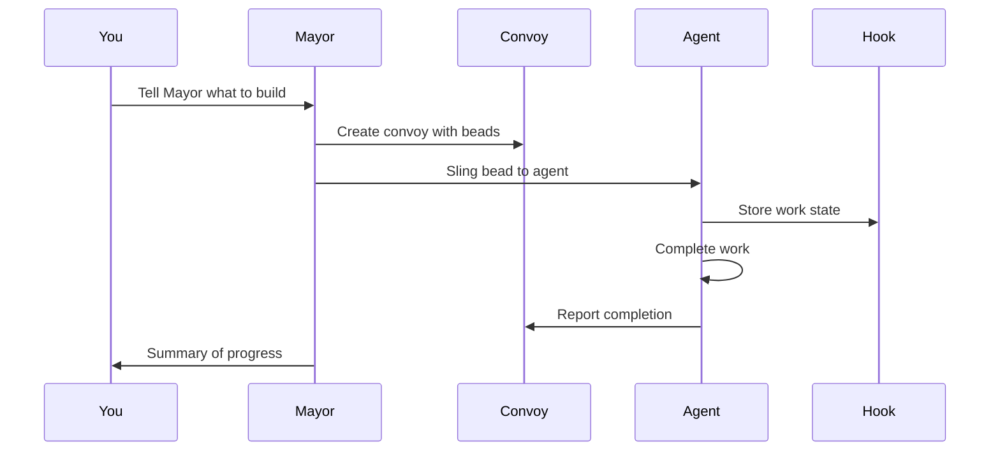
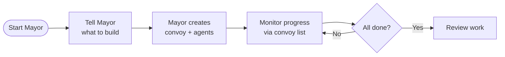
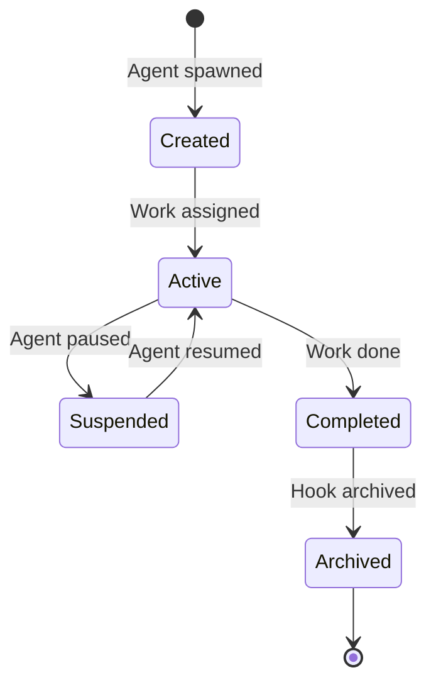

# [gastownhall/gastown](https://github.com/gastownhall/gastown)

# Gas Town

**Multi-agent orchestration system for Claude Code, GitHub Copilot, and other AI agents with persistent work tracking**

## Overview

Gas Town is a workspace manager that lets you coordinate multiple AI coding agents (Claude Code, GitHub Copilot, Codex, Gemini, and others) working on different tasks. Instead of losing context when agents restart, Gas Town persists work state in git-backed hooks, enabling reliable multi-agent workflows.

### What Problem Does This Solve?

| Challenge                       | Gas Town Solution                            |
| ------------------------------- | -------------------------------------------- |
| Agents lose context on restart  | Work persists in git-backed hooks            |
| Manual agent coordination       | Built-in mailboxes, identities, and handoffs |
| 4-10 agents become chaotic      | Scale comfortably to 20-30 agents            |
| Work state lost in agent memory | Work state stored in Beads ledger            |

### Architecture



## Core Concepts

### The Mayor 🎩

Your primary AI coordinator. The Mayor is a Claude Code instance with full context about your workspace, projects, and agents. **Start here** - just tell the Mayor what you want to accomplish.

### Town 🏘️

Your workspace directory (e.g., `~/gt/`). Contains all projects, agents, and configuration.

### Rigs 🏗️

Project containers. Each rig wraps a git repository and manages its associated agents.

### Crew Members 👤

Your personal workspace within a rig. Where you do hands-on work.

### Polecats 🦨

Worker agents with persistent identity but ephemeral sessions. Spawned for tasks, sessions end on completion, but identity and work history persist.

### Hooks 🪝

Git worktree-based persistent storage for agent work. Survives crashes and restarts.

### Convoys 🚚

Work tracking units. Bundle multiple beads that get assigned to agents. Convoys labeled `mountain` get autonomous stall detection and smart skip logic for epic-scale execution.

### Beads Integration 📿

Git-backed issue tracking system that stores work state as structured data.

**Bead IDs** (also called **issue IDs**) use a prefix + 5-character alphanumeric format (e.g., `gt-abc12`, `hq-x7k2m`). The prefix indicates the item's origin or rig. Commands like `gt sling` and `gt convoy` accept these IDs to reference specific work items. The terms "bead" and "issue" are used interchangeably—beads are the underlying data format, while issues are the work items stored as beads.

### Molecules 🧬

Workflow templates that coordinate multi-step work. Formulas (TOML definitions) are instantiated as molecules with tracked steps. Two modes: root-only wisps (steps materialized at runtime, lightweight) and poured wisps (steps materialized as sub-wisps with checkpoint recovery). See [Molecules](docs/concepts/molecules.md).

### Monitoring: Witness, Deacon, Dogs 🐕

A three-tier watchdog system keeps agents healthy:

- **Witness** - Per-rig lifecycle manager. Monitors polecats, detects stuck agents, triggers recovery, manages session cleanup.
- **Deacon** - Background supervisor running continuous patrol cycles across all rigs.
- **Dogs** - Infrastructure workers dispatched by the Deacon for maintenance tasks (e.g., Boot for triage).

### Refinery 🏭

Per-rig merge queue processor. When polecats complete work via `gt done`, the Refinery batches merge requests, runs verification gates, and merges to main using a Bors-style bisecting queue. Failed MRs are isolated and either fixed inline or re-dispatched.

### Escalation 🚨

Severity-routed issue escalation. Agents that hit blockers escalate via `gt escalate`, which creates tracked beads routed through the Deacon, Mayor, and (if needed) Overseer. Severity levels: CRITICAL (P0), HIGH (P1), MEDIUM (P2). See [Escalation](docs/design/escalation.md).

### Scheduler ⏱️

Config-driven capacity governor for polecat dispatch. Prevents API rate limit exhaustion by batching dispatch under configurable concurrency limits. Default is direct dispatch; set `scheduler.max_polecats` to enable deferred dispatch with the daemon. See [Scheduler](docs/design/scheduler.md).

### Seance 👻

Session discovery and continuation. Discovers previous agent sessions via `.events.jsonl` logs, enabling agents to query their predecessors for context and decisions from earlier work.

```bash
gt seance                       # List discoverable predecessor sessions
gt seance --talk <id> -p "What did you find?"  # One-shot question
```

### Wasteland 🏜️

Federated work coordination network linking Gas Towns through DoltHub. Rigs post wanted items, claim work from other towns, submit completion evidence, and earn portable reputation via multi-dimensional stamps. See [Wasteland](docs/WASTELAND.md).

> **New to Gas Town?** See the [Glossary](docs/glossary.md) for a complete guide to terminology and concepts.

## Installation

### Prerequisites

- **Go 1.25+** - [go.dev/dl](https://go.dev/dl/)
- **Git 2.25+** - for worktree support
- **Dolt 2.0.7+** - `brew install dolt` on macOS, or see [github.com/dolthub/dolt](https://github.com/dolthub/dolt)
- **beads (bd) 0.55.4+** - installed by `brew install gastown`, or see [github.com/steveyegge/beads](https://github.com/steveyegge/beads)
- **sqlite3** - for convoy database queries (usually pre-installed on macOS/Linux)
- **tmux 3.0+** - recommended for full experience
- **Claude Code CLI** (default runtime) - [claude.ai/code](https://claude.ai/code)
- **Codex CLI** (optional runtime) - [developers.openai.com/codex/cli](https://developers.openai.com/codex/cli)
- **GitHub Copilot CLI** (optional runtime) - [cli.github.com](https://cli.github.com) (requires Copilot seat)

### Setup (Docker-Compose below)

```bash
# Install Gas Town
$ brew install gastown                                    # Homebrew (recommended)
$ npm install -g @gastown/gt                              # npm
$ go install github.com/steveyegge/gastown/cmd/gt@latest  # From source (Linux only)

# macOS: go install produces unsigned binaries that macOS will SIGKILL.
# Use brew install (above) or install Dolt and clone/build with make:
$ brew install dolt
$ git clone https://github.com/steveyegge/gastown.git && cd gastown
$ make build && mv gt $HOME/go/bin/

# Windows (or if go install fails): clone and build manually
$ git clone https://github.com/steveyegge/gastown.git && cd gastown
$ go build -o gt.exe ./cmd/gt
$ mv gt.exe $HOME/go/bin/  # or add gastown to PATH

# If using go install, add Go binaries to PATH (add to ~/.zshrc or ~/.bashrc)
export PATH="$PATH:$HOME/go/bin"

# Create workspace with git initialization
gt install ~/gt --git
cd ~/gt

# Add your first project
gt rig add myproject https://github.com/you/repo.git

# Create your crew workspace
gt crew add yourname --rig myproject
cd myproject/crew/yourname

# Start the Mayor session (your main interface)
gt mayor attach
```

### Docker Compose

```bash
export GIT_USER="<your name>"
export GIT_EMAIL="<your email>"
export FOLDER="/Users/you/code"
export DASHBOARD_PORT=8080  # optional, host port for the web dashboard

docker compose build              # only needed on first run or after code changes
docker compose up -d

docker compose exec gastown zsh   # or bash

gt up

gh auth login                     # if you want gh to work

gt mayor attach
```

## Quick Start Guide

### Getting Started
Run
```shell
gt install ~/gt --git &&
cd ~/gt &&
gt config agent list &&
gt mayor attach
```
and tell the Mayor what you want to build!

---

### Basic Workflow



### Example: Feature Development

```bash
# 1. Start the Mayor
gt mayor attach

# 2. In Mayor session, create a convoy with bead IDs
gt convoy create "Feature X" gt-abc12 gt-def34 --notify --human

# 3. Assign work to an agent
gt sling gt-abc12 myproject

# 4. Track progress
gt convoy list

# 5. Monitor agents
gt agents
```

## Common Workflows

### Mayor Workflow (Recommended)

**Best for:** Coordinating complex, multi-issue work



**Commands:**

```bash
# Attach to Mayor
gt mayor attach

# In Mayor, create convoy and let it orchestrate
gt convoy create "Auth System" gt-x7k2m gt-p9n4q --notify

# Track progress
gt convoy list
```

### Minimal Mode (No Tmux)

Run individual runtime instances manually. Gas Town just tracks state.

```bash
gt convoy create "Fix bugs" gt-abc12   # Create convoy (sling auto-creates if skipped)
gt sling gt-abc12 myproject            # Assign to worker
claude --resume                        # Agent reads mail, runs work (Claude)
# or: codex                            # Start Codex in the workspace
gt convoy list                         # Check progress
```

### Beads Formula Workflow

**Best for:** Predefined, repeatable processes

Formulas are TOML-defined workflows embedded in the `gt` binary (source in `internal/formula/formulas/`).

**Example Formula** (`internal/formula/formulas/release.formula.toml`):

```toml
description = "Standard release process"
formula = "release"
version = 1

[vars.version]
description = "The semantic version to release (e.g., 1.2.0)"
required = true

[[steps]]
id = "bump-version"
title = "Bump version"
description = "Run ./scripts/bump-version.sh {{version}}"

[[steps]]
id = "run-tests"
title = "Run tests"
description = "Run make test"
needs = ["bump-version"]

[[steps]]
id = "build"
title = "Build"
description = "Run make build"
needs = ["run-tests"]

[[steps]]
id = "create-tag"
title = "Create release tag"
description = "Run git tag -a v{{version}} -m 'Release v{{version}}'"
needs = ["build"]

[[steps]]
id = "publish"
title = "Publish"
description = "Run ./scripts/publish.sh"
needs = ["create-tag"]
```

**Execute:**

```bash
# List available formulas
bd formula list

# Run a formula with variables
bd cook release --var version=1.2.0

# Create formula instance for tracking
bd mol pour release --var version=1.2.0
```

### Manual Convoy Workflow

**Best for:** Direct control over work distribution

```bash
# Create convoy manually
gt convoy create "Bug Fixes" --human

# Add issues to existing convoy
gt convoy add hq-cv-abc gt-m3k9p gt-w5t2x

# Assign to specific agents
gt sling gt-m3k9p myproject/my-agent

# Check status
gt convoy show
```

## Runtime Configuration

Gas Town supports multiple AI coding runtimes. Per-rig runtime settings are in `settings/config.json`.

```json
{
  "runtime": {
    "provider": "codex",
    "command": "codex",
    "args": [],
    "prompt_mode": "none"
  }
}
```

**Notes:**

- Claude uses hooks in `.claude/settings.json` (managed via `--settings` flag) for mail injection and startup.
- For Codex, set `project_doc_fallback_filenames = ["CLAUDE.md"]` in
  `~/.codex/config.toml` so role instructions are picked up.
- For runtimes without hooks (e.g., Codex), Gas Town sends a startup fallback
  after the session is ready: `gt prime`, optional `gt mail check --inject`
  for autonomous roles, and `gt nudge deacon session-started`.
- **GitHub Copilot** (`copilot`) is a built-in preset using `--yolo` for autonomous
  mode. It uses executable lifecycle hooks in `.github/hooks/gastown.json` (same events
  as Claude: `sessionStart`, `userPromptSubmitted`, `preToolUse`, `sessionEnd`). Uses a
  5-second ready delay instead of prompt detection. Requires a Copilot seat and org-level
  CLI policy. See [docs/INSTALLING.md](docs/INSTALLING.md).

## Key Commands

### Workspace Management

```bash
gt install <path>           # Initialize workspace
gt rig add <name> <repo>    # Add project
gt rig list                 # List projects
gt crew add <name> --rig <rig>  # Create crew workspace
```

### Agent Operations

```bash
gt agents                   # List active agents
gt sling <bead-id> <rig>    # Assign work to agent
gt sling <bead-id> <rig> --agent cursor   # Override runtime for this sling/spawn
gt mayor attach             # Start Mayor session
gt mayor start --agent auggie           # Run Mayor with a specific agent alias
gt prime                    # Context recovery (run inside existing session)
gt feed                     # Real-time activity feed (TUI)
gt feed --problems          # Start in problems view (stuck agent detection)
```

**Built-in agent presets**: `claude`, `gemini`, `codex`, `cursor`, `auggie`, `amp`, `opencode`, `copilot`, `pi`, `omp`

### Convoy (Work Tracking)

```bash
gt convoy create <name> [issues...]   # Create convoy with issues
gt convoy list              # List all convoys
gt convoy show [id]         # Show convoy details
gt convoy add <convoy-id> <issue-id...>  # Add issues to convoy
```

### Configuration

```bash
# Set custom agent command
gt config agent set claude-glm "claude-glm --model glm-4"
gt config agent set codex-low "codex --thinking low"

# Set default agent
gt config default-agent claude-glm
```

### Monitoring & Health

```bash
gt escalate -s HIGH "description"  # Escalate a blocker
gt escalate list               # List open escalations
gt scheduler status            # Show scheduler state
gt seance                      # Discover previous sessions
gt seance --talk <id>          # Query a predecessor session
```

### Beads Integration

```bash
bd formula list             # List formulas
bd cook <formula>           # Execute formula
bd mol pour <formula>       # Create trackable instance
bd mol list                 # List active instances
```

### Wasteland Federation

```bash
gt wl join <remote>            # Join a wasteland
gt wl browse                   # View wanted board
gt wl claim <id>               # Claim work
gt wl done <id> --evidence <url>  # Submit completion
```

## Cooking Formulas

Gas Town includes built-in formulas for common workflows. See `internal/formula/formulas/` for available recipes.

## Activity Feed

`gt feed` launches an interactive terminal dashboard for monitoring all agent activity in real-time. It combines beads activity, agent events, and merge queue updates into a three-panel TUI:

- **Agent Tree** - Hierarchical view of all agents grouped by rig and role
- **Convoy Panel** - In-progress and recently-landed convoys
- **Event Stream** - Chronological feed of creates, completions, slings, nudges, and more

```bash
gt feed                      # Launch TUI dashboard
gt feed --problems           # Start in problems view
gt feed --plain              # Plain text output (no TUI)
gt feed --window             # Open in dedicated tmux window
gt feed --since 1h           # Events from last hour
```

**Navigation:** `j`/`k` to scroll, `Tab` to switch panels, `1`/`2`/`3` to jump to a panel, `?` for help, `q` to quit.

### Problems View

At scale (20-50+ agents), spotting stuck agents in the activity stream becomes difficult. The problems view surfaces agents needing human intervention by analyzing structured beads data.

Press `p` in `gt feed` (or start with `gt feed --problems`) to toggle the problems view, which groups agents by health state:

| State | Condition |
|-------|-----------|
| **GUPP Violation** | Hooked work with no progress for an extended period |
| **Stalled** | Hooked work with reduced progress |
| **Zombie** | Dead tmux session |
| **Working** | Active, progressing normally |
| **Idle** | No hooked work |

**Intervention keys** (in problems view): `n` to nudge the selected agent, `h` to handoff (refresh context).

## Dashboard

Gas Town includes a web dashboard for monitoring your workspace. The dashboard
must be run from inside a Gas Town workspace (HQ) directory.

```bash
# Start dashboard (default port 8080)
gt dashboard

# Start on a custom port
gt dashboard --port 3000

# Start and automatically open in browser
gt dashboard --open
```

The dashboard gives you a single-page overview of everything happening in your
workspace: agents, convoys, hooks, queues, issues, and escalations. It
auto-refreshes via htmx and includes a command palette for running gt commands
directly from the browser.

## Monitoring & Health

Gas Town uses a three-tier watchdog chain to keep agents healthy at scale:

```
Daemon (Go process) ← heartbeat every 3 min
    └── Boot (AI agent) ← intelligent triage
        └── Deacon (AI agent) ← continuous patrol
            └── Witnesses & Refineries ← per-rig agents
```

### Witness (Per-Rig)

Each rig has a Witness that monitors its polecats. The Witness detects stuck agents, triggers recovery (nudge or handoff), manages session cleanup, and tracks completion. Witnesses delegate work rather than implementing it directly.

### Deacon (Cross-Rig)

The Deacon runs continuous patrol cycles across all rigs, checking agent health, dispatching Dogs for maintenance tasks, and escalating issues that individual Witnesses can't resolve.

### Escalation

When agents hit blockers, they escalate rather than waiting:

```bash
gt escalate -s HIGH "Description of blocker"
gt escalate list                    # List open escalations
gt escalate ack <bead-id>           # Acknowledge an escalation
```

Escalations route through Deacon -> Mayor -> Overseer based on severity. See [Escalation design](docs/design/escalation.md).

## Merge Queue (Refinery)

The Refinery processes completed polecat work through a bisecting merge queue:

1. Polecat runs `gt done` -> branch pushed, MR bead created
2. Refinery batches pending MRs
3. Runs verification gates on the merged stack
4. If green: all MRs in batch merge to main
5. If red: bisects to isolate the failing MR, merges the good ones

This is a Bors-style merge queue — polecats never push directly to main.

## Scheduler

The scheduler controls polecat dispatch capacity to prevent API rate limit exhaustion:

```bash
gt config set scheduler.max_polecats 5   # Enable deferred dispatch (max 5 concurrent)
gt scheduler status                      # Show scheduler state
gt scheduler pause                       # Pause dispatch
gt scheduler resume                      # Resume dispatch
```

Default mode (`max_polecats = -1`) dispatches immediately via `gt sling`. When a limit is set, the daemon dispatches incrementally, respecting capacity. See [Scheduler design](docs/design/scheduler.md).

## Seance

Discover and query previous agent sessions:

```bash
gt seance                              # List discoverable predecessor sessions
gt seance --talk <id>                  # Full context conversation with predecessor
gt seance --talk <id> -p "Question?"   # One-shot question to predecessor
```

Seance discovers sessions via `.events.jsonl` logs, enabling agents to recover context and decisions from earlier work without re-reading entire codebases.

## Wasteland Federation

The Wasteland is a federated work coordination network linking multiple Gas Towns through DoltHub:

```bash
gt wl join hop/wl-commons              # Join a wasteland
gt wl browse                           # View wanted board
gt wl claim <id>                       # Claim a wanted item
gt wl done <id> --evidence <url>       # Submit completion with evidence
gt wl post --title "Need X"            # Post new wanted item
```

Completions earn portable reputation via multi-dimensional stamps (quality, speed, complexity). See [Wasteland guide](docs/WASTELAND.md).

## Telemetry (OpenTelemetry)

Gas Town emits all agent operations as structured logs and metrics to any OTLP-compatible backend (VictoriaMetrics/VictoriaLogs by default):

```bash
# Configure OTLP endpoints
export GT_OTEL_LOGS_URL="http://localhost:9428/insert/jsonline"
export GT_OTEL_METRICS_URL="http://localhost:8428/api/v1/write"
```

**Events emitted:** session lifecycle, agent state changes, bd calls with duration, mail operations, sling/nudge/done workflows, polecat spawn/remove, formula instantiation, convoy creation, daemon restarts, and more.

**Metrics include:** `gastown.session.starts.total`, `gastown.bd.calls.total`, `gastown.polecat.spawns.total`, `gastown.done.total`, `gastown.convoy.creates.total`, and others.

See [OTEL data model](docs/otel-data-model.md) and [OTEL architecture](docs/design/otel/) for the complete event schema.

## Advanced Concepts

### The Propulsion Principle

Gas Town uses git hooks as a propulsion mechanism. Each hook is a git worktree with:

1. **Persistent state** - Work survives agent restarts
2. **Version control** - All changes tracked in git
3. **Rollback capability** - Revert to any previous state
4. **Multi-agent coordination** - Shared through git

### Hook Lifecycle



### MEOW (Mayor-Enhanced Orchestration Workflow)

MEOW is the recommended pattern:

1. **Tell the Mayor** - Describe what you want
2. **Mayor analyzes** - Breaks down into tasks
3. **Convoy creation** - Mayor creates convoy with beads
4. **Agent spawning** - Mayor spawns appropriate agents
5. **Work distribution** - Beads slung to agents via hooks
6. **Progress monitoring** - Track through convoy status
7. **Completion** - Mayor summarizes results

## Shell Completions

```bash
# Bash
gt completion bash > /etc/bash_completion.d/gt

# Zsh
gt completion zsh > "${fpath[1]}/_gt"

# Fish
gt completion fish > ~/.config/fish/completions/gt.fish
```

## Project Roles

| Role            | Description                          | Primary Interface    |
| --------------- | ------------------------------------ | -------------------- |
| **Mayor**       | AI coordinator                       | `gt mayor attach`    |
| **Human (You)** | Crew member                          | Your crew directory  |
| **Polecat**     | Worker agent                         | Spawned by Mayor     |
| **Witness**     | Per-rig agent health monitor         | Automatic patrol     |
| **Deacon**      | Cross-rig supervisor daemon          | `gt patrol`          |
| **Refinery**    | Merge queue processor                | Automatic            |
| **Hook**        | Persistent storage                   | Git worktree         |
| **Convoy**      | Work tracker                         | `gt convoy` commands |

## Tips

- **Always start with the Mayor** - It's designed to be your primary interface
- **Use convoys for coordination** - They provide visibility across agents
- **Leverage hooks for persistence** - Your work won't disappear
- **Create formulas for repeated tasks** - Save time with Beads recipes
- **Use `gt feed` for live monitoring** - Watch agent activity and catch stuck agents early
- **Monitor the dashboard** - Get real-time visibility in the browser
- **Let the Mayor orchestrate** - It knows how to manage agents

## Design Documentation

For deeper technical details, see the design docs in `docs/`:

| Topic | Document |
|-------|----------|
| Architecture | [docs/design/architecture.md](docs/design/architecture.md) |
| Glossary | [docs/glossary.md](docs/glossary.md) |
| Molecules | [docs/concepts/molecules.md](docs/concepts/molecules.md) |
| Escalation | [docs/design/escalation.md](docs/design/escalation.md) |
| Scheduler | [docs/design/scheduler.md](docs/design/scheduler.md) |
| Wasteland | [docs/WASTELAND.md](docs/WASTELAND.md) |
| OTEL data model | [docs/otel-data-model.md](docs/otel-data-model.md) |
| Witness design | [docs/design/witness-at-team-lead.md](docs/design/witness-at-team-lead.md) |
| Convoy lifecycle | [docs/design/convoy/](docs/design/convoy/) |
| Polecat lifecycle | [docs/design/polecat-lifecycle-patrol.md](docs/design/polecat-lifecycle-patrol.md) |
| Plugin system | [docs/design/plugin-system.md](docs/design/plugin-system.md) |
| Agent providers | [docs/agent-provider-integration.md](docs/agent-provider-integration.md) |
| Hooks | [docs/HOOKS.md](docs/HOOKS.md) |
| Installation guide | [docs/INSTALLING.md](docs/INSTALLING.md) |

## Troubleshooting

### Agents lose connection

Check hooks are properly initialized:

```bash
gt hooks list
gt hooks repair
```

### Convoy stuck

Force refresh:

```bash
gt convoy refresh <convoy-id>
```

### Mayor not responding

Restart Mayor session:

```bash
gt mayor detach
gt mayor attach
```

## License

MIT License - see LICENSE file for details
