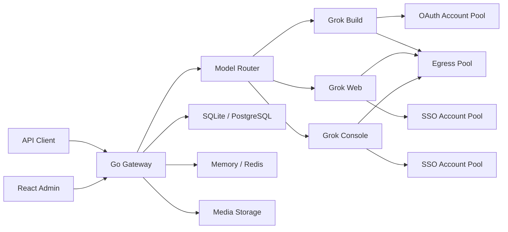

# [chenyme/grok2api](https://github.com/chenyme/grok2api)

<p align="center">
  
</p>

<p align="center">
  <strong>面向 Grok Build、Grok Web 与 Grok Console 的多账号 API 网关</strong>
</p>

<p align="center">
  <a href="./backend/go.mod"></a>
  <a href="./frontend/package.json"></a>
  <a href="https://github.com/chenyme/grok2api/actions/workflows/docker-publish.yml"></a>
</p>

> [!TIP]
> **个人新项目**<br>
> 推荐个人新项目 [DEEIX-AI：DEEIX-Chat 轻量化 AI 平台](https://github.com/DEEIX-AI/DEEIX-Chat)：企业级模型路由、对话、文件、工具、计费、身份和运维的一体化 AI 平台，全面且极致的低占用，空载运行时仅占用 34 MB。

> [!NOTE]
> 本项目仅供学习与研究交流。请务必遵循 Grok 的使用条款及当地法律法规，不得用于非法用途！

Grok2API 是一个纯 Go 实现的 Grok API 网关。项目将 Grok Build OAuth、Grok Web SSO 与 Grok Console SSO 组织为独立账号池，对外提供 OpenAI 风格接口、Anthropic Messages 兼容接口，以及账号、模型、密钥、用量和代理管理后台。

## 功能概览

- **三 Provider**：`grok_build`、`grok_web` 与 `grok_console` 独立路由、额度和故障状态
- **标准接口**：Responses、Chat Completions、Images、异步 Videos、Anthropic Messages
- **多账号调度**：优先级、并发限制、额度门控、会话粘滞、冷却与故障切换
- **账号接入**：Device OAuth、OAuth JSON、SSO JSON、逐行 SSO Token
- **媒体能力**：图片生成、图片编辑、视频生成、图片本地归档与 URL/Base64 返回
- **基础设施**：SQLite/PostgreSQL、Memory/Redis、HTTP 与 SOCKS 代理池
- **安全边界**：AES-256-GCM 凭据加密、客户端密钥哈希、日志脱敏、SSRF 与传输上限
- **管理后台**：Dashboard、账号、模型、客户端密钥、请求审计、接口文档与热加载设置

## 架构



## 快速部署

### Docker Compose

1. 准备配置：

```bash
git clone https://github.com/chenyme/grok2api.git
cd grok2api
cp config.example.yaml config.yaml
```

2. 生成并填写安全密钥：

```bash
openssl rand -hex 32
openssl rand -base64 32
```

```yaml
secrets:
  jwtSecret: "替换为 hex 随机值"
  credentialEncryptionKey: "替换为 Base64 随机密钥"

bootstrapAdmin:
  username: "admin"
  password: "替换为强密码"
```

3. 启动：

```bash
docker compose pull
docker compose up -d
```

访问 `http://127.0.0.1:8000`。

官方镜像已经包含前端构建产物，管理端与 API 由同一个 Go 服务提供。Compose 默认将 `config.yaml` 只读挂载到容器，并使用 `grok2api-data` 命名卷保存 SQLite 数据库和本地媒体。

常用命令：

```bash
docker compose logs -f grok2api
docker compose restart grok2api
docker compose down
```

### 源码运行

后端：

```bash
cp config.example.yaml config.yaml
cd backend
go run ./cmd/grok2api
```

前端开发服务器：

```bash
cd frontend
pnpm install
pnpm dev
```

前端默认运行于 `http://127.0.0.1:5173`，并将 API 请求代理到 `http://127.0.0.1:8000`。

## 首次使用

1. 使用 `bootstrapAdmin` 配置的管理员登录。
2. 在“上游账号”中接入 Grok Build、Grok Web 或 Grok Console 账号。
3. 等待本次额度和模型能力同步完成。
4. 在“模型管理”中确认对外模型名称与启用状态。
5. 在“客户端密钥”中创建 `g2a_` API Key。
6. 使用该密钥调用 `/v1/*`。

首次管理员创建后，建议修改管理员密码并从 `config.yaml` 删除 `bootstrapAdmin` 段。`credentialEncryptionKey` 必须长期保留，更换后已有凭据将无法解密。

## 账号来源

| Provider | 认证方式 | 主要能力 |
| :-- | :-- | :-- |
| Grok Build | Device OAuth、OAuth JSON | 原生 Responses、Chat、Messages、Billing、模型同步 |
| Grok Web | SSO JSON、逐行 SSO Token | Chat、Responses、Messages、图片、图片编辑、视频 |
| Grok Console | SSO JSON、逐行 SSO Token | 无状态 Responses、兼容 Chat 与 Messages |

Grok Build OAuth 支持按需续期。Grok Web 与 Grok Console 的 SSO 不可自动续期，凭据失效后账号会退出可用号池并等待重新授权。

Grok Web 与 Grok Console 均支持账号列表 JSON，也支持每行一个 Token 的快速导入。账号接入接口会等待本批账号的首次额度与模型能力同步完成后再返回结果。

管理端可复用 Web 账号的同一份 SSO 创建或更新对应的 Console 账号；同步按 Console 身份键幂等执行，不会改变已有 Web/Build 关联。

Grok Console 固定使用 `store: false`，不支持 `previous_response_id`、Response 查询/删除或 `/responses/compact`。多轮调用应像 Codex 无状态链路一样回放完整输入、工具调用和工具结果；网关不会为 Console 响应登记虚假的持久化归属。

## 模型

对外模型名称不带 Provider 前缀，例如 `grok-4.5`。内部上游路由使用 `Build/`、`Web/`、`Console/` 前缀区分实际来源；Grok Build 模型根据账号能力动态同步，请以管理端模型页或 `GET /v1/models` 为准。

升级时会原位迁移内部路由并保留路由主键、客户端密钥权限和旧名称别名。多个来源可以提供同一个对外模型名称；网关会按客户端权限、协议能力和账号可用性选择来源。带 Provider 前缀的名称仍可作为兼容入口，用于显式指定渠道。

Grok Web 内置模型：

| 模型 | 能力 | 最低等级 |
| :-- | :-- | :-- |
| `grok-chat-fast` | Chat / Responses / Messages | Basic |
| `grok-chat-auto` | Chat / Responses / Messages | Super |
| `grok-chat-expert` | Chat / Responses / Messages | Super |
| `grok-chat-heavy` | Chat / Responses / Messages | Heavy |
| `grok-imagine-image` | Fast 图片生成 | Basic |
| `grok-imagine-image-quality` | Quality 图片生成 | Super |
| `grok-imagine-image-edit` | 图片编辑 | Super |
| `grok-imagine-video` | 视频生成 | Super |

Grok Console 内置模型：

| 模型 | 能力 |
| :-- | :-- |
| `grok-4.3` | Responses / Chat / Messages |
| `grok-4.20-0309` | Responses / Chat / Messages |
| `grok-4.20-0309-reasoning` | Responses / Chat / Messages |
| `grok-4.20-0309-non-reasoning` | Responses / Chat / Messages |
| `grok-4.20-multi-agent-0309` | Responses / Chat / Messages |
| `grok-build-0.1` | Responses / Chat / Messages |

`grok-4.5` 不由 Grok Console Provider 注册；即使由 Web SSO 同步创建 Console 账号，该模型在 Console 中仍不可用。

Console 上游路由始终使用 `Console/` 内部前缀，不再根据启动顺序生成 `-console` 冲突后缀。升级产生的兼容别名不会出现在 `GET /v1/models`。

同名模型会在当前可用来源中自动选路；来源选定后，账号故障切换只发生在该 Provider 的账号池内。

## API

除健康检查和公开图片外，所有 `/v1` 接口都需要客户端 API Key：

```http
Authorization: Bearer g2a_xxx_xxx
```

| 方法 | 路径 | 说明 |
| :-- | :-- | :-- |
| `GET` | `/healthz` | 存活检查 |
| `GET` | `/readyz` | 就绪检查 |
| `GET` | `/v1/models` | 当前可服务模型 |
| `POST` | `/v1/responses` | Responses JSON / SSE |
| `POST` | `/v1/responses/compact` | Responses compact |
| `GET` | `/v1/responses/{id}` | 查询 Response |
| `DELETE` | `/v1/responses/{id}` | 删除 Response |
| `POST` | `/v1/chat/completions` | Chat Completions JSON / SSE |
| `POST` | `/v1/messages` | Anthropic Messages JSON / SSE |
| `POST` | `/v1/images/generations` | 图片生成 |
| `POST` | `/v1/images/edits` | 图片编辑 |
| `GET` | `/v1/media/images/{id}` | 公开归档图片 |
| `POST` | `/v1/videos/generations` | 创建视频任务 |
| `GET` | `/v1/videos/{request_id}` | 查询视频任务 |

Responses 资源查询、删除和 compact 的实际可用性取决于目标模型所属 Provider；Grok Console 仅支持无状态 `POST /v1/responses`。

管理端登录后可在 `/docs` 查看当前 Base URL、可用模型以及 cURL、Python 和 JavaScript 示例。开发环境还可以在 `config.yaml` 设置 `server.swaggerEnabled: true`，通过 `/swagger/index.html` 查看公开 API 的 Swagger 文档；生产环境应保持关闭。

最小调用示例：

```bash
export GROK2API_API_KEY="g2a_xxx_xxx"

curl http://127.0.0.1:8000/v1/responses \
  -H "Authorization: Bearer $GROK2API_API_KEY" \
  -H "Content-Type: application/json" \
  -d '{
    "model": "grok-chat-auto",
    "input": "用三句话解释量子隧穿",
    "stream": true
  }'
```

## 配置与存储

根目录 `config.yaml` 保存启动配置：

| 分组 | 说明 |
| :-- | :-- |
| `server` | 监听地址、请求体上限、请求生命周期与 Swagger 开关 |
| `frontend` | 公开 API 地址与静态前端目录 |
| `database` | SQLite 或 PostgreSQL |
| `runtimeStore` | Memory 或 Redis |
| `auth` | 管理员 Token 与安全 Cookie |
| `secrets` | JWT 与凭据加密密钥 |
| `provider` | Build/Web/Console 上游默认配置 |
| `media` | 媒体存储驱动与路径 |

账号、模型、额度、审计、客户端密钥、媒体任务和运行设置始终保存在关系型数据库。Redis 用于限流、并发租约、粘滞路由、分布式锁、额度恢复事件和多实例设置通知。

推荐组合：

| 场景 | 数据库 | 运行态 | 媒体 |
| :-- | :-- | :-- | :-- |
| 本地或单实例 | SQLite | Memory | 本地目录 |
| 多实例 | PostgreSQL | Redis | 共享卷或实例亲和 |

Provider（包括 Console 上游地址与 User-Agent）、服务容量、批量任务并发、路由、媒体、审计和代理参数统一在管理端 `/settings` 修改，不需要直接编辑数据库；除页面明确标记“重启生效”的字段外均会热加载。导入同步、账号转换、数据同步和凭据刷新默认并发均为 `25`，可分别限制为 `1–50`，并支持随机启动延迟；多实例使用 Redis 时，分类上限和总上限均在集群范围内生效。

## 生产部署

- 使用 HTTPS，并设置 `auth.secureCookies: true`
- 保持 `server.swaggerEnabled: false`
- 多实例部署使用 PostgreSQL 与 Redis
- 本地媒体目录在多实例下必须使用共享卷或实例亲和
- 持久化备份 `config.yaml`、关系型数据库和媒体目录
- 不要将 OAuth、SSO、Cloudflare Cookie 或账号导出文件提交到 Git
- 对外暴露前建议配置反向代理、访问日志和基础网络防护

## 开发

后端：

```bash
cd backend
go test ./...
go test -race ./...
go vet ./...
go build ./cmd/grok2api
```

前端：

```bash
cd frontend
pnpm install --frozen-lockfile
pnpm lint
pnpm build
```

## 进一步阅读

- [后端说明](./backend/README.md)
- [前端说明](./frontend/README.md)
