# [run-llama/liteparse](https://github.com/run-llama/liteparse)

# LiteParse

[](https://github.com/run-llama/liteparse/actions/workflows/ci.yml)
|
[](https://crates.io/crates/liteparse)
|
[](https://www.npmjs.com/package/@llamaindex/liteparse)
|
[](https://www.npmjs.com/package/@llamaindex/liteparse-wasm)
|
[](https://pypi.org/project/liteparse/)
|
[](https://opensource.org/licenses/Apache-2.0)
|
[Docs](https://developers.llamaindex.ai/liteparse/)


> Looking for LiteParse V1? Follow this link to [the old code](https://github.com/run-llama/liteparse/tree/logan/liteparse-v1)

LiteParse is a standalone OSS PDF parsing tool focused exclusively on **fast and light** parsing. It provides high-quality spatial text parsing with bounding boxes, without proprietary LLM features or cloud dependencies. Everything runs locally on your machine.

**Hitting the limits of local parsing?**
For complex documents (dense tables, multi-column layouts, charts, handwritten text, or
scanned PDFs), you'll get significantly better results with [LlamaParse](https://developers.llamaindex.ai/python/cloud/llamaparse/?utm_source=github&utm_medium=liteparse),
our cloud-based document parser built for production document pipelines. LlamaParse handles the
hard stuff so your models see clean, structured data and markdown.

>  [Sign up for LlamaParse free](https://cloud.llamaindex.ai?utm_source=github&utm_medium=liteparse)

## Overview

- **Fast Text Parsing**: Spatial text parsing using PDFium
- **Flexible OCR System**:
  - **Built-in**: Tesseract (zero setup, bundled with the library)
  - **HTTP Servers**: Plug in any OCR server (EasyOCR, PaddleOCR, custom)
  - **Standard API**: Simple, well-defined OCR API specification
- **Screenshot Generation**: Generate high-quality page screenshots for LLM agents
- **Multiple Output Formats**: JSON and Text
- **Bounding Boxes**: Precise text positioning information
- **Multi-language**: Use from Rust, Node.js/TypeScript, Python, or the browser (WASM)
- **Multi-platform**: Linux, macOS (Intel/ARM), Windows

```mermaid
flowchart LR
      subgraph Input["Input Formats"]
          direction TB
          PDF["PDF"]
          DOCX["DOCX"]
          XLSX["XLSX"]
          PPTX["PPTX"]
          IMG["Images"]
      end

      subgraph Core["Rust Core"]
          direction TB
          CONV["Format Conversion\nLibreOffice / ImageMagick"]
          EXTRACT["Text Extraction\nPDFium C library"]
          OCR["Selective OCR\nTesseract / HTTP / Custom"]
          MERGE["OCR Merge\nNative text + OCR results"]
          PROJ["Grid Projection\nSpatial layout reconstruction"]
          CONV --> EXTRACT
          EXTRACT --> OCR --> MERGE --> PROJ
          EXTRACT --> MERGE
      end

      subgraph Output[" Output "]
          direction TB
          JSON["Structured JSON\ntext + bounding boxes"]
          TEXT["Plain Text\nlayout-preserved"]
          SCREEN["Screenshots\nPNG rendering"]
      end

      subgraph Bindings["Language Bindings"]
          direction TB
          NAPI["Node.js / TypeScript\nnapi-rs"]
          PYO3["Python\nPyO3"]
          WASM["Browser / WASM\nwasm-bindgen"]
          CLI["CLI\ncargo / npm / pip"]
          NAPI ~~~ PYO3 ~~~ WASM ~~~ CLI
      end

      PDF --> EXTRACT
      DOCX & XLSX & PPTX & IMG --> CONV
      PROJ --> JSON & TEXT & SCREEN
      JSON & TEXT & SCREEN --> Bindings

      style Input fill:#F5F5F5,color:#000000,stroke:#37D7FA,stroke-width:2px
      style Core fill:#F5F5F5,color:#000000,stroke:#3E18F9,stroke-width:2px
      style Output fill:#F5F5F5,color:#000000,stroke:#FF8705,stroke-width:2px
      style Bindings fill:#F5F5F5,color:#000000,stroke:#FF8DF2,stroke-width:2px

      style PDF fill:#96E7F9,color:#000000,stroke:#37D7FA,stroke-width:1px
      style DOCX fill:#96E7F9,color:#000000,stroke:#37D7FA,stroke-width:1px
      style XLSX fill:#96E7F9,color:#000000,stroke:#37D7FA,stroke-width:1px
      style PPTX fill:#96E7F9,color:#000000,stroke:#37D7FA,stroke-width:1px
      style IMG fill:#96E7F9,color:#000000,stroke:#37D7FA,stroke-width:1px

      style CONV fill:#92AEFF,color:#000000,stroke:#4B72FE,stroke-width:1px
      style EXTRACT fill:#92AEFF,color:#000000,stroke:#4B72FE,stroke-width:1px
      style OCR fill:#92AEFF,color:#000000,stroke:#4B72FE,stroke-width:1px
      style MERGE fill:#92AEFF,color:#000000,stroke:#4B72FE,stroke-width:1px
      style PROJ fill:#4B72FE,color:#FFFFFF,stroke:#3E18F9,stroke-width:2px

      style JSON fill:#FFBD74,color:#000000,stroke:#FF8705,stroke-width:1px
      style TEXT fill:#FFBD74,color:#000000,stroke:#FF8705,stroke-width:1px
      style SCREEN fill:#FFBD74,color:#000000,stroke:#FF8705,stroke-width:1px

      style NAPI fill:#FFBFF8,color:#000000,stroke:#FF8DF2,stroke-width:1px
      style PYO3 fill:#FFBFF8,color:#000000,stroke:#FF8DF2,stroke-width:1px
      style WASM fill:#FFBFF8,color:#000000,stroke:#FF8DF2,stroke-width:1px
      style CLI fill:#FFBFF8,color:#000000,stroke:#FF8DF2,stroke-width:1px
```



## Installation

Install via your preferred package manager. All versions (except WASM) ship with the same `lit` CLI.

| Language | Install | Library Docs |
|----------|---------|--------------|
| **Node.js / TypeScript** | `npm i @llamaindex/liteparse` | [Node.js README](packages/node/README.md) |
| **Python** | `pip install liteparse` | [Python README](packages/python/README.md) |
| **Rust** | `cargo install liteparse` (CLI) / `cargo add liteparse` (lib) | [Rust README (crates.io)](crates/liteparse/README.md) |
| **Browser (WASM)** | `npm i @llamaindex/liteparse-wasm` | [WASM README](packages/wasm/README.md) |

### Agent Skill

You can use `liteparse` as an agent skill, downloading it with the `skills` CLI tool:

```bash
npx skills add run-llama/llamaparse-agent-skills --skill liteparse
```

Or copy-pasting the [`SKILL.md`](https://github.com/run-llama/llamaparse-agent-skills/blob/main/skills/liteparse/SKILL.md) file to your own skills setup.

## CLI Usage

The CLI is the same across all installations (`npm`, `pip`, `cargo install`).

### Parse Files

```bash
# Basic parsing
lit parse document.pdf

# Parse with specific format
lit parse document.pdf --format json -o output.json

# Parse specific pages
lit parse document.pdf --target-pages "1-5,10,15-20"

# Parse without OCR
lit parse document.pdf --no-ocr

# Parse a remote PDF
curl -sL https://example.com/report.pdf | lit parse -
```

### Batch Parsing

Parse an entire directory of documents:

```bash
lit batch-parse ./input-directory ./output-directory
```

### Generate Screenshots

Screenshots are essential for LLM agents to extract visual information that text alone cannot capture.

```bash
# Screenshot all pages
lit screenshot document.pdf -o ./screenshots

# Screenshot specific pages
lit screenshot document.pdf --target-pages "1,3,5" -o ./screenshots

# Custom DPI
lit screenshot document.pdf --dpi 300 -o ./screenshots
```

### CLI Reference

#### Parse Command

```
lit parse [OPTIONS] <file>

Options:
  -o, --output <file>          Output file path
      --format <format>        Output format: json|text [default: text]
      --no-ocr                 Disable OCR
      --ocr-language <lang>    OCR language, Tesseract format [default: eng]
      --ocr-server-url <url>   HTTP OCR server URL (uses Tesseract if not provided)
      --tessdata-path <path>   Path to tessdata directory
      --max-pages <n>          Max pages to parse [default: 1000]
      --target-pages <pages>   Pages to parse (e.g., "1-5,10,15-20")
      --dpi <dpi>              Rendering DPI [default: 150]
      --preserve-small-text    Keep very small text
      --password <password>    Password for encrypted documents
      --num-workers <n>        Concurrent OCR workers [default: CPU cores - 1]
  -q, --quiet                  Suppress progress output
  -h, --help                   Print help
```

#### Batch Parse Command

```
lit batch-parse [OPTIONS] <input-dir> <output-dir>

Options:
      --format <format>        Output format: json|text [default: text]
      --no-ocr                 Disable OCR
      --ocr-language <lang>    OCR language [default: eng]
      --ocr-server-url <url>   HTTP OCR server URL
      --tessdata-path <path>   Path to tessdata directory
      --max-pages <n>          Max pages per file [default: 1000]
      --dpi <dpi>              Rendering DPI [default: 150]
      --recursive              Recursively search input directory
      --extension <ext>        Only process files with this extension (e.g., ".pdf")
      --password <password>    Password for encrypted documents
      --num-workers <n>        Concurrent OCR workers
  -q, --quiet                  Suppress progress output
  -h, --help                   Print help
```

#### Screenshot Command

```
lit screenshot [OPTIONS] <file>

Options:
  -o, --output-dir <dir>       Output directory [default: ./screenshots]
      --target-pages <pages>   Pages to screenshot (e.g., "1,3,5" or "1-5")
      --dpi <dpi>              Rendering DPI [default: 150]
      --password <password>    Password for encrypted documents
  -q, --quiet                  Suppress progress output
  -h, --help                   Print help
```

## OCR Setup

### Default: Tesseract

Tesseract is bundled and works out of the box:

```bash
lit parse document.pdf                    # OCR enabled by default
lit parse document.pdf --ocr-language fra # Specify language
lit parse document.pdf --no-ocr           # Disable OCR
```

For offline or air-gapped environments, set `TESSDATA_PREFIX` to a directory containing pre-downloaded `.traineddata` files:

```bash
export TESSDATA_PREFIX=/path/to/tessdata
lit parse document.pdf --ocr-language eng
```

Or pass the path directly:

```bash
lit parse document.pdf --tessdata-path /path/to/tessdata
```

### Optional: HTTP OCR Servers

For higher accuracy or better performance, you can use an HTTP OCR server. We provide ready-to-use example wrappers for popular OCR engines:

- [EasyOCR](ocr/easyocr/README.md)
- [PaddleOCR](ocr/paddleocr/README.md)

You can integrate any OCR service by implementing the simple LiteParse OCR API specification (see [`OCR_API_SPEC.md`](OCR_API_SPEC.md)).

The API requires:
- POST `/ocr` endpoint
- Accepts `file` and `language` parameters
- Returns JSON: `{ results: [{ text, bbox: [x1,y1,x2,y2], confidence }] }`

## Multi-Format Input Support

LiteParse supports **automatic conversion** of various document formats to PDF before parsing.

### Supported Input Formats

#### Office Documents (via LibreOffice)
- **Word**: `.doc`, `.docx`, `.docm`, `.odt`, `.rtf`, `.pages`
- **PowerPoint**: `.ppt`, `.pptx`, `.pptm`, `.odp`, `.key`
- **Spreadsheets**: `.xls`, `.xlsx`, `.xlsm`, `.ods`, `.csv`, `.tsv`, `.numbers`

Install LibreOffice for automatic conversion:

```bash
# macOS
brew install --cask libreoffice

# Ubuntu/Debian
apt-get install libreoffice

# Windows
choco install libreoffice-fresh
```

> _On Windows, you may need to add LibreOffice's program directory (usually `C:\Program Files\LibreOffice\program`) to your PATH._

#### Images (via ImageMagick)
- **Formats**: `.jpg`, `.jpeg`, `.png`, `.gif`, `.bmp`, `.tiff`, `.webp`, `.svg`

Install ImageMagick for image-to-PDF conversion:

```bash
# macOS
brew install imagemagick

# Ubuntu/Debian
apt-get install imagemagick

# Windows
choco install imagemagick.app
```

## Environment Variables

| Variable | Description |
|----------|-------------|
| `TESSDATA_PREFIX` | Path to a directory containing Tesseract `.traineddata` files. Used for offline/air-gapped environments. |

## Development

The project is a Rust workspace with the core library and language-specific binding crates.

```
crates/
├── liteparse/          # Core library + CLI binary
├── liteparse-napi/     # Node.js bindings (napi-rs)
├── liteparse-python/   # Python bindings (PyO3)
├── liteparse-wasm/     # WASM bindings (wasm-bindgen)
├── pdfium/             # PDFium Rust wrapper
└── pdfium-sys/         # PDFium FFI bindings
packages/
├── node/               # npm package (TS wrapper + native binary)
├── python/             # PyPI package (Python wrapper + native binary)
└── wasm/               # WASM npm package
```

### Building

```bash
# Build the CLI
cargo build --release -p liteparse

# Build Node.js bindings
cd packages/node && npm run build

# Build Python bindings
cd packages/python && maturin develop --release

# Build WASM
cd packages/wasm && npm run build
```

We provide a fairly rich `AGENTS.md`/`CLAUDE.md` that we recommend using to help with development + coding agents.

## License

Apache 2.0

## Credits

Built on top of:

- [PDFium](https://pdfium.googlesource.com/pdfium/) - PDF rendering and text extraction
- [Tesseract](https://github.com/tesseract-ocr/tesseract) - OCR engine (via tesseract-rs)
- [EasyOCR](https://github.com/JaidedAI/EasyOCR) - HTTP OCR server (optional)
- [PaddleOCR](https://github.com/PaddlePaddle/PaddleOCR) - HTTP OCR server (optional)
- [napi-rs](https://napi.rs/) - Node.js native bindings
- [PyO3](https://pyo3.rs/) - Python native bindings
- [wasm-bindgen](https://github.com/wasm-bindgen/wasm-bindgen) - WebAssembly bindings
