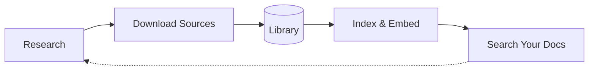
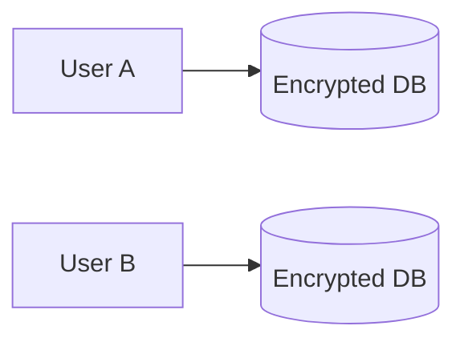

# [LearningCircuit/local-deep-research](https://github.com/LearningCircuit/local-deep-research)

# Local Deep Research

<div align="center">

[](https://github.com/LearningCircuit/local-deep-research/stargazers)
[](https://hub.docker.com/r/localdeepresearch/local-deep-research)
[](https://pypi.org/project/local-deep-research/)

[](https://trendshift.io/repositories/14116)

[](https://github.com/LearningCircuit/local-deep-research/commits/main)
[](https://github.com/LearningCircuit/local-deep-research/commits/main)

[](https://huggingface.co/datasets/local-deep-research/ldr-benchmarks)
[](docs/SQLCIPHER_INSTALL.md)

<!-- Well-known security scanners that visitors will recognize -->
[](https://securityscorecards.dev/viewer/?uri=github.com/LearningCircuit/local-deep-research)
[](https://github.com/LearningCircuit/local-deep-research/security/code-scanning)
[](https://github.com/LearningCircuit/local-deep-research/actions/workflows/semgrep.yml)

[](https://github.com/LearningCircuit/local-deep-research/actions/workflows/pre-commit.yml)

[](https://github.com/LearningCircuit/local-deep-research/actions/workflows/docker-publish.yml)
[](https://github.com/LearningCircuit/local-deep-research/actions/workflows/publish.yml)

[](https://discord.gg/ttcqQeFcJ3)
[](https://www.reddit.com/r/LocalDeepResearch/)
[](https://www.youtube.com/@local-deep-research)


**AI-powered research assistant for deep, agentic research**

*Performs deep, agentic research using multiple LLMs and search engines with proper citations*

<a href="https://www.youtube.com/watch?v=pfxgLX-MxMY&t=1999">
  ▶️ Watch Review by The Art Of The Terminal
</a>

</div>

## 🚀 What is Local Deep Research?

AI research assistant you control. Run locally for privacy, use any LLM and build your own searchable knowledge base. You own your data and see exactly how it works.

## ⚡ Quick Start


**Option 1: Docker Run (Linux)**
```bash
# Step 1: Pull and run Ollama
docker run -d -p 11434:11434 --name ollama ollama/ollama
docker exec ollama ollama pull gpt-oss:20b

# Step 2: Pull and run SearXNG for optimal search results
docker run -d -p 8080:8080 --name searxng searxng/searxng

# Step 3: Pull and run Local Deep Research
docker run -d -p 5000:5000 --network host \
  --name local-deep-research \
  --volume "deep-research:/data" \
  -e LDR_DATA_DIR=/data \
  localdeepresearch/local-deep-research
```

**Option 2: Docker Compose**

CPU-only (all platforms):
```bash
curl -O https://raw.githubusercontent.com/LearningCircuit/local-deep-research/main/docker-compose.yml && docker compose up -d
```

With NVIDIA GPU (Linux):
```bash
curl -O https://raw.githubusercontent.com/LearningCircuit/local-deep-research/main/docker-compose.yml && \
curl -O https://raw.githubusercontent.com/LearningCircuit/local-deep-research/main/docker-compose.gpu.override.yml && \
docker compose -f docker-compose.yml -f docker-compose.gpu.override.yml up -d
```

Open http://localhost:5000 after ~30 seconds. For GPU setup, environment variables, and more, see the [Docker Compose Guide](docs/docker-compose-guide.md).

**Option 3: pip install**
```bash
pip install local-deep-research
```
> Works on Windows, macOS, and Linux. SQLCipher encryption is included via pre-built wheels — no compilation needed.
> PDF export on Windows requires Pango ([setup guide](https://doc.courtbouillon.org/weasyprint/stable/first_steps.html)).
> If you encounter issues with encryption, set `export LDR_BOOTSTRAP_ALLOW_UNENCRYPTED=true` to use standard SQLite instead.

[More install options →](#-installation-options)

## 🏗️ How It Works

### Research

You ask a complex question. LDR:
- Does the research for you automatically
- Searches across web, academic papers, and your own documents
- Synthesizes everything into a report with proper citations

Choose from 20+ research strategies for quick facts, deep analysis, or academic research.

**New: LangGraph Agent Strategy** — An autonomous agentic research mode where the LLM decides what to search, which specialized engines to use (arXiv, PubMed, Semantic Scholar, etc.), and when to synthesize. Early results are promising — it adaptively switches between search engines based on what it finds and collects significantly more sources than pipeline-based strategies. Select `langgraph-agent` in Settings to try it.

### Build Your Knowledge Base



Every research session finds valuable sources. Download them directly into your encrypted library—academic papers from ArXiv, PubMed articles, web pages. LDR extracts text, indexes everything, and makes it searchable. Next time you research, ask questions across your own documents and the live web together. Your knowledge compounds over time.

## 🛡️ Security

<div align="center">

<!-- Static Analysis (additional scanners beyond CodeQL/Semgrep) -->
[](https://github.com/LearningCircuit/local-deep-research/actions/workflows/devskim.yml)
[](https://github.com/LearningCircuit/local-deep-research/actions/workflows/bearer.yml)

<!-- Dependency & Secrets Scanning -->
[](https://github.com/LearningCircuit/local-deep-research/actions/workflows/gitleaks-main.yml)
[](https://github.com/LearningCircuit/local-deep-research/actions/workflows/osv-scanner.yml)
[](https://github.com/LearningCircuit/local-deep-research/actions/workflows/npm-audit.yml)
[](https://github.com/LearningCircuit/local-deep-research/actions/workflows/retirejs.yml)

<!-- Container Security -->
[](https://github.com/LearningCircuit/local-deep-research/actions/workflows/container-security.yml)
[](https://github.com/LearningCircuit/local-deep-research/actions/workflows/dockle.yml)
[](https://github.com/LearningCircuit/local-deep-research/actions/workflows/hadolint.yml)
[](https://github.com/LearningCircuit/local-deep-research/actions/workflows/checkov.yml)

<!-- Workflow & Runtime Security -->
[](https://github.com/LearningCircuit/local-deep-research/actions/workflows/zizmor-security.yml)
[](https://github.com/LearningCircuit/local-deep-research/actions/workflows/owasp-zap-scan.yml)
[](https://github.com/LearningCircuit/local-deep-research/actions/workflows/security-tests.yml)

</div>



Your data stays yours. Each user gets their own isolated SQLCipher database encrypted with AES-256 (Signal-level security). No password recovery means true zero-knowledge—even server admins can't read your data. Run fully local with Ollama + SearXNG and nothing ever leaves your machine.

**In-memory credentials**: Like all applications that use secrets at runtime — including [password managers](https://www.ise.io/casestudies/password-manager-hacking/), browsers, and API clients — credentials are held in plain text in process memory during active sessions. This is an [industry-wide accepted reality](https://cheatsheetseries.owasp.org/cheatsheets/Secrets_Management_Cheat_Sheet.html), not specific to LDR: if an attacker can read process memory, they can also read any in-process decryption key. We mitigate this with session-scoped credential lifetimes and core dump exclusion. Ideas for further improvements are always welcome via [GitHub Issues](https://github.com/LearningCircuit/local-deep-research/issues). See our [Security Policy](SECURITY.md) for details.

**Supply Chain Security**: Docker images are signed with [Cosign](https://github.com/sigstore/cosign), include SLSA provenance attestations, and attach SBOMs. Verify with:
```bash
cosign verify localdeepresearch/local-deep-research:latest
```

**Security Transparency**: Scanner suppressions are documented with justifications in [Security Alerts Assessment](.github/SECURITY_ALERTS.md), [Scorecard Compliance](.github/SECURITY_SCORECARD.md), [Container CVE Suppressions](.trivyignore), and [SAST Rule Rationale](bearer.yml). Some alerts (Dependabot, code scanning) can only be dismissed or are very difficult to suppress outside the [GitHub Security tab](https://docs.github.com/en/code-security/dependabot/dependabot-alerts/viewing-and-updating-dependabot-alerts), so the files above do not cover every dismissed finding.

[Detailed Architecture →](docs/architecture.md) | [Security Policy →](SECURITY.md) | [Security Review Process →](docs/SECURITY_REVIEW_PROCESS.md)

### 🔒 Privacy & Data

Local Deep Research contains **no telemetry, no analytics, and no tracking**. We do not collect, transmit, or store any data about you or your usage. No analytics SDKs, no phone-home calls, no crash reporting, no external scripts. Usage metrics stay in your local encrypted database.

The only network calls LDR makes are ones **you** initiate: search queries (to engines you configure), LLM API calls (to your chosen provider), and notifications (only if you set up Apprise).

Since we don't collect any usage data, we rely on you to tell us what works, what's broken, and what you'd like to see next — [bug reports](https://github.com/LearningCircuit/local-deep-research/issues), feature ideas, and even which features you love or never use all help us improve LDR.

## 📊 Performance

**~95% accuracy on SimpleQA benchmark** (preliminary results)
- Tested with GPT-4.1-mini + SearXNG + focused-iteration strategy
- Comparable to state-of-the-art AI research systems
- Local models can achieve similar performance with proper configuration

### 🧭 Picking a model? Use the community benchmarks

Not sure which local model to run with LDR? The community-maintained **[LDR Benchmarks dataset on Hugging Face](https://huggingface.co/datasets/local-deep-research/ldr-benchmarks)** tracks accuracy across models, search engines, and research strategies — it's the fastest way to see which Ollama / LM Studio / llama.cpp models actually work well for deep research before you download multi-GB weights.

- **[Browse leaderboards & download CSVs on Hugging Face →](https://huggingface.co/datasets/local-deep-research/ldr-benchmarks)**
- **[Submit your own results on GitHub →](https://github.com/LearningCircuit/ldr-benchmarks)**

## ✨ Key Features

### 🔍 Research Modes
- **Quick Summary** - Get answers in 30 seconds to 3 minutes with citations
- **Detailed Research** - Comprehensive analysis with structured findings
- **Report Generation** - Professional reports with sections and table of contents
- **Document Analysis** - Search your private documents with AI

### 🛠️ Advanced Capabilities
- **[LangChain Integration](docs/LANGCHAIN_RETRIEVER_INTEGRATION.md)** - Use any vector store as a search engine
- **[REST API](docs/api-quickstart.md)** - Authenticated HTTP access with per-user databases
- **[Benchmarking](docs/BENCHMARKING.md)** - Test and optimize your configuration
- **[Analytics Dashboard](docs/analytics-dashboard.md)** - Track costs, performance, and usage metrics
- **[Journal Quality System](docs/journal-quality.md)** - Automatic journal reputation scoring with 212K+ indexed sources, predatory detection, and quality dashboard. Powered by [OpenAlex](https://openalex.org) (CC0), [DOAJ](https://doaj.org) (CC0), and [Stop Predatory Journals](https://predatoryjournals.org) (MIT).
- **Real-time Updates** - WebSocket support for live research progress
- **Export Options** - Download results as PDF or Markdown
- **Research History** - Save, search, and revisit past research
- **Adaptive Rate Limiting** - Intelligent retry system that learns optimal wait times
- **Keyboard Shortcuts** - Navigate efficiently (ESC, Ctrl+Shift+1-5)
- **Per-User Encrypted Databases** - Secure, isolated data storage for each user

### 📰 News & Research Subscriptions
- **Automated Research Digests** - Subscribe to topics and receive AI-powered research summaries
- **Customizable Frequency** - Daily, weekly, or custom schedules for research updates
- **Smart Filtering** - AI filters and summarizes only the most relevant developments
- **Multi-format Delivery** - Get updates as markdown reports or structured summaries
- **Topic & Query Support** - Track specific searches or broad research areas

### 🌐 Search Sources

#### Free Search Engines
- **Academic**: arXiv, PubMed, Semantic Scholar
- **General**: Wikipedia, SearXNG
- **Technical**: GitHub, Elasticsearch
- **Historical**: Wayback Machine
- **News**: The Guardian, Wikinews

#### Premium Search Engines
- **Tavily** - AI-powered search
- **Google** - Via SerpAPI or Programmable Search Engine
- **Brave Search** - Privacy-focused web search

#### Custom Sources
- **Local Documents** - Search your files with AI
- **LangChain Retrievers** - Any vector store or database
- **Meta Search** - Combine multiple engines intelligently

LDR respects `robots.txt` and identifies itself honestly when fetching web pages — no stealth or anti-detection techniques. In rare cases this means a page that blocks automated access won't be fetched, which we consider the right trade-off.

[Full Search Engines Guide →](docs/search-engines.md)

## 📦 Installation Options

For most users, the [Quick Start](#-quick-start) above is all you need.

| Method | Best for | Guide |
|--------|----------|-------|
| Docker Compose | Most users (recommended) | [Docker Compose Guide](docs/docker-compose-guide.md) |
| Docker | Minimal setup | [Installation Guide](docs/installation.md#docker) |
| pip | Developers, Python integration | [pip Guide](docs/install-pip.md) |
| Unraid | Unraid servers | [Unraid Guide](docs/deployment/unraid.md) |

[All installation options →](docs/installation.md)

## 💻 Usage Examples

### Python API
```python
from local_deep_research.api import LDRClient, quick_query

# Option 1: Simplest - one line research
summary = quick_query("username", "password", "What is quantum computing?")
print(summary)

# Option 2: Client for multiple operations
client = LDRClient()
client.login("username", "password")
result = client.quick_research("What are the latest advances in quantum computing?")
print(result["summary"])
```

### HTTP API

*The code example below shows the basic API structure - for working examples, see the link below*

```python
import requests
from bs4 import BeautifulSoup

# Create session and authenticate
session = requests.Session()
login_page = session.get("http://localhost:5000/auth/login")
soup = BeautifulSoup(login_page.text, "html.parser")
login_csrf = soup.find("input", {"name": "csrf_token"}).get("value")

# Login and get API CSRF token
session.post("http://localhost:5000/auth/login",
            data={"username": "user", "password": "pass", "csrf_token": login_csrf})
csrf = session.get("http://localhost:5000/auth/csrf-token").json()["csrf_token"]

# Make API request
response = session.post("http://localhost:5000/api/start_research",
                       json={"query": "Your research question"},
                       headers={"X-CSRF-Token": csrf})
```

🚀 **[Ready-to-use HTTP API Examples → examples/api_usage/http/](examples/api_usage/http/)**
- ✅ **Automatic user creation** - works out of the box
- ✅ **Complete authentication** with CSRF handling
- ✅ **Result retry logic** - waits until research completes
- ✅ **Progress monitoring** and error handling

### Command Line Tools

```bash
# Run benchmarks from CLI
python -m local_deep_research.benchmarks --dataset simpleqa --examples 50

# Manage rate limiting
python -m local_deep_research.web_search_engines.rate_limiting status
python -m local_deep_research.web_search_engines.rate_limiting reset
```

## 🔗 Enterprise Integration

Connect LDR to your existing knowledge base:

```python
from local_deep_research.api import quick_summary

# Use your existing LangChain retriever
result = quick_summary(
    query="What are our deployment procedures?",
    retrievers={"company_kb": your_retriever},
    search_tool="company_kb"
)
```

Works with: FAISS, Chroma, Pinecone, Weaviate, Elasticsearch, and any LangChain-compatible retriever.

[Integration Guide →](docs/LANGCHAIN_RETRIEVER_INTEGRATION.md)

## 🔌 MCP Server (Claude Integration)

LDR provides an MCP (Model Context Protocol) server that allows AI assistants like Claude Desktop and Claude Code to perform deep research.

> ⚠️ **Security Note**: This MCP server is designed for **local use only** via STDIO transport (e.g., Claude Desktop). It has no built-in authentication or rate limiting. Do not expose over a network without implementing proper security controls. See the [MCP Security Guide](https://modelcontextprotocol.io/docs/concepts/security) for network deployment requirements.

### Installation

```bash
# Install with MCP extras
pip install "local-deep-research[mcp]"
```

### Claude Desktop Configuration

Add to your `claude_desktop_config.json`:

```json
{
  "mcpServers": {
    "local-deep-research": {
      "command": "ldr-mcp",
      "env": {
        "LDR_LLM_PROVIDER": "openai",
        "LDR_LLM_OPENAI_API_KEY": "sk-..."
      }
    }
  }
}
```

### Claude Code Configuration

Add to your `.mcp.json` (project-level) or `~/.claude/mcp.json` (global):

```json
{
  "mcpServers": {
    "local-deep-research": {
      "command": "ldr-mcp",
      "env": {
        "LDR_LLM_PROVIDER": "ollama",
        "LDR_LLM_OLLAMA_URL": "http://localhost:11434"
      }
    }
  }
}
```

### Available Tools

| Tool | Description | Duration | LLM Cost |
|------|-------------|----------|----------|
| `search` | Raw results from a specific engine (arxiv, pubmed, wikipedia, ...) | 5-30s | None |
| `quick_research` | Fast research summary | 1-5 min | Yes |
| `detailed_research` | Comprehensive analysis | 5-15 min | Yes |
| `generate_report` | Full markdown report | 10-30 min | Yes |
| `analyze_documents` | Search local collections | 30s-2 min | Yes |
| `list_search_engines` | List available search engines | instant | None |
| `list_strategies` | List research strategies | instant | None |
| `get_configuration` | Get current config | instant | None |

### Individual Search Engines

The `search` tool lets you query specific search engines directly and get raw results (title, link, snippet) — no LLM processing, no cost, fast. This is especially useful for **monitoring and subscriptions** where you want to check for new content regularly without burning LLM tokens.

```
# Search arXiv for recent papers
search(query="transformer architecture improvements", engine="arxiv")

# Search PubMed for medical literature
search(query="CRISPR clinical trials 2024", engine="pubmed")

# Search Wikipedia for quick facts
search(query="quantum error correction", engine="wikipedia")

# Search OpenClaw for legal case law
search(query="copyright fair use precedents", engine="openclaw")

# Use list_search_engines() to see all available engines
```

### Example Usage

```
"Use quick_research to find information about quantum computing applications"
"Search arxiv for recent papers on diffusion models"
"Generate a detailed research report on renewable energy trends"
```

## 📊 Performance & Analytics

### Benchmark Results
Early experiments on small SimpleQA dataset samples:

| Configuration | Accuracy | Notes |
|--------------|----------|--------|
| gpt-4.1-mini + SearXNG + focused_iteration | 90-95% | Limited sample size |
| gpt-4.1-mini + Tavily + focused_iteration | 90-95% | Limited sample size |
| gemini-2.0-flash-001 + SearXNG | 82% | Single test run |

Note: These are preliminary results from initial testing. Performance varies significantly based on query types, model versions, and configurations. [Run your own benchmarks →](docs/BENCHMARKING.md)

**Full community leaderboard:** The community maintains a growing collection of benchmark results across models, strategies, and search engines in a dedicated repo with CI-validated submissions and auto-generated leaderboards:

- **[GitHub: LearningCircuit/ldr-benchmarks](https://github.com/LearningCircuit/ldr-benchmarks)** — submit your results here
- **[Hugging Face: local-deep-research/ldr-benchmarks](https://huggingface.co/datasets/local-deep-research/ldr-benchmarks)** — browse leaderboards and download CSVs

### Benchmark Contributors

Thanks to the community members who have contributed benchmark runs:

<!-- BENCHMARK_CONTRIBUTORS:START -->
<!-- BENCHMARK_CONTRIBUTORS:END -->

[See all contributors →](https://github.com/LearningCircuit/ldr-benchmarks/blob/main/CONTRIBUTORS.md)

### Built-in Analytics Dashboard
Track costs, performance, and usage with detailed metrics. [Learn more →](docs/analytics-dashboard.md)

## 🤖 Supported LLMs

### Local Models
- **Ollama** — connect to its native API (default `http://localhost:11434`)
- **LM Studio** — connect to its OpenAI-compatible server (default `http://localhost:1234/v1`)
- **llama.cpp** — connect to `llama-server`'s OpenAI-compatible endpoint (default `http://localhost:8080/v1`); start with `llama-server -m <model.gguf>`
- Common models: Llama 3, Mistral, Gemma, DeepSeek, Qwen
- LLM processing stays local (search queries still go to web). No API costs.

> 💡 **Which local model should I pick?** Check the **[LDR Benchmarks dataset on Hugging Face](https://huggingface.co/datasets/local-deep-research/ldr-benchmarks)** — community-submitted accuracy numbers across local and cloud models, so you can compare before downloading. Also on [GitHub](https://github.com/LearningCircuit/ldr-benchmarks) if you want to submit your own runs.

### Cloud Models
- OpenAI (GPT-4, GPT-3.5)
- Anthropic (Claude 3)
- Google (Gemini)
- 100+ models via OpenRouter

[Model Setup →](docs/env_configuration.md)

### Upgrading from earlier versions

- **`llm.model` no longer has a default.** Pre-1.7 installs auto-filled `gemma3:12b` (Ollama) when no model was configured, which silently downloaded a multi-GB binary. The field is now empty by default — pick a model in Settings → LLM, or research will fail loudly with a clear error.
- **The `llamacpp` provider now uses HTTP instead of in-process loading.** If you previously set `llm.llamacpp_model_path` to a local `.gguf` file, that setting is no longer read. Instead, run `llama-server -m <your-model.gguf>` (it ships with every modern llama.cpp build) and the default `llm.llamacpp.url` of `http://localhost:8080/v1` will pick it up. Optional API key support is available via `llm.llamacpp.api_key` if you put `llama-server` behind an auth proxy.

## 📚 Documentation

### Getting Started
- [Installation Guide](docs/installation.md)
- [Frequently Asked Questions](docs/faq.md)
- [API Quickstart](docs/api-quickstart.md)
- [Configuration Guide](docs/env_configuration.md)
- [Full Configuration Reference](docs/CONFIGURATION.md)

### Core Features
- [All Features Guide](docs/features.md)
- [Search Engines Guide](docs/search-engines.md)
- [Analytics Dashboard](docs/analytics-dashboard.md)

### Advanced Features
- [LangChain Integration](docs/LANGCHAIN_RETRIEVER_INTEGRATION.md)
- [Benchmarking System](docs/BENCHMARKING.md)
- [Elasticsearch Setup](docs/elasticsearch_search_engine.md)
- [SearXNG Setup](docs/SearXNG-Setup.md)

### Development
- [Docker Compose Guide](docs/docker-compose-guide.md)
- [Development Guide](docs/developing.md)
- [Security Guide](docs/security/CODEQL_GUIDE.md)
- [Release Guide](docs/RELEASE_GUIDE.md)

### Examples & Tutorials
- [API Examples](examples/api_usage/)
- [Benchmark Examples](examples/benchmarks/)
- [Optimization Examples](examples/optimization/)

## 📰 Featured In

> "Local Deep Research **deserves special mention** for those who prioritize privacy... **tuned to use open-source LLMs** that can run on consumer GPUs or even CPUs. Journalists, researchers, or companies with sensitive topics can investigate information **without queries ever hitting an external server**."
>
> — [Medium: Open-Source Deep Research AI Assistants](https://medium.com/@leucopsis/open-source-deep-research-ai-assistants-157462a59c14)

### News & Articles
- [Korben.info](https://korben.info/local-deep-research-alternative-gratuite-recherche-ia-sourcee.html) - French tech blog ("Sherlock Holmes numérique")
- [Roboto.fr](https://www.roboto.fr/blog/local-deep-research-l-alternative-open-source-gratuite-deep-research-d-openai) - "L'alternative open-source gratuite à Deep Research d'OpenAI"
- [KDJingPai AI Tools](https://www.kdjingpai.com/en/local-deep-research/) - AI productivity tools coverage
- [AI Sharing Circle](https://aisharenet.com/en/local-deep-research/) - AI resources coverage

### Community Discussions
- [Hacker News](https://news.ycombinator.com/item?id=43330164) - 190+ points, community discussion
- [LangChain Twitter/X](https://x.com/LangChainAI/status/1901347759757902038) - Official LangChain promotion
- [LangChain LinkedIn](https://www.linkedin.com/posts/langchain_local-deep-research-an-ai-research-activity-7307113456095137792-cXRH) - 400+ likes

### International Coverage

#### 🇨🇳 Chinese
- [Juejin (掘金)](https://juejin.cn/post/7481604667589885991) - Developer community
- [Cnblogs (博客园)](https://www.cnblogs.com/qife122/p/18955032) - Developer blogs
- [GitHubDaily (Twitter/X)](https://x.com/GitHub_Daily/status/1900169979313741846) - Influential tech account
- [Zhihu (知乎)](https://zhuanlan.zhihu.com/p/30886269290) - Tech community
- [A姐分享](https://www.ahhhhfs.com/68713/) - AI resources
- [CSDN](https://blog.csdn.net/gitblog_01198/article/details/147061415) - Installation guide
- [NetEase (网易)](https://www.163.com/dy/article/JQKAS50205567BLV.html) - Tech news portal

#### 🇯🇵 Japanese
- [note.com: 調査革命：Local Deep Research徹底活用法](https://note.com/r7038xx/n/nb3b74debbb30) - Comprehensive tutorial
- [Qiita: Local Deep Researchを試す](https://qiita.com/orca13/items/635f943287c45388d48f) - Docker setup guide
- [LangChainJP (Twitter/X)](https://x.com/LangChainJP/status/1902918110073807073) - Japanese LangChain community

#### 🇰🇷 Korean
- [PyTorch Korea Forum](https://discuss.pytorch.kr/t/local-deep-research/6476) - Korean ML community
- [GeekNews (Hada.io)](https://news.hada.io/topic?id=19707) - Korean tech news

### Reviews & Analysis
- [BSAIL Lab: How useful is Deep Research in Academia?](https://uflbsail.net/uncategorized/how-useful-is-deep-research-in-academia/) - Academic review by contributor [@djpetti](https://github.com/djpetti)
- [The Art Of The Terminal: Use Local LLMs Already!](https://youtu.be/pfxgLX-MxMY?t=1999) - Comprehensive review of local AI tools, featuring LDR's research capabilities (embeddings now work!)

### Related Projects
- [SearXNG LDR-Academic](https://github.com/porespellar/searxng-LDR-academic) - Academic-focused SearXNG fork with 12 research engines (arXiv, Google Scholar, PubMed, etc.) designed for LDR
- [DeepWiki Documentation](https://deepwiki.com/LearningCircuit/local-deep-research) - Third-party documentation and guides

> **Note:** Third-party projects and articles are independently maintained. We link to them as useful resources but cannot guarantee their code quality or security.

## 🤝 Community & Support

- [Discord](https://discord.gg/ttcqQeFcJ3) - Get help and share research techniques
- [Reddit](https://www.reddit.com/r/LocalDeepResearch/) - Updates and showcases
- [GitHub Issues](https://github.com/LearningCircuit/local-deep-research/issues) - Bug reports

## 🚀 Contributing

We welcome contributions of all sizes — from typo fixes to new features. The key rule: **keep PRs small and atomic** (one change per PR). For larger changes, please open an issue or start a discussion first — we want to protect your time and make sure your effort leads to a successful merge rather than a misaligned PR. See our [Contributing Guide](CONTRIBUTING.md) to get started.

## Acknowledgements

Local Deep Research is built on the work of many open-access initiatives, academic databases, and open-source projects. We are grateful to:

### Academic & Research Data

| Source | What It Provides | License |
|--------|-----------------|---------|
| [OpenAlex](https://openalex.org) | Academic metadata for ~280K sources and ~120K institutions, including DOAJ status | CC0 |
| [DOAJ](https://doaj.org) | Directory of Open Access Journals — open-access verification (via OpenAlex) | CC0 |
| [arXiv](https://arxiv.org) | Preprints in physics, mathematics, CS, and more | Various (see arXiv license) |
| [PubMed / NCBI](https://pubmed.ncbi.nlm.nih.gov) | Biomedical and life sciences literature | Public domain (US Gov) |
| [Semantic Scholar](https://www.semanticscholar.org) | Cross-discipline academic search with citation data | [Terms](https://www.semanticscholar.org/product/api/license) |
| [NASA ADS](https://ui.adsabs.harvard.edu) | Astrophysics, physics, and astronomy papers | [Terms](https://ui.adsabs.harvard.edu/help/terms/) |
| [Zenodo](https://zenodo.org) | Open research data, datasets, and software | Various per record |
| [PubChem](https://pubchem.ncbi.nlm.nih.gov) | Chemistry and biochemistry database | Public domain (US Gov) |
| [Stop Predatory Journals](https://predatoryjournals.org) | Predatory journal/publisher blacklist | MIT |
| [JabRef](https://github.com/JabRef/abbrv.jabref.org) | Journal abbreviation database | CC0 |

### Knowledge & Content Sources

[Wikipedia](https://www.wikipedia.org) &bull; [OpenLibrary](https://openlibrary.org) &bull; [Project Gutenberg](https://www.gutenberg.org) &bull; [GitHub](https://github.com) &bull; [Stack Exchange](https://stackexchange.com) &bull; [The Guardian](https://www.theguardian.com) &bull; [Wayback Machine](https://web.archive.org)

### Infrastructure & Frameworks

[LangChain](https://github.com/hwchase17/langchain) &bull; [Ollama](https://ollama.ai) &bull; [SearXNG](https://searxng.org/) &bull; [FAISS](https://github.com/facebookresearch/faiss)

### Support Open Access

These projects run on donations and grants, not paywalls. If Local Deep Research is useful to you, consider giving back to the open-access ecosystem that makes it possible:

- [arXiv](https://arxiv.org/about/give) — free preprints for physics, math, CS, and more
- [PubMed / NLM](https://www.nlm.nih.gov/pubs/donations/donations.html) — open biomedical literature
- [Wikipedia / Wikimedia](https://donate.wikimedia.org) — the free encyclopedia
- [Internet Archive](https://archive.org/donate) — the Wayback Machine and open digital library
- [DOAJ](https://doaj.org/support) — curating and verifying open-access journals worldwide
- [OpenAlex](https://openalex.org) — open scholarly metadata (sponsored by [OurResearch](https://ourresearch.org))
- [Project Gutenberg](https://www.gutenberg.org/donate/) — free ebooks since 1971

## 📄 License

MIT License - see [LICENSE](LICENSE) file.

**Dependencies:** All third-party packages use permissive licenses (MIT, Apache-2.0, BSD, etc.) - see [allowlist](.github/workflows/dependency-review.yml#L50-L68)
