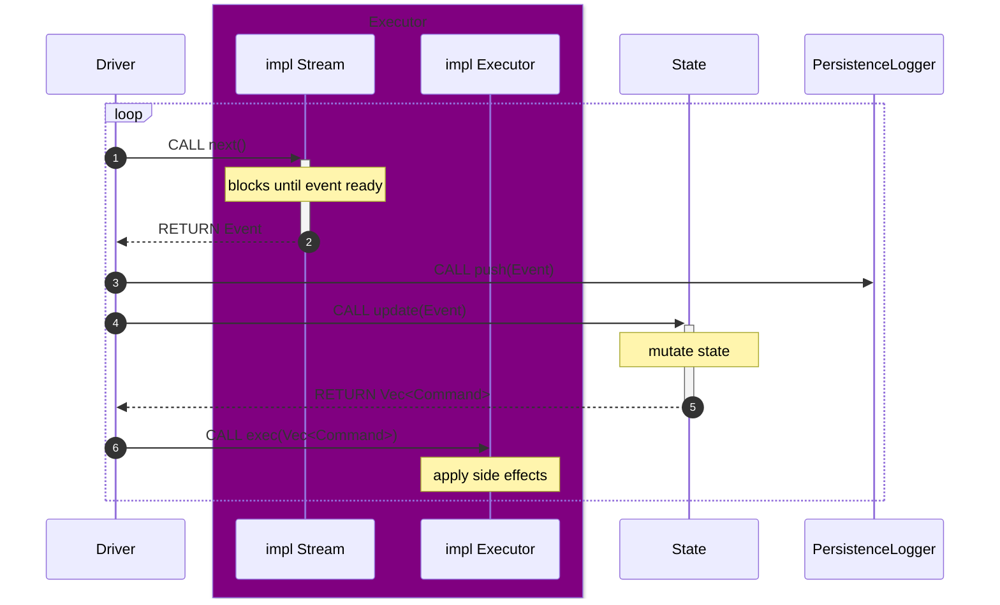

# [category-labs/monad-bft](https://github.com/category-labs/monad-bft)

# Monad BFT

![Nightly Tests][tests-badge]

## Overview

This repository contains implementation for the Monad consensus client and JsonRpc server. Monad consensus collects transactions and produces blocks which are written to a ledger filestream. These blocks are consumed by Monad execution, which then updates the state of the blockchain. The [triedb](monad-triedb/README.md) is a database which stores block information and the blockchain state.

## Getting Started

```sh
git submodule update --init --recursive
```

### Using Docker

The most straightforward way to start a consensus client + an execution client + a JsonRpc server. Run the following:
1. `cd docker/single-node`
2. `nets/run.sh`

### Using Cargo

To run a Monad consensus client, follow instructions [here](monad-node/README.md).
 
To run a JsonRpc server, follow instructions [here](monad-rpc/README.md).

## Architecture



[tests-badge]: https://github.com/monad-crypto/monad-bft/actions/workflows/randomized.yml/badge.svg?branch=master
