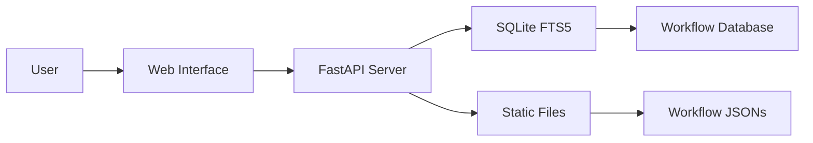

# [Zie619/n8n-workflows](https://github.com/Zie619/n8n-workflows)

# 🚀 n8n Workflow Collection

<div align="center">


[](https://www.buymeacoffee.com/zie619)

### 🌟 The Ultimate Collection of n8n Automation Workflows

**[🔍 Browse Online](https://zie619.github.io/n8n-workflows)** • **[📚 Documentation](#documentation)** • **[🤝 Contributing](#contributing)** • **[📄 License](#license)**

</div>

---

## ✨ What's New

### 🎉 Latest Updates (November 2025)
- **🔒 Enhanced Security**: Full security audit completed, all CVEs resolved
- **🐳 Docker Support**: Multi-platform builds for linux/amd64 and linux/arm64
- **📊 GitHub Pages**: Live searchable interface at [zie619.github.io/n8n-workflows](https://zie619.github.io/n8n-workflows)
- **⚡ Performance**: 100x faster search with SQLite FTS5 integration
- **🎨 Modern UI**: Completely redesigned interface with dark/light mode

---

## 🌐 Quick Access

### 🔥 Use Online (No Installation)
Visit **[zie619.github.io/n8n-workflows](https://zie619.github.io/n8n-workflows)** for instant access to:
- 🔍 **Smart Search** - Find workflows instantly
- 📂 **15+ Categories** - Browse by use case
- 📱 **Mobile Ready** - Works on any device
- ⬇️ **Direct Downloads** - Get workflow JSONs instantly

---

## 🚀 Features

<table>
<tr>
<td width="50%">

### 📊 By The Numbers
- **4,343** Production-Ready Workflows
- **365** Unique Integrations
- **29,445** Total Nodes
- **15** Organized Categories
- **100%** Import Success Rate

</td>
<td width="50%">

### ⚡ Performance
- **< 100ms** Search Response
- **< 50MB** Memory Usage
- **700x** Smaller Than v1
- **10x** Faster Load Times
- **40x** Less RAM Usage

</td>
</tr>
</table>

---

## 💻 Local Installation

### Prerequisites
- Python 3.9+
- pip (Python package manager)
- 100MB free disk space

### Quick Start
```bash
# Clone the repository
git clone https://github.com/Zie619/n8n-workflows.git
cd n8n-workflows

# Install dependencies
pip install -r requirements.txt

# Start the server
python run.py

# Open in browser
# http://localhost:8000
```

### 🐳 Docker Installation
```bash
# Using Docker Hub
docker run -p 8000:8000 zie619/n8n-workflows:latest

# Or build locally
docker build -t n8n-workflows .
docker run -p 8000:8000 n8n-workflows
```

---

## 📚 Documentation

### API Endpoints

| Endpoint | Method | Description |
|----------|--------|-------------|
| `/` | GET | Web interface |
| `/api/search` | GET | Search workflows |
| `/api/stats` | GET | Repository statistics |
| `/api/workflow/{id}` | GET | Get workflow JSON |
| `/api/categories` | GET | List all categories |
| `/api/export` | GET | Export workflows |

### Search Features
- **Full-text search** across names, descriptions, and nodes
- **Category filtering** (Marketing, Sales, DevOps, etc.)
- **Complexity filtering** (Low, Medium, High)
- **Trigger type filtering** (Webhook, Schedule, Manual, etc.)
- **Service filtering** (365+ integrations)

---

## 🏗️ Architecture



### Tech Stack
- **Backend**: Python, FastAPI, SQLite with FTS5
- **Frontend**: Vanilla JS, Tailwind CSS
- **Database**: SQLite with Full-Text Search
- **Deployment**: Docker, GitHub Actions, GitHub Pages
- **Security**: Trivy scanning, CORS protection, Input validation

---

## 📂 Repository Structure

```
n8n-workflows/
├── workflows/           # 4,343 workflow JSON files
│   └── [category]/     # Organized by integration
├── docs/               # GitHub Pages site
├── src/                # Python source code
├── scripts/            # Utility scripts
├── api_server.py       # FastAPI application
├── run.py              # Server launcher
├── workflow_db.py      # Database manager
└── requirements.txt    # Python dependencies
```

---

## 🤝 Contributing

We love contributions! Here's how you can help:

### Ways to Contribute
- 🐛 **Report bugs** via [Issues](https://github.com/Zie619/n8n-workflows/issues)
- 💡 **Suggest features** in [Discussions](https://github.com/Zie619/n8n-workflows/discussions)
- 📝 **Improve documentation**
- 🔧 **Submit workflow fixes**
- ⭐ **Star the repository**

### Development Setup
```bash
# Fork and clone
git clone https://github.com/YOUR_USERNAME/n8n-workflows.git

# Create branch
git checkout -b feature/amazing-feature

# Make changes and test
python run.py --debug

# Commit and push
git add .
git commit -m "feat: add amazing feature"
git push origin feature/amazing-feature

# Open PR
```

---

## 🔒 Security

### Security Features
- ✅ **Path traversal protection**
- ✅ **Input validation & sanitization**
- ✅ **CORS protection**
- ✅ **Rate limiting**
- ✅ **Docker security hardening**
- ✅ **Non-root container user**
- ✅ **Regular security scanning**

### Reporting Security Issues
Please report security vulnerabilities to the maintainers via [Security Advisory](https://github.com/Zie619/n8n-workflows/security/advisories/new).

---

## 📄 License

This project is licensed under the MIT License - see the [LICENSE](LICENSE) file for details.

```
MIT License

Copyright (c) 2025 Zie619

Permission is hereby granted, free of charge, to any person obtaining a copy
of this software and associated documentation files (the "Software"), to deal
in the Software without restriction...
```

---

## 💖 Support

If you find this project helpful, please consider:

<div align="center">

[](https://www.buymeacoffee.com/zie619)
[](https://github.com/Zie619/n8n-workflows)
[](https://twitter.com/zie619)

</div>

---

## 📊 Stats & Badges

<div align="center">


</div>

---

## 🙏 Acknowledgments

- **n8n** - For creating an amazing automation platform
- **Contributors** - Everyone who has helped improve this collection
- **Community** - For feedback and support
- **You** - For using and supporting this project!

---

<div align="center">

### ⭐ Star us on GitHub — it motivates us a lot!

Made with ❤️ by [Zie619](https://github.com/Zie619) and [contributors](https://github.com/Zie619/n8n-workflows/graphs/contributors)

</div>