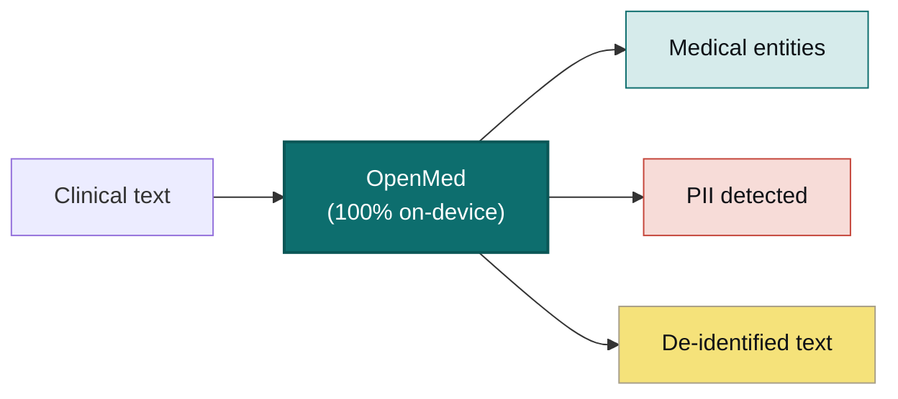

# [maziyarpanahi/openmed](https://github.com/maziyarpanahi/openmed)

<div align="center">


<h3>Local-first healthcare AI that never leaves the device</h3>

<p><b>Turn clinical text into structured insight with one line of code.</b><br/>
Entity extraction, PII de-identification, and 1,000+ specialized medical models that run entirely on
your own hardware — from a one-liner in Python to a native Swift app on iPhone, powered by Apple MLX.
No cloud. No vendor lock-in. No patient data leaving your network.</p>

<p>
  <a href="https://pypi.org/project/openmed/"></a>
  <a href="https://www.python.org/downloads/"></a>
  <a href="https://huggingface.co/OpenMed"></a>
  <a href="https://arxiv.org/abs/2508.01630"></a>
  <a href="LICENSE"></a>
  <a href="https://github.com/maziyarpanahi/openmed/stargazers"></a>
</p>

<p>
  <a href="swift/OpenMedKit"></a>
  <a href="docs/mlx-backend.md"></a>
  <a href="docs/swift-openmedkit.md"></a>
  <a href="https://openmed.life/docs"></a>
</p>

<p>
  <b>1,000+ models</b> &nbsp;·&nbsp; <b>12 languages</b> &nbsp;·&nbsp; <b>247 PII checkpoints</b> &nbsp;·&nbsp; <b>100% on-device</b> &nbsp;·&nbsp; <b>Apache-2.0</b>
</p>

<p>
  <b>English</b> ·
  <a href="README.zh-CN.md">简体中文</a> ·
  <a href="README.es.md">Español</a> ·
  <a href="README.fr.md">Français</a> ·
  <a href="README.de.md">Deutsch</a> ·
  <a href="README.it.md">Italiano</a> ·
  <a href="README.pt.md">Português</a> ·
  <a href="README.nl.md">Nederlands</a> ·
  <a href="README.ar.md">العربية</a> ·
  <a href="README.hi.md">हिन्दी</a> ·
  <a href="README.te.md">తెలుగు</a> ·
  <a href="README.ja.md">日本語</a> ·
  <a href="README.tr.md">Türkçe</a> ·
  <a href="README.fa.md">فارسی</a>
</p>

</div>

---

## See it in action

OpenMed runs **entirely on the device** — clinical text never leaves it. Here it is on iPhone, fully offline:

<div align="center">
  
  <br/>
  <sub><b>On iPhone via <a href="swift/OpenMedKit">OpenMedKit</a></b> — scan a clinical note, de-identify it, and extract clinical signals, all locally with Apple MLX. Nothing is uploaded.</sub>
</div>

<br/>

<div align="center">
  
  <br/>
  <sub><b>Real-time PII de-identification</b> — the Nemotron Privacy Filter redacting names, addresses, IDs, and billing data from a clinical discharge packet, entirely on-device. <i>(All values shown are synthetic.)</i></sub>
</div>

---

## 30-second example

```python
from openmed import analyze_text

result = analyze_text(
    "Patient started on imatinib for chronic myeloid leukemia.",
    model_name="disease_detection_superclinical",
)

for entity in result.entities:
    print(f"{entity.label:<12} {entity.text:<28} {entity.confidence:.2f}")
# DISEASE      chronic myeloid leukemia     0.98
# DRUG         imatinib                     0.95
```

A state-of-the-art clinical NER model running locally — no API key, no network call.

---

## Why OpenMed?

|                                       |       **OpenMed**        |   Cloud medical APIs   |
| ------------------------------------- | :----------------------: | :--------------------: |
| Runs on your device / servers         |            ✅            |           ❌           |
| Patient data leaves your network      |        **Never**         |   Sent to the vendor   |
| Cost                                  |    Free & open-source    |    Per-call pricing    |
| Specialized medical models            |          1,000+          |        Limited         |
| Languages                             |           12+            |         Varies         |
| Offline / air-gapped                  |            ✅            |           ❌           |
| Apple Silicon (MLX) acceleration      |            ✅            |          n/a           |
| Native iOS / macOS apps               |   ✅ via OpenMedKit      |           ❌           |
| Vendor lock-in                        |    None — Apache-2.0     |          Yes           |

- **Specialized models** — 1,000+ curated biomedical & clinical models, many outperforming proprietary stacks.
- **HIPAA-aware de-identification** — all 18 Safe Harbor identifiers, smart entity merging, format-preserving fakes.
- **Runs everywhere** — CPU, CUDA, Apple Silicon (MLX), and natively in iOS/macOS apps via OpenMedKit.
- **One-line deployment** — Python API, Dockerized REST service, or batch pipelines.
- **Zero lock-in** — Apache-2.0, your infrastructure, your data.

---

## On-device on Apple — Swift, MLX & iOS

OpenMed is built to run where your data already lives. On Apple hardware it accelerates with **MLX**,
and it ships straight into iPhone, iPad, and Mac apps through **[OpenMedKit](swift/OpenMedKit)** — so
PII detection and clinical extraction happen fully offline, on the device.

```swift
// Add OpenMedKit to your app
dependencies: [
    .package(url: "https://github.com/maziyarpanahi/openmed.git", from: "1.5.5"),
]
```

- **MLX runtime** for PII token classification, the Privacy Filter family, and experimental GLiNER-family zero-shot tasks — with a CoreML fallback path.
- **One model name, every platform** — MLX model names automatically fall back to the matching PyTorch checkpoint on non-Apple hardware.
- **Python on Apple Silicon** too: `pip install "openmed[mlx]"`.

Guides: [MLX backend](docs/mlx-backend.md) · [OpenMedKit (Swift)](docs/swift-openmedkit.md) · [CoreML export](docs/coreml-export.md)

<div align="center">
  
  <br/>
  <sub><b>MLX on Apple Silicon: 24–33× faster than CPU PyTorch</b> for the Privacy Filter — median latency per inference step, lower is better.</sub>
</div>

---

## How it works



---

## Quick start

```bash
# Core + Hugging Face runtime (Linux, macOS, Windows; CPU or CUDA)
pip install "openmed[hf]"

# Add the REST service
pip install "openmed[hf,service]"

# Apple Silicon acceleration (MLX)
pip install "openmed[mlx]"
```

<table>
<tr>
<td width="33%" valign="top">

**Python API**

```python
from openmed import analyze_text

analyze_text(
  "Patient received 75mg "
  "clopidogrel for NSTEMI.",
  model_name=
  "pharma_detection_superclinical",
)
```

</td>
<td width="33%" valign="top">

**REST service**

```bash
uvicorn openmed.service.app:app \
  --host 0.0.0.0 --port 8080
```

`GET /health`
`POST /analyze`
`POST /pii/extract`
`POST /pii/deidentify`

</td>
<td width="33%" valign="top">

**Batch**

```python
from openmed import BatchProcessor

p = BatchProcessor(
  model_name=
  "disease_detection_superclinical",
  group_entities=True,
)
p.process_texts([...])
```

</td>
</tr>
</table>

**Offline / air-gapped?** Point `model_name` (or `model_id`) at a local directory and OpenMed loads it without contacting the Hugging Face Hub:

```python
from openmed import OpenMedConfig, analyze_text

result = analyze_text(
    "Patient presents with chronic myeloid leukemia and Type 2 diabetes.",
    model_id="./models/OpenMed-NER-DiseaseDetect-SuperClinical-434M",
    config=OpenMedConfig(device="cpu"),
)
```

---

## Models

A curated registry of specialized medical NER models — browse the [full catalog](https://openmed.life/docs/model-registry).

| Model | Specialization | Entity types | Size |
|-------|----------------|--------------|------|
| `disease_detection_superclinical` | Disease & conditions | DISEASE, CONDITION, DIAGNOSIS | 434M |
| `pharma_detection_superclinical`  | Drugs & medications  | DRUG, MEDICATION, TREATMENT   | 434M |
| `pii_superclinical_large`     | PII & de-identification | NAME, DATE, SSN, PHONE, EMAIL, ADDRESS | 434M |
| `anatomy_detection_electramed`    | Anatomy & body parts | ANATOMY, ORGAN, BODY_PART     | 109M |
| `gene_detection_genecorpus`       | Genes & proteins     | GENE, PROTEIN                 | 109M |

---

## Privacy: PII detection & de-identification

```python
from openmed import extract_pii, deidentify

text = "Patient: John Doe, DOB: 01/15/1970, SSN: 123-45-6789"

# Extract PII with smart merging (prevents tokenization fragmentation)
result = extract_pii(text, model_name="pii_superclinical_large", use_smart_merging=True)

# De-identify with the method you need
deidentify(text, method="mask")     # [NAME], [DATE]
deidentify(text, method="replace")  # Faker-backed, locale-aware, format-preserving fakes
deidentify(text, method="hash")     # Cryptographic hashing
deidentify(text, method="shift_dates", date_shift_days=180)
```

- **Smart entity merging** keeps `01/15/1970` whole instead of fragmenting it.
- **Faker-backed obfuscation** with custom clinical-ID providers (CPF, CNPJ, BSN, NIR, Codice Fiscale, NIE, Aadhaar, Steuer-ID, NPI).
- **HIPAA**: all 18 Safe Harbor identifiers, configurable confidence thresholds.
- **Batch PII** (v1.5.5): extract or de-identify across many documents with `BatchProcessor(operation="extract_pii" | "deidentify", batch_size=16)`.

<div align="center">
  
  <br/>
  <sub><b>Batch processing</b> — up to <b>3.3×</b> higher throughput on CPU and <b>2.2×</b> on MLX vs. one document at a time.</sub>
</div>

[Complete PII notebook](examples/notebooks/PII_Detection_Complete_Guide.ipynb) · [Smart merging](docs/pii-smart-merging.md) · [Anonymization](docs/anonymization.md)

<details>
<summary><b>Privacy Filter family</b> — three model families on the OpenAI Privacy Filter architecture</summary>

<br/>

Same model code (gpt-oss-style sparse-MoE transformer with local attention, sink tokens, RoPE+YaRN, tiktoken `o200k_base`), different training data. All route through the **same** `extract_pii()` / `deidentify()` API — only `model_name=` changes.

| Variant | PyTorch (CPU + CUDA) | MLX (Apple Silicon) | MLX 8-bit |
| --- | --- | --- | --- |
| **OpenAI Privacy Filter** | [`openai/privacy-filter`](https://huggingface.co/openai/privacy-filter) | [`OpenMed/privacy-filter-mlx`](https://huggingface.co/OpenMed/privacy-filter-mlx) | [`…-mlx-8bit`](https://huggingface.co/OpenMed/privacy-filter-mlx-8bit) |
| **Nemotron-PII fine-tune** | [`OpenMed/privacy-filter-nemotron`](https://huggingface.co/OpenMed/privacy-filter-nemotron) | [`…-nemotron-mlx`](https://huggingface.co/OpenMed/privacy-filter-nemotron-mlx) | [`…-nemotron-mlx-8bit`](https://huggingface.co/OpenMed/privacy-filter-nemotron-mlx-8bit) |
| **OpenMed Multilingual** | [`OpenMed/privacy-filter-multilingual`](https://huggingface.co/OpenMed/privacy-filter-multilingual) | [`…-multilingual-mlx`](https://huggingface.co/OpenMed/privacy-filter-multilingual-mlx) | [`…-multilingual-mlx-8bit`](https://huggingface.co/OpenMed/privacy-filter-multilingual-mlx-8bit) |

```python
from openmed import extract_pii

text = "Patient Sarah Connor (DOB: 03/15/1985) at MRN 4471882."

extract_pii(text, model_name="openai/privacy-filter")              # PyTorch baseline
extract_pii(text, model_name="OpenMed/privacy-filter-nemotron")    # same code, different weights
extract_pii(text, model_name="OpenMed/privacy-filter-mlx")         # Apple Silicon (MLX)
```

On non-Apple-Silicon hosts, MLX model names are automatically substituted with the matching PyTorch checkpoint (with a one-time warning) — ship one model name, run anywhere. See [Privacy Filter architecture & backend routing](docs/anonymization.md#privacy-filter-family).

</details>

---

## Multilingual PII (12 languages)

Extraction and de-identification across `en`, `fr`, `de`, `it`, `es`, `nl`, `hi`, `te`, `pt`, `ar`, `ja`, and `tr` — **247 PII checkpoints** total.

```bash
python -c "from openmed import extract_pii; print([(e.label, e.text) for e in extract_pii('Dr. Pedro Almeida, CPF: 123.456.789-09, email: pedro@hospital.pt', lang='pt').entities])"
```

<details>
<summary>Show per-language examples (Portuguese, Dutch, Hindi, Arabic, Japanese, Turkish)</summary>

<br/>

```python
from openmed import extract_pii

portuguese = extract_pii("Paciente: Pedro Almeida, CPF: 123.456.789-09, telefone: +351 912 345 678", lang="pt", use_smart_merging=True)
dutch      = extract_pii("Patiënt: Eva de Vries, BSN: 123456782, telefoon: +31 6 12345678", lang="nl", use_smart_merging=True)
hindi      = extract_pii("रोगी: अनीता शर्मा, फोन: +91 9876543210, पता: नई दिल्ली 110001", lang="hi", use_smart_merging=True)
arabic     = extract_pii("المريضة ليلى حسن، الهاتف +20 10 1234 5678، الرقم القومي 29801011234567.", lang="ar", use_smart_merging=True)
japanese   = extract_pii("患者 佐藤 花子、電話 +81 90 1234 5678、マイナンバー 1234 5678 9012.", lang="ja", use_smart_merging=True)
turkish    = extract_pii("Hasta Ayşe Yılmaz, telefon +90 532 123 45 67, TCKN 10000000146.", lang="tr", use_smart_merging=True)

for r in (portuguese, dutch, hindi, arabic, japanese, turkish):
    print([(e.label, e.text) for e in r.entities])
```

</details>

---

## REST API

A Docker-friendly FastAPI service with request validation, shared pipeline preload, and unified error envelopes.

```bash
pip install "openmed[hf,service]"
uvicorn openmed.service.app:app --host 0.0.0.0 --port 8080

# or with Docker
docker build -t openmed:1.5.5 .
docker run --rm -p 8080:8080 -e OPENMED_PROFILE=prod openmed:1.5.5
```

```bash
curl -X POST http://127.0.0.1:8080/pii/extract \
  -H "Content-Type: application/json" \
  -d '{"text":"Paciente: Maria Garcia, DNI: 12345678Z","lang":"es"}'
```

**Model lifecycle (v1.5.5):** free memory on demand with `GET /models/loaded`, `POST /models/unload`, and a `keep_alive` idle window:

```bash
OPENMED_SERVICE_KEEP_ALIVE=10m uvicorn openmed.service.app:app --host 0.0.0.0 --port 8080
curl -X POST http://127.0.0.1:8080/models/unload -H "Content-Type: application/json" -d '{"all":true}'
```

See the full [REST service guide](docs/rest-service.md).

---

## Documentation

Full guides at **[openmed.life/docs](https://openmed.life/docs/)**.

| | | |
|---|---|---|
| [Getting Started](https://openmed.life/docs/) | [Analyze Text](https://openmed.life/docs/analyze-text) | [Model Registry](https://openmed.life/docs/model-registry) |
| [PII Detection Guide](examples/notebooks/PII_Detection_Complete_Guide.ipynb) | [Anonymization](docs/anonymization.md) | [Batch Processing](https://openmed.life/docs/batch-processing) |
| [Configuration Profiles](https://openmed.life/docs/profiles) | [REST Service](docs/rest-service.md) | [MLX Backend](docs/mlx-backend.md) |

---

## Meet the mascot


OpenMed's guardian is a fluffy Persian cat styled as a tiny **Avicenna (Ibn Sina)** — the great Persian
physician whose *Canon of Medicine* was the world's standard medical text for some 600 years. He keeps
watch over the open book of medical knowledge, in a palette built around Persian turquoise (*fīrūza*):
a local-first guardian for your most private data.

<br clear="left"/>

---

## Contributing

Contributions welcome — bug reports, feature requests, and PRs alike.

- [Open an issue](https://github.com/maziyarpanahi/openmed/issues)
- **Translations welcome** — help complete the other-language READMEs linked in the switcher at the top.

---

## Credits

OpenMed builds on excellent open-source work — particular thanks to **OpenAI** (the [Privacy Filter](https://huggingface.co/openai/privacy-filter) architecture), **NVIDIA** (the [Nemotron PII dataset](https://huggingface.co/datasets/nvidia/Nemotron-PII-v1)), **Hugging Face** (`transformers` & the model ecosystem), **Apple** ([MLX](https://github.com/ml-explore/mlx)), and the **[Faker](https://faker.readthedocs.io/)** maintainers.

## License

Released under the [Apache-2.0 License](LICENSE).

## Citation

```bibtex
@misc{panahi2025openmedneropensourcedomainadapted,
      title={OpenMed NER: Open-Source, Domain-Adapted State-of-the-Art Transformers for Biomedical NER Across 12 Public Datasets},
      author={Maziyar Panahi},
      year={2025},
      eprint={2508.01630},
      archivePrefix={arXiv},
      primaryClass={cs.CL},
      url={https://arxiv.org/abs/2508.01630},
}
```

---

## Star History

If OpenMed is useful to you, a star helps others discover it.

<a href="https://star-history.com/#maziyarpanahi/openmed&Date">
  
</a>

---

<div align="center">

Built by the OpenMed team

<a href="https://openmed.life">Website</a> ·
<a href="https://openmed.life/docs">Docs</a> ·
<a href="https://x.com/openmed_ai">X / Twitter</a> ·
<a href="https://www.linkedin.com/company/openmed-ai/">LinkedIn</a>

</div>
