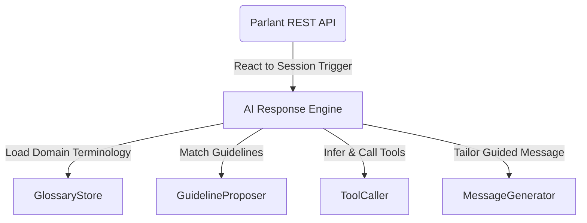

# [emcie-co/parlant](https://github.com/emcie-co/parlant)


<div align="center">

  <h2>Parlant: The Behavior Guidance Framework for Customer-Facing Agents</h2>
  <p>
    <a href="https://www.parlant.io/" target="_blank">Website</a> —
    <a href="https://www.parlant.io/docs/quickstart/introduction" target="_blank">Introduction</a> —
    <a href="https://www.parlant.io/docs/quickstart/installation" target="_blank">Installation</a> —
    <a href="https://www.parlant.io/docs/tutorial/getting_started/overview" target="_blank">Tutorial</a> —
    <a href="https://www.parlant.io/docs/about" target="_blank">About</a>
  </p>
  <p>
    <a href="https://pypi.org/project/parlant/" alt="Parlant on PyPi"></a>
    
    <a href="https://opensource.org/licenses/Apache-2.0"></a>
    
    
    <a href="https://discord.gg/duxWqxKk6J">
</a>
  </p>
</div>

**IMPORTANT NOTE:** Parlant is in active development by a team of (currently) 12 contributors (developers, researchers, and QA) from leading institutions, such as Microsoft, Check Point, and Dynamic Yield. We're looking for more contributors to help get customer-facing agents under control! Please consider joining our Discord server and participating in our development.

## ✨ Take Control of AI Agent Decisions
**Parlant is a framework that transforms how AI agents make decisions in customer-facing scenarios.**

**With Parlant, you can not only spin up and serve an LLM agent in minutes—with a full-fledged & responsive conversation management API—but, more importantly, you can continuously guide and improve its decision making and general behavior, easily and reliably.**

Unlike traditional approaches that rely on prompt engineering or conversational flow charts, Parlant introduces a dynamic control system that ensures agents follow your specific business rules, in the form of behavioral guidelines that you provide, by matching and activating the appropriate combination of guidelines for every specific context.



When an agent needs to respond to a customer, Parlant's engine evaluates the situation, checks relevant guidelines, gathers necessary information through your tools, and continuously re-evaluates its approach based on your guidelines as new information emerges. When it's time to generate a message, Parlant implements self-critique mechanisms to ensure that the agent's responses precisely align with your intended behavior as given by the contextually-matched guidelines.

***📚 More technical docs on the architecture and API are available under [docs/](./docs)***.

## 📦 Quickstart
Parlant comes pre-built with responsive session (conversation) management, a detection mechanism for incoherence and contradictions in guidelines, content-filtering, jailbreak protection, an integrated sandbox UI for behavioral testing, native API clients in Python and TypeScript, and other goodies.

```bash
$ pip install parlant
$ parlant-server
$ # Open the sandbox UI at http://localhost:8800 and play
```


## 🙋‍♂️🙋‍♀️ Who Is Parlant For?
Parlant is the right tool for the job if you're building an LLM-based chat agent, and:

1. 🎯 Your use case places a **high importance on behavioral precision and consistency**, particularly in customer-facing scenarios
1. 🔄 Your agent is expected to undergo **continuous behavioral refinements and changes**, and you need a way to implement those changes efficiently and confidently
1. 📈 You're expected to maintain a **growing set of behavioral guidelines**, and you need to maintain them coherently and with version-tracking
1. 💬 Conversational UX and user-engagmeent is an important concern for your use case, and you want to easily **control the flow and tone of conversations**

## ⭐ Help Us Pick Up Pace!
[](https://star-history.com/#emcie-co/parlant&Date)

## 🤔 What Makes Parlant Different?

In a word: **_Guidance._** 🧭🚦🤝

Parlant's engine revolves around solving one key problem: How can we _reliably guide_ customer-facing agents to behave in alignment with our needs and intentions.

Hence Parlant's fundamentally different approach to agent building: [Managed Guidelines](https://www.parlant.io/docs/concepts/customization/guidelines):

```bash
$ parlant guideline create \
    --agent-id MY_AGENT_ID \
    --condition "the customer wants to return an item" \
    --action "get the order number and item name and then help them return it"
```

By giving structure to behavioral guidelines, and _granularizing_ guidelines (i.e. making each behavioral guideline a first-class entity in the engine), Parlant's engine is able to offer unprecedented control, quality, and efficiency in building LLM-based agents:

1. 🛡️ **Reliability:** Running focused self-critique in real-time, per guideline, to ensure it is actually followed
1. 💡 **Explainability:** Providing feedback around its interpretation of guidelines in each real-life context, which helps in troubleshooting and improvement
1. 🔧 **Maintainability:** Helping you maintain a coherent set of guidelines by detecting and alerting you to possible contradictions (gross or subtle) in your instructions

## 🚀 Real-world impact

[Revenued](https://www.revenued.com), a business capital provider, uses Parlant for their Sales Copilot. They leverage Parlant's structured CLI to modify the agent's behavior quickly and easily based on feedback from company stakeholders.

## 💪 Key benefits

### Control that actually works
* **Guidelines**: Control responses by writing contextual rules - like "offer limited time coupons if it's a holiday" or "make it very clear we don't offer loans if a customer asks about it". By using condition/action definitions, you define exactly when and how your agent should respond
* **Glossary**: Teach your agent your business-specific terminology so that both you and your customers can speak to it naturally in your language
* **Coherence checks**: Catch conflicts by having Parlant evaluate new guidelines against existing ones before they're applied
* **Dynamic context**: Make your agent context-aware by setting user-specific variables like customer account or subscription tier. These shape how your agent responds to each user
* **Guided tool use**: Control API access by linking tools to specific guidelines. This way, your agent only calls APIs when appropriate and with clear intent

### Developer friendly
* **See changes instantly**: Modify behavior on the fly by updating guidelines directly, no retraining or redeployment needed
* **Track changes in Git**: Manage agent behavior like code by storing configuration as JSON in your repo. Review, rollback, branch, and merge just like any other code
* **Clean architecture**: Separate concerns by keeping business logic in tools and conversation patterns in guidelines. Each piece does what it does best
* **Type safety**: Build rapidly using native TypeScript/JavaScript SDKs with proper type definitions

### Deploy with confidence
* **Reliable at scale**: Parlant filters and selects guidelines per context, allowing you to scale your agent's complexity and use-cases while maintaining consistent, focused behavior
* **Debug with ease**: Troubleshoot effectively by tracing which guidelines were applied and why for any given response
* **Test before deploy**: Validate changes using the built-in chat UI to test new behaviors before they reach customers

## 🤖 Works with all major LLM providers
- [OpenAI](https://platform.openai.com/docs/overview) (also via [Azure](https://learn.microsoft.com/en-us/azure/ai-services/openai/))
- [Gemini](https://ai.google.dev/)
- [Meta Llama 3](https://www.llama.com/) (via [Together AI](https://www.together.ai/) or [Cerebras](https://cerebras.ai/))
- [Anthropic](https://www.anthropic.com/api) (also via [AWS Bedrock](https://aws.amazon.com/bedrock/))

## 📚 Learning Parlant

To start learning and building with Parlant, visit our [documentation portal](https://parlant.io/docs/quickstart/introduction).

Need help? Ask us anything on [Discord](https://discord.gg/duxWqxKk6J). We're happy to answer questions and help you get up and running!

## 💻 Usage Example
Adding a guideline for an agent—for example, to ask a counter-question to get more info when a customer asks a question:
```bash
parlant guideline create \
    --agent-id CUSTOMER_SUCCESS_AGENT_ID \
    --condition "a free-tier customer is asking how to use our product" \
    --action "first seek to understand what they're trying to achieve"
```

In Parlant, Customer-Agent interaction happens asynchronously, to enable more natural customer interactions, rather than forcing a strict and unnatural request-reply mode.

Here's a basic example of a simple client (using the TypeScript client SDK):

```typescript
import { ParlantClient } from 'parlant-client';

const client = ParlantClient({ environment: SERVER_ADDRESS });

session_id = "...";

// Post customer message
const customerEvent = await client.sessions.createEvent(session_id, {
   kind: "message",
   source: "customer",
   message: "How do you use this product?",
});

// Wait for and get the agent's reply
const [agentEvent] = (await client.sessions.listEvents(session_id, {
   kinds: "message",
   source: "ai_agent",
   minOffset: customerEvent.offset,
   waitForData: 60 // Wait up to 60 seconds for an answer
}));

// Print the agent's reply
const { agentMessage } = agentEvent.data as { message: string };
console.log(agentMessage);

// Inspect the details of the message generation process
const { trace } = await client.sessions.inspectEvent(
   session_id,
   agentEvent.id
);
```

## 👋 Contributing
We use the Linux-standard Developer Certificate of Origin ([DCO.md](DCO.md)), so that, by contributing, you confirm that you have the rights to submit your contribution under the Apache 2.0 license (i.e., the code you're contributing is truly yours to share with the project).

Please consult [CONTRIBUTING.md](CONTRIBUTING.md) for more details.

Can't wait to get involved? Join us on [Discord](https://discord.gg/duxWqxKk6J) and let's discuss how you can help shape Parlant. We're excited to work with contributors directly while we set up our formal processes!

Otherwise, feel free to start a discussion or open an issue here on GitHub—freestyle 😎.
