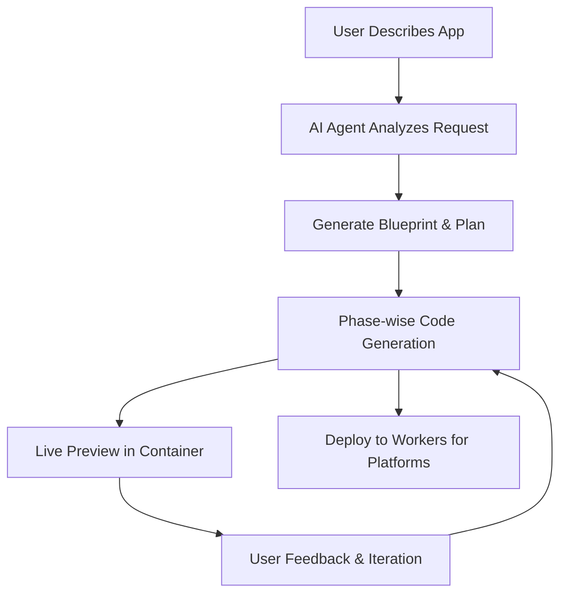

# [cloudflare/vibesdk](https://github.com/cloudflare/vibesdk)

# 🧡 Cloudflare Vibe SDK

> **An open source full-stack AI webapp generator** – Deploy your own instance of Cloudflare VibeSDK, an AI vibe coding platform that you can run and customize yourself.

<div align="center">


## 🚀 Live Demo

**[build.cloudflare.dev](https://build.cloudflare.dev)**

*Explore VibeSDK Build before deploying your own stack.*

[](https://deploy.workers.cloudflare.com/?url=https://github.com/cloudflare/vibesdk)

**👆 Click to deploy your own instance!**

*Follow the setup guide below to configure required services*

</div>

## Star History

[](https://www.star-history.com/#cloudflare/vibesdk&Date)

---

## ✨ What is Cloudflare VibeSDK?

Cloudflare VibeSDK is an open source AI vibe coding platform built on Cloudflare's developer platform. If you're building an AI-powered platform for building applications, this is a great example that you can deploy and customize to build the whole platform yourself. Once the platform is deployed, users can say what they want to build in natural language, and the AI agent will create and deploy the application. 

**🌐 [Experience it live at build.cloudflare.dev](https://build.cloudflare.dev)** – Try it out before deploying your own instance!

## 🎯 Perfect For

### Companies building AI-powered platforms
Run your own solution that allows users to build applications in natural language. Customize the AI behavior, control the generated code patterns, integrate your own component libraries, and keep all customer data within your infrastructure. Perfect for startups wanting to enter the AI development space or established companies adding AI capabilities to their existing developer tools.  

### Internal development
Enable non-technical teams to create the tools they need without waiting for engineering resources. Marketing can build landing pages, sales can create custom dashboards, and operations can automate workflows, all by describing what they want. 

### SaaS platforms 
Let your customers extend your product's functionality without learning your API or writing code. They can describe custom integrations, build specialized workflows, or create tailored interfaces specific to their business needs. 

---

### 🎯 Key Features

🤖 **AI Code Generation** – Phase-wise development with intelligent error correction  
⚡ **Live Previews** – App previews running in sandboxed containers  
💬 **Interactive Chat** – Guide development through natural conversation  
📱 **Modern Stack** – Generates React + TypeScript + Tailwind apps  
🚀 **One-Click Deploy** – Deploy generated apps to Workers for Platforms  
📦 **GitHub Integration** – Export code directly to your repositories  

### 🏗️ Built on Cloudflare's Platform

Cloudflare VibeSDK Build utilizes the full Cloudflare developer ecosystem:

- **Frontend**: React + Vite with modern UI components
- **Backend**: Workers with Durable Objects for AI agents  
- **Database**: D1 (SQLite) with Drizzle ORM
- **AI**: Multiple LLM providers via AI Gateway
- **Containers**: Sandboxed app previews and execution
- **Storage**: R2 buckets for templates, KV for sessions
- **Deployment**: Workers for Platforms with dispatch namespaces

## 📋 Quick Deploy Checklist

Before clicking "Deploy to Cloudflare", have these ready:

### ✅ Prerequisites
- Cloudflare Workers Paid Plan
- Workers for Platforms subscription
- Advanced Certificate Manager (needed when you map a first-level subdomain such as `abc.xyz.com` so Cloudflare can issue the required wildcard certificate for preview apps on `*.abc.xyz.com`)

### 🔑 Required API Key
- **Google Gemini API Key** - Get from [ai.google.dev](https://ai.google.dev)

Once you click "Deploy to Cloudflare", you'll be taken to your Cloudflare dashboard where you can configure your VibeSDK deployment with these variables. 

[](https://deploy.workers.cloudflare.com/?url=https://github.com/cloudflare/vibesdk)

### 🔑 What you'll configure

- `GOOGLE_AI_STUDIO_API_KEY` - Your Google Gemini API key for Gemini models
- `JWT_SECRET` - Secure random string for session management
- `WEBHOOK_SECRET` - Webhook authentication secret
- `SECRETS_ENCRYPTION_KEY` - Encryption key for secrets
- `SANDBOX_INSTANCE_TYPE` - Container performance tier (optional, see section below)
- `ALLOWED_EMAIL` - Email address of the user allowed to use the app. This is used to verify the user's identity and prevent unauthorized access.
- `CUSTOM_DOMAIN` - Custom domain for your app that you have configured in Cloudflare (**Required**). If you use a first-level subdomain such as `abc.xyz.com`, make sure the Advanced Certificate Manager add-on is active on that zone.

### Custom domain DNS setup

To serve preview apps correctly, add the following DNS record in the zone that hosts `CUSTOM_DOMAIN`:

- Type: `CNAME`
- Name: `*.abc`
- Target: `abc.xyz.com` (replace with your base custom domain or another appropriate origin)
- Proxy status: **Proxied** (orange cloud)

Adjust the placeholder `abc`/`xyz` parts to match your domain. DNS propagation can take time—expect it to take up to an hour before previews resolve. This step may be automated in a future release, but it is required today.

### 🏗️ Sandbox Instance Configuration (Optional)

VibeSDK uses Cloudflare Containers to run generated applications in isolated environments. You can configure the container performance tier based on your needs and Cloudflare plan.

#### Available Instance Types

> **📢 Updated Oct 2025**: Cloudflare now offers [larger container instance types](https://developers.cloudflare.com/changelog/2025-10-01-new-container-instance-types/) with more resources!

| Instance Type | Memory | CPU | Disk | Use Case | Availability |
|---------------|--------|-----|------|----------|--------------|
| `lite` (alias: `dev`) | 256 MiB | 1/16 vCPU | 2 GB | Development/testing | All plans |
| `standard-1` (alias: `standard`) | 4 GiB | 1/2 vCPU | 8 GB | Light production apps | All plans |
| `standard-2` | 8 GiB | 1 vCPU | 12 GB | Medium workloads | All plans |
| `standard-3` | 12 GiB | 2 vCPU | 16 GB | Production apps | All plans (**Default**) |
| `standard-4` | 12 GiB | 4 vCPU | 20 GB | High-performance apps | All plans |

#### Configuration Options

**Option A: Via Deploy Button (Recommended)**
During the "Deploy to Cloudflare" flow, you can set the instance type as a **build variable**:
- Variable name: `SANDBOX_INSTANCE_TYPE`
- Recommended values:
  - **Standard/Paid users**: `standard-3` (default, best balance)
  - **High-performance needs**: `standard-4`

**Option B: Via Environment Variable**
For local deployment or CI/CD, set the environment variable:
```bash
export SANDBOX_INSTANCE_TYPE=standard-3  # or standard-4, standard-2, standard-1, lite
bun run deploy
```

#### Instance Type Selection Guide

**For All Users:**
- **`standard-3`** (Recommended) - Best balance for production apps with 2 vCPU and 12 GiB memory
- **`standard-4`** - Maximum performance with 4 vCPU for compute-intensive applications

#### What This Affects

The `SANDBOX_INSTANCE_TYPE` controls:
- **App Preview Performance** - How fast generated applications run during development
- **Build Process Speed** - Container compile and build times
- **Concurrent App Capacity** - How many apps can run simultaneously
- **Resource Availability** - Memory and disk space for complex applications

> **💡 Pro Tip**: Start with `standard-3` (the new default) for the best balance of performance and resources. Upgrade to `standard-4` if you need maximum CPU performance for compute-intensive applications.

### 🔗 Post-Deployment: OAuth Setup (Optional)

OAuth configuration is **not** shown on the initial deploy page. If you want user login features, you'll need to set this up after deployment:

**How to Add OAuth After Deployment:**
1. **Find your repository** in your GitHub/GitLab account (created by "Deploy to Cloudflare" flow) 
2. **Clone locally** and run `bun install`
3. **Create `.dev.vars` and `.prod.vars` files** (see below for OAuth configuration)
4. **Run `bun run deploy`** to update your deployment

**Google OAuth Setup:**
1. [Google Cloud Console](https://console.cloud.google.com) → Create Project
2. Enable **Google+ API** 
3. Create **OAuth 2.0 Client ID**
4. Add authorized origins: `https://your-custom-domain.`
5. Add redirect URI: `https://your-worker-name.workers.dev/api/auth/callback/google`
6. Add to **both** `.dev.vars` (for local development) and `.prod.vars` (for deployment):
   ```bash
   GOOGLE_CLIENT_ID="your-google-client-id"
   GOOGLE_CLIENT_SECRET="your-google-client-secret"
   ```

**GitHub OAuth Setup:**
1. GitHub → **Settings** → **Developer settings** → **OAuth Apps**
2. Click **New OAuth App**
3. Application name: `Cloudflare VibeSDK`
4. Homepage URL: `https://your-worker-name.workers.dev`
5. Authorization callback URL: `https://your-worker-name.workers.dev/api/auth/callback/github`
6. Add to **both** `.dev.vars` (for local development) and `.prod.vars` (for deployment):
   ```bash
   GITHUB_CLIENT_ID="your-github-client-id"
   GITHUB_CLIENT_SECRET="your-github-client-secret"
   ```

**GitHub Export OAuth Setup:**
1. Create a separate GitHub OAuth app (e.g., `VibeSDK Export`)—do not reuse the login app above.
2. Authorization callback URL: `https://your-worker-name.workers.dev/api/github-exporter/callback` (or your custom domain equivalent).
3. Add to **both** `.dev.vars` and `.prod.vars`:
   ```bash
   GITHUB_EXPORTER_CLIENT_ID="your-export-client-id"
   GITHUB_EXPORTER_CLIENT_SECRET="your-export-client-secret"
   ```
4. Redeploy or restart local development so the new variables take effect.


---
## 🎨 How It Works



### How It Works

1. **🧠 AI Analysis**: Language models process your description
2. **📋 Blueprint Creation**: System architecture and file structure planned
3. **⚡ Phase Generation**: Code generated incrementally with dependency management
4. **🔍 Quality Assurance**: Automated linting, type checking, and error correction
5. **📱 Live Preview**: App execution in isolated Cloudflare Containers
6. **🔄 Real-time Iteration**: Chat interface enables continuous refinements
7. **🚀 One-Click Deploy**: Generated apps deploy to Workers for Platforms

## 💡 Try These Example Prompts

Want to see these prompts in action? **[Visit the live demo at build.cloudflare.dev](https://build.cloudflare.dev)** first, then try them on your own instance once deployed:

**🎮 Fun Apps**
> "Create a todo list with drag and drop and dark mode"

> "Build a simple drawing app with different brush sizes and colors"

> "Make a memory card game with emojis"

**📊 Productivity Apps**  
> "Create an expense tracker with charts and categories"

> "Build a pomodoro timer with task management"

> "Make a habit tracker with streak counters"

**🎨 Creative Tools**
> "Build a color palette generator from images"

> "Create a markdown editor with live preview"  

> "Make a meme generator with text overlays"

**🛠️ Utility Apps**
> "Create a QR code generator and scanner"

> "Build a password generator with custom options"

> "Make a URL shortener with click analytics"

---

## 🌍 Architecture Deep Dive

### Durable Objects for Stateful AI Agents
```typescript
class CodeGeneratorAgent extends DurableObject {
  async generateCode(prompt: string) {
    // Persistent state across WebSocket connections
    // Phase-wise generation with error recovery
    // Real-time progress streaming to frontend
  }
}
```

### Workers for Platforms Deployment
```javascript
// Generated apps deployed to dispatch namespace
export default {
  async fetch(request, env) {
    const appId = extractAppId(request);
    const userApp = env.DISPATCHER.get(appId);
    return await userApp.fetch(request);
  }
};
```

### Iteration-based Code Generation
Cloudflare VibeSDK generates apps in intelligent phases:

1. **Planning Phase**: Analyzes requirements, creates file structure
2. **Foundation Phase**: Generates package.json, basic setup files  
3. **Core Phase**: Creates main components and logic
4. **Styling Phase**: Adds CSS and visual design
5. **Integration Phase**: Connects APIs and external services
6. **Optimization Phase**: Performance improvements and error fixes

---

## After Deployment

- The "Deploy to Cloudflare" button provisions the worker and also creates a GitHub repository in your account. Clone that repository to work locally.
- Pushes to the `main` branch trigger automatic deployments; CI/CD is already wired up for you.
- For a manual deployment, copy `.dev.vars.example` to `.prod.vars`, fill in production-only secrets, and run `bun run deploy`. The deploy script reads from `.prod.vars`.

DNS updates made during setup, including the wildcard CNAME record described above, can take a while to propagate. Wait until the record resolves before testing preview apps.

---

## 🏠 Local Development

### Quick Setup

You can run VibeSDK locally by following these steps:

```bash
# Clone the repository
git clone https://github.com/cloudflare/vibesdk.git
cd vibesdk

# Install dependencies
npm install  # or: bun install, yarn install, pnpm install

# Run automated setup
npm run setup  # or: bun run setup
```

The setup script will guide you through:
- Installing Bun for better performance
- Configuring Cloudflare credentials and resources
- Setting up AI providers and OAuth
- Creating development and production environments
- Database setup and migrations
- Template deployment

**[📖 Complete Setup Guide](docs/setup.md)** - Detailed setup instructions and troubleshooting

### Development Server

After setup, start the development server:

#### Required for Manual Deployment

If you're deploying manually using `bun run deploy`, you **must** set these environment variables:

**Cloudflare API Token & Account ID:**

1. **Get your Account ID**:
   - Go to [Cloudflare Dashboard -> Workers and Pages](https://dash.cloudflare.com/?to=/:account/workers-and-pages)
   - Copy your Account ID from the right sidebar or URL

2. **Create an API Token**:
   - Go to [Cloudflare Dashboard -> API Tokens](https://dash.cloudflare.com/?to=/:account/api-tokens)
   - Click "Create Token" → Use custom token
   - Configure with these **minimum required permissions**:
     - **Account** → **Containers** → **Edit**
     - **Account** → **Secrets Store** → **Edit**
     - **Account** → **D1** → **Edit**
     - **Account** → **Workers R2 Storage** → **Edit**
     - **Account** → **Workers KV Storage** → **Edit**
     - **Account** → **Workers Scripts** → **Edit**
     - **Account** → **Account Settings** → **Read**
     - **Zone** → **Workers Routes** → **Edit**
   - Under "Zone Resources": Select "All zones from an account" → Choose your account
   - Click "Continue to summary" → "Create Token"
   - Copy the token immediately (you won't see it again)

3. **Set the environment variables**:
   ```bash
   export CLOUDFLARE_API_TOKEN="your-api-token-here"
   export CLOUDFLARE_ACCOUNT_ID="your-account-id-here"
   ```

> **Note**: These credentials are automatically provided when using the "Deploy to Cloudflare" button, but are required for manual `bun run deploy`.

**For Local Development (.dev.vars):**
```bash
bun run dev
```

Visit `http://localhost:5173` to access VibSDK locally.

**For Production Deployment (.prod.vars):**
```bash
cp .dev.vars.example .prod.vars
# Edit .prod.vars with your production API keys and tokens
```

### Production Deployment

Deploy to Cloudflare Workers:

```bash
bun run deploy  # Builds and deploys automatically (includes remote DB migration)
```

---

### Manually Deploying the Platform

#### For Local Development (.dev.vars)
1. Copy the example file: `cp .dev.vars.example .dev.vars`
2. Fill in your API keys and tokens
3. Leave optional values as `"default"` if not needed

#### For Production Deployment
1. **Build Variables**: Set in your deployment platform (GitHub Actions, etc.)
2. **Worker Secrets**: Automatically handled by deployment script or set manually:
   ```bash
   wrangler secret put ANTHROPIC_API_KEY
   wrangler secret put OPENAI_API_KEY
   wrangler secret put GOOGLE_AI_STUDIO_API_KEY
   # ... etc
   ```

#### Environment Variable Priority
The deployment system follows this priority order:
1. **Environment Variables** (highest priority)
2. **wrangler.jsonc vars**
3. **Default values** (lowest priority)

Example: If `MAX_SANDBOX_INSTANCES` is set both as an environment variable (`export MAX_SANDBOX_INSTANCES=5`) and in wrangler.jsonc (`"MAX_SANDBOX_INSTANCES": "2"`), the environment variable value (`5`) will be used.

---

## 🔒 Security & Privacy

Cloudflare VibeSDK implements enterprise-grade security:

- 🔐 **Encrypted Secrets**: All API keys stored with Cloudflare encryption
- 🏰 **Sandboxed Execution**: Generated apps run in completely isolated containers
- 🛡️ **Input Validation**: All user inputs sanitized and validated
- 🚨 **Rate Limiting**: Prevents abuse and ensures fair usage
- 🔍 **Content Filtering**: AI-powered detection of inappropriate content
- 📝 **Audit Logs**: Complete tracking of all generation activities

---

## ❓ Troubleshooting

### Common Deploy Issues

**🚫 "Insufficient Permissions" Error**
- Authentication is handled automatically during deployment
- If you see this error, try redeploying - permissions are auto-granted
- Contact Cloudflare support if the issue persists

**🤖 "AI Gateway Authentication Failed"**  
- Confirm AI Gateway is set to **Authenticated** mode
- Verify the authentication token has **Run** permissions
- Check that gateway URL format is correct

**🗄️ "Database Migration Failed"**
- D1 resources may take time to provision automatically
- Wait a few minutes and retry - resource creation is handled automatically
- Check that your account has D1 access enabled

**🔐 "Missing Required Variables"**
- **Worker Secrets**: Verify all required secrets are set: `ANTHROPIC_API_KEY`, `OPENAI_API_KEY`, `GOOGLE_AI_STUDIO_API_KEY`, `JWT_SECRET`
- **AI Gateway Token**: `CLOUDFLARE_AI_GATEWAY_TOKEN` should be set as BOTH build variable and worker secret
- **Environment Variables**: These are automatically loaded from wrangler.jsonc - no manual setup needed
- **Authentication**: API tokens and account IDs are automatically provided by Workers Builds

**🤖 "AI Gateway Not Found"**
- **With AI Gateway Token**: The deployment script should automatically create the gateway. Check that your token has Read, Edit, and **Run** permissions.
- **Without AI Gateway Token**: You must manually create an AI Gateway before deployment:
  1. Go to [AI Gateway Dashboard](https://dash.cloudflare.com/ai/ai-gateway)
  2. Create gateway named `vibesdk-gateway` (or your custom name)
  3. Enable authentication and create a token with **Run** permissions

**🏗️ "Container Instance Type Issues"**
- **Slow app previews**: Try upgrading from `lite`/`standard-1` to `standard-3` (default) or `standard-4` instance type
- **Out of memory errors**: Upgrade to a higher instance type (e.g., from `standard-2` to `standard-3` or `standard-4`) or check for memory leaks in generated apps
- **Build timeouts**: Use `standard-3` or `standard-4` for faster build times with more CPU cores
- **Using legacy types**: The `dev` and `standard` aliases still work but map to `lite` and `standard-1` respectively

### Need Help?

- 📖 Check [Cloudflare Workers Docs](https://developers.cloudflare.com/workers/)
- 💬 Join [Cloudflare Discord](https://discord.gg/cloudflaredev)
- 🐛 Report issues on [GitHub](https://github.com/your-org/cloudflare-vibecoding-starter-kit/issues)

---

## 🤝 Contributing

Want to contribute to Cloudflare VibeSDK? Here's how:

1. **🍴 Fork** via the Deploy button (creates your own instance!)
2. **💻 Develop** new features or improvements  
3. **✅ Test** thoroughly with `bun run test`
4. **📤 Submit** Pull Request to the main repository

---

## 📚 Resources

### 🛠️ **Cloudflare Platform**
- [Workers](https://developers.cloudflare.com/workers/) - Serverless compute platform
- [Durable Objects](https://developers.cloudflare.com/durable-objects/) - Stateful serverless objects
- [D1](https://developers.cloudflare.com/d1/) - SQLite database at the edge
- [R2](https://developers.cloudflare.com/r2/) - Object storage without egress fees
- [AI Gateway](https://developers.cloudflare.com/ai-gateway/) - Unified AI API gateway

### 💬 **Community**  
- [Discord](https://discord.gg/cloudflaredev) - Real-time chat and support
- [Community Forum](https://community.cloudflare.com/) - Technical discussions
- [GitHub Discussions](https://github.com/your-org/cloudflare-vibecoding-starter-kit/discussions) - Feature requests and ideas

### 🎓 **Learning Resources**
- [Workers Learning Path](https://developers.cloudflare.com/learning-paths/workers/) - Master Workers development
- [Full-Stack Guide](https://developers.cloudflare.com/pages/tutorials/build-a-blog-using-nuxt-and-sanity/) - Build complete applications
- [AI Integration](https://developers.cloudflare.com/workers-ai/) - Add AI to your apps

---

## 📄 License

MIT License - see [LICENSE](LICENSE) for details.
