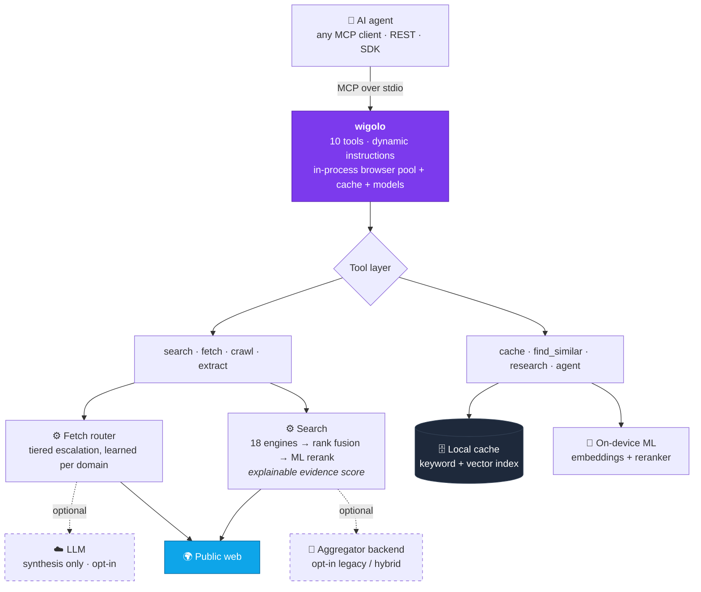

# [KnockOutEZ/wigolo](https://github.com/KnockOutEZ/wigolo)

<div align="center">


Local-first web intelligence for AI agents — **no keys, no cloud, no metered bill.**

<sub>works with&nbsp;&nbsp;**Claude Code · Cursor · Codex · Gemini CLI · VS Code · Windsurf · Zed · Antigravity**</sub>
<br>
<sub>and beyond&nbsp;&nbsp;**LangChain · CrewAI · LlamaIndex · Vercel AI SDK · n8n & self-hosted agents · any MCP client · plain REST**</sub>

[](https://www.npmjs.com/package/wigolo)
[](https://www.npmjs.com/package/wigolo)
[](https://github.com/KnockOutEZ/wigolo/stargazers)
[](https://github.com/KnockOutEZ/wigolo/actions/workflows/ci.yml)
[](https://nodejs.org)
[](https://modelcontextprotocol.io)
[](#license)
[](#beta--feedback)
[](https://x.com/yourtowhid)

<a href="https://trendshift.io/repositories/79424?utm_source=repository-badge&utm_medium=badge&utm_campaign=badge-repository-79424" target="_blank"></a>
<a href="https://trendshift.io/repositories/79424?utm_source=trendshift-badge&utm_medium=badge&utm_campaign=badge-trendshift-79424" target="_blank" rel="noopener noreferrer"></a>

[Quickstart](#quickstart) · [Tools](#tools) · [Why wigolo](#why-its-different) · [Benchmark](#benchmark) · [Docs](docs/README.md) · [Examples](examples/README.md) · [Feedback](#beta--feedback) · [FAQ](#faq)

New features and updates ship steadily. Follow <a href="https://x.com/yourtowhid"><b>@yourtowhid on X</b></a> for all of it and new ways to use wigolo, and reach out there for collaborations or feedback · also on <a href="https://www.linkedin.com/in/yourtowhid/">LinkedIn</a>

</div>

---

wigolo gives an AI agent one surface for everything web-related: **search, fetch, crawl, extract, cache, find-similar, research,** and autonomous gather loops. It runs wherever your agent runs — as an MCP server next to your coding agent, as a REST/MCP endpoint on the box where your self-hosted agents live, or embedded through an SDK inside your own app. The core tools need no API keys, nothing it touches leaves `~/.wigolo/`, and no bill grows with how much your agent thinks.

<div align="center">


</div>

## Quickstart

```bash
npx wigolo init                              # set up the local engine — any system
npx wigolo init --agents=claude-code,cursor  # …or set up + wire your day-to-day agents in one command
```

Requires **Node ≥ 20** and ~1.5 GB of free disk on macOS, Linux, or Windows. Bare `init` sets up the local engine: it downloads the browser engine and on-device models, runs a health check, and reports each component. Adding `--agents` wires the named agents in the same run, so a coding agent you use daily is ready in one command.

- **Supported agents** — `--agents` takes any of `claude-code` · `cursor` · `codex` · `gemini-cli` · `vscode` · `windsurf` · `zed` · `antigravity` (comma-separated); wigolo writes the MCP config and instructions for each.
- **Any other setup** — any MCP client, agent framework, or self-hosted agent registers `npx -y wigolo` in its own MCP config. The [installation guide](docs/installation.md) has the exact config block for every client, plus Docker, Homebrew, and single-file-binary channels.
- **More on the way** — the supported list keeps growing, and a PR to add your agent is welcome; see [CONTRIBUTING.md](CONTRIBUTING.md).
- **Interactive setup** — `--interactive` is a plain-text flow; `--wizard` is the full terminal TUI.
- **Defer downloads** — `--no-warmup` waits until first use. A failed component download never fails setup; init reports what's not ready with the exact fix and still completes.

`init` is unattended by default, so it's safe in scripts and CI, and any setup problem surfaces right here in the per-component report, before your agent's first call. **Search, fetch, crawl, extract, cache, and find-similar work with no API key.** Check it's healthy anytime:

```bash
npx wigolo doctor
```

To remove everything cleanly, run `npx wigolo config --uninstall --yes`. You can also paste the [installation guide](docs/installation.md) into any AI assistant and let it do the setup; it's written to be self-contained.

### Recommended — a free key for `research` & `agent`

Search, fetch, crawl, extract, cache, and find-similar are **fully keyless**. `research`, `agent`, and `search format=answer` use an LLM to write the synthesized, cited answer. Without one they hand back a raw brief and evidence for your agent to assemble. A free Gemini key turns that into a finished answer:

```bash
export WIGOLO_LLM_PROVIDER=gemini
export GEMINI_API_KEY=<free-key>      # grab one at aistudio.google.com/apikey — the free tier is plenty
```

Any provider works (`anthropic` · `openai` · `groq`), or stay fully local and keyless with `WIGOLO_LLM_PROVIDER=ollama` (or any OpenAI-compatible URL). Set it in your shell or your agent's MCP `env` block. Providers, models, and the keyless local-model ladder are in the [configuration guide](docs/configuration.md).

## What your agent gets back

Every search result is evidence the agent can act on. It carries a verbatim excerpt pinned to its exact position in the source, a citation ID the agent can quote, and a score it can inspect (abridged real shape):

```jsonc
{
  "results": [{
    "title": "Logical replication - PostgreSQL docs",
    "url": "https://www.postgresql.org/docs/current/logical-replication.html",
    "excerpt": "Logical replication is a method of replicating data objects…",
    "citation_id": "src-1",
    "source_span": { "start": 1042, "end": 1305 },          // byte-exact provenance
    "evidence_score": { "final": 0.86, "semantic": 0.91, "lexical": 0.78, "engine_consensus": 3 }
  }],
  "citations": [{ "id": "src-1", "url": "…" }],
  "freshness_signal": { "published": "2026-05-12", "confidence": "high" }
}
```

Weak results get flagged as junk by wigolo's own scorer. Failed engines are reported and stale cache is labeled, so the agent always knows what it's standing on. Full response contracts per tool are in the [tools reference](docs/tools.md).

## Tools

| Tool | What it does |
|------|--------------|
| 🔎 `search` | Multi-engine web search (18 direct adapters) with rank fusion, ML reranking, and an explainable per-result score. Pass a query **array** for parallel breadth. Scope by domain and time range, match an exact phrase, or return image results. |
| 📄 `fetch` | Load one URL through a tiered router that auto-escalates from plain HTTP to a headless browser engine on anti-bot challenges or SPA shells. Clean markdown + metadata + links. Handles PDFs, a single-heading `section`, authenticated sessions, and page actions (click / type / scroll / screenshot). |
| 🕸️ `crawl` | Multi-page crawl — BFS, DFS, sitemap, or map-only. Per-domain rate limits, robots.txt respect, boilerplate dedup. |
| 🧩 `extract` | Structured data from a page: tables, metadata, JSON-LD, brand identity, named schemas (Article / Recipe / Product / …), or any custom JSON Schema. |
| 💾 `cache` | Query everything already seen — keyword or hybrid semantic. Plus stats, clear, and change detection. |
| 🧲 `find_similar` | Pages similar to a URL or a concept, via 3-way fusion of keyword + semantic + live web. |
| 🧠 `research` | Decompose a question → fan out sub-queries → fetch sources → synthesize a cited report (or a structured brief the host LLM writes from). |
| 🤖 `agent` | Autonomous gather loop: plan → search → fetch → extract → synthesize, with a step log, time budget, and optional output schema. |
| 🔁 `diff` + ⏱️ `watch` | See exactly what changed on a page since last visit; re-check on demand and deliver changes to a webhook. |

Every tool also runs from the terminal (`wigolo search "…" --json`), from an interactive shell with NDJSON piping (`wigolo shell`), over REST, and through the SDKs — [CLI reference](docs/cli.md). Per-tool guides with the full parameter set are in [docs/tools.md](docs/tools.md); runnable examples are in [examples/](examples/README.md).

## Why it's different

wigolo isn't a free stand-in for the paid tools — it's built to match them. It's a focused web layer for your agents: an MCP and REST surface they call directly, with the search and extraction quality the paid services charge for. What separates it:

- **Built for agents.** One MCP call fans out many queries across many engines in parallel, which a serial host tool-loop can't replicate. Every result carries transparent per-result scoring, and output is budget-aware.
- **Honest output.** Stale cache, failed fetches, degraded backends, and truncation are surfaced in the result. When a bot-protected page can't be read, you get a labeled `blocked_by_challenge` failure, not a challenge shell returned as content.
- **$0 per query, free to re-query.** Default search talks to public engines through direct adapters; the reranker and embeddings run on-device. Every response is cached, so asking again is instant and costs nothing.
- **Private by default.** Cache, embeddings, models, and config live under `~/.wigolo/`. Nothing reaches a third party unless you explicitly opt into an LLM for synthesis.

Here's what one real result looks like, dissected. It includes the failed engine and the weak result, because those are part of the answer too:

<div align="center">

<picture>
<source media="(prefers-color-scheme: dark)" srcset="assets/promo/anatomy-dark.svg">

</picture>

</div>

## Benchmark

> **All four tools converged on the same core answer, and only one of them handed back verbatim, byte-pinned evidence while doing it.**

One cold query ran live inside a single **Claude Fable 5** session, fanned out to four web tools on equal footing (built-in **WebSearch**, **wigolo**, **Tavily**, **Exa**), and was judged by the agent on the evidence alone. All four converged on the same answer and the same top source, so the parity is demonstrated on-screen. wigolo alone returned verbatim excerpts pinned to byte-offset source spans, an explainable score decomposition, and live per-engine telemetry, and its own scorer flagged two weak results as junk. The cloud tools earn their place too: Exa rendered the official docs' comparison matrix in full. Run your own query and you'll see the same shape.

<div align="center">


</div>

### How it compares

| | wigolo | Firecrawl | Exa | Tavily |
|---|:---:|:---:|:---:|:---:|
| Multi-engine web search | ✅ | ✅ | ✅ | ✅ |
| Fetch & structured extraction | ✅ | ✅ | ✅ | ✅ |
| Whole-site crawl & map | ✅ | ✅ | — | ✅ |
| Verbatim excerpts pinned to byte-offset source spans | ✅ | — | — | — |
| Explainable per-result score decomposition | ✅ | — | — | — |
| Persistent local memory — re-query instantly, offline | ✅ | — | — | — |
| Query data stays on your machine | ✅ | — | — | — |
| API key / account | none | required | required | required |
| Cost per query | $0 | metered | metered | metered |

<sub>Feature standing as of July 2026 — check each vendor's docs for current state.</sub>

That last row compounds, because agents ask in bursts:

<div align="center">

<picture>
<source media="(prefers-color-scheme: dark)" srcset="assets/promo/meter-dark.svg">

</picture>

</div>

## Beyond your editor

The same ten tools serve every kind of agent, over whichever surface fits: MCP for coding agents, REST for everything else, SDKs to embed, and framework wrappers to drop in.

### REST API — `wigolo serve`

One process exposes a plain-JSON REST API next to the MCP transport. No MCP client needed, just curl:

```bash
wigolo serve                          # 127.0.0.1:3333 — loopback is open; off-loopback requires a token

curl -sX POST http://127.0.0.1:3333/v1/search \
  -H 'Content-Type: application/json' \
  -d '{"query":"local-first software","max_results":5}'
```

`POST /v1/{tool}` covers all ten tools, `GET /openapi.json` is the OpenAPI 3.1 contract, and `/mcp` + `/sse` serve remote MCP clients from the same port. Bind past loopback and a bearer token is required, so the server fails closed by default. Point n8n, a Hermes-style assistant, or any self-hosted agent at it. → [REST API](docs/rest-api.md)

### SDKs — TypeScript & Python

Thin, typed clients with an embedded local mode that finds or starts the daemon for you. No separate `serve` step.

**TypeScript** — `npm install wigolo-sdk` (zero-dep; Node / Bun / Deno / edge):

```ts
import { createLocalClient } from 'wigolo-sdk/local';

const { client, close } = await createLocalClient();   // reuse a running daemon, or spawn one
const res = await client.search({ query: 'local-first web search', max_results: 5 });
console.log(res.results.map((r) => r.title));
await close();                                          // stops the daemon only if this call spawned it
```

**Python** — `pip install wigolo` (standard library only; sync + async):

```python
from wigolo import local_client

with local_client() as client:                          # reuse a healthy daemon, or spawn one
    res = client.search(query="local-first web search", max_results=5)
    for r in res["results"]:
        print(r["title"], r["url"])
```

→ [SDKs & embedded mode](docs/sdks.md)

### Framework integrations

Drop wigolo's tools into the framework you already use. You get the full ten-tool surface, including the cache / find_similar / research / agent that most framework web-tools don't ship:

| Framework | Package | What you get |
|-----------|---------|--------------|
| **LangChain** | `wigolo-langchain` | each tool as a `BaseTool`, plus a `BaseRetriever` over search / find_similar for RAG |
| **CrewAI** | `wigolo-crewai` | `wigolo_tools()` → hand the set to any crew |
| **LlamaIndex** | `wigolo-llamaindex` | a `BaseReader` that loads fetched / crawled / searched pages as documents |
| **Vercel AI SDK** | `wigolo-vercel-ai-sdk` | tool factories for `generateText` / `streamText`, edge-friendly |

→ [Framework integrations](docs/sdks.md)

### Docker

```bash
# stdio MCP — wire it into any MCP client as command: docker
docker run -i --rm -v wigolo-data:/data ghcr.io/knockoutez/wigolo

# HTTP server for remote / multi-client use
docker run -p 3333:3333 -v wigolo-data:/data \
  -e WIGOLO_API_TOKEN=a-long-random-secret \
  ghcr.io/knockoutez/wigolo serve --host 0.0.0.0
```

The slim image lazy-loads models into the volume; `:full` preinstalls the browser engine. Also on Docker Hub as `towhid69420/wigolo`. → [installation & all channels](docs/installation.md)

### Agent skills

An 11-pack skill catalog teaches your coding agent to drive each tool well. It's installed by `init` and managed with `wigolo skills add|list|remove`. → [skills](docs/skills.md)

One note for self-hosters: some challenge-protected sites score IP reputation, so a datacenter IP won't clear walls a home connection would. wigolo labels those failures, and the [self-hosting guide](docs/self-hosting.md) covers the opt-in proxy answer.

## Star history

<div align="center">

<a href="https://www.star-history.com/#KnockOutEZ/wigolo&Date">
<picture>
<source media="(prefers-color-scheme: dark)" srcset="https://raw.githubusercontent.com/KnockOutEZ/wigolo/star-chart/star-history-dark.svg">

</picture>
</a>

<sub>Refreshed daily from the GitHub API. <a href="https://github.com/KnockOutEZ/wigolo">Add a ⭐</a> if wigolo is useful to you.</sub>

</div>

## Architecture

A single Node process speaks MCP (JSON-RPC over stdio). Everything heavy is local and lazy-loaded, so a zero-key install pays nothing for the parts it isn't using.



- **Code beats model.** Deterministic work stays off the LLM: canonicalization, rank fusion, dedup, and schema matching. The model is reserved for judgment, opt-in, and capped per request. LLM-filled fields are checked against the source and nulled if absent.
- **Signal-driven routing.** The fetch ladder escalates to a real browser on observable signals, not domain guesses: SPA markers, challenge bodies, thin content. It learns per domain, unlearns when a site stops needing it, and `wigolo tune list` shows you exactly what it learned.
- **Reads pages the way a browser does.** Tiered fetching waits out interstitial challenges and reuses clearances per domain, politely: robots.txt respected, per-domain rate limits, research-grade volumes. When a wall stays up, the failure is labeled and reported.

## Configuration

A clean install works out of the box. Three settings raise output quality:

```bash
# 1. Synthesis — the biggest lever (research / agent / search-answer write real prose)
export WIGOLO_LLM_PROVIDER=gemini                   # or anthropic / openai / groq / ollama (keyless)
export GEMINI_API_KEY=<your-key>

# 2. Wider retrieval funnel
export WIGOLO_SEARCH=hybrid                         # core engines + aggregator fallback
export WIGOLO_GITHUB_TOKEN=...                      # GitHub code search 10 → 30 req/min

# 3. Land more fetches, stay warm
export WIGOLO_TLS_TIER=auto                         # per-domain learned fetch hardening
export WIGOLO_EAGER_WARMUP=1                        # pay the ~1s model load up front
```

**Per-call habits that pay off:** query **arrays** (`["a","b","c"]`) for parallel breadth · `search_depth: "deep"` for queries that matter · `include_domains` as a hard filter for docs lookups. The full reference covers every environment variable, config-file key, search backend, cache TTL, and serve limit; it's in the [configuration guide](docs/configuration.md).

## Docs & examples

**[docs/](docs/README.md)** — the complete manual:
[getting started](docs/getting-started.md) · [installation & channels](docs/installation.md) · [configuration](docs/configuration.md) · [tools reference](docs/tools.md) · [CLI & shell](docs/cli.md) · [REST API](docs/rest-api.md) · [SDKs & integrations](docs/sdks.md) · [self-hosting](docs/self-hosting.md) · [agent skills](docs/skills.md) · [plugins](docs/plugins.md) · [troubleshooting & FAQ](docs/troubleshooting.md) · [privacy & security](docs/privacy-security.md)

**[examples/](examples/README.md)** — runnable, each with a README (and most with a terminal recording): one-shot CLI, NDJSON shell pipelines, REST via curl, TypeScript & Python SDKs, Vercel AI SDK tools, pointing self-hosted n8n at a remote wigolo, watch-with-webhook, and writing your own search-engine plugin. The docs are also rendered on the site at **[knockoutez.github.io/wigolo/docs](https://knockoutez.github.io/wigolo/docs/)**.

## Beta & feedback

wigolo is in **public beta**. Everything documented here works and is held to a 7,600-test suite; it's stable, and beta is about the polish bar. It stays beta until enough people have used it, kicked it, and starred it that calling it v1 means something. Your feedback shapes what comes next, and every report is read, usually the same day:

- 🐛 **[Report a bug](https://github.com/KnockOutEZ/wigolo/issues/new?template=bug_report.yml)** — broke, misbehaved, surprised you
- 💡 **[Request a feature](https://github.com/KnockOutEZ/wigolo/issues/new?template=feature_request.yml)** — something it should do
- 💬 **[Ask anything](https://github.com/KnockOutEZ/wigolo/discussions)** — questions, setups, show & tell

If wigolo earns a place in your setup, three things keep it going: a ⭐ **star** (it's how open source gets found), a **[☕ coffee](https://buymeacoffee.com/knockoutez)** (there's no paid tier and never will be), or **[an email](mailto:ktowhid20@gmail.com)** that goes straight to the one developer who wrote the code.

## Troubleshooting

`wigolo doctor` names any broken component and the exact env var or command that fixes it; `wigolo doctor --fix` repairs the common cases, and `wigolo verify` health-checks every component. A component failing during `init` doesn't break wigolo: `init` still exits 0, and core search / fetch / crawl / extract / cache work with no models and no browser. Quick hits:

- **Slow or failed downloads** — re-run `wigolo warmup --all` (or `--browser` / `--embeddings` / `--reranker`); they resume and retry.
- **Browser won't launch on Linux** — `wigolo warmup --browser` installs the OS libraries (or prints the exact command).
- **Native build error / unusual Node** — use an LTS: **Node 20, 22, or 24**.
- **Behind a proxy** — `USE_PROXY=true` + `PROXY_URL`; add `NODE_EXTRA_CA_CERTS` for TLS-inspecting proxies.

The full guide covers per-symptom fixes, a "what still works when X fails" map, platform notes (incl. linux-arm64), and offline installs: **[docs/troubleshooting.md](docs/troubleshooting.md)**.

## FAQ

<details>
<summary><b>Free? What's the catch?</b></summary>

No catch by design. The expensive parts (ranking, embeddings, the browser engine) run on *your* hardware, so there's no per-query cost to recover and no reason for a meter. It's sustained by donations, and the AGPL license legally prevents a switch into a closed hosted product.

</details>

<details>
<summary><b>Is the quality really on par with the paid services?</b></summary>

The benchmark section above is a live 4-way run you can reproduce: everyday agent queries land at parity, the paid tools still win some deep-extraction edge cases, and crawling is where wigolo is strongest. Every result shows its scoring, so you don't have to take anyone's word for it.

</details>

<details>
<summary><b>Won't public search engines block or rot?</b></summary>

It's engineered for exactly that: 18 engines fused with rank fusion (any one failing barely moves results), a tiered fetch ladder with per-domain learning, and an optional aggregator fallback. Degraded backends are *reported in the output*, and the local cache means everything already seen keeps working regardless.

</details>

<details>
<summary><b>Is this kind of scraping OK?</b></summary>

wigolo reads the public web the way a browser does: robots.txt respected by default, per-domain rate limits, and research-grade volumes for one agent on one machine. It sits deliberately at the polite end of the spectrum.

</details>

<details>
<summary><b>AGPL — can I use this at work?</b></summary>

Yes, freely, company-wide. The license only bites if you *modify wigolo and run it as a network service*, in which case you must publish those modifications; using it as a local dev tool carries zero obligation. For commercial-licensing questions, reach out.

</details>

<details>
<summary><b>Why 1.5 GB of disk?</b></summary>

That's the on-device brain: a full browser engine plus the ranking and embedding models the cloud services run on their side and bill you for. Once it's on disk, every query uses it for free.

</details>

## Available on

- **npm** — [`wigolo`](https://www.npmjs.com/package/wigolo) *(primary channel — the Quickstart above)*
- **PyPI** — [`wigolo`](https://pypi.org/project/wigolo/) *(Python SDK)*
- **Docker** — [`ghcr.io/knockoutez/wigolo`](https://github.com/KnockOutEZ/wigolo/pkgs/container/wigolo) · [`towhid69420/wigolo`](https://hub.docker.com/r/towhid69420/wigolo)
- **Official MCP Registry** — `io.github.KnockOutEZ/wigolo`
- **Directories** — [Glama](https://glama.ai/mcp/servers/KnockOutEZ/wigolo) · [Smithery](https://smithery.ai/server/ktowhid20/wigolo) · [mcp.so](https://mcp.so/server/wigolo/KnockOutEZ) · [LobeHub](https://lobehub.com/mcp/knockoutez-wigolo)

Homebrew, `curl | sh`, and the single-file binary are covered in the [installation guide](docs/installation.md). Use one channel per machine; they all share `~/.wigolo`.

## Contributing

Bug reports, feature requests, and PRs are all welcome; see **[CONTRIBUTING.md](CONTRIBUTING.md)**. Keep tool handlers thin, add tests, and run the suite before opening a PR. The friendliest entry point is the plugin system for custom search engines and extractors: [add a search engine in ~100 lines](docs/plugins.md), with a template in [`examples/plugin-search-engine`](examples/plugin-search-engine).

## License

**[GNU AGPL-3.0-only](LICENSE).** Free to use, modify, and self-host, including inside a company. The one obligation: if you run a **modified** version as a network service, you must publish your modified source under the same license. That keeps wigolo open while preventing a closed, hosted fork. See **[SECURITY.md](SECURITY.md)** to report a vulnerability and **[TRADEMARK.md](TRADEMARK.md)** for use of the name. For commercial-licensing questions, reach out.

<div align="center">
<br>

wigolo is free and actively maintained, and it's meant to stay that way.
If it saves you a metered search bill, a ⭐, a sharp issue, or a **[☕ coffee](https://buymeacoffee.com/knockoutez)** helps keep it sustainable.

<sub>Built and maintained by <a href="https://github.com/KnockOutEZ">@KnockOutEZ</a> · <a href="mailto:ktowhid20@gmail.com">ktowhid20@gmail.com</a> · <a href="https://x.com/yourtowhid">X</a> · <a href="https://www.linkedin.com/in/yourtowhid/">LinkedIn</a></sub>

</div>
