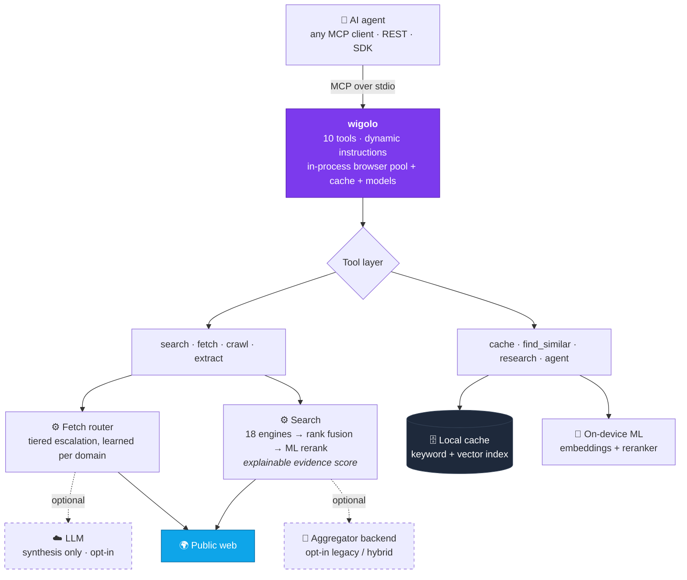

# [KnockOutEZ/wigolo](https://github.com/KnockOutEZ/wigolo)

<div align="center">


Local-first web intelligence for AI agents — **no keys, no cloud, no metered bill.**

<sub>works with&nbsp;&nbsp;**Claude Code · Cursor · Codex · Gemini CLI · VS Code · Windsurf · Zed · Antigravity**</sub>
<br>
<sub>and beyond&nbsp;&nbsp;**LangChain · CrewAI · LlamaIndex · Vercel AI SDK · n8n & self-hosted agents · any MCP client · plain REST**</sub>

[](https://www.npmjs.com/package/wigolo)
[](https://github.com/KnockOutEZ/wigolo/stargazers)
[](https://nodejs.org)
[](https://modelcontextprotocol.io)
[](#license)
[](#beta--feedback)

[Quickstart](#quickstart) · [Tools](#tools) · [Why wigolo](#why-its-different) · [Benchmark](#benchmark) · [Docs](docs/README.md) · [Examples](examples/README.md) · [Feedback](#beta--feedback) · [FAQ](#faq)

</div>

---

wigolo gives an AI agent one durable surface for everything web-related — **search, fetch, crawl, extract, cache, find-similar, research,** and autonomous gather loops. It runs wherever your agent runs: as an MCP server next to your coding agent, as a REST/MCP endpoint on the box where your self-hosted agents live, or embedded through an SDK inside your own app. The core tools need no API keys, nothing it touches leaves `~/.wigolo/`, and there's no bill that grows with how much your agent thinks.

<div align="center">


</div>

## Quickstart

Requires **Node ≥ 20** and ~1.5 GB of free disk. macOS, Linux, and Windows.

One command wires the local engine into your agent. `init` is **unattended by default** — no prompts, safe in scripts and CI — and does the **complete setup**: it downloads the browser engine and on-device models, runs a health check, and prints a per-component summary, so any setup problem surfaces right here, not silently on your agent's first call:

```bash
npx wigolo init --agents=<your-agent>
```

- **`<your-agent>`** — one or more of `claude-code` · `cursor` · `codex` · `gemini-cli` · `vscode` · `windsurf` · `zed` · `antigravity` (comma-separated). wigolo writes the MCP config and instructions for you.
- **Any other MCP client?** Omit `--agents` and register `npx -y wigolo` yourself — the [installation guide](docs/installation.md) has the exact config block for every client, plus Docker, Homebrew, and single-file-binary channels.
- **Prefer prompts?** `--interactive` is a plain-text flow; `--wizard` is the full terminal TUI.
- **Skip the downloads?** `--no-warmup` defers everything to first use. A failed component download never fails setup — init reports what's not ready with the exact fix and still wires your agent.

That's the whole setup — **search, fetch, crawl, extract, cache, and find-similar work with no API key.** Check it's healthy anytime:

```bash
npx wigolo doctor
```

Not for you? `npx wigolo config --uninstall --yes` removes everything, cleanly. You can also paste the [installation guide](docs/installation.md) at any AI assistant and let it do the setup — it's written to be self-contained.

### Recommended — a free key makes `research` & `agent` shine

Search, fetch, crawl, extract, cache, and find-similar are **fully keyless**. But `research`, `agent`, and `search format=answer` use an LLM to *write* the synthesized, cited answer — without one they hand back a raw brief and evidence for your agent to assemble, which is a much thinner experience. **A free Gemini key is all it takes**, and it's the single biggest quality upgrade you can make:

```bash
export WIGOLO_LLM_PROVIDER=gemini
export GEMINI_API_KEY=<free-key>      # grab one at aistudio.google.com/apikey — the free tier is plenty
```

Any provider works (`anthropic` · `openai` · `groq`), or stay fully local and keyless with `WIGOLO_LLM_PROVIDER=ollama` (or any OpenAI-compatible URL). Set it in your shell or your agent's MCP `env` block. Providers, models, and the keyless local-model ladder: [configuration guide](docs/configuration.md).

## What your agent gets back

Not snippets — evidence. Every search result carries a verbatim excerpt pinned to its exact position in the source, a citation ID the agent can quote, and a score it can inspect (abridged real shape):

```jsonc
{
  "results": [{
    "title": "Logical replication - PostgreSQL docs",
    "url": "https://www.postgresql.org/docs/current/logical-replication.html",
    "excerpt": "Logical replication is a method of replicating data objects…",
    "citation_id": "src-1",
    "source_span": { "start": 1042, "end": 1305 },          // byte-exact provenance
    "evidence_score": { "final": 0.86, "semantic": 0.91, "lexical": 0.78, "engine_consensus": 3 }
  }],
  "citations": [{ "id": "src-1", "url": "…" }],
  "freshness_signal": { "published": "2026-05-12", "confidence": "high" }
}
```

Weak results get flagged as junk by wigolo's own scorer, failed engines are reported, stale cache is labeled — the agent always knows what it's standing on. Full response contracts per tool: [tools reference](docs/tools.md).

## Tools

| Tool | What it does |
|------|--------------|
| 🔎 `search` | Multi-engine web search (18 direct adapters) with rank fusion, ML reranking, and an explainable per-result score. Pass a query **array** for parallel breadth. |
| 📄 `fetch` | Load one URL through a tiered router that auto-escalates from plain HTTP to a headless browser engine on anti-bot challenges or SPA shells. Clean markdown + metadata + links. |
| 🕸️ `crawl` | Multi-page crawl — BFS, DFS, sitemap, or map-only. Per-domain rate limits, robots.txt respect, boilerplate dedup. |
| 🧩 `extract` | Structured data from a page: tables, metadata, JSON-LD, brand identity, named schemas (Article / Recipe / Product / …), or any custom JSON Schema. |
| 💾 `cache` | Query everything already seen — keyword or hybrid semantic. Plus stats, clear, and change detection. |
| 🧲 `find_similar` | Pages similar to a URL or a concept, via 3-way fusion of keyword + semantic + live web. |
| 🧠 `research` | Decompose a question → fan out sub-queries → fetch sources → synthesize a cited report (or a structured brief the host LLM writes from). |
| 🤖 `agent` | Autonomous gather loop: plan → search → fetch → extract → synthesize, with a step log, time budget, and optional output schema. |
| 🔁 `diff` + ⏱️ `watch` | See exactly what changed on a page since last visit; re-check on demand and deliver changes to a webhook. |

Every tool also runs from the terminal (`wigolo search "…" --json`), from an interactive shell with NDJSON piping (`wigolo shell`), over REST, and through the SDKs — [CLI reference](docs/cli.md).

### What that actually lets you do

Each tool goes well past its one-liner. A sampler — every line links to the guide and, where there's one, a runnable example:

- **Search that fans out** — pass a query **array** for parallel breadth, scope to `include_domains`, bound by `time_range`/recency, exact-phrase match, choose a depth tier, even image results. → [guide](docs/tools.md#search) · [example](examples/one-shot-cli)
- **Fetch almost anything** — JS-rendered SPAs, PDFs, a single heading `section`, authenticated pages (via a browser profile or remote browser), or drive the page with `actions` (click / type / scroll / screenshot). → [guide](docs/tools.md#fetch)
- **Crawl a whole site** — sitemap, BFS, DFS, or map-only; robots.txt-respecting, per-domain rate-limited, boilerplate-deduped. → [guide](docs/tools.md#crawl)
- **Extract structure** — tables, JSON-LD, metadata, brand assets, named schemas (Article / Recipe / Product / …), or your own JSON Schema. → [guide](docs/tools.md#extract)
- **A memory that compounds** — every page is cached; re-query by keyword or meaning, instantly and offline; detect what changed since last visit. → [guide](docs/tools.md#cache) · [example](examples/watch-changelog-webhook)
- **Research & autonomous gather** — decompose a question into a cited brief, or turn `agent` loose to plan → fetch → extract → synthesize against a JSON Schema and a time budget. → [guide](docs/tools.md#research) · [example](examples/sdk-python-agent)
- **Watch & diff** — monitor a URL, get a change report, deliver it to a webhook. → [guide](docs/tools.md#watch) · [example](examples/watch-changelog-webhook)
- **Drive it your way** — one-shot CLI, an NDJSON shell for pipelines, REST, SDKs, or as skills your agent installs. → [CLI & shell](docs/cli.md) · [example](examples/shell-ndjson-pipeline)
- **Extend it** — add a search engine or a site extractor as a plugin in ~100 lines. → [plugins](docs/plugins.md) · [example](examples/plugin-search-engine)
- **Tune & inspect** — `wigolo tune` shows what it learned per domain (which fetch tier, challenge clearances, backoff); `doctor` / `verify` health-check every component. → [CLI](docs/cli.md) · [troubleshooting](docs/troubleshooting.md)

## Why it's different

wigolo isn't the free stand-in you settle for until the budget clears — it's built to hold the same line as the paid services in this lane, and it brings receipts. What actually separates it:

- **Built for agents, not humans.** One MCP call fans out many queries across many engines in parallel — something a serial host tool-loop can't replicate — with transparent per-result scoring and budget-aware output.
- **Honest output.** Stale cache, failed fetches, degraded backends, and truncation are surfaced in the result, never disguised as empty-but-successful data. When a bot-protected page can't be read, you get a labeled `blocked_by_challenge` failure — never a challenge shell dressed up as content.
- **$0 per query, free to re-query.** Default search talks to public engines through direct adapters; the reranker and embeddings run on-device. Every response is cached, so asking again is instant and costs nothing.
- **Private by default.** Cache, embeddings, models, and config live under `~/.wigolo/`. Nothing reaches a third party unless you explicitly opt into an LLM for synthesis.

wigolo is a focused web layer for your agents — not a hosted SaaS, a vector database other apps query, or a scale-scraping platform. Within that lane it goes toe-to-toe with the paid services on result quality — and the meter, the key, and the data-egress simply aren't there.

Here's what one real result looks like, dissected — including the failed engine and the weak result, because those are part of the answer too:

<div align="center">

<picture>
<source media="(prefers-color-scheme: dark)" srcset="assets/promo/anatomy-dark.svg">

</picture>

</div>

## Benchmark

> **All four tools converged on the same core answer — and only one of them handed back verbatim, byte-pinned evidence while doing it.**

One cold query, run live inside a single **Claude Fable 5** session and fanned out to four web tools on equal footing — built-in **WebSearch**, **wigolo**, **Tavily**, and **Exa** — then reported by the agent itself under one rule: judge on the evidence alone, no favoritism. All four converged on the same answer and the same top source — parity demonstrated, not asserted. wigolo alone returned verbatim excerpts pinned to byte-offset source spans, an explainable score decomposition, and live per-engine telemetry — and when two of its results were weak, its own scorer flagged them as junk on-screen. The cloud tools earn their line too: Exa rendered the official docs' comparison matrix in full. One honest query, not a leaderboard — run your own and you'll see the same shape.

<div align="center">


</div>

### Same fight, different physics

| | wigolo | Firecrawl | Exa | Tavily |
|---|:---:|:---:|:---:|:---:|
| Multi-engine web search | ✅ | ✅ | ✅ | ✅ |
| Fetch & structured extraction | ✅ | ✅ | ✅ | ✅ |
| Whole-site crawl & map | ✅ | ✅ | — | ✅ |
| Verbatim excerpts pinned to byte-offset source spans | ✅ | — | — | — |
| Explainable per-result score decomposition | ✅ | — | — | — |
| Persistent local memory — re-query instantly, offline | ✅ | — | — | — |
| Query data stays on your machine | ✅ | — | — | — |
| API key / account | none | required | required | required |
| Cost per query | $0 | metered | metered | metered |

<sub>Feature standing as of July 2026 — check each vendor's docs for current state.</sub>

That last row is the one that compounds — agents don't ask once, they ask in bursts:

<div align="center">

<picture>
<source media="(prefers-color-scheme: dark)" srcset="assets/promo/meter-dark.svg">

</picture>

</div>

## Beyond your editor

The same ten tools serve every kind of agent, over whichever surface fits — MCP for coding agents, REST for everything else, SDKs to embed, framework wrappers to drop in.

### REST API — `wigolo serve`

One process exposes a plain-JSON REST API next to the MCP transport. No MCP client needed — just curl:

```bash
wigolo serve                          # 127.0.0.1:3333 — loopback is open; off-loopback requires a token

curl -sX POST http://127.0.0.1:3333/v1/search \
  -H 'Content-Type: application/json' \
  -d '{"query":"local-first software","max_results":5}'
```

`POST /v1/{tool}` covers all ten tools, `GET /openapi.json` is the OpenAPI 3.1 contract, and `/mcp` + `/sse` serve remote MCP clients from the same port. Bind past loopback and a bearer token is required — the server fails closed rather than opening wide by accident. Point n8n, a Hermes-style assistant, or any self-hosted agent at it. → [REST API](docs/rest-api.md)

### SDKs — TypeScript & Python

Thin, typed clients with an embedded local mode that finds or starts the daemon for you — no separate `serve` step.

**TypeScript** — `npm install wigolo-sdk` (zero-dep; Node / Bun / Deno / edge):

```ts
import { createLocalClient } from 'wigolo-sdk/local';

const { client, close } = await createLocalClient();   // reuse a running daemon, or spawn one
const res = await client.search({ query: 'local-first web search', max_results: 5 });
console.log(res.results.map((r) => r.title));
await close();                                          // stops the daemon only if this call spawned it
```

**Python** — `pip install wigolo` (standard library only; sync + async):

```python
from wigolo import local_client

with local_client() as client:                          # reuse a healthy daemon, or spawn one
    res = client.search(query="local-first web search", max_results=5)
    for r in res["results"]:
        print(r["title"], r["url"])
```

→ [SDKs & embedded mode](docs/sdks.md)

### Framework integrations

Drop wigolo's tools into the framework you already use — the full ten-tool surface, including the cache / find_similar / research / agent that most framework web-tools don't ship:

| Framework | Package | What you get |
|-----------|---------|--------------|
| **LangChain** | `wigolo-langchain` | each tool as a `BaseTool`, plus a `BaseRetriever` over search / find_similar for RAG |
| **CrewAI** | `wigolo-crewai` | `wigolo_tools()` → hand the set to any crew |
| **LlamaIndex** | `wigolo-llamaindex` | a `BaseReader` that loads fetched / crawled / searched pages as documents |
| **Vercel AI SDK** | `wigolo-vercel-ai-sdk` | tool factories for `generateText` / `streamText`, edge-friendly |

→ [Framework integrations](docs/sdks.md)

### Docker

```bash
# stdio MCP — wire it into any MCP client as command: docker
docker run -i --rm -v wigolo-data:/data ghcr.io/knockoutez/wigolo

# HTTP server for remote / multi-client use
docker run -p 3333:3333 -v wigolo-data:/data \
  -e WIGOLO_API_TOKEN=a-long-random-secret \
  ghcr.io/knockoutez/wigolo serve --host 0.0.0.0
```

The slim image lazy-loads models into the volume; `:full` preinstalls the browser engine. Also on Docker Hub as `towhid69420/wigolo`. → [installation & all channels](docs/installation.md)

### Agent skills

An 11-pack skill catalog teaches your coding agent to drive each tool well — installed by `init`, managed with `wigolo skills add|list|remove`. → [skills](docs/skills.md)

One honest note for self-hosters: some challenge-protected sites score IP reputation, so a datacenter IP won't clear walls a home connection would. wigolo labels those failures instead of faking them, and the [self-hosting guide](docs/self-hosting.md) covers the opt-in proxy answer.

## Star history

<div align="center">

<a href="https://star-history.com/#KnockOutEZ/wigolo&Date">

</a>

<sub>Live chart — it updates itself. If it's still climbing when you read this, <a href="https://github.com/KnockOutEZ/wigolo">add a ⭐</a>.</sub>

</div>

## Architecture

A single Node process speaking MCP (JSON-RPC over stdio). Everything heavy is local and lazy-loaded, so a zero-key install pays nothing for the parts it isn't using.



- **Code beats model.** Deterministic work — canonicalization, rank fusion, dedup, schema matching — never touches an LLM. The model is reserved for judgment, opt-in, and capped per request; LLM-filled fields are checked against the source and nulled if absent.
- **Routing on observable signals.** The fetch ladder escalates to a real browser on what it *sees* — SPA markers, challenge bodies, thin content — not domain guesses. It learns per domain, unlearns when a site stops needing it, and `wigolo tune list` shows you exactly what it learned.
- **Reads pages the way a browser does — and says so when it can't.** Tiered fetching waits out interstitial challenges and reuses clearances per domain, politely: robots.txt respected, per-domain rate limits, research-grade volumes. When a wall stays up, the failure is labeled, never disguised.

## Configuration

A clean install works out of the box. Three settings meaningfully raise output quality:

```bash
# 1. Synthesis — the biggest lever (research / agent / search-answer write real prose)
export WIGOLO_LLM_PROVIDER=gemini                   # or anthropic / openai / groq / ollama (keyless)
export GEMINI_API_KEY=<your-key>

# 2. Wider retrieval funnel
export WIGOLO_SEARCH=hybrid                         # core engines + aggregator fallback
export WIGOLO_GITHUB_TOKEN=...                      # GitHub code search 10 → 30 req/min

# 3. Land more fetches, stay warm
export WIGOLO_TLS_TIER=auto                         # per-domain learned fetch hardening
export WIGOLO_EAGER_WARMUP=1                        # pay the ~1s model load up front
```

**Per-call habits that pay off:** query **arrays** (`["a","b","c"]`) for parallel breadth · `search_depth: "deep"` for queries that matter · `include_domains` as a hard filter for docs lookups.

The full reference — every environment variable, config-file key, search backend, cache TTL, and serve limit — lives in the [configuration guide](docs/configuration.md).

## Docs & examples

**[docs/](docs/README.md)** — the complete manual:
[getting started](docs/getting-started.md) · [installation & channels](docs/installation.md) · [configuration](docs/configuration.md) · [tools reference](docs/tools.md) · [CLI & shell](docs/cli.md) · [REST API](docs/rest-api.md) · [SDKs & integrations](docs/sdks.md) · [self-hosting](docs/self-hosting.md) · [agent skills](docs/skills.md) · [plugins](docs/plugins.md) · [troubleshooting & FAQ](docs/troubleshooting.md) · [privacy & security](docs/privacy-security.md)

**[examples/](examples/README.md)** — runnable, each with a README (and most with a terminal recording): one-shot CLI, NDJSON shell pipelines, REST via curl, TypeScript & Python SDKs, Vercel AI SDK tools, pointing self-hosted n8n at a remote wigolo, watch-with-webhook, and writing your own search-engine plugin.

Docs are also rendered on the site: **[knockoutez.github.io/wigolo/docs](https://knockoutez.github.io/wigolo/docs/)**.

## Beta & feedback

wigolo is in **public beta**. Everything documented here works and is held to a 7,600-test suite — beta is about the polish bar, not stability. It stays beta until enough people have used it, kicked it, and starred it that calling it v1 means something.

That makes your feedback the whole game right now. Every report is read, usually the same day:

- 🐛 **[Report a bug](https://github.com/KnockOutEZ/wigolo/issues/new?template=bug_report.yml)** — broke, misbehaved, surprised you
- 💡 **[Request a feature](https://github.com/KnockOutEZ/wigolo/issues/new?template=feature_request.yml)** — something it should do
- 💬 **[Ask anything](https://github.com/KnockOutEZ/wigolo/discussions)** — questions, setups, show & tell

And if wigolo earns a place in your setup, the ways to keep it alive: a ⭐ **star** (it's how open source gets found), a **[☕ coffee](https://buymeacoffee.com/knockoutez)** (there's no paid tier and never will be), or just **[an email](mailto:ktowhid20@gmail.com)** — it goes straight to the one developer who wrote the code.

## FAQ

<details>
<summary><b>Free? What's the catch?</b></summary>

No catch by design. The expensive parts — ranking, embeddings, the browser engine — run on *your* hardware, so there's no per-query cost to recover and no reason for a meter. Sustained by donations; the AGPL license legally prevents a bait-and-switch into a closed hosted product.

</details>

<details>
<summary><b>Is the quality really on par with the paid services?</b></summary>

Run one query and judge — the benchmark section above is a live 4-way run, not a chart. Everyday agent queries land at parity; the paid tools still win some deep-extraction edge cases, and crawling is where wigolo is strongest. Every result shows its scoring, so you don't have to take anyone's word for it.

</details>

<details>
<summary><b>Won't public search engines block or rot?</b></summary>

It's engineered for exactly that: 18 engines fused with rank fusion (any one failing barely moves results), a tiered fetch ladder with per-domain learning, and an optional aggregator fallback. Degraded backends are *reported in the output*, never hidden — and the local cache means everything already seen keeps working regardless.

</details>

<details>
<summary><b>Is this kind of scraping OK?</b></summary>

wigolo reads the public web the way a browser does — robots.txt respected by default, per-domain rate limits, research-grade volumes for one agent on one machine. It's deliberately the polite end of the spectrum, not a harvesting platform.

</details>

<details>
<summary><b>AGPL — can I use this at work?</b></summary>

Yes, freely, company-wide. The license only bites if you *modify wigolo and run it as a network service* — then you must publish those modifications. Using it as a local dev tool carries zero obligation. Commercial-licensing questions: reach out.

</details>

<details>
<summary><b>Why 1.5 GB of disk?</b></summary>

That's the on-device brain: a full browser engine plus the ranking and embedding models the cloud services run on their side and bill you for. Disk is cheap; meters aren't.

</details>

## Available on

- **npm** — [`wigolo`](https://www.npmjs.com/package/wigolo) *(primary channel — the Quickstart above)*
- **PyPI** — [`wigolo`](https://pypi.org/project/wigolo/) *(Python SDK)*
- **Docker** — [`ghcr.io/knockoutez/wigolo`](https://github.com/KnockOutEZ/wigolo/pkgs/container/wigolo) · [`towhid69420/wigolo`](https://hub.docker.com/r/towhid69420/wigolo)
- **Official MCP Registry** — `io.github.KnockOutEZ/wigolo`
- **Directories** — [Glama](https://glama.ai/mcp/servers/KnockOutEZ/wigolo) · [Smithery](https://smithery.ai/server/ktowhid20/wigolo) · [mcp.so](https://mcp.so/server/wigolo/KnockOutEZ) · [LobeHub](https://lobehub.com/mcp/knockoutez-wigolo)

Homebrew, `curl | sh`, and the single-file binary are covered in the [installation guide](docs/installation.md) — one channel per machine; they all share `~/.wigolo`.

## Contributing

Bug reports, feature requests, and PRs are all welcome — see **[CONTRIBUTING.md](CONTRIBUTING.md)**. Keep tool handlers thin, add tests, run the suite before opening a PR. The friendliest entry point: wigolo has a plugin system for custom search engines and extractors — [add a search engine in ~100 lines](docs/plugins.md), template in [`examples/plugin-search-engine`](examples/plugin-search-engine).

## License

**[GNU AGPL-3.0-only](LICENSE).** Free to use, modify, and self-host — including inside a company. The one obligation: if you run a **modified** version as a network service, you must publish your modified source under the same license. That keeps wigolo open while preventing a closed, hosted fork. See **[SECURITY.md](SECURITY.md)** to report a vulnerability and **[TRADEMARK.md](TRADEMARK.md)** for use of the name. For commercial-licensing questions, reach out.

<div align="center">
<br>

wigolo is free and meant to stay that way — maintained, not paywalled.
If it saves you a metered search bill, a ⭐, a sharp issue, or a **[☕ coffee](https://buymeacoffee.com/knockoutez)** helps keep it sustainable.

<sub>Built and maintained by <a href="https://github.com/KnockOutEZ">@KnockOutEZ</a> · <a href="mailto:ktowhid20@gmail.com">ktowhid20@gmail.com</a></sub>

</div>
